# 使用社会工程工具包(setoolkit)发送电子邮件

> 原文：<https://infosecwriteups.com/sending-emails-using-social-engineering-toolkit-setoolkit-97427712c809?source=collection_archive---------0----------------------->


里奇菲尔德·金·阿扎梅蒂出版

社会工程工具包是由 TrustedSec 的 Dave Kennedy 编写的开源免费 python 工具。这种开源工具主要由渗透测试人员、黑帽黑客、蓝色和紫色团队用于执行社会工程攻击。正如大多数人所说，安全方面最薄弱的环节不是任何计算机系统，而是人。社会工程攻击不仅仅针对某些个人，没有人能够真正免受这种形式的攻击。在这篇博客中，我们将主要关注黑客如何使用这个渗透测试框架发送钓鱼邮件。

根据之前关于使用 socialphish 进行网络钓鱼的博客，可以生成网络钓鱼链接，并将其替换为电子邮件中带有 href 值的 html 锚标记，通常称为给受害者的诈骗信。

https://hofearless-h . medium . com/phishing-got-easy-with-social phish-b 04 dcbab 3900

下面显示了一个示例:

```
<a href="phishing link here">
```

本博客将继续讲述黑客如何使用社会工程工具包向受害者发送电子邮件，特别是群发邮件选项。我们同样可以用 setoolkit 创建钓鱼链接。

# ***免责声明:每一个教程板块都是严格出于教育目的。不要将此用于任何恶意活动…！！！***

安装社会工程工具包:

步骤 1:打开你的终端，创建一个名为 setoolkit 的目录

```
mkdir Setoolkit
```

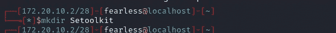

步骤 2:导航到创建的名为 Setoolkit 的新目录

```
cd Setoolkit
```

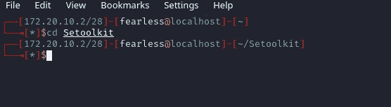

步骤 3:现在让我们使用命令 git clone 和 setoolkit 的存储库从 github 克隆 setoolkit。https://github.com/trustedsec/social-engineer-toolkit.git

```
git clone <https://github.com/trustedsec/social-engineer-toolkit.git>
```

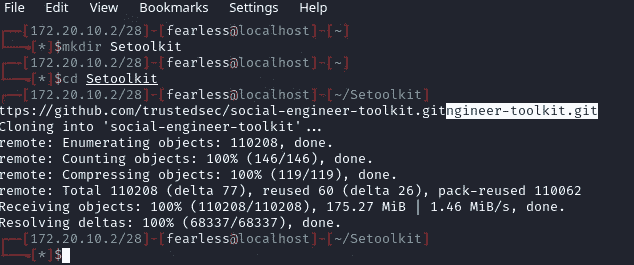

步骤 4:使用命令“ls”列出当前目录的内容，将目录更改为克隆存储库后创建的目录。

```
ls
cd social-engineer-toolkit
```

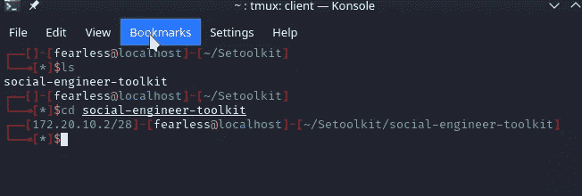

步骤 5:工具包已经成功下载。下载附件中的要求，这些要求需要使用 pip 安装在您的 Linux 操作系统上。

Pip 是 python 编程语言的包管理器。安装 pip3

```
sudo apt update -y && sudo apt install python3-pip
```

使用 pip 下载需求

```
pip3 install -r requirements.txt
```

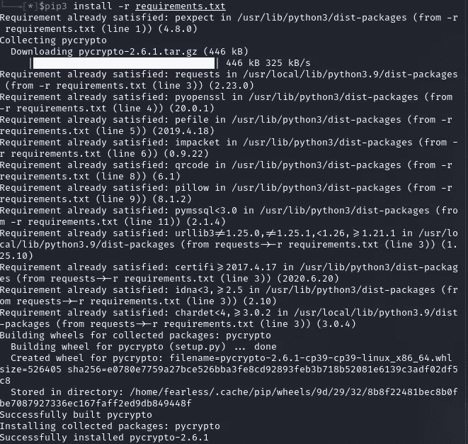

步骤 6:现在让我们安装下载的需求

```
sudo python3 setup.py
```

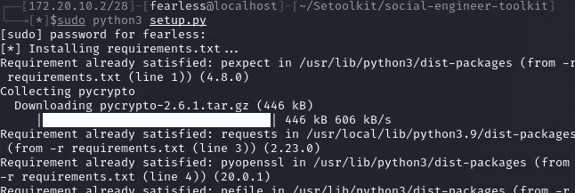

第 7 步:是时候运行 setoolkit 并开始发送电子邮件了。

键入 sudo setoolkit 并运行

```
sudo setoolkit
```

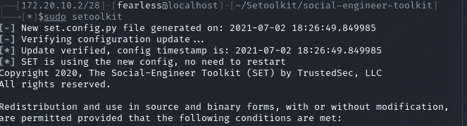

第八步:会弹出一个问题询问你是否同意 setoolkit 的条款和服务

键入 y 表示是，然后继续

```
y
```


步骤 9:选择社会工程攻击，因为我们的攻击是基于社会工程的攻击，可从下列攻击中选择:

```
set> 1
```

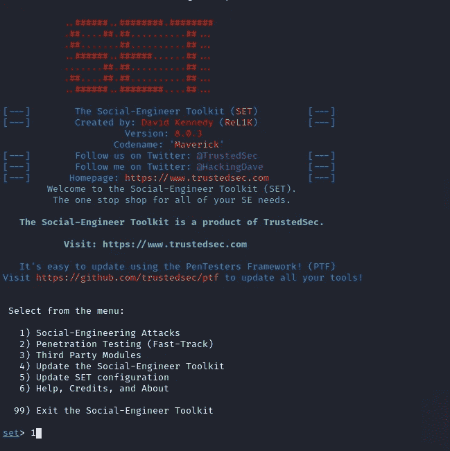

步骤 10:现在选择群发邮件程序，并进入下一个菜单

```
set> 5
```

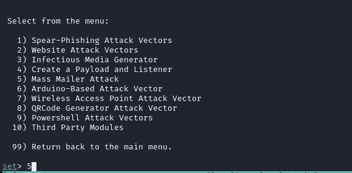

步骤 11:在这个菜单中有两个选项可以用来发送电子邮件。让我们来看看第一个选项，这是发送电子邮件给单一或有针对性的受害者

```
set:mailer> 1
```

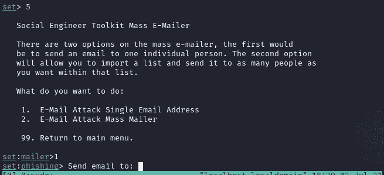

步骤 12:输入受害者或目标的电子邮件地址

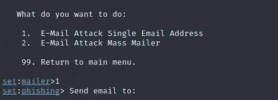

步骤 13:在这个博客中，我将使用我自己的电子邮件地址发送电子邮件。我建议你为此创建一个匿名邮件。要成功使用 gmail 从 setoolkit 发送电子邮件，您需要允许不太安全的应用程序访问您的电子邮件。对于使用双因素身份验证的帐户，您需要禁用它，以便从 setoolkit 等外部应用程序发送邮件。

选择 1 以使用您的帐户发送电子邮件

```
set:phishing> 1
```

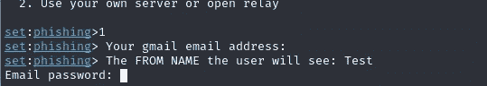

第十四步:

```
The FROM NAME the user will see:
Enter Password:
Flag this message/s as high priority? [yes|no]:
Do you want to attach a file - [y/n]:
Do you want to attach an inline file - [y/n]:
Email subject:
Send the message as html or plain? 'h' or 'p' [p]:
Enter the body of the message, type END (capitals) when finished:type your contents here
Next line of the body:END
```

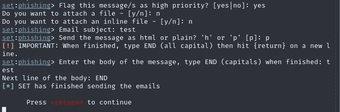

下面是 setoolkit 精心制作并发送的电子邮件的输出。


请查看我制作的关于如何使用 setoolkit 和 zphisher 的视频，以便更好地理解

***练习这个只是为了教育目的！！！！***

要了解更多内容，请订阅我的 youtube 频道，观看即将推出的视频。

> 【https://www.youtube.com/channel/UCbcfcMixWSNF7BoArenrlig? sub_confirmation=1