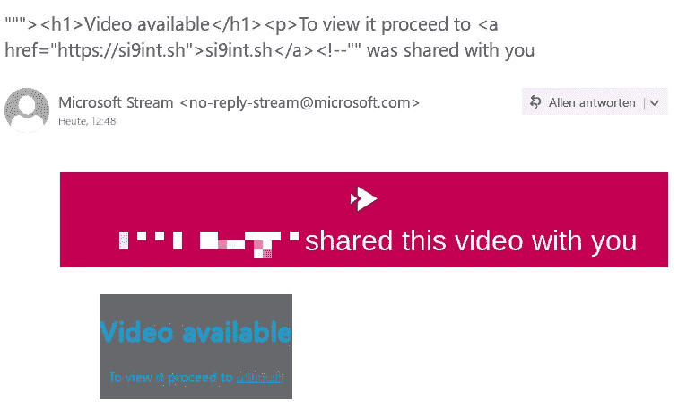

# 从@microsoft.com 发送网络钓鱼电子邮件

> 原文：<https://infosecwriteups.com/sending-out-phishing-e-mails-from-microsoft-com-84c3b918ada2?source=collection_archive---------0----------------------->

爱因斯坦是对的！(大概)

这是一篇关于我两个月前向 Microsoft 报告的一个漏洞的短文，描述了一个影响他们一个叫做“微软流”的服务的 HTML 注入问题。由于该漏洞不会被修补，引用:

> *高拉夫:*
> 
> *“鉴于此事的严重性和影响，MSRC 不再跟踪此事。我们已经结案了。”*

出于教育目的，我将描述细节及其对客户的影响。这个问题仍然没有补丁，可以利用或进一步研究。

那是一个下雨的晚上，我想我可以试试微软的 bug-bounty 程序。在准备好我的工具集(一些定制的 Python 脚本、Burpsuite 和一个用于文档的本地 web 服务器)后，我登录了一个旧的 Microsoft 帐户并搜索了一个目标。

[**stream.microsoft.com**](https://stream.microsoft.com/en-us/)

没听说过，没用过，没听过有人用，听起来不错！这确实很好。良好的编程使用 REST-ful API 的(取决于您的位置:欧盟，亚洲，美国)通信通过 XMLHttp 为基础的请求令牌-安全与不同的认证头装备后端架构，验证我的请求的每一个字符。“这个应用程序不可能是不安全的”我心想。

我的方法始终如一，在每个目标上，我都努力遵循这些全球步骤，以确保取得一些成功:

*   侦察(太大，此处不再赘述)
*   确定正确的应用程序逻辑
*   尝试以任何方式绕过应用程序逻辑(不仅仅是与安全相关的)
*   注意“bug”也就是应用程序错误
*   尝试将此功能性错误“bug”扩展到安全相关问题
*   试图利用这些安全问题
*   试着证明一些影响(低；中等；高)
*   尝试通过链接不同的问题或错误(异类)来扩大影响

在“微软流”的例子中，迎接我的是“成千上万”的参数和不同的 API，所以我把重点放在了文件上传这个核心功能上。在理解了不同参数背后的逻辑之后，我使用了我的 Python-fuzzer(可能它会很快发布；[github.com/si9int](https://github.com/si9int))模糊不同的参数，根据 HTTP 响应和请求时间显示有效和无效输入之间的相关性或差异。

我通过使用不同的字符串和有效负载引用不同的攻击媒介来敲打后端，并注意到两件(后来)重要的事情:

1.  API 接受 HTML，但对其进行编码，例如:`<h1>Hello world!</h1>`是视频标题的有效字符串
2.  API 正在解释 Unicode，该 API 允许注入不同的空格和白块，而不考虑字符限制(1 个 Unicode = 1 个字符)

但是，没错，没有反射，没有异常或任何错误，无视 JavaScript 功能带来的正确和完美的错误处理。我输了比赛，浪费时间，没有动力，上床睡觉。

第二天早上，我坐到办公桌前，查看了我的电子邮件(我几乎每天都是这样)。*唉*我收到了很多来自`no-reply-stream@microsoft.com`的新邮件，描述我上传的视频被成功渲染“bla bla”。然后我注意到一些事情，我的楼梯开始旋转 360 度。标题`<h1>Hello world!</h1>`被执行，HTML 被呈现在电子邮件中。

**呜呜呜！**

头奖(有点……；对我来说是在浪费时间之后)。我立即重新访问了编辑视频页面，重新检查了“分享您的视频”功能，并制作了一份概念证明，提交给了“微软安全响应中心”:

嗯是的..它又快又脏..

我在一个顶级的微软服务上发现了一个有效的 bug！滥用`@microsoft.com`域名进行网络钓鱼。**感觉难以置信**

> **尝试感受我的感受，让它生效**

直到 Gaurav 把我的报告移到 **N/A** 。

啊是啊..他们认为邮件是以有效载荷命名的，因此很容易发现网络钓鱼企图。我失去了动力，把邮件踢到了/archive。

第二天，我和我的一个同学谈论这件事，想起了 char 限制。从大学回到家后，我立即重新检查了这个问题，并设计了一个新的 PoC:

``嗨，loveley 女士，这是微软被黑和滥用的

成功了！白块和空格的组合将我的有效载荷推到了侧边栏的右侧(我使用的是“Microsoft Outlook”的实例)，只显示了电子邮件的“合法”标题。

虽然微软的人没有看到任何安全影响，并再次通知我，该漏洞是低级别的，不会被修复。我不认为这是一个好主意，因为可能会有更多的发现和破坏实际的 HTML 上下文，欺骗 HTML 本身。这种方法也可以用来制作极其高效的鱼叉式网络钓鱼邮件。

您可以在此处阅读原始报告(我已经在电子邮件对话中添加了第二个 PoC):[https://si9int.sh/view/9/](https://si9int.sh/view/9/)

我希望您喜欢这篇短文，欢迎随时向我提问:

SI9INT([https://twitter.com/si9int](https://twitter.com/si9int))