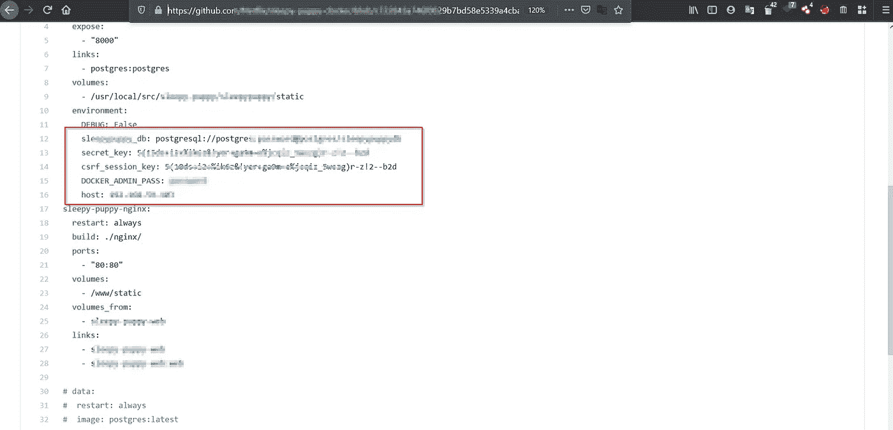

# 通过 GitHub 暴露敏感数据:深入 bug 海洋

> 原文：<https://infosecwriteups.com/sensitive-data-exposure-through-github-a-deep-dive-into-bug-ocean-a43ed5a0a3da?source=collection_archive---------1----------------------->

你好，我的黑客朋友们，我希望你们都做得很好。继续寻找漏洞，即使你没有找到，也要继续努力:)最近几天，我已经不太关注奖金了，因为我在做办公室的事情和许多其他事情。不管怎样，我在上周左右再次爱上了它，结果相当不错。我们将在这里谈论我最近发现的 GitHub 呆子的一个 bug，如果你对这个不熟悉，请跟随 [***这个***](https://www.youtube.com/watch?v=l0YsEk_59fQ)bug crowd**大学的视频来了解 GitHub 呆子是如何工作的。基本上，我们放入一组傻瓜来找到想要的结果，即敏感数据。**

**让我们来看看窃听器。所以最近我开始了一个项目，让我们称之为 hack.com，我在大范围项目中做的第一件事是多金。让我明确的告诉你，这确实需要时间。呆呆需要时间！如果你期待一个小时左右的 P1/P2，很可能你会每次都挠头。我在找一些常见的傻瓜，比如“password=”、“token=”等等。我找到了其中的一些，因为这些与组织无关，所以我没有继续前进。不管承认与否，我们都犯过这样的错误。我们已经提交了任何发现的密码或秘密的程序 xD。无论如何，我一直在检查回购，经过 2 次休息和近 4-5 个小时，我终于有了 3 个关键的仓库。这里是其中一个的一瞥**

****

**这些傻瓜引领我走向成功。尽管这些都是经典的，但是在你的搜索中检查这些是有意义的**

****Secret_key=****

****用户密码=****

****管理员密码=****

**一旦你选择 GitHub dorking，记住你不能报告每一个包含大量数据但不属于组织的仓库。是的，如果您发现一个带有*管理员凭据*的回购，请尽快报告。最好的方法是在你的字典中使用 **"org:"** ，它将只向你显示那些包含在一个组织中的库。比如说。 ***org:Tesla*** 会显示所有与 Tesla 相关的储存库，然后你用一个呆子列表开始你的黑客之旅:)**

**好了，这就是这篇文章的全部内容，我希望它能帮助你对 GitHub dorking 保持很高的期望。看，你需要时间才能得到结果。是的，如果你足够幸运，你可能在 5 分钟内找到一个。但是要确保你的数据对组织有影响。祝你前方好运！**

**如果你喜欢这篇文章，在下面给我一个掌声。有疑问吗？用这个用户名在 twitter 上关注我:@ [**ManasH4rsh**](https://twitter.com/ManasH4rsh) 。把你的问题发给我，我会肯定地回答你。**

**黑客快乐！保重:)**

**Adios❤**

**推特:-【https://twitter.com/ManasH4rsh **

**LinkedIn:-[https://www.linkedin.com/in/manasharsh/](https://www.linkedin.com/in/manasharsh/)**