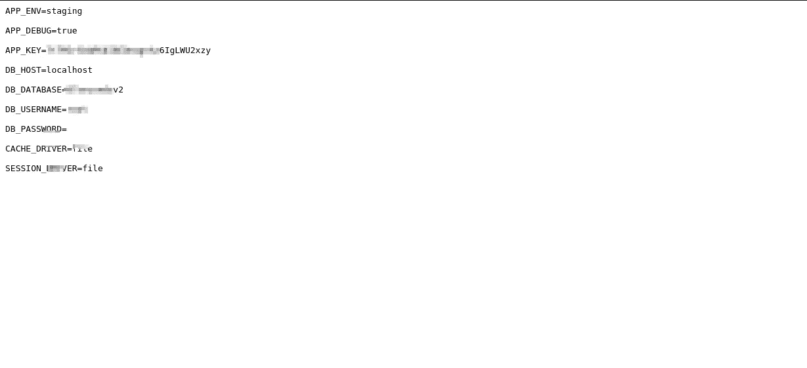

# 敏感数据暴露与原子核:新的大枪与利用子弹

> 原文：<https://infosecwriteups.com/sensitive-data-exposure-with-nuclei-the-new-big-gun-with-exploit-bullets-eea1ea2bfcf6?source=collection_archive---------2----------------------->

嘿，我的黑客朋友们！我希望你正在享受 WFH(如果你有)/你的赏金日子！我已经几个月没怎么打猎了，这也是我在媒体上不活跃的原因。我得到了一些奖金，我想和你们分享一些东西。所以我们开始吧！

我是自动化工具的忠实粉丝，我经常使用它们。所以最近我偶然发现了一个叫做**nucleus**的工具，让我告诉你这是一个容易取胜的工具。 [ProjectDiscovery](https://github.com/projectdiscovery) 的家伙们一如既往地完成了一些令人惊叹的工作，一些非常优秀的黑客和我的兄弟 [Harsh Bothra](https://medium.com/u/54fa249211d2?source=post_page-----eea1ea2bfcf6--------------------------------) 一起为此做出了贡献。它基本上是一个基于模板的工具，可以根据给定的模板发现错误。你可以在这里了解更多信息

所以，我在 xyz.com 上搜索，因为我经常使用 nuclei，所以我也在这个网站上尝试了一下。我很惊讶它为我找到了一些真正好的东西。所以有一个模板给你**。env** 目录，您可以在其中找到特定网站的敏感数据。完整的网址是这样的:-[*https://www.xyz.com//.env*](https://www.thevideocontentagency.nl//.env)。你可以在下面的截图中看到

这是我用 Nuclei 的第一个 bug，我强烈推荐使用这个。如果你今天过得好，你可能会钓到一条大鱼。谁知道呢！我用这个工具发现了更多的错误，比如 ***Git 信息披露*** ，我对此很满意。您可以添加自己的模板供自己使用，如果您有一个独特的模板，您甚至可以在此工具中做出贡献。

所以，这差不多就是这个。我希望你们能从中有所收获。如果你这样做了，请在下面给我一个掌声，是的，在 twitter 上关注我。

继续寻找，错误无处不在，你只需要随着经验而来的不同心态。不要轻易失去动力，bug bounty 是一种爱恨交加的关系，我们不会离开我们所爱的人:)花一些时间在程序上，你最终会找到一些东西。

保持好奇心！Adios❤

推特:-[https://twitter.com/manas_hunter](https://twitter.com/manas_hunter)

LinkedIn:-[https://www.linkedin.com/in/manas-harsh-05636a154/](https://www.linkedin.com/in/manas-harsh-05636a154/)