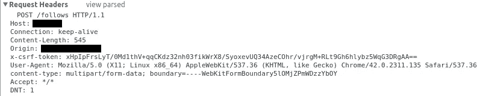
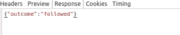
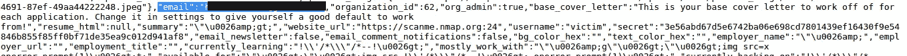
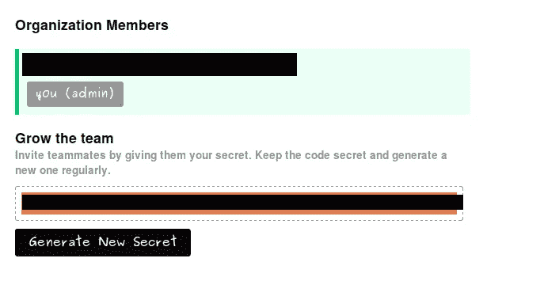
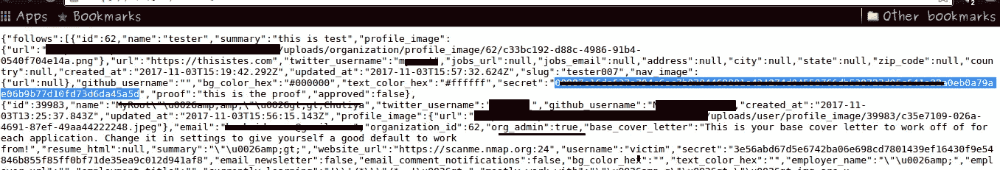

# 敏感信息泄露导致加入任何组织

> 原文：<https://infosecwriteups.com/senstive-information-disclose-lead-to-join-any-organisation-40ab549011?source=collection_archive---------6----------------------->

***声明:***

这篇文章的唯一目的是**教育**和测试你自己的应用程序。这是**而不是**用于盗版或任何其他非法用途。

***描述:***

这是我的第一个博客，所以可能会有错误，但是从错误中学习会让你变得更专业。

关于这个问题，我正在测试

地点:***XYZ.com***【抱歉不能透露姓名】

折腾了一个小时后，我得到了一个数据泄露的点。

在网站上，你可以关注用户、组织、标签等。等等。

所以当你关注任何一个用户。作为回应[通常我使用浏览器控制台]。李世民简单地说道:

> { "结果":"已跟踪" }

请求:

关注任何用户

回应:

关注用户时的响应

但是在这里你看不到任何使它成为敏感信息的东西。

所以我只是**通过在新标签中打开 Follow 请求来【从 chrome 控制台】重放请求**。在响应中，它公开了用户配置文件的所有信息。

网址像**[【https://XYZ.com/follow】](https://XYZ.com/follow)**

***已披露的用户信息:***

1.  ***邮件(可能是 ***GitHub 或 Twitter 邮件*** )***
2.  *****秘钥*****
3.  ***所有的配置文件设置就像他们的通知，[我没有测试付款部分，但我确信它会透露**卡**信息]***

******

***电子邮件和密钥泄露***

***但是等等，我不知道我能用这把秘密钥匙做什么。所以我试图找到网站的开发者部分，在那里我可以得到关于密钥的信息[我们可以用这个密钥做什么]。***

***遗憾的是他们没有。***

***所以我决定探索网站的更多特性。***

***在**设置部分，我发现你可以通过共享*密钥来创建一个组织并邀请用户。******

******

***组织成员***

***我们开始吧..现在我知道我能用那把秘密钥匙做什么了。***

***但是等等，我们必须交叉检查公开密钥是否与邀请密钥匹配。***

***查看他们的是网站的另一个特点，你可以跟随组织。所以从前面我们看到， ***When-ever 你关注任何用户..它会泄露用户信息。******

***所以我试着做了同样的事情。！！***

******

***组织密钥***

***它也泄露了组织的秘密。***

***因此..没有任何邀请，我们能够加入该组织。***

*****我们可以改变组织设置，张贴任何文章，邀请任何用户加入组织[ *当然我们有密钥* ]，删除组织。太**。***

***我很快联系了他们，他们在几个小时内就修补好了。***

***暂时就这样了。希望你喜欢它。***

***黑客快乐:)***

****关注* [*Infosec 报道*](https://medium.com/bugbountywriteup) *获取更多此类精彩报道。****

*** [## 信息安全报道

### 收集了世界上最好的黑客的文章，主题从 bug 奖金和 CTF 到 vulnhub…

medium.com](https://medium.com/bugbountywriteup)***