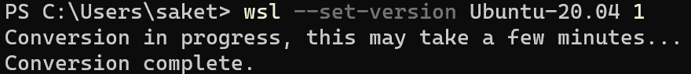
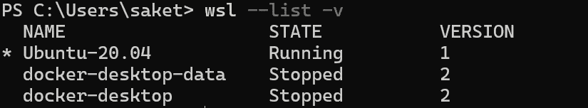
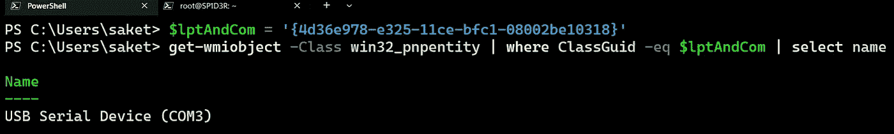
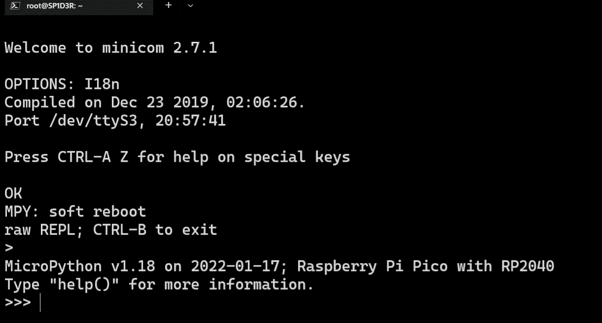

# 通过 WSL 与 Windows 10/11 中的 Raspberry Pi Pico 进行串行通信

> 原文：<https://infosecwriteups.com/serial-communication-with-raspberry-pi-pico-in-windows-10-11-via-wsl-50f93e29e2cb?source=collection_archive---------0----------------------->

# 树莓派皮可

> “Raspberry Pi Pico 是一款具有灵活数字接口的低成本、高性能微控制器板”~[Raspberry Pi . com/documentation/microcontrollers/Raspberry-Pi-Pico](https://www.raspberrypi.com/documentation/microcontrollers/raspberry-pi-pico.html)

微控制器可以用 [MicroPython](https://micropython.org/) 或 C/C++编程。更多信息，查看[官网](https://www.raspberrypi.com/documentation/microcontrollers/raspberry-pi-pico.html)。

# 设置 wsl

如果您还没有，请按照微软官方指南在您的 Windows 10/11 机器中设置 WSL:

 [## 安装 WSL

### 本指南将向您展示如何安装 Linux 发行版(如 Ubuntu、OpenSUSE、Kali、Debian、Arch Linux 和…

docs.microsoft.com](https://docs.microsoft.com/en-us/windows/wsl/install) 

## 将 WSL 降级到版本 1 ⬇️

出于某种原因，与 minicom 的串行通信在 WSL 版本 2 中不工作，因此我们需要将我们的 WSL 实例降级到版本 1。

首先通过`wsl --list -v`检查您的 WSL 容器版本号是多少:

如果`VERSION`下面的数字是`2`，可以通过-将其转换回版本 1

`wsl --set-version <DISTRO_NAME> <TARGET_VERSION>`

通过`wsl --list -v`再次检查版本:

现在，我们可以看到我们的 Ubuntu-20.04 容器被设置为版本 1，我们可以继续下一步。

## 安装 minicom

> Minicom 是一个基于文本的串口通信程序。它用于与外部 RS-232 设备对话，如移动电话、路由器和串行控制台端口。~[https://help.ubuntu.com/community/Minicom](https://help.ubuntu.com/community/Minicom)

在您的终端中启动 WSL 实例，并键入`**sudo apt-get update && sudo apt-get install minicom**` 来安装 minicom。我们不需要配置任何东西，因为我们的串行连接是虚拟的，因此它不受波特率和其他设置的限制。

# 与 Pico 的通信💡

要与 raspberry Pi Pico 进行通信，请确保 MicroPython 图像被闪存到板上，并通过正确的 USB 电缆连接到计算机。*了解如何将 micropython flash 到 Pico* [***阅读本文档***](https://github.com/Saket-Upadhyay/PiPicoRFID/raw/main/docs/raspberry-pi-pico-python-sdk.pdf) *。*

## 寻找虚拟串行端口

将 pico 连接到您的 Windows 主机后，您需要找到它所连接的虚拟串行端口。在 PowerShell 中运行以下命令来查找 COM 端口。

在这种情况下，端口是`COM3`，它将转换为 WSL 内部的`/dev/ttyS3`。这个关系也可以用— `COM(**ɳ**) -> /dev/ttyS(**ɳ**) [**∀ ɳ∈*N***]` **来表示。**

## 通过 minicom 连接

一旦知道了 COM 端口号，我们就可以打开我们的 WSL 实例，并通过将`ttyS3`替换为相应 COM 端口的`**ɳ**` 来启动与`**minicom -D /dev/ttyS3**` 的连接。连接后，按`CTRL+D`启动软重启，然后按`CTRL+B`退出到 MicroPython 实例。

干杯！现在，您可以开始在 Micro Python 中与设备进行交互🐍。

参考文献-

 [## GitHub-Saket-Upadhyay/pipi corfid:代码和修改后的库，用于读取/写入 MIFARE RFID 中的数据…

### 使用 Raspberry Pi Pico 微控制器读取/写入 MIFARE RFID 卡和令牌中的数据的代码和修改库…

github.com](https://github.com/Saket-Upadhyay/PiPicoRFID)  [## 迷你通讯

### Minicom 是一个基于文本的串口通信程序。它用于与外部 RS-232 设备对话，如…

help.ubuntu.com](https://help.ubuntu.com/community/Minicom)  [## 用于微控制器的 MicroPython - Python

### MicroPython 是 Python 3 编程语言的一个精简而高效的实现，它包含了…

micropython.org](https://micropython.org/)