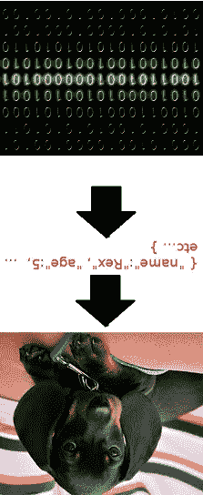
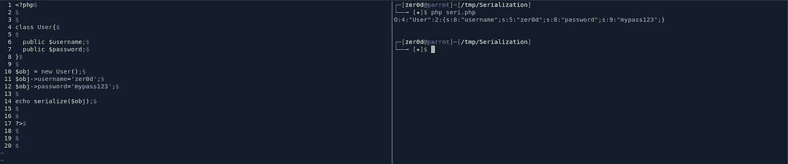
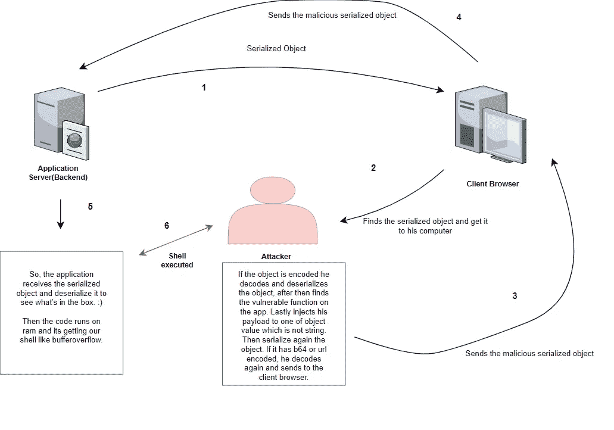
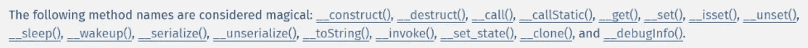
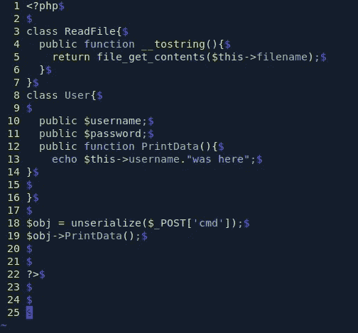
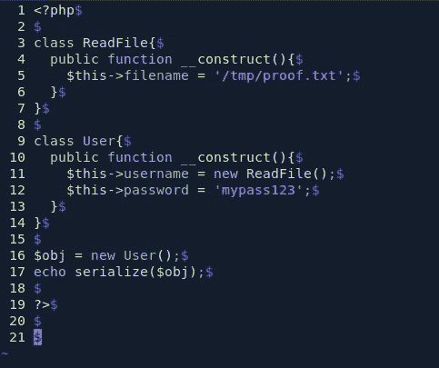
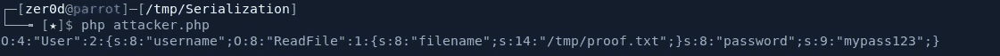
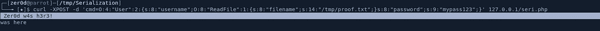
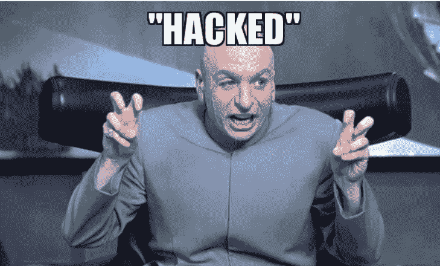

# 序列化和反序列化攻击

> 原文：<https://infosecwriteups.com/serialization-deserialization-attacks-on-php-d5fb02e29248?source=collection_archive---------0----------------------->

大家好，今天我将尝试解释序列化漏洞是如何工作的。

在我们摧毁金字塔之前，我们需要了解他们是如何建造的。


所以第一个问题是什么是序列化和反序列化？

**连载:**

序列化是一种将对象状态转换为字节流的机制。

所以基本上，它是这样工作的:


串行化意味着将某物(例如狗雷克斯)转换成一系列的 1 和 0，这些 1 和 0 可以通过电话线传输，并存储在存储器中。我在海外的朋友可以将这些 1 和 0 翻译回小狗的完美表示(反序列化)，这样他们就可以享受 Rex 的陪伴了。

**我们为什么需要它？**

这里有一个简单的类比来理解为什么我们需要在某些情况下序列化数据:假设你有一个想法，你想把它描述给你的朋友。不幸的是，你在家，而你的朋友在别处，所以你决定写一封邮件，描述你的想法。看到你刚才做了什么吗？你把脑子里的东西序列化成邮件，可以传输、存储、渲染，最终被你的朋友阅读。阅读这封邮件并在大脑中建立该想法的内部模型是令人惊讶的，然后是反序列化过程。所以，计算机实际上只是自然过程的模仿者；)

要了解更多信息，您可以查看下面的链接:

[](https://en.wikipedia.org/wiki/Serialization) [## 序列化-维基百科

### 在计算中，串行化(美国拼写)或串行化(英国拼写)是翻译数据结构的过程…

en.wikipedia.org](https://en.wikipedia.org/wiki/Serialization) 

**反序列化:**

反序列化是相反的过程，其中字节流用于在内存中重新创建实际的对象。

基本上是:D



英雄联盟

就像传说中说的，让我们跳到实际的事情上来。

**在 PHP 上序列化数据:**



序列化

**左窗格(代码描述):**

在左窗格中，

```
class User{public $username;
 public $password;
}
```

我们创建一个用户类，并在这个类中分配$username 和$password。

`*$obj = new User();*`

我们为我们的对象设置了一个新用户，我们基本上说:

```
*$obj->username=’zer0d’;
$obj->password=’mypass123';*
```

$obj 的这个$username 成员

$obj 的这个$password 成员

```
*echo serialize($obj);*
```

最后，我们用$obj 调用序列化函数来序列化我们的对象。

**右窗格(运行时):**

在右窗格中，我们看到我们的对象是序列化版本。

```
*O:4:”User”:2:{s:8:”username”;s:5:”zer0d”;s:8:”password”;s:9:”mypass123";}*
```

这是什么意思？

```
Ex: (Type:object):(4 character):( “It is User”): (it has 2 variable)
```

**在 PHP 上反序列化数据:**

```
*$obj = unserialize($_POST[‘cmd’]);*
```

在服务器端，像上面这样运行的代码反序列化接收到的序列化对象。我知道这有点令人困惑。


让我们试着理解这个过程。



1-应用程序服务器序列化要发送的对象，然后将其发送到客户端浏览器。

2-攻击者找到序列化的对象，假设它是一个 cookie。

3-如果 cookie 编码为 base64，首先，攻击者需要解码它才能看到字符串。然后它是一个序列化的对象，所以他需要反序列化它来查看对象中有什么。此时，该对象可能会存储 username、isAdmin 等变量。

在进行序列化攻击时，有两件事需要注意。

*   非字符串值:

如你所知，字符创建字符串。一些语言把它们分开，如果有有意义的字符，这些是字符串，如果有一个接一个的字符，它们是字符。但是当我们在攻击的时候，我们会发送一个对象(这种攻击就是对象注入)，如果我们用变化的字符串发送，PHP 语言就不能在里面把字符串转换成对象。所以我们需要将恶意对象注入到非字符串值中，如 boolean 等。

在我们注入我们的有效载荷之后，我们可以序列化它并把它发送回来。

*   神奇的方法:

PHP 魔法方法是一个[类](https://www.phptutorial.net/php-oop/php-objects/)中的特殊方法。当对象执行动作时，魔术方法覆盖默认动作。

按照惯例，神奇方法的名称以双下划线(`__`)开头。PHP 为神奇的方法保留了名称以双下划线(`__`)开头的方法。


每个魔法方法都遵循一定的规则:

-每个神奇的方法都以双下划线(__)开头。

-它们是预定义的，既不能创建也不能删除。

-魔法方法有保留名称，它们的名称不应用于其他目的。

-当满足特定标准时，自动调用神奇的方法。

例如:

_ _ 构造()

每次创建特定类的对象时，都会自动调用该方法。

这个神奇方法的作用和任何 OOP 语言中的构造函数是一样的。



例子

在攻击中，序列化部分就像一扇门，所以如果他们在序列化时没有检查我们的输入，这意味着门是开着的。但是为了偷金子，你需要打开抽屉。在密码中，抽屉有神奇的功能。

所以，问题是序列化实际上并不危险，我们需要跳转到魔法方法来用序列化损害系统。否则，我们的有效负载将被反序列化，但该有效负载无法在系统上执行。

**综上所述，诀窍在于你需要找到不是字符串的值，你需要通过使用非字符串值跳转到易受攻击的函数(魔术方法)来成功进行序列化攻击。您将在攻击模拟中看到更多细节。**

4-浏览器将此请求发送到后端服务器。

5-应用程序将其反序列化，以查看序列化数据中的内容。在这一步中，我们的有效载荷带着有害的愿望调用函数:)。

6- Shell 已执行。

**攻击模拟:**

首先，让我们看看服务器端代码:



server.php

因为这是一个模拟，所以代码实际上是不起作用的，但是让我们假设开发人员试图通过 post 方法从客户端获取用户名，然后对其进行反序列化。此外，在代码的不同部分，他们使用了一个神奇的方法 __tostring 来获取文件内容。在这一点上，如果我们反序列化对象，并以恶意的方式序列化它，我们可以通过跳转到 magic 方法来运行我们的危险愿望。

攻击者方面:



attacker.php

我们正在编写 PHP 脚本，用 **__construct** 函数序列化相同的数据表单，以便从系统中读取文件。该脚本创建恶意的序列化数据。

输出:



正如您在输出中看到的，s:8:username 是一个指向对象 ReadFile 的字符串值，因此有了这些数据，我们可以通过浏览器将其发送到服务器，并在服务器端使用我们的输入运行神奇的方法。所以让我们复制它通过 curl 发送。



我们已经向服务器发送了一个 post 请求，其中包含了我们序列化的恶意数据。

嘣！我们可以读取 proof.txt，在上图中高亮显示。

