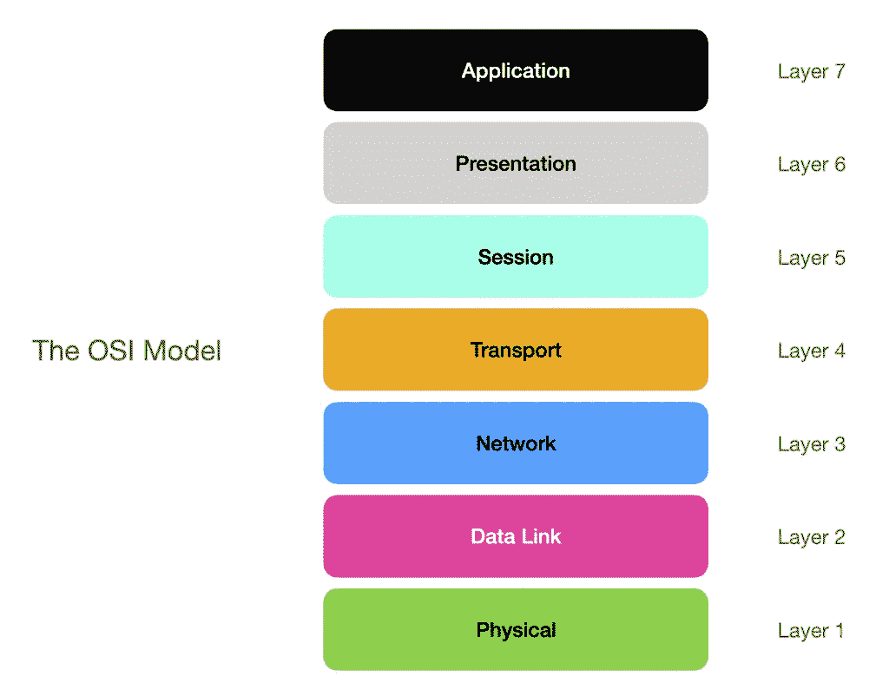
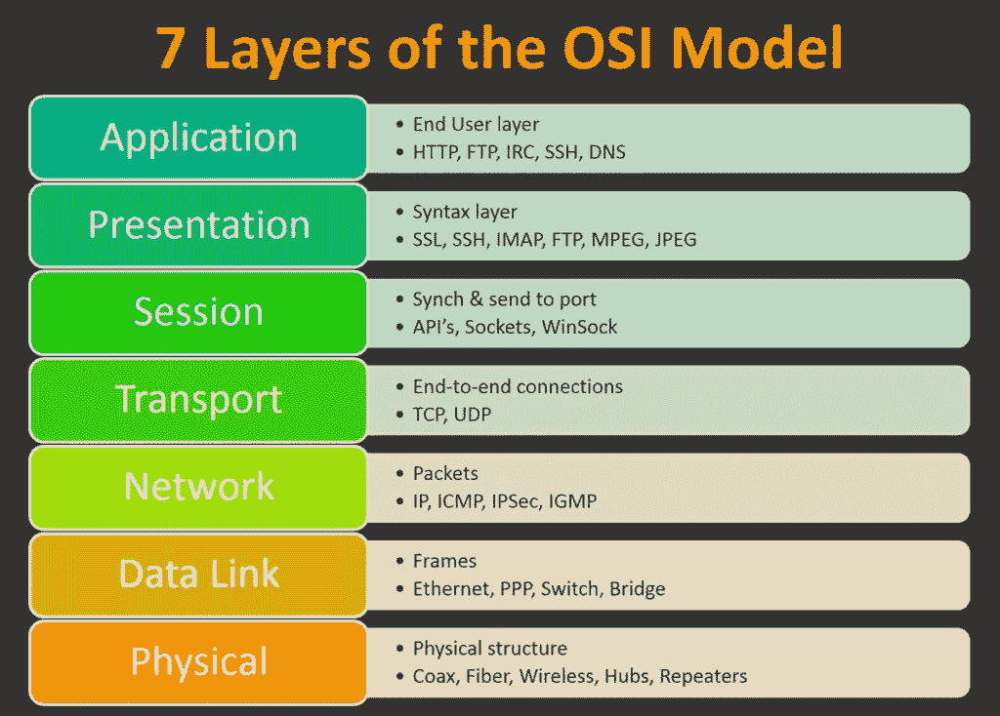
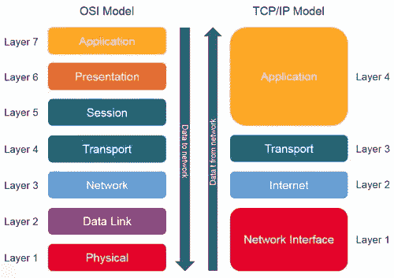
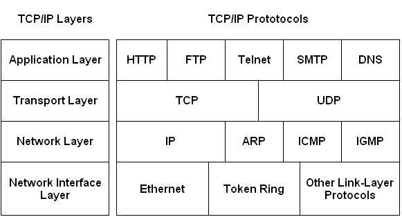
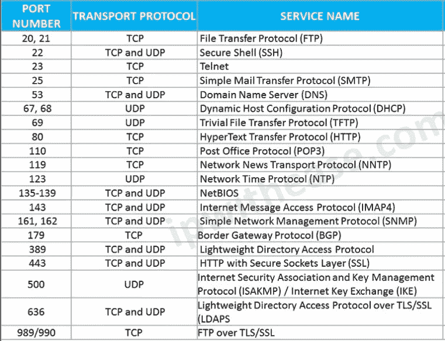

# 网络基础系列#2 (OSI 模型)，网络安全入门。

> 原文：<https://infosecwriteups.com/series-of-network-fundamentals-2-osi-model-to-get-started-in-cyber-security-f0320fbbee38?source=collection_archive---------0----------------------->

大家好，我又回到了网络基础的第二个系列，在上一篇博客中，我们学习了什么是*网络的类型，在这篇博客中，我们将学习 OSI 模型和 TCP/IP 模型及其协议。*

*我们开始吧，*

# *开放系统互连(OSI)模型*

## *什么是 OSI 模型*

*OSI 模型是用于不同网络设备之间通信的标准协议栈，由国际标准化组织(ISO)在 20 世纪 70 年代后期开发，也被称为网络的父协议，也被许多厂商引用。*

*OSI 模型由 7 层组成*

**

## *7)应用层*

*它是用户和计算机之间的接口，为用户提供服务。*

## *6)表示层*

*这一层负责加密/解密、编码/解码和压缩，并将 ASCII 转换为十六进制格式。*

## *5)会话层*

*它建立与服务器的连接，负责会话管理并确保安全性。*

## *4)传输层*

*这一层是 OSI 模型的核心，负责将数据段可靠地传输到不同的服务，而不会出现任何数据复制。*

## *3)网络层*

*这一层从传输层提取数据段并转换成数据包，它负责以最短路径将数据包路由到不同的网络。*

## *2)数据链路层*

*这一层负责将数据包转换成帧，并在节点间传递数据。
数据链路层分为两种类型
1)逻辑链路控制
*管理错误，流量控制
*定义称为服务接入点(SAP)的逻辑接口点。这些 SAP 用于向上层传输信息。

2)媒体访问控制(MAC)
*直接与网络适配卡
*通信，负责在两台计算机之间传输无错数据。*

## *1)物理层*

*这一层负责将帧转换为比特，并通过电缆或无线信号进行传输，还负责设备之间的物理连接。*

## *OSI 模型的 7 层及其协议*

**

*这是 OSI 模型的工作模型和历史。*

# *TCP/IP 模型*

*还有另一个我们今天使用的协议栈，它是从 OSI 模型派生出来的，它就是 TCP/IP 协议栈。*

## *什么是 TCP/IP*

*TCP/IP 是由 ARPANET(高级研究计划局网络)开发的。TCP/IP 也是协议栈，用于其他网络设备之间的通信。*

## *TCP/IP 模型由 4 层组成*

*4)应用层
3)传输层
2)互联网层
1)网络接口*

*OSI 和 TCP/IP 模型的区别*

**

*包含协议的 TCP/IP 模型的 4 层列表。*

**

*带有服务名称的著名端口列表，你必须记住这些端口，这些协议将在网络安全中非常有用。我会写一篇关于这些端口号和服务的单独的博客，并给出详细的解释。*

**

*我希望你了解 OSI 和 TCP/IP 模型。有任何疑问或意见让我知道。*

*下一篇报道( [*拓扑和网络设备*](https://cmuppin9.medium.com/series-of-network-fundamentals-3-topologies-network-devices-to-get-started-in-cyber-security-a514624ce55e) )*

*进一步参考和视频教学的链接。
* [*视频由 Ansh 从咬科技 you tube 频道*](https://www.youtube.com/watch?v=0AcpUwnc12E&list=PLkW9FMxqUvyZaSQNQslneeODER3bJCb2K)
* [*视频由 F5 dev central*](https://www.youtube.com/watch?v=i9RL5jD9cTI)
*[*视频由网络卡盘从 you tube*](https://www.youtube.com/watch?v=CRdL1PcherM&t=314s) *。**