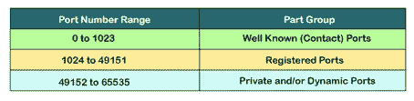
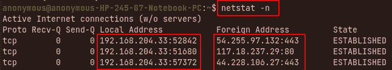
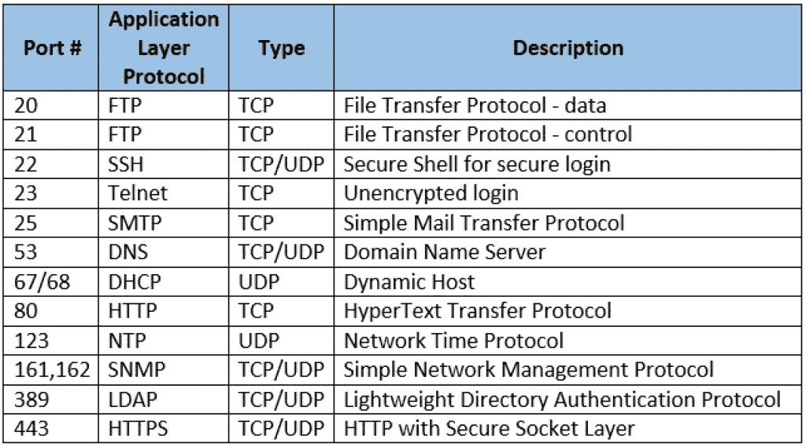
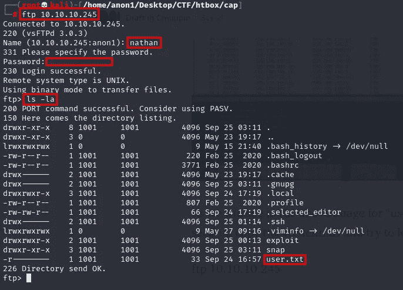

# 网络基础系列#5(端口和协议)，网络安全入门。

> 原文：<https://infosecwriteups.com/series-of-network-fundamentals-5-ports-protocols-to-get-started-in-cyber-security-a1adada9dbdb?source=collection_archive---------0----------------------->

你好，黑客们，今天我们要讨论的是网络安全行业日常使用的**【众所周知的端口号和协议】**，在上一篇博客中我们学习了 [***IPv4 和 IPv6***](https://medium.com/techiepedia/series-of-network-fundamentals-4-ipv4-ipv6-address-to-get-started-in-cyber-security-efadbdeef34f) 请务必阅读上一篇博客。

**我们开始吧，**

## 什么是端口？

端口用于通过互联网与服务器上的特定服务/协议进行通信，因为在服务器上运行着许多服务/协议，如 FTP、SMTP、SSH、HTTP、HTTPS 等，每个服务/协议都分配有唯一的端口号，服务器会将您的请求重定向到特定的服务。

## 端口号及其范围:

端口号是一个 16 位值，范围从 0 到 65535，由**“互联网名称与数字地址分配机构**”(ICANN)分配，分为 3 种类型。
**1)0–1023 个已知端口
2)1024–49151 个注册端口
3)49152–65535 个动态端口**

图片来自谷歌

## 1)众所周知的端口(0–1023)

众所周知的端口基本上是为特定的服务或协议分配的，如 FTP、SMTP、SSH、HTTP、HTTPS 等。我们将在下面详细讨论这些协议。

## 2)注册端口(1024–49151)

这些端口基本上是由公司和用户注册的，用于不同的网络功能、特定应用和 ICANN 的其他服务。

## 3)动态端口(49152–65535)

动态端口用于建立出站连接，就像如果你想从浏览器与 web 服务器通信，你需要一个目的端口和一个源端口。

## 示例:-

Netstat 是安装在每个操作系统中的 CLI 工具，它显示 TCP 连接、路由表等。通过使用这个 netstat 实用程序，我们可以看到 TCP 连接。(netstat -h) -h 列出选项。

## 端口号和协议

图片由谷歌提供

## 1)文件传输协议(FTP)端口号— 20 和 21

这是使用命令行界面在服务器和客户端设备之间传输文件所使用的协议，现在很少在组织中使用，因为它在服务器和客户端之间通信时不加密任何文件或数据，数据以明文形式传输。

FTP 命令

## 2)安全外壳(SSH)端口号:22

这是用于远程连接到设备的协议，它在远程设备之间提供加密连接。

## 3) Telenet 端口号:23

这是用于设备之间远程连接的协议，它是非常基本的协议，并且非常不安全，因为数据以明文传输。

## 4)简单邮件传输协议(SMTP)端口号:25

这是用于通过互联网将电子邮件传输到目的服务器的协议。

## 5)邮局协议 3 (POP3)端口号:110

这是电子邮件客户端用来从服务器检索电子邮件的协议。

## 6)域名系统(DNS)端口号:53

这是用于将域名转换为 IP 地址的协议，反之亦然。例:——Amazon.com 到 95.418.46.46。

## 7)动态主机传输协议(DHCP)端口号:67 和 68

这是用于在网络中动态分配 IP 地址的协议。

## 8)普通文件传输协议(TFTP)端口号:69

这是用于在设备之间传输文件的协议，主要用于配置路由器。

## 9)超文本传输协议(HTTP)端口号:80

这是使用超文本链接获取或加载网页的协议。它是万维网(WWW)的基础。

## 10)超文本传输安全(HTTPS)端口号:443

HTTPS 协议的功能与 HTTP 相同，但主要区别在于 HTTPS 使用了额外的安全功能，它提供了身份验证和加密功能，通过使用安全套接字层(SSL)在互联网上提供安全通信。

## 11)远程桌面协议(RDP)端口号:3389

这是一种协议，它为用户提供图形界面，以便通过互联网连接到另一台远程设备。

## 12)服务器消息块(SMB)端口号:445

这是用于访问网络资源(如网络中的共享文件和打印机)的协议。

## 13)互联网消息访问协议(IMAP)端口号:143

IMAP 是电子邮件客户端用来通过 TCP/IP 连接从邮件服务器检索电子邮件的协议。

## 14) NetBIOS 端口号:137 和 139

NetBIOS 代表网络基本输入/输出系统，它用于在局域网上的计算机之间建立连接和访问共享资源。

*在这篇文章中，我们了解了端口号、协议及其用途，除此之外，还有一些其他协议你一定要看看，我会在下面给出链接。*

*我希望你明白，如果有任何需要补充或纠正的地方，请在评论区告诉我，因为总有改进的空间。*

*如果你喜欢这些内容，点击关注按钮，每周我都会发布内容丰富、令人惊叹的内容，请确保关注*“[*链接-在*](https://www.linkedin.com/in/c-m-uppin-b09967203/)&[*Twitter*](https://twitter.com/cmuppin97)”