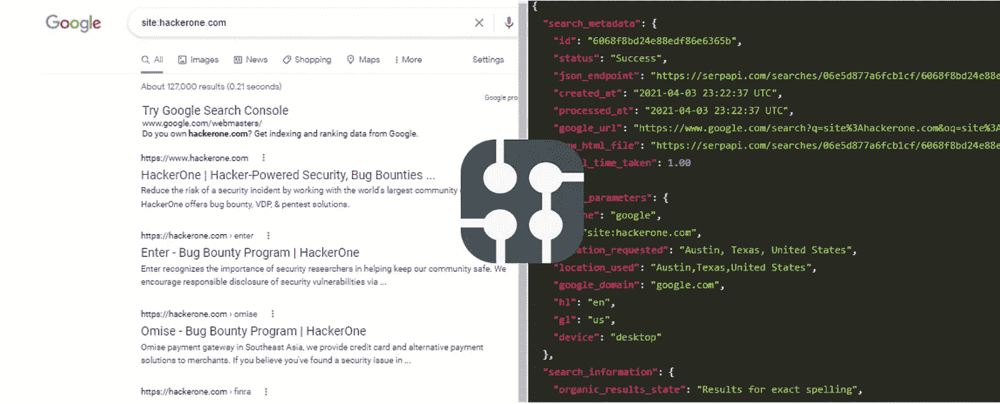
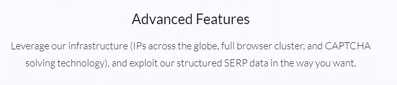
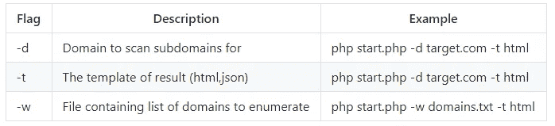
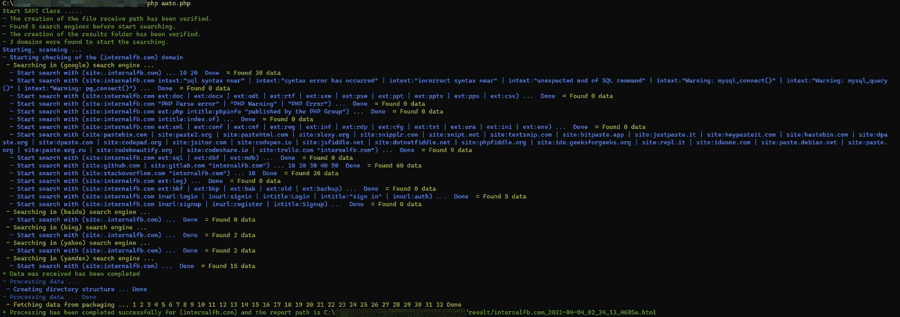
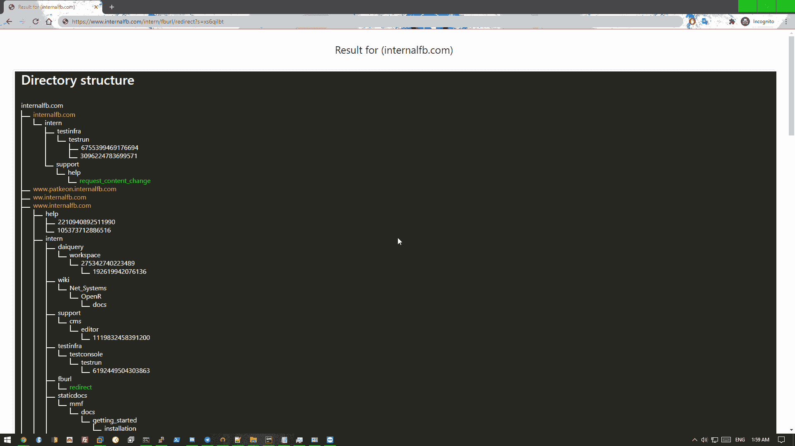

# 使用搜索引擎自动侦察

> 原文：<https://infosecwriteups.com/serpscan-automate-your-recon-using-search-engines-6a8cc2b1a3b3?source=collection_archive---------0----------------------->



serpapi.com

Serpscan 是一个强大的 PHP 工具，旨在允许您从舒适的命令行直接利用 dorking 的功能。

如标题所示，今天我将展示一个新工具，但对于那些希望开发一个自动漏洞扫描器来寻找 bug 的人，以及那些计划开发一个付费笔测试服务的公司来说，这可能是一个**想法而不是一个工具**。

**你是虫子赏金猎人**？—我不知道你是否熟悉这一信息，但顶级安全公司和 [HackerOne](https://www.hackerone.com/) 平台上的前 100 名黑客中的一些正在使用自动工具来收集信息、编写、检查 CVE 氏症并准备好报告。

已经有很多内置 API 的扫描仪可以使用，但是这些扫描仪无法提供这样的服务 [SerpApi](https://serpapi.com/) 。

这里的想法是，你当然不会一个接一个地手工检查每一个呆子，所以这里出现了 [SerpApi](https://serpapi.com) 和 SerpScan 工具…

[**SerpApi**](https://serpapi.com/) **是给你一个已知搜索引擎的 Api 的服务，比如 Google、Bing 等。**

**和实时搜索，他们的 API 基于不同的 IP，验证码解决技术，等等…**



serpapi.com

那么什么是 [**SerpScan**](https://github.com/Alaa-abdulridha/SerpScan) ？—这是一个功能强大的 PHP 脚本，旨在允许您从舒适的命令行直接利用 Dorking 的功能，您只需输入您的目标，该工具将自动从所有搜索引擎页面收集有关您的目标的信息。

# 特征

*   扫描多个域。
*   子域枚举。
*   检查活动子域。
*   从所有搜索引擎中查找 URL。
*   查找 js 文件。
*   在 js 文件中搜索端点。
*   查找参数。
*   查找目录。
*   以 HTML、JSON 格式导出结果。
*   您可以在配置文件中自定义您的呆子。

现在在 config.php 的文件中已经有了基本的呆瓜，你可以想添加多少就添加多少。

当前的呆子将检查:

```
 Publicly exposed documents
 Directory listing vulnerabilities
 Configuration files exposed
 Database files exposed
 Log files exposed
 Backup and old files
 Login pages
 SQL errors
 PHP errors / warnings
 phpinfo()
 Search Pastebin.com / pasting sites
 Search Github.com and Gitlab.com
 Search Stackoverflow.com
 Signup pages
```

# 装置

首先，你需要在这里 下载或者克隆这个工具 [**的 Github repo**](https://github.com/Alaa-abdulridha/SerpScan)

1.  https://github.com/Alaa-abdulridha/SerpScan.git
2.  光盘 SerpScan
3.  chmod +x install.sh
4.  。/install.sh

这里的 install.sh 文件仅支持两个系统:

**Ubuntu(18 日和 20 日测试)和 CentOS 7。**

它可以很容易地手动安装，我也在 windows 上测试过，该工具提供了一个 Docker 映像。

要使用 Docker，您只需:

```
docker run -it alaa0x2/serpscan:latest php 
/usr/src/SerpScan/start.php -d domain.com -t html
```

但是不要忘记把你的 API 密匙放在 config.php，你可以从 https://serpapi.com 的[拿到你的 API 密匙](https://serpapi.com)

# 使用

在所有情况下都必须使用参数 **-t** ，您可以在 domains.txt 文件中输入多个目标。



windows CMD 中的 SerpScan

我将把结果留给你:)



这个工具只是一个例子，展示了通过使用 SerpApi 来自动化你的 bug 追踪:D 可以实现什么

查看 GitHub repo，有一个提供的报告样本。

正如我之前提到的，你可以从 https://serpapi.com 获得 API 密钥

这是最便宜的网站，也是最好的为你提供这种服务的网站，有一个很棒的团队，他们会为你提供免费的 5000 搜索积分(这真的很多)。

干杯。