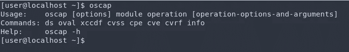
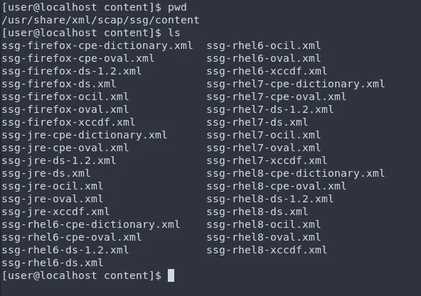
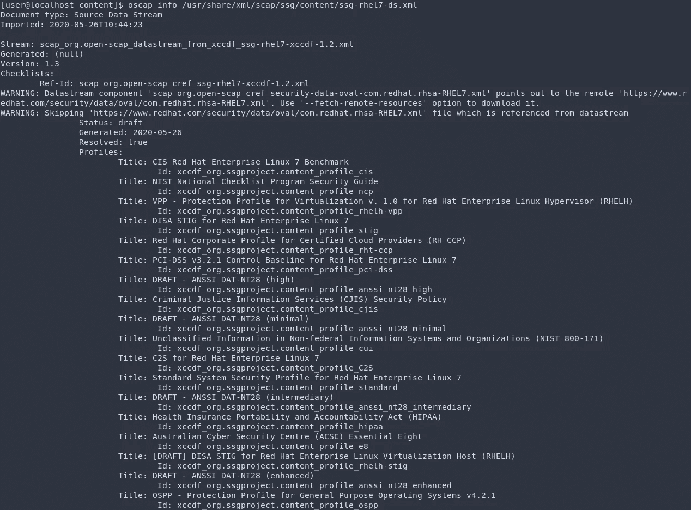
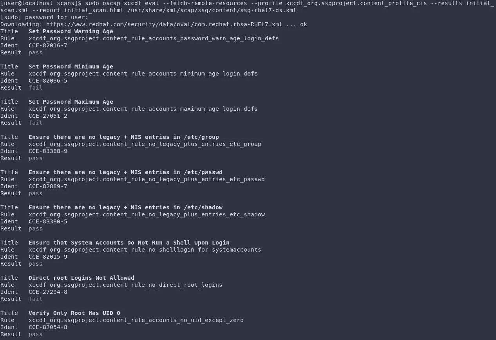
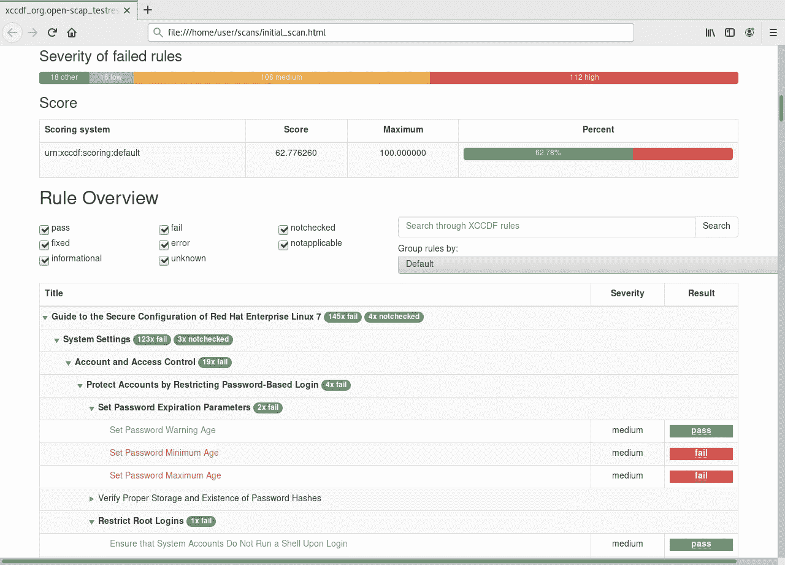
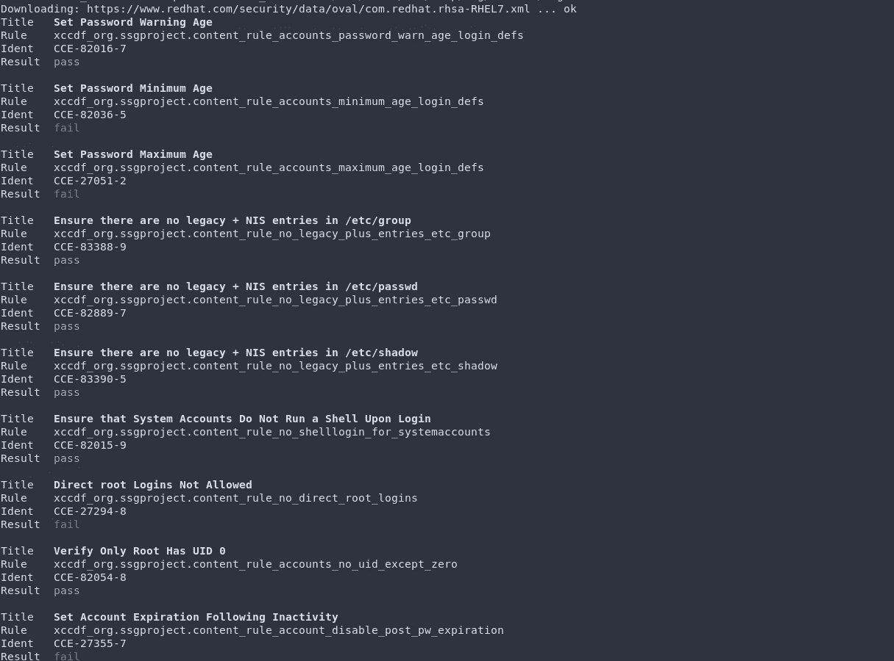
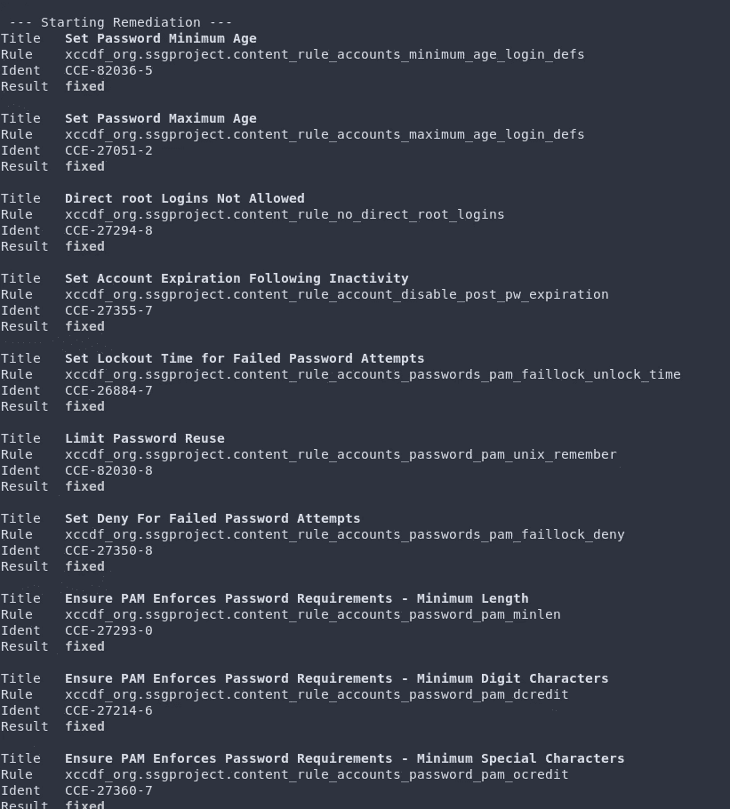
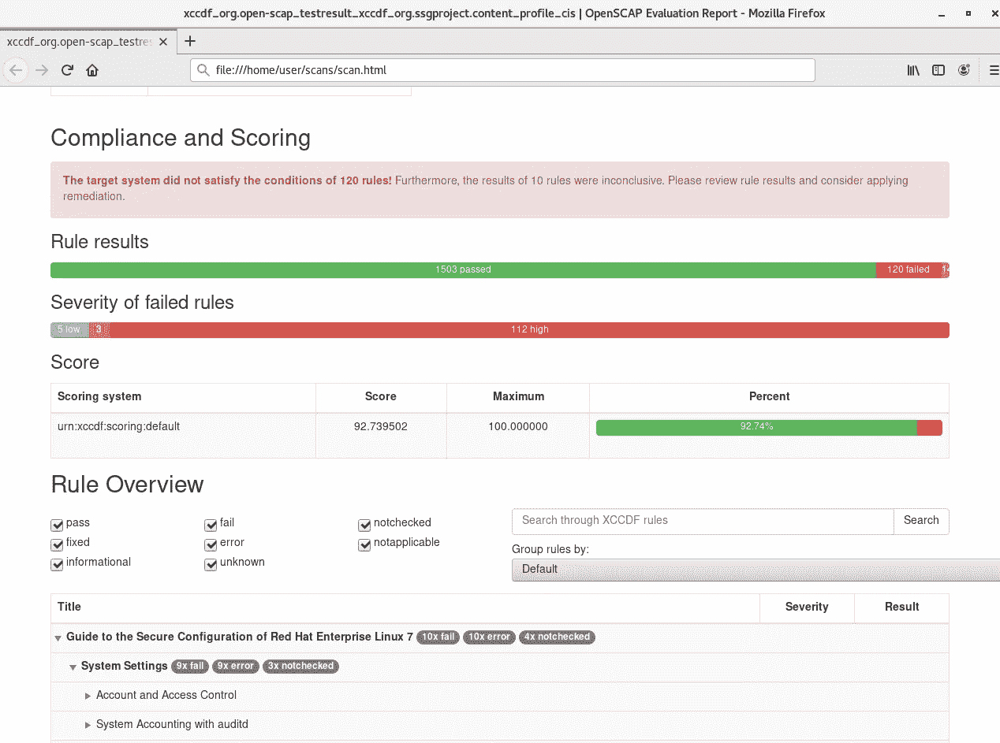
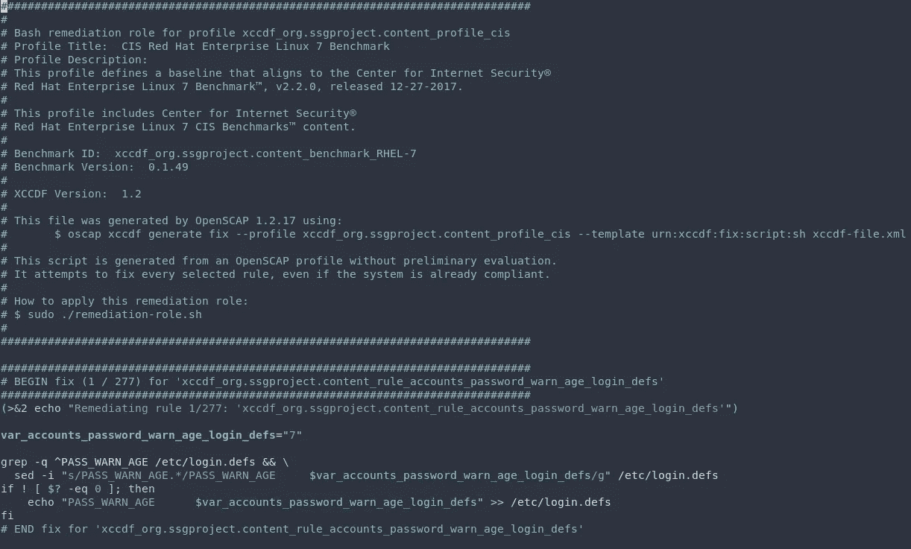

# 使用 OpenSCAP 强化服务器

> 原文：<https://infosecwriteups.com/server-hardening-with-openscap-be072ba2e415?source=collection_archive---------1----------------------->

> “SCAP 安全指南是以 [SCAP](http://www.open-scap.org/security-policies/scap-security-guide/#) 文档的形式编写的安全策略。SCAP 安全指南中创建的安全策略涵盖了计算机安全的许多领域，并提供了最佳实践解决方案。该指南包含详细描述的规则，还包括针对目标系统优化的成熟补救脚本。SCAP 安全指南和 OpenSCAP 工具可用于自动审计您的系统。”[http://www . open-scap . org/security-policies/scap-security-guide/](http://www.open-scap.org/security-policies/scap-security-guide/)

RHEL 7 号将在这次演习中使用。

为了开始，应该安装 oscap 工具和 scap 安全指南。

`yum install openscap-scanner scap-security-guide`



安装后，可以使用命令 oscap 来启动程序

scap-security-guide 包提供了安全策略，其内容可以在`/usr/share/xml/scap/ssg/content/`中找到



/usr/share/XML/scap/SSG/content/directory 的内容

SCAP 数据流是从 SCAP 1.2 版开始使用的一种文件格式，它代表一个 XCCDF、OVAL 和其他组件文件包。可以使用`oscap info`模块检查 SCAP 数据流文件。

`oscap info /usr/share/xml/scap/ssg/content/ssg-rhel7-ds.xml`



关于 SCAP 数据流的信息

通过检查，我们可以注意到所选 SCAP 文档中所有可用的概要文件。我将选择 id 为 xccdf _ org . SSG project . content _ profile _ CIS 的[*CIS Red Hat Enterprise 7 Benchmark*](https://www.redhat.com/en/blog/center-internet-security-cis-compliance-red-hat-enterprise-linux-using-openscap)概要文件来审计系统。请注意关于远程资源的警告，我们收到此警告是因为 SCAP 安全指南使用外部文件来检查系统是否是最新的，是否有已知的安全漏洞。

## 扫描

接下来是使用 OpenSCAP 扫描系统是否符合 CIS 基准。

```
sudo oscap xccdf eval --fetch-remote-resources --profile xccdf_org.ssgproject.content_profile_cis --results initial_scan.xml --report initial_scan.html /usr/share/xml/scap/ssg/content/ssg-rhel7-ds.xml
```



扫描过程

这将扫描系统并将结果存储在一个 xml 文件和一个 html 文件中，html 文件将有助于了解系统并查看哪些规则通过了哪些规则失败了。还记得我们在检查 SCAP 文档时发现的警告说它使用了外部文件吗？`--fetch-remote-resources`选项将下载操作所需的文件，该操作需要互联网连接，如果系统没有互联网连接，请参见[此处](https://access.redhat.com/solutions/5185891)。

扫描完成后，可以查看 html 报告。



初始扫描的 HTML 报告

从报告中，我们可以获得许多信息，如分数，通过和失败的规则数量，失败规则的严重性等。根据我的报告，分数是 62.77，这意味着有相当数量的失败规则，该系统不是完全安全的，也不符合 CIS。

## 补救

为了使系统更符合要求，我们可以修复系统。以下单个命令将评估和修复系统，这种方法称为在线修复。

```
sudo oscap xccdf eval --remediate --fetch-remote-resources --profile xccdf_org.ssgproject.content_profile_cis --results scan.xml --report scan.html /usr/share/xml/scap/ssg/content/ssg-rhel7-ds.xml
```

执行该命令后，我们首先可以看到 oscap 是如何扫描系统的，其次是如何修复系统的。在补救阶段，结果将被标记为“已修复”或“错误”。

> “**修复的**结果表明修复后执行的扫描通过。**错误**结果表明，即使应用了补救措施，评估仍未通过。”
> 
> [http://static . open-scap . org/openscap-1.2/OS cap _ user _ manual . html # _ remediate _ system](http://static.open-scap.org/openscap-1.2/oscap_user_manual.html#_remediate_system)



扫描过程



补救过程

该过程完成后，可以查看生成的 html 报告。如你所见，现在分数是 92.73，系统比以前更安全了。我们已经成功地使用 openSCAP 对服务器进行了安全加固。



oscap 生成的 HTML 报告

## 生成和编辑补救脚本

由于脚本用于修复系统，我们可以使用 openSCAP 从概要文件中提取所有规则的修复脚本，并为我们生成一个 bash 脚本，然后可以根据我们的选择编辑这个 bash 脚本。我们可以删除某些规则或改变规则的价值。

```
oscap xccdf generate fix --fetch-remote-resources --profile xccdf_org.ssgproject.content_profile_cis /usr/share/xml/scap/ssg/content/ssg-rhel7-ds.xml > fix.sh
```

生成 bash 脚本后，我们可以使用文本编辑器进行我们喜欢的任何更改，然后可以执行该脚本来修复系统。



在 vim 中打开补救 bash 脚本

我们已经成功学习了如何使用 OpenSCAP 和 OpenSCAP 的一些基础知识来强化 RHEL 系统。

那都是乡亲们！

## 来自 Infosec 的报道:Infosec 每天都有很多内容，很难跟上。[加入我们的每周简讯](https://weekly.infosecwriteups.com/)以 5 篇文章、4 条线索、3 个视频、2 个 GitHub Repos 和工具以及 1 个工作提醒的形式免费获取所有最新的 Infosec 趋势！