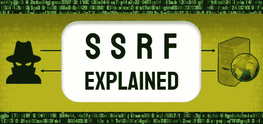
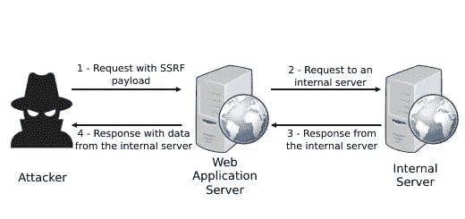
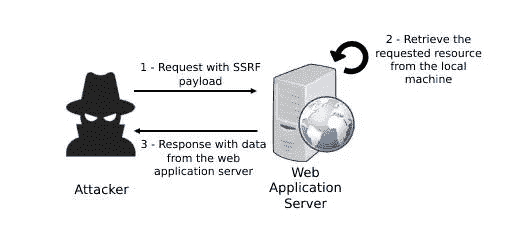

# 服务器端请求伪造(SSRF)解释

> 原文：<https://infosecwriteups.com/server-side-request-forgery-ssrf-explained-7d87b67b0e3b?source=collection_archive---------3----------------------->

**服务器端请求伪造**(或 **SSRF** )是一种攻击，包括诱导 web 应用程序向非预期目的地发送后端请求。

在云服务和复杂后端架构日益普及的推动下，这种攻击近年来变得越来越常见。

在 OWASP 十大 Web 应用程序安全风险中，SSRF 有自己的类别(A10)，这反映了此漏洞的严重程度。



# 什么是 SSRF？

在服务器端请求伪造攻击中，恶意参与者将通过发送包含伪造 URL 的请求来利用 web 应用程序。该 URL 通常指向位于受限后端位置的资源。这将导致 web 应用程序与这个非预期的目的地进行通信，并将结果发送回用户。

目的地可以在目标 web 应用服务器所在的后端网络上，也可以在同一台服务器上。另一种类型是目的地位于外部服务器上，通常由攻击者控制。

## 瞄准内部基础设施

在这种类型的 SSRF 中，攻击者会试图向无法从 Internet 访问的后端服务发送请求。

通常，该服务器位于防火墙后面的安全区域，并且可以向 web 应用程序授予例外，以允许它与服务器通信。

攻击者将利用后端服务在易受攻击的应用程序中建立的信任关系。他们会诱使应用程序向后端系统发送请求，从而允许他们未经授权访问数据。



SSRF 过程

让我们看一个攻击者如何利用易受攻击的 web 应用程序的示例。

**不安全应用示例**

为了演示攻击是如何进行的，我们将考虑一个非常基本的不安全 PHP 代码的例子。

```
<?php 
if (isset($_GET['url']))
{
// The url is provided in a GET parameter
$url = $_GET['url'];
// The destination url is accessed and the content is opened
$handle = fopen($url,"rb");
// The content of the file is dumped
fpassthru($handle);
}
?>
```

在这个例子中，应用程序打开一个名为`url`的 GET 参数中提供的文件。

现在，当用户向应用程序发送请求时，它看起来是这样的:

```
GET /?url=http://destination.com/resource
Host: vulnerablesite.com
```

如您所见，用户可以操作这个参数，并将其更改为他们想要的任何其他 URL。因为应用程序没有任何保护机制来防止这种情况，所以用户可以提供一个私有 IP 地址来诱导应用程序检索后端网络上的资源。

```
GET /?url=http://192.168.1.45/resource
Host: vulnerablesite.com
```

上述 IP 地址位于 192 . 168 . 0 . 0–192 . 168 . 255 . 255 范围内，该范围是为私有 IP 地址保留的。

在到达这行代码:`$handle = fopen($url,"rb");`时，web 应用程序将向在本地网络上拥有这个 IP `192.168.1.45`的主机发送一个请求。

当然，在这种情况下，后端服务拥有这个 IP 地址的几率非常低。

但是，攻击者可以构建一个脚本来执行主机发现。该脚本将扫描私有 IP 的所有可能范围，并检测哪些后端服务做出响应。

攻击者还可以更进一步，在发现的主机上执行端口扫描。

## 以同一台服务器为目标

另一种类型的 SSRF 包括以承载 web 应用程序的相同服务器为目标。



SSRF 瞄准同一个服务器

攻击者可以提供环回地址(127.0.0.1 或 localhost ),后跟要公开的文件的路径。

他们还可以使用以`file:///`开头的 URL 来使用服务器上文件的绝对路径。

根据前面给出的同一个示例，针对同一台服务器的 HTTP 请求将如下所示:

```
GET /?url=http://127.0.0.1/resource
Host: vulnerablesite.com
```

或者

```
GET /?url=file:///path/to/local/resource
Host: vulnerablesite.com
```

同样，攻击者可以利用此漏洞在托管 web 应用程序的机器上执行端口扫描。这可能会泄露目标计算机上运行的可能服务的信息。

# 防止 SSRF 袭击

为了保护您的 web 应用程序免受服务器端请求伪造，有一组好的实践可以遵循。它们应该可以帮助您降低 SSRF 攻击您的应用程序的风险。

**白名单:**不依赖黑名单网址。恶意用户总能找到绕过这些过滤器的方法，要么使用不同的编码；使用指向同一位置的替代域；或者利用开放重定向漏洞。相反，您可以使用白名单来只允许授权的目的地。

**网络分段:**并非所有后端服务都需要在同一个网络上。您可以尝试通过防火墙将您的网络分成多个部分。如果 SSRF 袭击发生的话，这应该会降低其影响。

**只允许 https 模式:**通常，应用程序只需要使用 https 模式进行通信。可以禁用其他模式，如`file:///`、`ftp://`等可用于利用 SSRF 漏洞的模式。

**认证:**您的应用程序应该要求认证，即使是同一内部网络上的后端服务之间的通信。

此外，不用说，您应该始终遵循安全 web 应用程序的通用良好实践。这些包括用户输入验证、正确的错误处理、安全的 API 实践、安全的 HTTP 头等等。

*原载于 2022 年 4 月 8 日 https://patchthenet.com*[](https://patchthenet.com/articles/web-application-security/server-side-request-forgery-ssrf-explained/)**。**