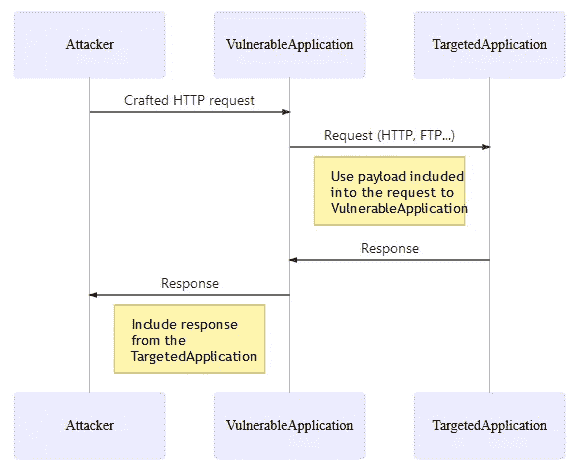
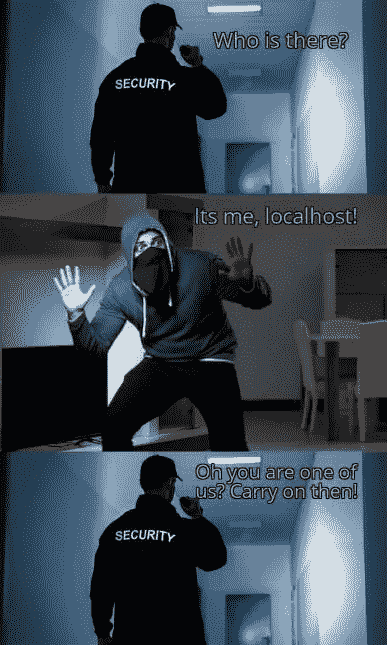

# 服务器端请求伪造— SSRF:利用技术

> 原文：<https://infosecwriteups.com/server-side-request-forgery-ssrf-exploitation-technique-9bc4b4045fbd?source=collection_archive---------0----------------------->

服务器端请求伪造或 SSRF 是一个漏洞，使得攻击者能够使用易受攻击的服务器代表攻击者发出 HTTP 请求。这与 CSRF 类似，因为两个漏洞都在受害者未确认的情况下执行 HTTP 请求。

> SSRF:受害者将是易受攻击的服务器。
> 
> CSRF:受害者将是用户的浏览器。

OWASP-SSRF 共同流程概览

如由 **OWASP** -在 SSRF 预防小抄:

*   SSRF 不限于 HTTP 协议，尽管事实上通常第一请求利用它，然而第二请求由应用本身执行，因此它可以使用不同的协议(*例如* FTP、SMB、SMTP 等)。)和方案(*如*`file://``phar://``gopher://``data://``dict://`等)。).协议/方案的使用高度依赖于应用的要求。
*   如果应用程序易受 XML 外部实体(XXE)注入的攻击，则攻击者可以利用该应用程序来执行 SSRF 攻击。

当应用程序获取用户可控制的输入并将其合并到使用后端 *HTTP* 请求回收的 *URL* 中时，服务器端重定向漏洞就会出现。用户提供的输入可以包括检索到的整个 URL，或者应用程序可以对其执行一些处理。这可能会导致:

*   **信息泄露**攻击者可以欺骗服务器泄露自己的信息，并提供对敏感内部文件的访问。
*   **XSS** 如果攻击者能够欺骗服务器管理一个包含 *Javascript* 的远程 *HTML* 文件。

SSRF 是一种攻击媒介，它滥用应用程序与内部网络、外部网络和机器本身进行交互。

**例如:**

这里，易受攻击的应用程序根据应用程序逻辑向 URL 发出请求:“*safedomain.safesite.com/account/edit.aspx"(具有 IP:192.10.10.1)。*

`POST /account/index HTTP/1.1
Content-Type: application/x-www-form-urlencoded
Host: safesite.com
Content-Length: 1234
show=default&url=safedomain.safesite.com/account/edit.aspx`

攻击者可以将请求的 URL 修改为:" *192.10.10.2:22 "，其中*请求位于防火墙后的替代资源或内部资源，并限制外部访问。

`POST /account/index HTTP/1.1
Content-Type: application/x-www-form-urlencoded
Host: safesite.com
Content-Length: 1234
show=default&url=192.10.10.2:22`

收到的响应包括来自所请求的 **SSH 服务的横幅:**

`HTTP/1.1 200 OK
Connection: close
SSH-2.0-OpenSSH_4.2Protocol mismatch`

# 作为攻击者你能做什么？

攻击者可以利用服务器端 HTTP 重定向漏洞，诱使易受攻击的应用程序充当**开放 HTTP 代理**来执行各种进一步的攻击:

1.  使用代理**攻击互联网上的第三方系统**。在目标看来，恶意流量似乎来自运行易受攻击的应用程序的服务器。
2.  使用代理**连接到组织内部网络**上的任意主机，从而达到无法从互联网直接访问的目标。
3.  使用代理**连接回运行在应用服务器本身上的其他服务**，绕过防火墙限制，并可能利用信任关系绕过认证。
4.  通过使应用程序在其响应中包含攻击者控制的内容，代理功能可被用于**执行跨站点脚本**等攻击。

# 如何识别和利用 SSRF？

1.  识别任何似乎包含**主机名、IP 地址或完整 URL 的请求参数。**
2.  对于每个参数，**修改其值**以指定一个替代资源，类似于所请求的资源
3.  检查该资源是否出现在服务器的响应中。
4.  定义一个指向您管理的互联网服务器的 URL，并**监控来自您正在测试的应用程序的传入连接**。
5.  如果没有接收到输入连接，**监控应用程序响应**所需的时间。
6.  如果有延迟，应用程序的后端**请求可能会由于出站连接的网络限制**而超时。
7.  如果成功建立了与任意 URL 的连接，请尝试执行以下操作:

a.确定**端口号是否可以指定**。例如:`http://site.com:22`
b .如果是，尝试**端口扫描内网**使用 Burp Intruder 等工具依次连接一系列 IP 地址和端口。
c .尝试**连接易受攻击服务器回环地址**上的其他服务。
d .尝试**将您控制的网页加载到应用程序的响应中，以执行跨站点脚本(XSS)攻击。**

## **使用特殊字符绕过限制:**

在内部、外部重定向应用程序或访问任何资源时，可能会有进一步的限制。您可以尝试绕过这些限制，使用特殊字符来修改请求的资源。

`?url=http://safesite.com&site.com
?url=http://////////////site.com/
?url=http://site@com/account/edit.aspx
?url=http://site.com/account/edit.aspx
?url=http://safesite.com?.site.com
?url=http://safesite.com#.site.com
?url=http://safesite.com\.site.com/domain
?url=https://ⓈⒾⓉⒺ.ⓒⓞⓜ = site.com
?url=https://192.10.10.3/
?url=https://192.10.10.2?.192.10.10.3/
?url=https://192.10.10.2#.192.10.10.3/
?url=https://192.10.10.2\.192.10.10.3/
?url=http://127.0.0.1/status/
?url=http://localhost:8000/status/`

## **使用 HTTP 重定向绕过限制:**

您可以尝试在请求中实现一个类似的代码片段，如果服务器成功处理，会将您重定向到目的地:

`?url=http://site.com/domain.php
<?php
header(‘Location: http://127.0.0.1:8080/status');
?>`

再见。