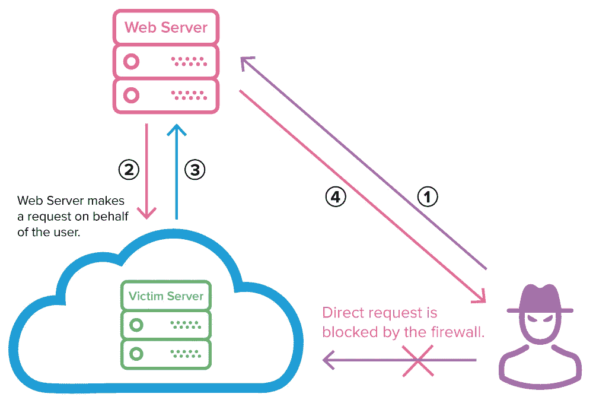

# 服务器端请求伪造— SSRF

> 原文：<https://infosecwriteups.com/server-side-request-forgery-ssrf-f62235a2c151?source=collection_archive---------0----------------------->

服务器端请求伪造是 web 漏洞之一，它允许攻击者使用后端服务器向内部系统发出非预期的请求。通过这种方式，攻击者可以访问被防火墙阻止的内部系统，如果应用程序使用 AWS 之类的云平台，那么易受攻击的应用程序可能会导致攻击者访问元数据实例，其中包含大量有趣的信息，如 IAM 角色的安全密钥等。

SSRF 的工作

上图是 SSRF 工作方式的一个例子。图像中显示的场景包含两台服务器

1.  网络服务器
2.  受害服务器(受防火墙保护的内部服务器)

让我们为每台服务器分配 Ip 地址

1.  Web 服务器— 192.168.0.3
2.  受害者服务器— 192.168.0.4
3.  攻击者——222.234.123.1

该系统被设计成网络服务器可以被网络内外的任何 IP 地址访问。而受害者服务器有防火墙，只允许来自邮件服务器的连接，所以如果攻击者试图直接访问受害者服务器，他/她将被防火墙阻止。

现在，攻击者必须想办法绕过限制，访问受害者服务器。假设上面提到的网络服务器就像一个在线图片画廊，用户可以上传他们的图片并保存在云中。

图像可以通过两种方式上传

1.  从他们的设备上传。
2.  存放图像的 URL。

> *通过 URL 上传图像意味着网络服务器必须向用户给定的 URL 发出 GET 请求，获取图像，然后存储在云中。因此，获取图像的 GET 请求代表后端 web 服务器(192.168.0.3)。*

如果用户输入的 URL 没有经过适当的清理，web 服务器提供的这个小功能就可能被利用。那么，如果攻击者不是给出实际的图像 URL，而是输入一个指向网络内部域(在这种情况下是受害者服务器)的 URL，会怎么样呢？

现在，攻击者可以在图像 URL 字段中输入受害者服务器的 IP 地址-http://192.168.0.4，然后 web 服务器会向受害者服务器发出 GET 请求，受害者服务器的防火墙允许该请求，因为该请求是从 **192.168.0.3** 而不是**222.234.123.1**(攻击者地址)发出的。这会导致攻击者访问内部服务器并绕过防火墙。

> 简而言之，攻击者使用邮件服务器作为代理，让受害服务器相信请求来自授权用户。

## 我们还能对 SSRF 做些什么？

**端口枚举:-** 一旦发现漏洞，攻击者就可以根据为每个请求提供的响应，开始枚举各种内部服务和端口。这可以通过使用一个叫做 **Burp Suite** 的工具来完成，攻击者创建一个所有可能的 IP 组合和端口号的单词列表，使用 Burp Suite 中的入侵者功能来枚举不同的端口。Burp 允许我们查看它向受害者服务器发出的每个请求的请求和响应头，根据响应我们可以枚举内部系统。

**使用 AWS -EC2 元数据服务窃取 AWS 访问密钥:-**

易受 SSRF 攻击的应用程序托管在云虚拟机实例上，那么攻击者就有可能访问只能由机器本身访问的端点，即元数据端点。

假设一个应用程序托管在 AWS 上，AWS 的元数据端点是 [http://169.254.169.254/](http://169.254.169.254/) ，该端点包含该特定实例的元数据，如本文开头所述，这些元数据实例具有 IAM 角色的凭证。AWS 的 **IMDSv1** 允许我们通过对下面提到的路径的简单 get 请求来访问 IAM 角色的凭证，

> [http://169 . 254 . 169 . 254/latest/metadata/iam/security-credentials/S3 access](http://169.254.169.254/latest/meta-data/iam/security-credentials/s3access)

这将返回一个包含以下内容的响应:

> { "Code" : "Success "，" last updated ":" 2020–04–26t 16:39:16Z "，" Type" : "AWS-HMAC "，" access keyid ":" asiaiosfodnn 7 example "，" SecretAccessKey ":" wJalrXUtnFEMI/k7m Deng/bPxRfiCYEXAMPLEKEY "，" Token":"token "，" Expiration ":" 2024–05–17t 15:09:54Z " }

现在，具备这方面知识的攻击者可以借助云上托管的 web 应用程序中的 SSRF 漏洞轻松获得特定 IAM 角色的访问密钥，然后他可以将密钥添加到 **~/。aws/credentials** 然后访问该特定帐户的数据。

**结论**

服务器端请求伪造、漏洞可能对现代 web 应用程序构成巨大威胁，因为它可能危及数据的机密性。SSRF 可以通过适当的 URL 或其他用户输入净化来缓解。开发人员可以创建一个黑名单，限制任何匹配黑名单的用户输入，还可以执行边界检查。

**更多了解 SSRF 的资源**

1.  [与 SSRF 一起动手](https://portswigger.net/web-security/ssrf)
2.  [为 SSRF 开发 URL 解析器](https://www.youtube.com/watch?v=2MslLrPinm0)
3.  [请求 WeasyPrint 中的伪造(SSRF)以获得 Bug 赏金& HackerOne 的 5000 万美元 CTF](https://www.youtube.com/watch?v=t5fB6OZsR6c)
4.  [首都一号口](https://krebsonsecurity.com/2019/08/what-we-can-learn-from-the-capital-one-hack/)