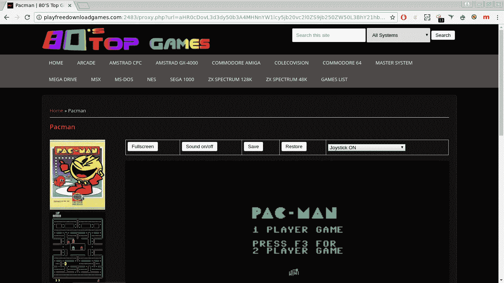
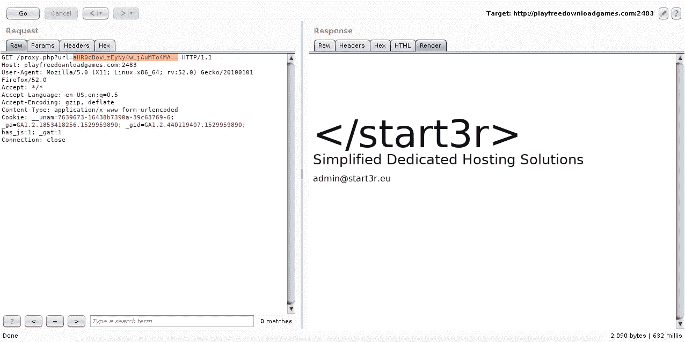
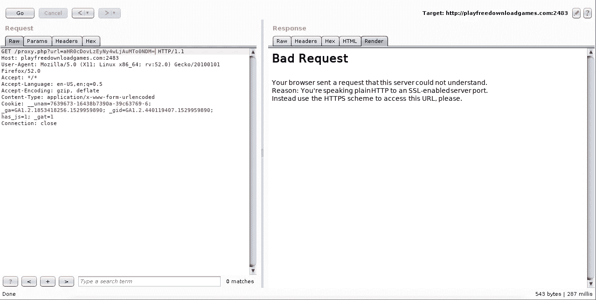
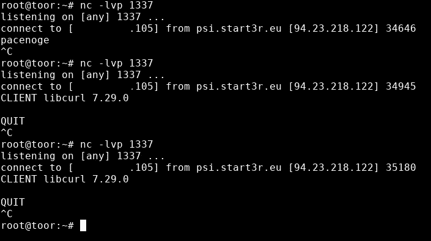
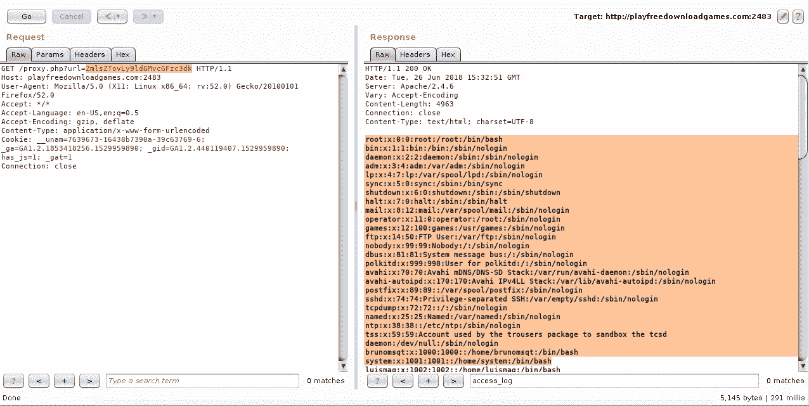
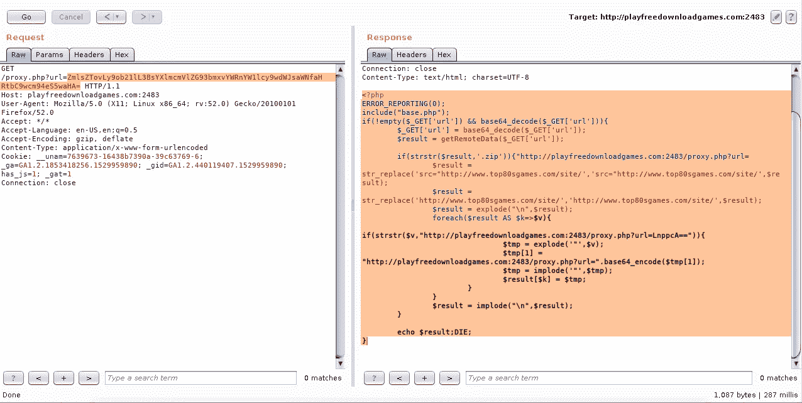

# 服务器端请求伪造(SSRF)测试

> 原文：<https://infosecwriteups.com/server-side-request-forgery-ssrf-testing-b9dfe57cca35?source=collection_archive---------4----------------------->

这个故事只是为了好玩测试 SSRF，而不是一个赏金写。我发现了一个易受 SSRF 攻击的随机网站，但为了利用它，我应该将我的输入转换为 base64。这里是 http://playfreedownloadgames.com:2483/proxy.php?的遗址[URL = ahr 0 cdovl 3d 3d y 50 B3 a4 mhnnyw1 lcy 5 JB 20 VC 2 l0 zs 9 JB 250 zw 50 L3 bhy 21 hbg = =](http://playfreedownloadgames.com:2483/proxy.php?url=aHR0cDovL3d3dy50b3A4MHNnYW1lcy5jb20vc2l0ZS9jb250ZW50L3BhY21hbg==)。如果我解码 base64，那么我得到了这个吃豆人游戏网站【http://www.top80sgames.com/site/content/pacman**。**

****

**所以让我们用 convert[**http://127 . 0 . 0 . 1:80**](http://127.0.0.1:80)到 base64**ahr 0 cdovlzeyny 4 wljaumto 4ma = =**试一下，在 burp repeater 上运行。**

****

**现在尝试使用端口 443，看看它是什么样子。**

****

**因为我使用端口 443 请求 HTTP，所以发生了错误请求。让我们试试 gopher，dict 和 sftp。我将在我的 VPS 中监听 1337 端口。**

****

**我尝试**gopher://my _ VPS _ IP:1337/_ pacenoge**， **dict://my_vps_ip:1337** 和 **sftp://my_vps_ip:1337** 都执行成功。还有什么？试试 **file:///etc/passwd****

****

**好的，我想看看 **httpd.conf** 。默认路径是这个**/etc/httpd/conf/httpd . conf****

****

**通过阅读 **httpd.conf** 文件，我知道 web 路径**/home/play free download games/public _ html**，所以我想通过访问这里的**/home/play free download games/public _ html/proxy . PHP**来了解**proxy.php**的代码**

****

**参考[http://blog.orange.tw](http://blog.orange.tw/)和 h1 SSRF 的报道。就是这样。黑客快乐！:)**