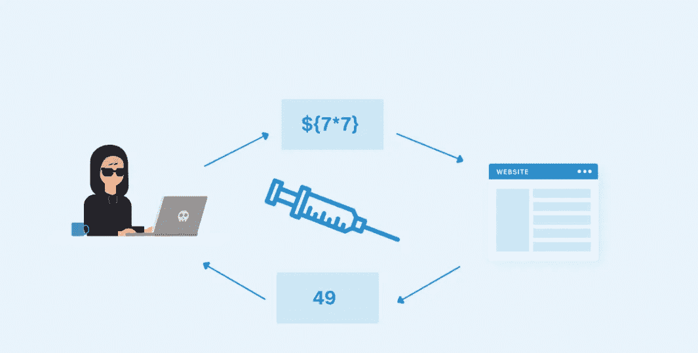
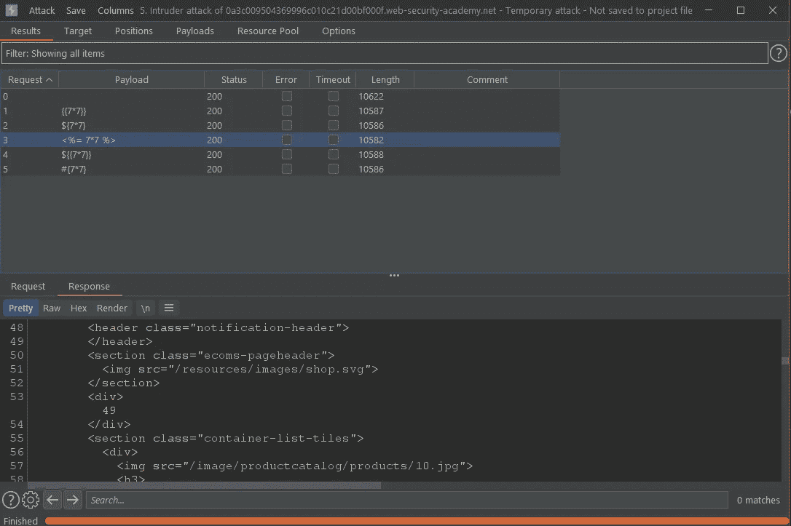
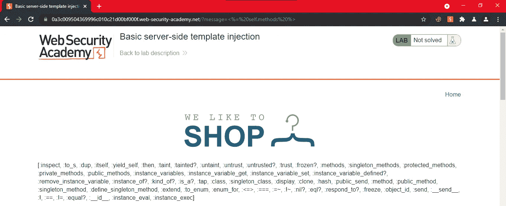
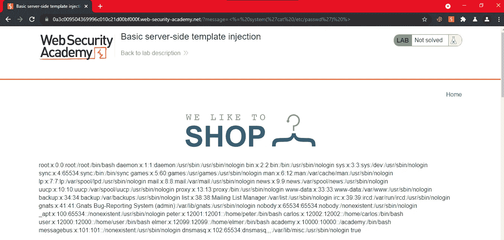
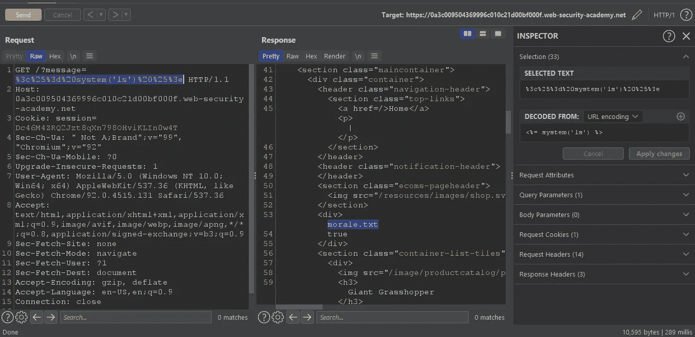
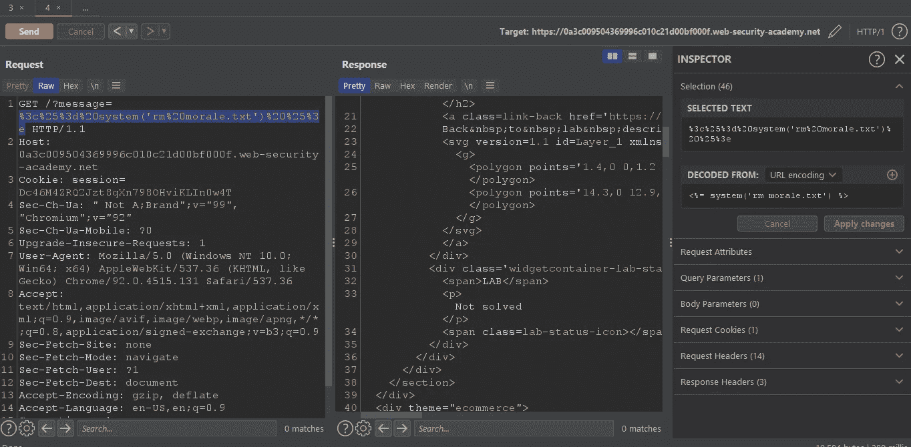
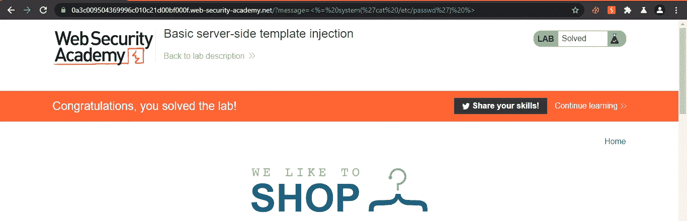

# 服务器端模板注入。

> 原文：<https://infosecwriteups.com/server-side-template-injections-by-hashar-mujahid-e5a1a383027e?source=collection_archive---------1----------------------->

在这篇博客中，我们将通过解决 Portswiggers 实验室来了解什么是服务器端模板注入以及它们是如何工作的。



服务器端模板注入。

**什么是模板引擎？**

由于模板引擎，您可以在应用程序中使用静态模板文件。模板引擎在运行时用实际值替换模板文件中的变量，并将模板转换成提供给客户端的 HTML 文件。这种方法使得创建 HTML 页面变得很容易。

尽管模板是静态分布的，但是高度灵活的服务(SaaS)的发展导致了各种模板库在互联网上的直接暴露。这些看似不起眼的库比一些开发人员想象的要强大得多。

**什么是 SSTI？**

当攻击者能够将恶意有效负载注入模板，然后在服务器端执行时，就会发生服务器端模板注入。

例如:让我们假设一个大规模地为用户生成完成证书的 LMS。开发人员可以使用一个模板，通过一个变量提供每个用户的名字，然后打印在证书上，而不是为每个用户生成整个证书。可以把它想象成一个**填充空格**，其中数据通过变量传递。如果攻击者可以插入恶意的有效载荷而不是用户名，并且它以某种方式在服务器端执行，将会产生灾难性的后果。

**SSTI 的影响？**

成功的服务器端模板注入漏洞的后果往往是灾难性的，导致**远程代码执行通过获得对后端服务器**的完全控制。即使没有执行任何代码，攻击者也可能**能够访问服务器**上的敏感数据。

**剥削:**

服务器端模板注入的开发分为五个步骤。

*   **检测**易受 SSTI 攻击的端点。
*   **识别**正在使用的模板引擎。这可能是 Twig，Jinja2，樱井真子等。
*   **开拓**、**探索**和**进攻**是一个三步走的活动，经常重复，需要很大的决心，通过反复试验来完成。

现在说够了…让我们把手弄脏吧。

实验 1: [**基础服务器端模板注入**](https://portswigger.net/web-security/server-side-template-injection/exploiting/lab-server-side-template-injection-basic)

目标:由于 ERB 模板的不安全构造，该实验室容易受到[服务器端模板注入](https://portswigger.net/web-security/server-side-template-injection)的攻击。要解决这个问题，请查阅 ERB 文档，了解如何执行任意代码，然后从 Carlos 的主目录中删除`morale.txt`文件。

让我们进入实验室。


网上商店的主页欢迎我们。

现在第一步:找到一个易受攻击的端点。点击我发现，当我们点击“查看详细信息”按钮时，web 应用程序会将我们重定向到主页，并在页面上显示一个消息参数“很遗憾，此产品已缺货”。


任何对 owasp 10 有所了解的人都会尝试将一个 XSS 有效载荷。这就是我所做的，当然我们得到了它。


🤣

但是我们也必须用 SSTI 的有效载荷来测试它。

因此，只需将带有消息参数的请求发送给入侵者，并用下面给出的有效载荷进行狙击。

```
{{7*7}}
${7*7}
<%= 7*7 %>
${{7*7}}
#{7*7}
```

攻击完成后，分析服务器的响应。



入侵者攻击

我们可以看到`<%= 7*7 %>`执行成功。

我们知道这是一个 ERB 模板引擎，所以让我们阅读文档，并尝试找到如何在服务器上执行任意代码。

列出方法:



方法

```
<%= self.methods %>
```

用 instance.eval()方法尝试了很多方法之后。我在互联网上找到了一个命令系统，它执行代码就像 PHP 中的系统命令一样。



/etc/passwd

```
<%= system('cat /etc/passwd') %>
```

现在我们有 RCE 在系统上，让我们完成我们的目标



限位开关（Limit Switch）

还是删了吧。



士气. txt

```
<%= system('rm morale.txt') %>
```



完成

我们可以看到我们已经成功完成了实验。

我会每天发布一个新的实验室。

敬请关注。

*来自 Infosec 的报道:Infosec 上每天都有很多事情发生，很难跟上。* [***加入我们的每周简讯***](https://weekly.infosecwriteups.com/) *以 5 篇文章、4 个线程、3 个视频、2 个 Github Repos 和工具以及 1 个工作提醒的形式免费获取所有最新的 Infosec 趋势！*