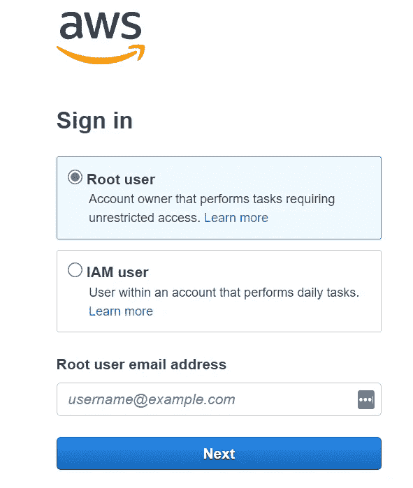
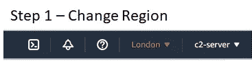
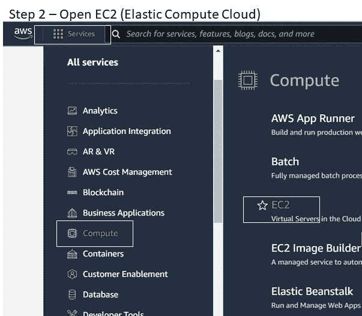
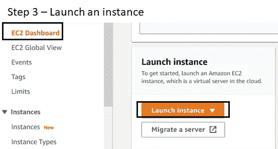
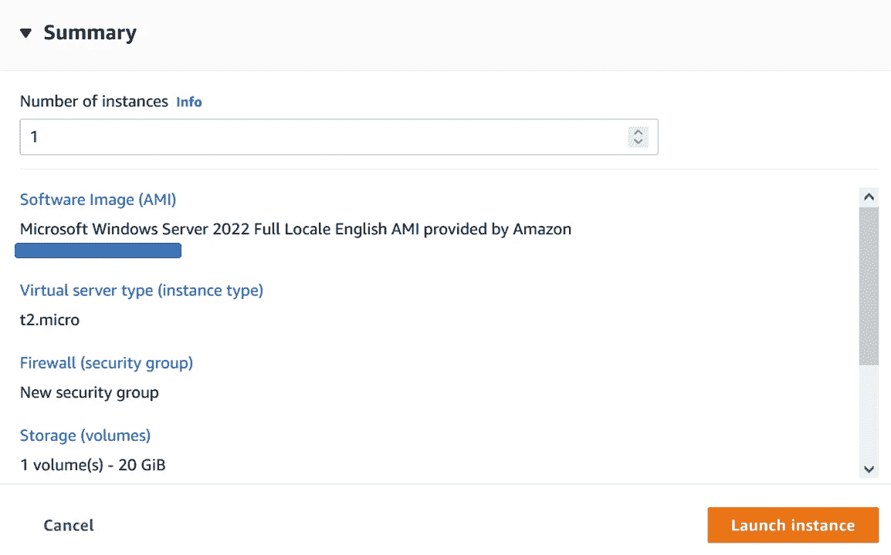
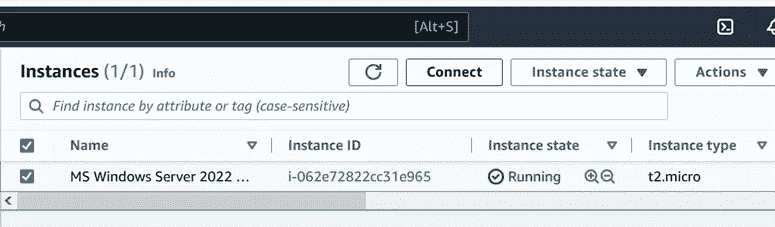
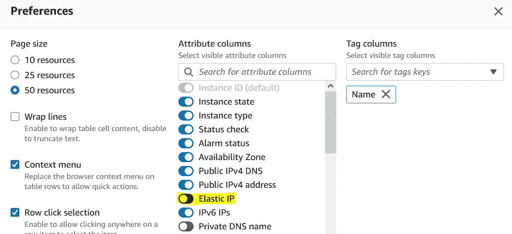
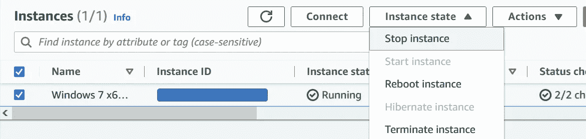
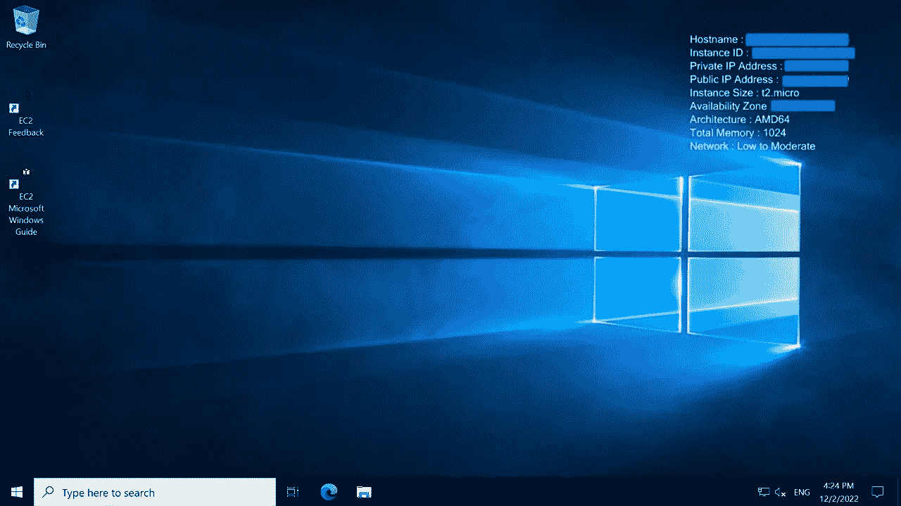

# 云计算实例设置

> 原文：<https://infosecwriteups.com/set-up-cloud-instances-703340af4897?source=collection_archive---------3----------------------->

## 自动警报系统

# 使用云实例的优势

*   低成本企业运营支出投资
*   使用云存储进行数据备份存储
*   易用性
*   维护成本低
*   高级数据安全性

# AWS 云

AWS 提供长达 12 个月的 ***免费层。*** 这包括:

*每月在免费层 ami 上使用 750 小时的 t2.micro(或在 t2.micro 不可用的地区使用 t3.micro)实例，30gb 的 EBS 存储，200 万个 io，1 GB 的快照，以及 100 GB 的互联网带宽。*

照片由 [Christian Wiediger](https://unsplash.com/@christianw?utm_source=medium&utm_medium=referral) 在 [Unsplash](https://unsplash.com?utm_source=medium&utm_medium=referral) 上拍摄

访问[**https://aws.amazon.com/console/**](https://aws.amazon.com/console/)，点击**“创建 AWS 账户”**并注册。

创建账户后，在登录期间，从选项中选择并以**“root 用户”身份登录。**

在您的帐户中，完成以下步骤开始创建 AWS 实例。

**步骤 4——完成所需的设置**

*   名称和标签
*   选择应用程序和操作系统映像(选择自由层映像)
*   选择满足您的计算、内存、网络或存储需求的实例类型(选择自由层映像)
*   为安全登录创建密钥对。
*   配置网络设置和防火墙(安全组)
*   指定存储(卷)选项(符合免费层条件的客户可以获得高达 30 GB 的 EBS 通用(SSD)或磁性存储)
*   启动实例，然后单击右下角的“查看所有实例**”**，转到您创建的实例列表。选择要运行的实例，单击实例状态下的“启动实例”,然后单击“连接”。

**在>设置页面**下，禁用弹性 IP 以避免产生任何费用

## 停止、重启和终止实例

工作完成后，如果您不想保留保存的数据供下次使用，可以“停止”会话。停止实例不会产生费用，但与这些实例关联的弹性 IP 地址或 EBS 卷会产生费用。每次启动实例时，停止实例将更改 IP 地址。

如果要删除实例，请单击“终止会话”。

如果要重新启动实例，您将能够保持其公共 DNS 名称(IPv4)、私有和公共 IPv4 地址、IPv6 地址(如果适用)不变，并保持其实例存储卷上的任何数据不变。

## 充当故障检修员

1.  **检查安全组**—AWS EC2 实例的虚拟防火墙。您可以修改安全组的入站和出站规则来控制入站和出站流量。

**——————**注意这个空间

## 来自 Infosec 的报道:Infosec 每天都有很多内容，很难跟上。[加入我们的每周时事通讯](https://weekly.infosecwriteups.com/)以 5 篇文章、4 个线程、3 个视频、2 个 GitHub Repos 和工具以及 1 个工作提醒的形式免费获取所有最新的 Infosec 趋势！