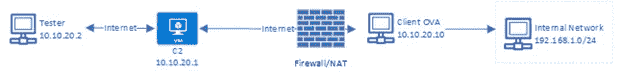
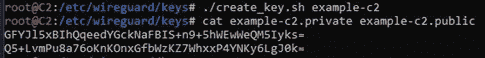
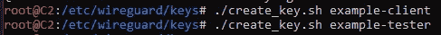
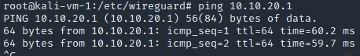
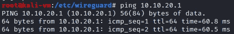
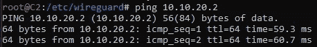
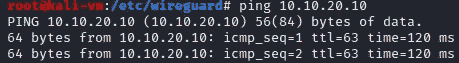
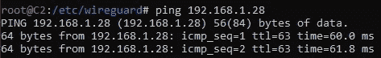
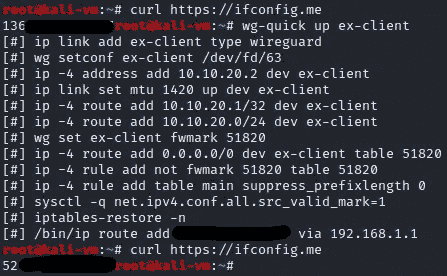

# 为内部网络访问设置 WireGuard VPN 服务器架构

> 原文：<https://infosecwriteups.com/setting-up-a-wireguard-vpn-server-architecture-for-internal-network-access-2adcdc79e8e1?source=collection_archive---------0----------------------->

利用云命令和控制(C2)服务器以及各种端点配置，您可以轻松设置完整的 WireGuard 网络，允许直接访问私有内部网络，甚至通过一个 IP 路由所有流量，以便于审计。这个博客和项目诞生于渗透测试的需要，但是这个概念可以很容易地应用于其他地方的家庭和企业。

我最近的工作挑战之一是创建一种方法，允许内部渗透测试人员安全地访问公司的现场内部网络。我提出的解决方案需要满足三个主要标准:

1.易于扩展、可公开访问并由我们安全拥有。

2.对于外部测试，所有内部渗透测试人员都应该来自同一个公共 IP，这样客户就可以跟踪进入的请求并轻松审计连接。

3.内部测试人员需要能够直接连接并看到内部网络，客户端之间需要的配置最少(如果有的话)。

为了满足这些标准，我决定将 WireGuard 与 Azure 结合用于公共命令和控制(C2)服务器，并将预配置的 OVA、Raspberry Pis 甚至 Azure 站点到站点 VPN 结合用于客户端访问。WireGuard 和 Azure C2 允许创建一个私有 VPN，我可以轻松地添加任何新的测试人员，来自外部机器的出站流量将通过 Azure C2 发送，作为一个公共 IP 输出。最后，由于 VPN 将我们测试人员的机器和 C2 服务器连接在一起，任何其他连接到 C2 的子网或网络，无论是通过站点到站点还是通过 Raspberry Pi 或 OVA 拨出，测试人员都可以访问，就像他们就在网络上一样。


WireGuard VPN 的基本网络图

## 为什么是 Azure？

实际上，你为 C2 服务器使用哪家提供商并不重要，只要它有一个可公开访问的 IP 地址和正确的规模和带宽来支持 VPN 网络。此外，操作系统并不重要，尽管我强烈建议使用 Linux，因为大多数定制规则都使用/bin/ip 或 iptables。我选择实际使用 Kali Linux，以防测试人员由于他们自己的客户端的网络问题而想要通过该机器运行漏洞。

## 什么是 WireGuard，我们为什么要使用它？

来自[卢西恩·康斯坦丁](https://www.csoonline.com/author/Lucian-Constantin/)在他的文章[这里](https://www.csoonline.com/article/3434788/what-is-wireguard-secure-simple-vpn-still-in-development.html):

> WireGuard 是以安全为中心的虚拟专用网络(VPN ),以其简单易用而闻名。它使用成熟的加密协议和算法来保护数据。最初是为 Linux 内核开发的，现在可以部署在 Windows、macOS、BSD、iOS 和 Android 上。

在使用 WireGuard 和 OpenVPN 用户等其他解决方案之间存在持续的争论，没有明确的答案。每个人都把自己的优势带到了这个领域。特别是对于这个项目，由于服务器和客户端都将基于 Linux，并且总的来说连接速度是一个重要因素，我们选择了 WireGuard，它是为 Linux 内核的速度和性能而设计的。OpenVPN 的主要好处是支持多种密码和算法的能力，这与我们的用途无关。这里有一篇关于 WireGuard 好处的有趣文章。

# 网络设置概述

对于此网络设置，将有 3 种主要的 WireGuard 配置:

1.C2 服务器，处理客户端之间的翻译连接，并作为测试人员公共互联网接入的中央 NAT。

2.面向客户端的连接，连接回 C2，并通过 VPN 将流量转发到它们所连接的内部网络。我创建了一个 OVA 虚拟机映像和一个 RPi 配置，它会在启动时自动连接回 C2，这将绕过任何 NAT 问题。

3.测试者的连接，简单地直接连接到 C2，并通过接口路由所有流量，让 C2 最终处理路由。

# 电线保护装置

对于 Kali，WireGuard 在大多数情况下已经安装，但如果不是一个简单的“apt install wireguard”将安装它。您可能需要重新启动系统。对于其他系统，请参考具体的安装说明[此处](https://www.wireguard.com/install/)。

# 电线保护配置

与 OpenVPN 等其他 VPN 不同，没有特定的服务器应用程序启动，WireGuard 直接连接点对点。要创建服务器-客户端关系，只需配置一个特定的客户端，在接受入站通信的同时将通信路由到其他客户端。此外，WireGuard 通过为您自己创建的每个客户端创建和使用一组私有/公共密钥来工作。一旦您创建了一组密钥，公钥就被放置在“服务器”的配置中，这允许它对出站流量进行加密。同时，“客户端”配置包含私钥，用于解密入站流量。

基本上，如果您想要将数据发送到端点，您只需要用该端点的公钥创建一个对等体(一旦您看到一些配置，这将更有意义)。WireGuard 配置文件作为. conf 文件放在/etc/wireguard 中。无论您将该文件命名为什么，它都将反映为接口名称，对于我的设置，我使用 wg0 作为服务器接口，使用 wg0-client 作为客户端的配置。

## 密钥创建

创建 WireGuard 密钥对非常简单，在 Linux 上，私钥是用`wg genkey`创建的，公钥是用`wg pubkey`创建的，私钥是通过管道输入的。为了使它更容易和更可重复，我已经包含了一个小的 shell 脚本，您可以用`./create-key.sh <name of key>`运行它，它将创建并保存具有正确名称的私有和公共密钥对。

创建 _ 密钥. sh

## 服务器配置

这是整体的服务器配置，我们将在下面一点一点地分解。为了不发布我自己的配置，私有和公共密钥值将被删除，您只需用您自己的值填充它。请记住，公钥是对等方的值，而不是主机的值。

C2 服务器 WireGuard 配置

所有 WireGuard 配置都以[Interface]开始，这是您在网络中插入客户端私钥和 IP 的位置。在本例中是 10.10.20.1，如初始图表所示，密钥是使用前面显示的 shell 脚本创建的。ListenPort 就是您希望为入站连接打开的 UDP 端口，默认端口为 51820。

PostUp 用于在接口启动时运行命令，PostDown 用于在接口停止时运行命令。在这种情况下，这些值是从这里的[复制过来的](https://gist.github.com/nealfennimore/92d571db63404e7ddfba660646ceaf0d)，用于将通过 VPN 接口进入的所有流量路由回 eth0 接口。换句话说，这些线路告诉 WireGuard 客户端充当所有定向到公共互联网的传入 VPN 流量的 NAT 网关。如果您有不同的公共互联网接口，请确保调整 eth0 值。

每个[Peer]值代表一个新的 VPN 连接点。对于这些值，PublicKey 是与客户机的[Interface]部分中的任何私钥相匹配的公钥。AllowedIPs 充当每个客户端的路由表和安全组。基本上，放置在 C2 服务器上的任何值都会将入站流量路由到这些 IP。请注意，对于 10.10.20.10 对等体，原始网络图中显示的内部 IP 范围是如何添加到允许的 IP 中的。这让 C2 知道，这些范围内的任何传入流量都必须发送到该对等方。正是这种设置允许我们的测试客户端直接连接到内部网络(在端点上还需要额外的设置)。

> **重要！**
> 
> 为此，您必须在 C2 主机、客户端端点和测试者端点上配置 IPv4 转发。为此:
> 
> #通过将下面的内容添加到/etc/sysctl.conf，确保允许转发
> 
> net.ipv4.ip_forward=1
> 
> 或者运行`sudo sysctl net.ipv4.ip_forward=1`

要启动 C2 WireGuard，以 root 用户身份或使用 sudo 运行命令`wg-quick up wg0`。现在，您应该看到 wg 与 ifconfig 的接口。要让界面在启动时运行，只需运行`sudo systemctl enable wg-quick@wg0`

> 用您命名的配置文件替换 wg0(不带。会议)

## 面向客户端的端点配置

现在 C2 已经设置好了，我们需要配置一个端点来连接并允许访问客户的内部网络。我用这种配置设置了 VM OVA 映像和硬件 Raspberry Pi，以便用最简单的方法访问客户端网络。

客户端端点 WireGuard 配置

[接口]和 PostUp/PostDown 与 C2 设置基本相同，只是调整了地址和私有密钥。然而，与 C2 不同的是，只有一个对等体(实际上是 C2 ),并且它有更多的选择。具体来说，端点值是实际连接两个客户端的东西。由于 RPi 可能位于 NAT 之后，或者无法通过直接互联网访问，因此我们没有向 C2 添加端点值，而是让端点连接到 C2 公共 IP 或 DNS。为外面所有的黑客设想一个反向外壳。为了确保这个连接保持活动，我们添加了 PersistentKeepalive 选项，它每隔 x 秒维护一次连接。此外，请注意，我们允许来自整个 WireGuard 10.10.20.0/24 网络的连接，而不仅仅是特定的/32 地址。

记住启用 ipv4 转发，并启用 wg 服务进行启动。

## 笔测试仪的配置

对于 Pen Tester 配置，我们需要设置一些 PostUp/PostDown ip 路由规则来创建到 C2 的静态路由，以便当我们通过接口发送所有流量时，它不会尝试发送 C2 流量，而是基本上自行循环。您需要调整规则以匹配您的默认网关 IP。

注意，像客户端设置一样，我们连接回 C2 并保持连接活动。唯一的大区别是，我们在 AllowedIPs 中添加了 0.0.0.0/0，它基本上通知 WireGuard 接口通过该接口转发所有流量，并让 C2 服务器处理发送到 internet 的流量。此外，我们还创建了一条通过普通互联网接口到达 C2 的静态路由，这样 C2 流量就不会试图通过该接口发送出去并自行循环。

同样，您必须确保启用了 IP 转发，这样才能正常工作。如果一切按预期运行，您应该会看到您的公共 ip 更改为 C2 公共 IP。此外，您应该能够 ping 通 WireGuard 内部网络并与之对话。

# 示例时间！

为了弄清楚这种设置的实际用途，让我们看一个小例子。我是一个笔测试员，在我的本地网络上有一个 Kali VM。我用 IP 为 10.10.20.2 的 WireGuard 客户端配置了这个虚拟机，连接到我之前设置的 Azure C2 Kali 服务器，并允许通过安全组进行访问。我需要测试一个客户的内部网络，该网络在 NAT 后有几台机器。客户端不拥有出站防火墙，因此他们不能设置站点到站点 VPN，但是他们可以确认连接上没有出站过滤。我向他们发送了一个带有预配置虚拟机的 OVA，该虚拟机作为 10.10.20.10 连接回 C2。

(假设以下步骤是在发货前设置网络和虚拟机。)



示例网络图

1.  设置 VPN C2、客户端和测试仪密钥。



2.配置 C2 VPN 配置(/etc/wireguard/ex.conf)。

```
[Interface]
Address = 10.10.20.1
PrivateKey = GFYJl5xBIhQqeedYGckNaFBIS+n9+5hWEwWeQM5Iyks=
ListenPort = 51820[Peer]
AllowedIPs = 10.10.20.2
PublicKey = 5OeEHFIejwuEHoQUx/CeuT35IF5aWkvbjPUWPRCEfhE=[Peer]
AllowedIPs = 10.10.20.10
PublicKey = AgYvXOVn+6ED/ylxhIfMjlhgW4/CPvWfFCb3PzmS3mc
```

3.旋转 C2 虚拟专用网。

`wg-quick up ex`

4.在远程端点上安装客户端配置(/etc/wireguard/ex-client.conf)。

```
[Interface]
Address = 10.10.20.10
PrivateKey = ILaVhY6259CoqUY6/dMnjKZsIel578cF+ssqKC+wrXY=[Peer]
PublicKey = Q5+LvmPu8a76oKnKOnxGfbWzKZ7WhxxP4YNKy6LgJ0k=
Endpoint = <C2 Public IP>:51820
AllowedIPs = 10.10.20.0/24
PersistentKeepalive = 25
```

5.启动客户端虚拟机，并设置为在启动时启动。

`wg-quick up ex-client`

`sudo systemctl **enable** wg-quick@ex-client`

6.检查连接。



7.在测试者端点上设置连接(/etc/wireguard/ex-client.conf)。

```
[Interface]
Address = 10.10.20.2
PrivateKey = yJAl7s7xoRpYZI6B/bAdCX/Ccj1oleUD5gEjDOfv+nm=[Peer]
PublicKey = Q5+LvmPu8a76oKnKOnxGfbWzKZ7WhxxP4YNKy6LgJ0k=
Endpoint = <C2 Public IP>:51820
AllowedIPs = 10.10.20.0/24
PersistentKeepalive = 25
```

8.测试 C2 和测试仪之间的连接。



9.通过 C2 从测试仪->客户端测试连接。



10.现在有趣的部分来了，让我们调整服务器以路由到客户端端点上的内部网络，这样我们就可以通过这个连接做一些事情了。

```
[Interface]
Address = 10.10.20.1
PrivateKey = GFYJl5xBIhQqeedYGckNaFBIS+n9+5hWEwWeQM5Iyks=
ListenPort = 51820[Peer]
AllowedIPs = 10.10.20.2
PublicKey = 5OeEHFIejwuEHoQUx/CeuT35IF5aWkvbjPUWPRCEfhE=[Peer]
AllowedIPs = 10.10.20.10, **192.168.1.0/24**
PublicKey = AgYvXOVn+6ED/ylxhIfMjlhgW4/CPvWfFCb3PzmS3mc=
```

11.并调整客户端配置以添加 PostUp 规则，从而将流量转发到内部端点。

```
[Interface]
Address = 10.10.20.10
PrivateKey = ILaVhY6259CoqUY6/dMnjKZsIel578cF+ssqKC+wrXY=**PostUp = iptables -A FORWARD -i %i -j ACCEPT; iptables -t nat -A POSTROUTING -o eth0 -j MASQUERADE
PostDown = iptables -D FORWARD -i %i -j ACCEPT; iptables -t nat -D POSTROUTING -o eth0 -j MASQUERADE**[Peer]
PublicKey = Q5+LvmPu8a76oKnKOnxGfbWzKZ7WhxxP4YNKy6LgJ0k=
Endpoint = <C2 Public IP>:51820
AllowedIPs = 10.10.20.0/24
PersistentKeepalive = 25
```

12.最后，调整测试仪以正确布线。

```
[Interface]
Address = 10.10.20.2
PrivateKey = yJAl7s7xoRpYZI6B/bAdCX/Ccj1oleUD5gEjDOfv+nm=[Peer]
PublicKey = Q5+LvmPu8a76oKnKOnxGfbWzKZ7WhxxP4YNKy6LgJ0k=
Endpoint = <C2 Public IP>:51820
AllowedIPs = 10.10.20.0/24, **192.168.1.0/24**
PersistentKeepalive = 25
```

13.检查连接。

来自 C2:



来自测试仪:


您可以看到数据包通过 C2 和客户端端点进行路由，对我的测试人员来说，这是一种无缝体验。

14.作为我的测试人员，我现在可以完全访问内部 192.168.1.0/24 网络，就好像我就在网络上一样！

好处:配置测试仪和 C2 配置，通过 C2 路由所有流量，有一个公共 ip！这也减少了测试人员所需的配置，因为他们不必在添加或删除新客户端时调整配置。

1.您需要在 C2 服务器配置中添加以下几行:

```
[Interface]
Address = 10.10.20.1
PrivateKey = GFYJl5xBIhQqeedYGckNaFBIS+n9+5hWEwWeQM5Iyks=
ListenPort = 51820**PostUp = iptables -A FORWARD -i %i -j ACCEPT; iptables -t nat -A POSTROUTING -o eth0 -j MASQUERADE # Add forwarding when VPN is started                                                                                                                                                   PostDown = iptables -D FORWARD -i %i -j ACCEPT; iptables -t nat -D POSTROUTING -o eth0 -j MASQUERADE # Remove forwarding when VPN is shutdown**[Peer]
AllowedIPs = 10.10.20.2
PublicKey = 5OeEHFIejwuEHoQUx/CeuT35IF5aWkvbjPUWPRCEfhE=[Peer]
AllowedIPs = 10.10.20.10
PublicKey = AgYvXOVn+6ED/ylxhIfMjlhgW4/CPvWfFCb3PzmS3mc[Interface] 
```

这(像客户端端点一样)将 C2 变成了 WireGuard 接口上入站流量的 NAT 网关。如果您有不同的互联网网关，请确保调整 eth0

2.对于 tester 客户端，您需要添加这些行，并将 0.0.0.0/0 添加到 AllowedIPs

```
[Interface]
Address = 10.10.20.2
PrivateKey = yJAl7s7xoRpYZI6B/bAdCX/Ccj1oleUD5gEjDOfv+nm=**PostUp = /bin/ip route add <C2 Public IP> via <Default gateway ip>                       PostDown = /bin/ip route del <C2 Public IP> via <Default gateway ip>**[Peer]
PublicKey = Q5+LvmPu8a76oKnKOnxGfbWzKZ7WhxxP4YNKy6LgJ0k=
Endpoint = <C2 Public IP>:51820
AllowedIPs = **10.10.20.0/24, 10.10.20.1/32, 0.0.0.0/0**
PersistentKeepalive = 25
```

PostUp 确保发送到 C2 的请求是通过正常的 internet 网关发送的，而不是试图通过 WG 接口发送，那样会中断。

> 边注:确保您有 10.10.20.1/32 或任何您的 C2 内部 IP 作为一个特定的允许的 IP 除了正常的 WireGuard CIDR 范围，不知道为什么，但这个设置不会工作，除非您指定。

3.通过卷曲检查更改 [https://ifconfig.me](https://ifconfig.me)



4.现在，您的所有公共互联网连接都显示为 C2 公共 IP 地址外，因为它对您来说就像一个 NAT 网关。此外，由于您通过 WireGuard 接口路由所有流量，并让 C2 处理路由，因此您不必在客户端指定要路由到的内部网络，而只需在服务器端设置即可。

显然，这个设置可以建立和改进，但我发现它是可靠的，易于使用和维护，并强烈推荐它的使用！