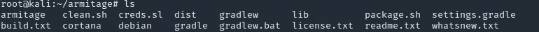
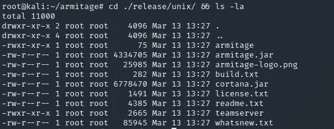
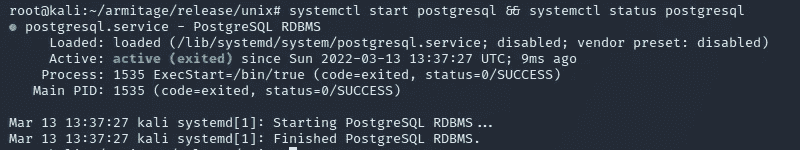
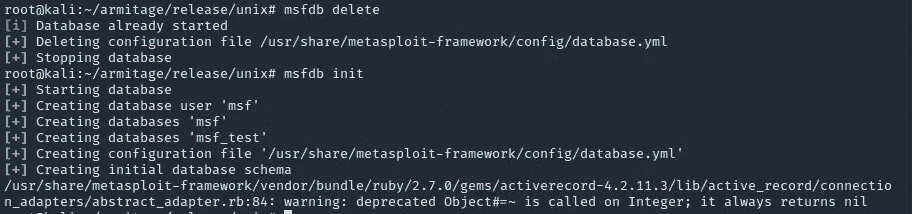
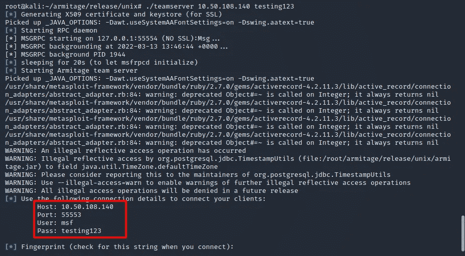
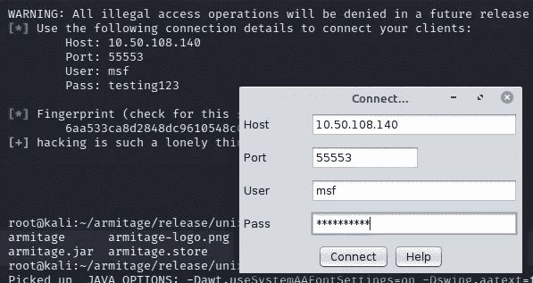
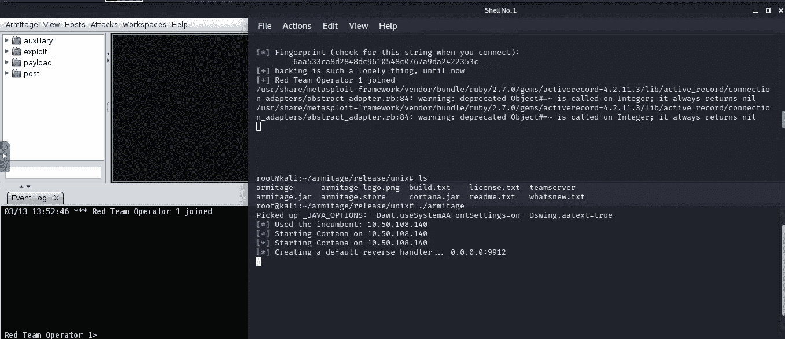
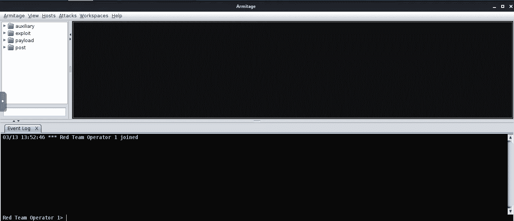

# 免费将 Armitage 设置为命令和控制(C2)框架

> 原文：<https://infosecwriteups.com/setup-armitage-as-a-command-control-c2-framework-for-free-bae590064817?source=collection_archive---------1----------------------->

## 关于如何设置 Armitage 的教程

Armitage 是带有图形用户界面的 Metasploit 框架的一个附加特性。作为最自由的 C2 框架之一，Armitage 仍然有一个不可思议的特性来进行 red teaming。

在我们设置 Armitage 之前，首先你必须知道要求是什么。Metasploit →必须安装在您的计算机上。
2。互联网→良好的连接获得良好的结果:)
3。咖啡→我喜欢这个。

如果你有上面的成分，让我们建立我们的工作站。

## **下载、构建和安装 Armitage**

1.  下载阿米蒂奇

最简单的方法就是从存储库中克隆

```
git clone [https://gitlab.com/kalilinux/packages/armitage.git](https://gitlab.com/kalilinux/packages/armitage.git) && cd armitage
```



2.然后运行 **package.sh** 来构建 Armitage。

```
bash package.sh
```

3.检查安装

```
cd ./release/unix/ && ls -la
```



团队服务器是团队中的任何人都可以连接在一起的 Armitage 服务器。这个 teamserver 有两个参数，IP 地址和共享密码来连接 armitage 服务器。

**armitage** 是能够连接到 **teamserver** 的客户端。

## 准备环境

1.  启动 **postgresql**

```
systemctl start postgresql && systemctl status postgresql
```



2.启动数据库

如果你不能使用根用户来执行这个命令，那么先改成标准用户。

```
msfdb delete
msfdb init
```



启动数据库后，我们现在可以运行阿米蒂奇。

## 启动阿米蒂奇

1.  启动团队服务器

```
cd /opt/armitage/release/unix && ./teamserver **<YourIP>** **<password>**
```



2.运行 Armitage 客户端

```
cd /opt/armitage/release/unix && ./armitage
```

3.输入连接 Armitage 服务器的凭证。



4.Armitage 将会打开，您已经连接到服务器。



试着和你的朋友一起连接到 Armitage 服务器，一起让开发变得有趣。


## **结论**

阿米蒂奇是世界上众多工具中的一个。你不能只依赖工具，但你的技能必须随时磨砺。在道德黑客圈，这个阿米蒂奇用来剥削和维护访问。希望这篇文章对你有帮助。感谢阅读