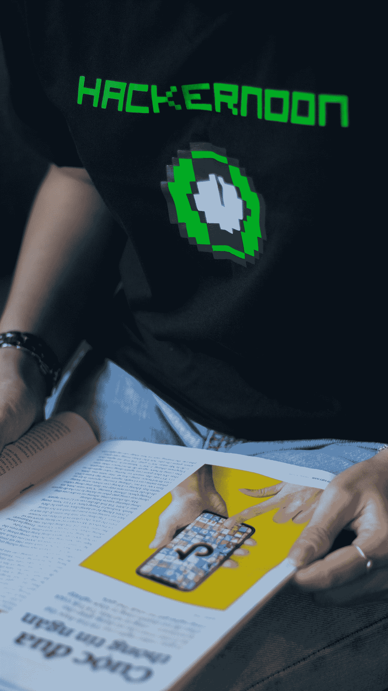
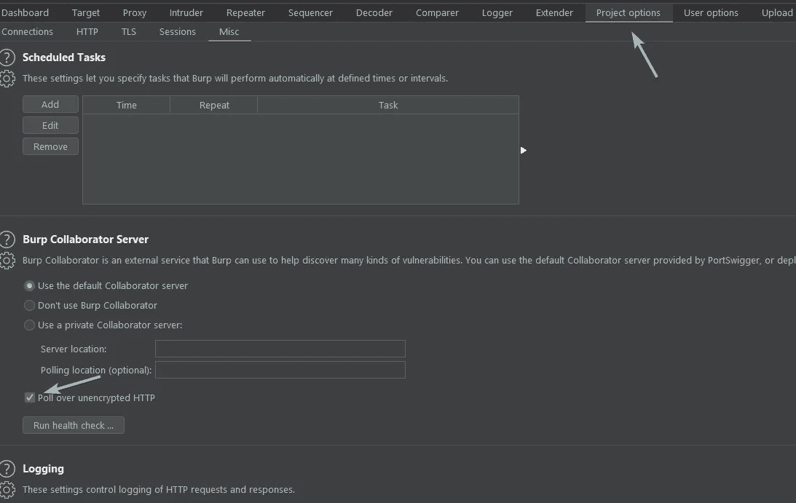
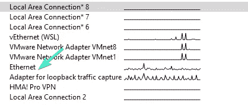
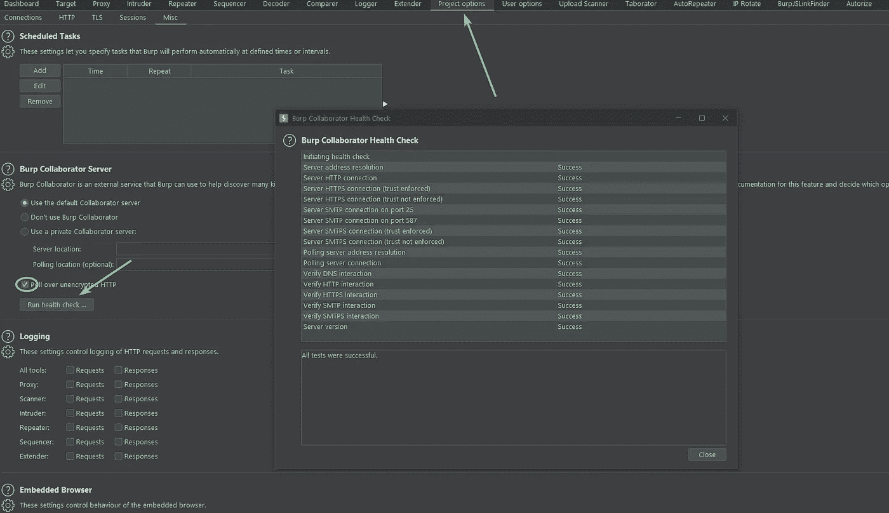
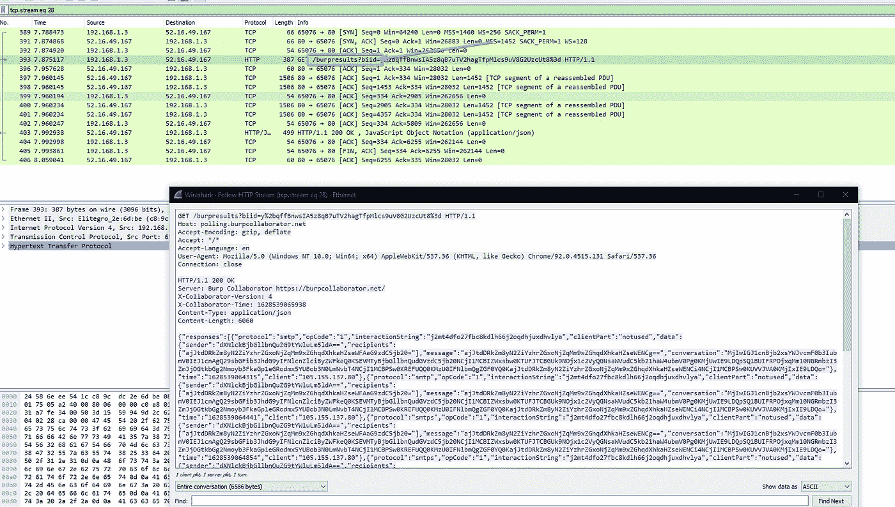
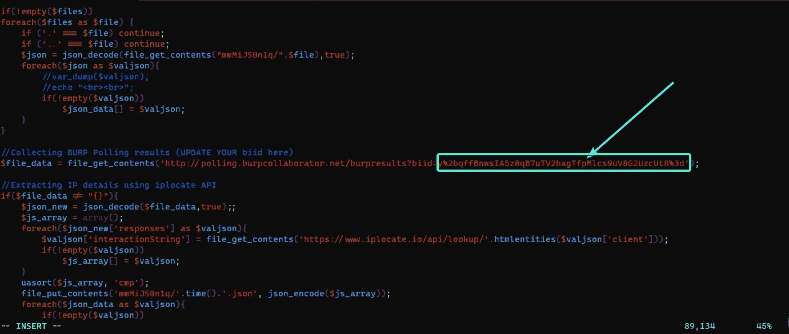
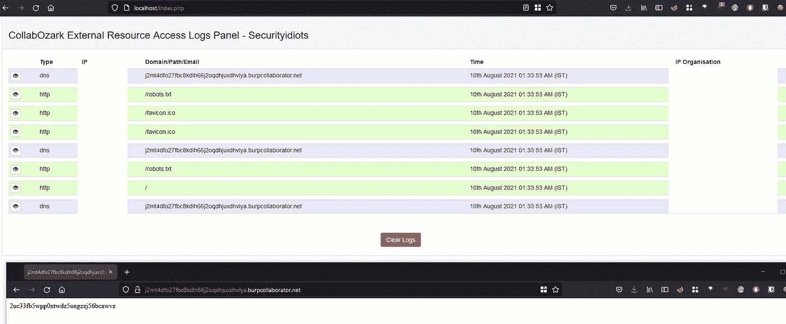

# 为 SSRF/XXE 设置您的私人打嗝合作者

> 原文：<https://infosecwriteups.com/setup-your-private-burp-collaborator-for-ssrf-xxe-fd6cf01c8ca?source=collection_archive---------2----------------------->

## 打嗝套件合作者

[黑客正午](https://unsplash.com/@hackernoon?utm_source=medium&utm_medium=referral)在 [Unsplash](https://unsplash.com?utm_source=medium&utm_medium=referral) 上的照片

你好，安全研究人员和黑客
在这篇文章中，我将谈论你如何获得自己的私人合作者，而不需要购买一个新的域名或使用任何其他工具

Pr-requirements
你所需要的是 [BurpSuite](https://medium.com/u/cc9576cb5ac5?source=post_page-----fd6cf01c8ca--------------------------------) Pro / VPS 5 美元就够了，你可以从 DigitalOcean 用 100 美元余额买一个用 2 个月[这里](https://m.do.co/c/2bef12838104)，我们还需要 Wireshark 你可以从[这里](https://www.wireshark.org/download.html)下载

打开 Burp-suite，进入项目-选项，启用未加密 HTTP 上的投票，并打开 Wireshark

在单击“运行状况检查”之前，请在 Wireshark (WIFI /以太网)中检查您的连接设备，它应该看起来像是有尖峰的设备，这意味着我使用了以太网，所以我单击了它

现在，返回打嗝，运行健康检查，等待一会儿
一旦完成，它将看起来像这样

现在，您可以返回 Wireshark，在过滤器搜索中键入 HTTP，并查找包含 **/burpresults？biid=** 通常应该是拦截的打嗝请求
右键单击它，然后单击 Follow HTTP，它应该如下所示

复制整个响应，在 DNS 或 HTTP 下搜索 burp 域，还复制 **BIID** 参数中的令牌，我们将需要它在轮询请求端点中使用
一旦完成所有操作，您可以在 VPS 中克隆此回购[此处](https://github.com/securityidiots/CollabOzark)打开 index.php，并在提到它的地方添加 **BIID** 令牌

现在将 index.php 发送到您的 Apache 目录和活动的 Apache 服务
，并使用我们之前复制的 burp collaborator 进入您的浏览器，如果一切顺利，您将看到回调

**注意:如果你错过了一个步骤或者设置出现了问题，我已经录制了一个视频，在这里我会显示所有步骤**

**希望你喜欢阅读这篇文章，下次再见
祝你狩猎愉快**