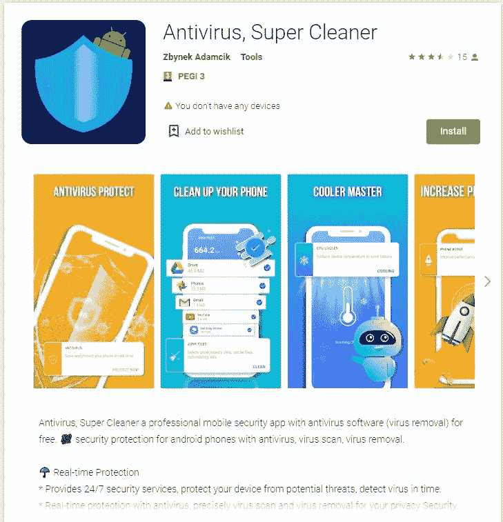
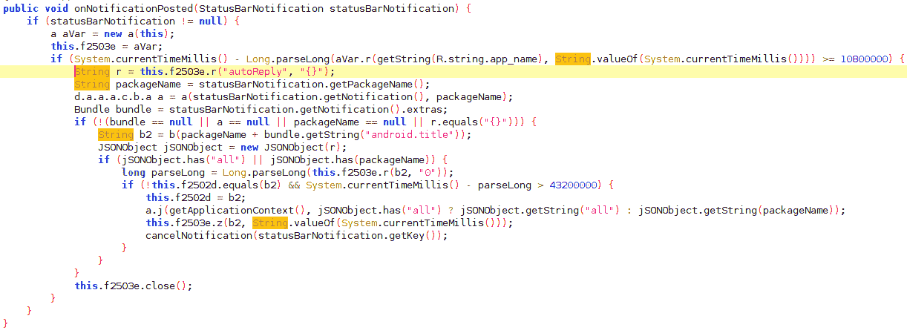
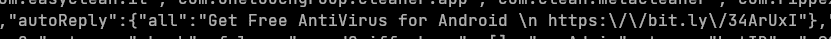
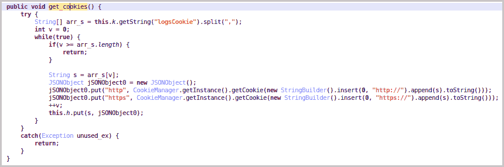

# Android 中的鲨鱼饵病毒

> 原文：<https://infosecwriteups.com/sharkbot-virus-in-android-b5be7c2ead16?source=collection_archive---------0----------------------->

Sharkbot 病毒是一种正在谷歌 Play 商店传播的 Android 银行特洛伊木马。请在本文中阅读更多相关内容。作者:anshul vyas

戴维·克洛德在 [Unsplash](https://unsplash.com?utm_source=medium&utm_medium=referral) 上的照片

# **简介**

Cleafy 威胁情报团队在 2021 年 10 月底发现了 Android 银行恶意软件 SharkBot。根据 Cleafy 的博客文章，SharkBot 的主要目标是通过自动转账系统(ATS)发起资金转移(从被入侵的设备)。Android 恶意软件很少使用这种攻击技术，这是一种高级的攻击技术。除了其他 Android 银行恶意软件，如 Anatsa/Teabot 或 Oscorp，其他 Android 银行恶意软件需要实时操作员插入和授权资金转移，允许对手自动填充合法移动银行应用程序中的字段。此外，ATS 的特性使对手能够不费吹灰之力扩大他们的运营规模。通过使用它们，恶意软件可以接收要模拟的事件列表，恶意软件将模拟它们来转移资金。

# 作案手法

该恶意软件将在渗透后持续显示弹出窗口，要求允许使用 Android 辅助功能服务(如果这些服务未启用)。一旦被允许继续，鲨鱼饵恶意软件可以做它的工作。通过使用自动转账系统(ATS)功能，SharkBot 恶意软件能够执行货币交易。这使得网络犯罪分子可以绕过 2FA，在银行应用程序中自动填写表单字段，无需登录即可转账。此外，SharkBot 具有击键记录(击键记录)功能，可用于安装恶意应用程序。此外，它还能够显示伪装成身份验证和登录屏幕的虚假叠加窗口。

该程序还可以隐藏和拦截传入的短信(SMS)，这些短信通常被银行用于验证目的。这种功能组合使 SharkBot 能够绕过银行和加密货币钱包常用的 2FA/MFA(双因素认证/多因素认证)系统。因此，SharkBot 不仅能够重定向用户发起的事务，还能够自己发起事务(不会向用户公开)。

许多银行和加密钱包已经成为这种恶意软件的目标，但有理由相信它的攻击范围在未来会增加。此外，SharkBot 的反检测技术与混淆、持久性和反分析方法相结合，以防止该程序被其目标应用程序采用的安全技术检测到。除了反检测策略之外，该程序还采用了混淆、持久化和反分析方法。此功能不仅可用于自动转账，还可用于安装恶意应用程序或组件，因为它可用于模拟触摸/点击和按钮按压。你可以在 Google Play 中找到的 SharkBot 版本似乎是只包含你需要的最少功能的 SharkBot 版本，例如 ATS，以便在你安装恶意软件后安装完整版本。

# 演变

它是由 Cleafy 的恶意软件分析师在 2021 年 10 月发现的，Cleafy 是一家意大利公司，致力于管理和防止在线欺诈。2022 年 3 月在 Google Play 上被 NCC 集团发现。当恶意软件首次被发现时，威胁参与者可以利用可访问性服务来执行覆盖攻击，通过键盘记录来窃取数据，拦截 SMS 消息，或者远程完全控制主机设备。鲨鱼机器人 2 于 2022 年 5 月被 ThreatFabric 的研究人员发现，它具有更新的通信协议、域生成算法(DGA)和完全重构的代码。

8 月 22 日，福克斯 IT 研究人员发现了该恶意软件的新版本(2.25)，该版本具有窃取银行登录 cookies 的能力。此外，新的下载者不太可能滥用可访问性服务。一旦安装了恶意的鲨鱼饵 APK 文件，下载应用程序就会请求该文件。为了使自动检测更加困难，SharkBot 使用 RC4 算法以加密形式存储其硬编码配置。在 dropper 提醒用户更新后，它会要求用户安装 APK 并授予所有必要的权限。

# 在幕后

假冒的杀毒软件是通过 Google Play 分发的，所以他们需要使用受感染的设备来传播恶意应用程序，因为它是通过谷歌 Play 商店分发的。它通过使用“直接回复”Android 功能来实现这一点，该功能用于自动发送回复通知，邀请用户下载假冒的防病毒应用程序。ThreatFabric 最近发现了另一种名为 Flubot 的银行恶意软件，它滥用了直接回复功能。ATS 还可能被用来绕过多因素身份认证机制，包括行为检测，如生物识别，以及更传统的功能，以同时窃取凭据。这就是鲨鱼饵不同于其他家族的地方。

此外，该程序的图标伪装成不起眼的/合法的应用程序。这使得恶意软件分析师在受感染系统上发现和研究该程序变得复杂。SharkBot 会拦截新的通知，并使用它从 C2 收到的消息自动回复这些通知。该程序的代码可以在下图中看到。

以下是“自动回复”命令的屏幕截图，其中包含由受感染的测试设备发送的谷歌 Play 商店样本的简短 Bit.ly 链接。

# 对饼干的热爱

在 SharkBot 2.25 中，覆盖、短信拦截、远程控制和按键记录仍然存在，但增加了一个 cookie 记录器。通过一个新命令(“logsCookie”)，当受害者登录他们的银行帐户时，SharkBot 会捕获他们的有效会话 Cookie，并将其发送到 C2。因为 cookies 包含软件和位置参数，所以它们对于绕过指纹检查或用户认证令牌来接管帐户是有价值的。

在调查过程中，Fox IT 在欧洲(西班牙、奥地利、德国、波兰、奥地利)和美国发现了新的鲨鱼饵活动。我们已经注意到，恶意软件正在使用键盘记录功能从这些攻击的目标官方应用程序中窃取敏感信息。由于鲨鱼饵已经更新，福克斯 IT 预计鲨鱼饵运动将继续和恶意软件的演变。

# 结论

在 SharkBot 的一个新变种中，开发者似乎希望继续通过 Google Play 分发恶意软件。恶意软件的感染链是由通过 Google Play 分发的恶意应用程序发起的。我们已经修改了应用程序，使它们在 Google Play 审核人员看来不那么可疑。由于 Android 辅助功能服务和直接回复功能可能表明某个应用程序是恶意的，因此它们已被移除。它现在要求用户安装一个实际上完成感染链的假更新，而不是要求他们安装一个真正的更新。此外，鲨鱼饵已经扩大了它的目标区域。在美国有更多的活动，在澳大利亚、奥地利、德国、波兰和西班牙有更多的目标用户。

## 来自 Infosec 的报道:Infosec 每天都有很多内容，很难跟上。[加入我们的每周简讯](https://weekly.infosecwriteups.com/)以 5 篇文章、4 条线索、3 个视频、2 个 Github Repos 和工具以及 1 个工作提醒的形式免费获取所有最新的 Infosec 趋势！