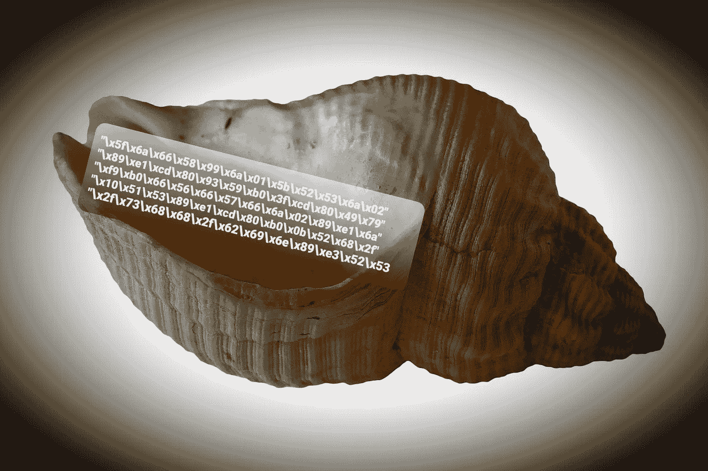

# 外壳代码分析

> 原文：<https://infosecwriteups.com/shellcode-analysis-313bf4ca4dec?source=collection_archive---------0----------------------->

让我们看看什么是外壳代码，以及如何识别和分析它们。

外壳代码插图

# 背景

外壳代码是一系列指令(操作码)，代表十六进制值，可以在代码中以不同的格式出现(作为字符串)。该序列用作利用漏洞后在内存中执行的代码的有效载荷。它的名字来源于攻击者使用它来获取系统的外壳。

# 属国

外壳代码有一些依赖性，这可能会使编写它们变得有点困难。

1.  长度—因为外壳代码利用了内存中的特定漏洞，所以序列需要尽可能高效。这意味着攻击者必须使其长度适合缓冲区的大小，这样所有的指令都将在内存空间中运行。
    如果外壳代码的长度大于缓冲区的大小，可能会导致程序崩溃甚至被利用(如缓冲区溢出)。
2.  不允许的字符—当字符如`‘\r’`、`‘\n’`、`0x00`等。出现在外壳代码中，应该运行的代码将终止而不会完成。#为什么？
    例如，当读取“空字节”(如`0x00`值)时，CPU 将其识别为字符串的结尾(空终止符)。

# Unix 外壳代码

Unix 操作系统通过指令`int 0x80`提供了与内核通信和管理内核的直接访问。因此，当系统调用遵循该指令时，外壳代码将被赋予以高权限执行的能力，而无需攻击者的特别努力。

# Windows 外壳代码

在基于 Windows 的操作系统中，由于 ASLR(地址空间布局随机化)等内存保护机制，创建外壳代码可能会稍微困难一些。

## 在内存中查找 API 函数的地址

大多数情况下，外壳代码被注入到一个正在运行的进程中，因此它没有任何关于内存状态以及 API 函数地址的先验知识。
结论:不能基于静态地址。

因此，外壳代码无法使用指令作为`Call CreateProcessA`或`jmp sub_40100000`，必须独立于其位置运行，以找到所需的 API 函数并手动解析地址。换句话说，找到它想要使用的 DLL，而不考虑地址，而是基于内存中对象的结构。这也是它被称为位置无关码(PIC)的原因。

比如要调用`GetProcAddress`，shellcode 需要找到`Kernel32.dll` DLL 的地址。

那么如何才能做到呢？

## PEB —过程环境区块

由于 PEB 对象总是被加载到内存的同一个地址— `FS:[0x30]`，外壳代码可以使用它！

它需要做什么:

1.  转到 PEB 对象。
2.  穿过`PEB_LDR_DATA`对象，直到到达`InMemoryOrderModuleList`链表，该链表包含关于进程加载的模块的信息。在这之后，shellcode 将保存想要的模块(通常`Kernel32.dll`是第三个对象)。
3.  使用`DllBase` 字段查找所需 DLL 的基地址。
4.  找到它的导出表。
5.  定位想要的功能(如`GetProcAddress`)。
6.  使用`GetProcAddress`函数获取函数的地址。
7.  最后，使用合适的参数运行所需的函数。

## 使用 SEH —结构化异常处理

该技术是关于访问 SEH 链的底部，通过在 TIB(线程信息块)中输入第一个属性，它有一个固定的地址— `FS:[0x0]`。它包含`Kernel32.dll`模块的默认异常处理程序。为了定位所需模块的地址，可以返回内存地址，直到找到模块的入口点(例如使用`MZ`签名或`0x5A4D`)。

## 使用 TEB —线程环境块

像 SEH 技术一样，可以访问 TEB 对象，它在内存中有一个固定的位置— `FS:[0x18]`。穿过这个物体可能会把你带到 SEH 链，如上所述。

## 顶部堆叠

这种方法并不常见，因为它依赖于拥有所需 DLL 的地址，而该 DLL 在堆栈中具有所需的 API 函数。

## 通过哈希查找 API 函数

这种技术也被称为 SFHA(斯蒂芬·诺瑟的哈希 API)。它用 4 个字节来表示`EAX` 寄存器内`DLL!WinAPI`函数的哈希值。然后，对那个地址进行一个`JMP` 来调用那个函数。注意`EAX`调用了哪个函数，得到了什么参数(可以在 MSDN 查)。然后，与内存中的实际值进行比较。例如，如果 shellcode 调用了`Win_Exec`函数，它将通过每一个使用其他技术之一的`DLL!WinApi`，并带有其他参数(我们可以在 register 调用之前通过`PUSH`指令来识别它们)。当我们输入参数的内存地址时，我们可能知道那里有什么(可能是一个`PS1`脚本或编码命令..).

# 侦查

在我们稍微了解了外壳代码是什么之后，让我们来看看如何检测它们。
注意去混淆，解密一个混淆或加密的脚本，暴露外壳代码！

## 使用行为模式

如上所述，外壳代码是代表指令的操作码序列。因此，我们可以找到这个序列并检查它。

如果我们有运行外壳代码(如 PowerShell 或 JavaScript)的恶意程序的源代码，我们可以寻找可能代表操作码的值/变量/字符串，这可能会引导我们找到外壳代码本身。

我们来看看说明:`mov ebp, esp`。外壳代码将使用的字符序列可以有几种格式:

*   六进制值:`8B EC`
*   反斜杠六进制值:`\x8B\EC`
*   百分比 Unicode: `%u8B%EC`
*   反斜杠 Unicode: `\u8B\uEC`
*   数组:`[0x8B, 0xEC]`

在识别出这些字符的序列可以代表 CPU 指令之后——我们将把重点放在它上面。

# 转储外壳代码

检测到潜在的外壳代码后，将它转储到二进制文件中是实现我们目标的第一步。

*   `base64dump.py`工具—允许找到可能包含外壳代码的部分，并将其转储到二进制文件(`.bin`)中，以便进行分析。
    `base64dump.py -e {param} {file}` **参数:**
    1。`pu` —允许搜索用于百分比 Unicode 编码的字符串(`%u`)。
    2。`bu` —允许搜索反斜杠 Unicode 编码的字符串用法(`\u`)。
    3。`hex` —允许搜索用作十六进制值的字符串。
    4。`base64` —允许使用 Base64 编码搜索字符串。
    `base64dump.py -e {param} {file} -s {sectionID} -d > {outFile.bin}` 允许通过 ID 定位想要的部分，并将其转储到二进制文件中。大多数情况下，会选择最大的部分。
    `base64dump.py -e {param} {file} -s {sectionID} -a` 显示所选截面的十六进制视图。
*   `objdump.py`工具-允许在提取外壳代码时转储外壳代码。
*   使用十六进制编辑器——十六进制编辑器可用于删除不相关的部分。因此，只有外壳代码保留下来，并可以保存到`.bin`文件中。

# 如何分析外壳代码？

外壳代码分析有两种主要方式:静态和动态分析。

## 静态分析—代码分析

这样，包含外壳代码的二进制文件将被转换为可执行文件，并被加载到反汇编程序(如 IDA PRO)中。然后，它将被分析为一个可执行文件。

用法:

*   `shellcode2exe.py {file.bin}`
*   `shellcode2exe.bat {32\64} {file.bin} {file.exe}`

## 动态分析

`scdbg`工具——允许模拟外壳代码的执行，以找到它使用的 API 函数，这可以指示它的许多行为。

*   `scdbg -s {steps} -f {file.bin}`
*   运行 GUI `scdbg`工具并启动二进制文件。
*   使用`FindSC`将在加载的二进制文件中找到外壳代码的开头。

`jmp2it`工具——允许在专用进程下执行外壳代码，用作可执行文件的“外壳”。因此，将调试器附加到正在运行的进程，使您能够调试外壳代码。

*   `jmp2it {file.bin} {offset}`—`offset`表示外壳代码从二进制入口点的偏移量(`0x0`表示开始)。

`shellcode_launcher.exe` —与前一个工具类似。

# 结论

在这篇文章中，我们了解了如何使用几种工具来识别和分析外壳代码。
我希望你能从这篇文章中学到一些东西。

感谢阅读。