# Shibboleth: HackTheBox 演练

> 原文：<https://infosecwriteups.com/shibboleth-hackthebox-walkthrough-f5c52d8949cf?source=collection_archive---------1----------------------->

欢迎回来！今天我们要解决 HacktheBox 的另一台机器。该盒子被列为简易盒子。只需在/etc/hosts 文件中添加 shibboleth.htb，我们就可以开始了！

请订阅电子邮件通知并支持我，这样可以激励我写更多！！！

 [## 每当舒巴姆·库马尔发表文章时，就收到一封电子邮件。

### 每当舒巴姆·库马尔发表文章时，就收到一封电子邮件。请通过注册来支持和订阅更多这样的演练…

shubham-singh.medium.com](https://shubham-singh.medium.com/subscribe) 

> **端口扫描**

在我的端口扫描过程中，我首先使用 [**rustscan**](https://tryhackme.com/room/rustscan) 来快速找出开放端口的数量…

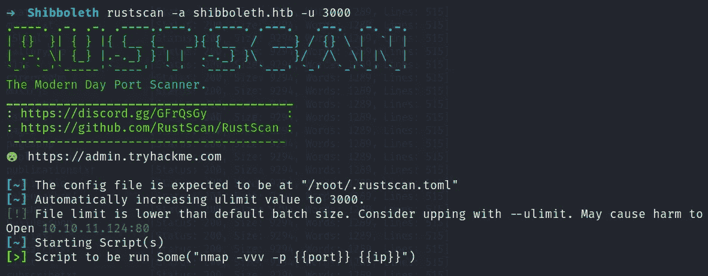

…然后在那些开放的端口上开始详细的 **Nmap** 扫描。这样会节省很多时间。

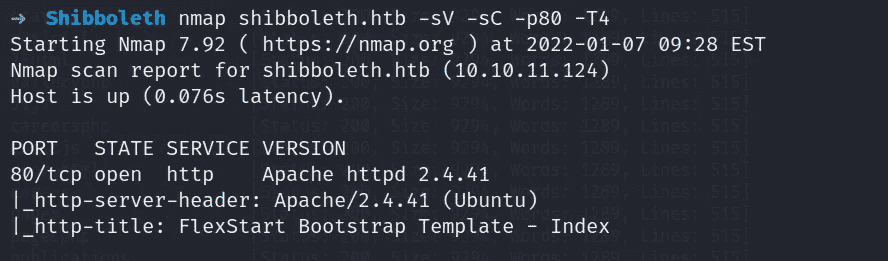

> **网络侦察**

所以我们只有一个开放的端口，即端口 80。我们试着列举一下。我首先启动了一个 **ffuf** 扫描来检查我们是否有任何隐藏的目录。没有什么有用的东西。

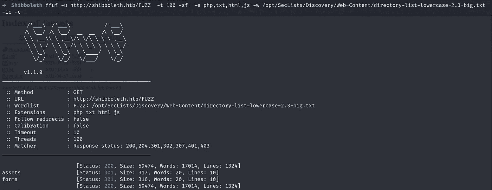

现在我决定启动 wfuzz 来检查我们是否有可用的子域，这次我们有 3 个。

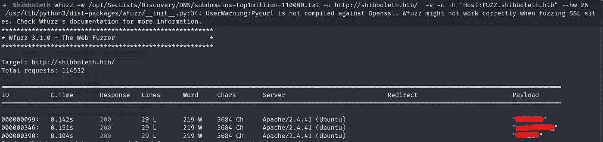

只需在/etc/hosts 文件中再次添加所有这些子域。访问所有三个子域名会给你相同的页面。

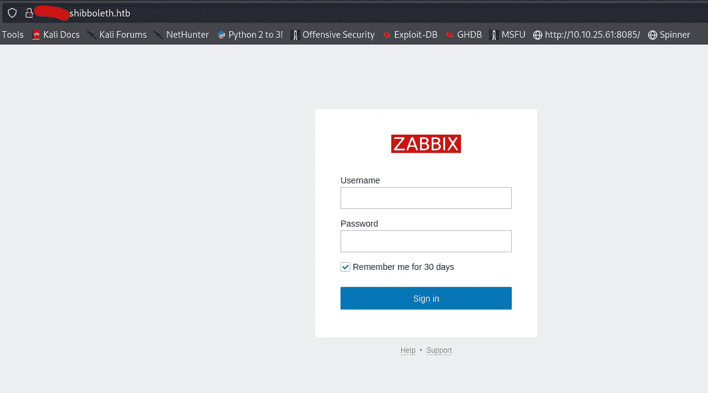

通过我的一个脚本，我试图从页面中抓取所有的‘href’链接，我得到了 Zabbix 版本的文档。现在，这确保了我们的 Zabbix 版本大于 5.0.x，如果你在谷歌搜索 Zabbix 5.0.x 漏洞，你会得到 SQL 注入 5.0 版本。

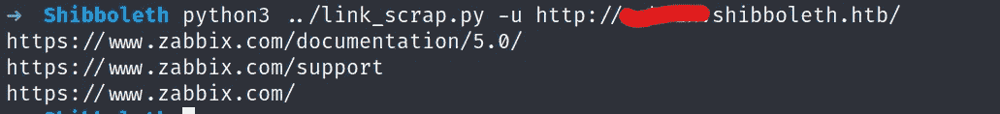

最后，在端口 80 上花了很多时间，我开始了 UDP 扫描，这给了我一个开放的端口，即 623。

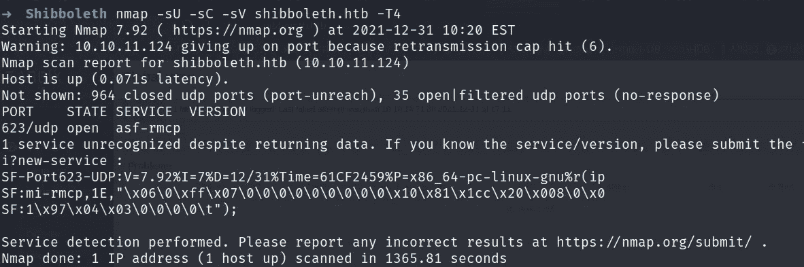

刚刚谷歌了"**ASF-rmpc port 623 pentesting "**我在 [**hacktricks**](https://book.hacktricks.xyz/pentesting/623-udp-ipmi) 网站上找到了做这件事的方法。智能平台管理接口(IPMI)服务正在此端口上运行。

现在根据博客来查看 ipmi 版本，我们必须使用这样的 IPMI 辅助模块

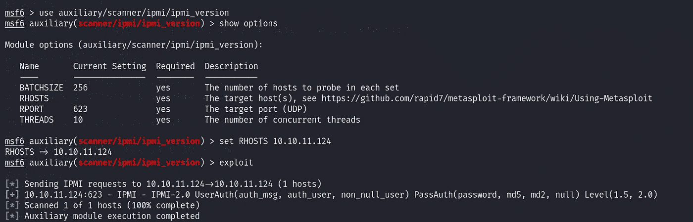

我们有了 IPMI 2.0 版。现在使用第二个命令来转储任何哈希(如果存在的话)。

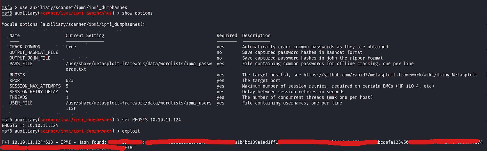

幸运的是，我们有一个可供一个用户使用的散列。使用 hashcat 来破解 hash。

提示:- "-m 7300 "

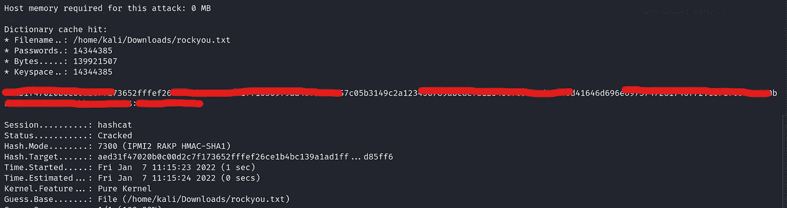

> **反壳**

登录后，我们有一个漂亮的仪表板。现在是时候了解 Zabbix 了。所以 [**Zabbix**](https://www.zabbix.com/documentation/5.0/en/manual/introduction/about) 基本上是一个企业级的开源分布式监控解决方案。我试着通过 Zabbix dashboard 搜索 reverse shell，得到了一个由 [**IppSec**](https://www.youtube.com/watch?v=RLvFwiDK_F8&t=758s) 制作的视频，但是版本比较老。视频中的重要信息是 Zabbix 特工。因此，用 C 语言开发的本机 [**Zabbix 代理**](https://www.zabbix.com/zabbix_agent) 可以在各种支持的平台上运行，包括 Linux、UNIX 和 Windows，并从设备收集 CPU、内存、磁盘和网络接口使用情况等数据。阅读手册和漫游仪表板，我得到了 Zabbix 代理。

**注意:-** 我们将重点放在 Zabbix 代理上，因为它包含一个关键字段，该字段有一个选项“ [**system.run**](https://www.zabbix.com/documentation/current/en/manual/config/items/itemtypes/zabbix_agent) ”，用于在主机上执行指定的命令。

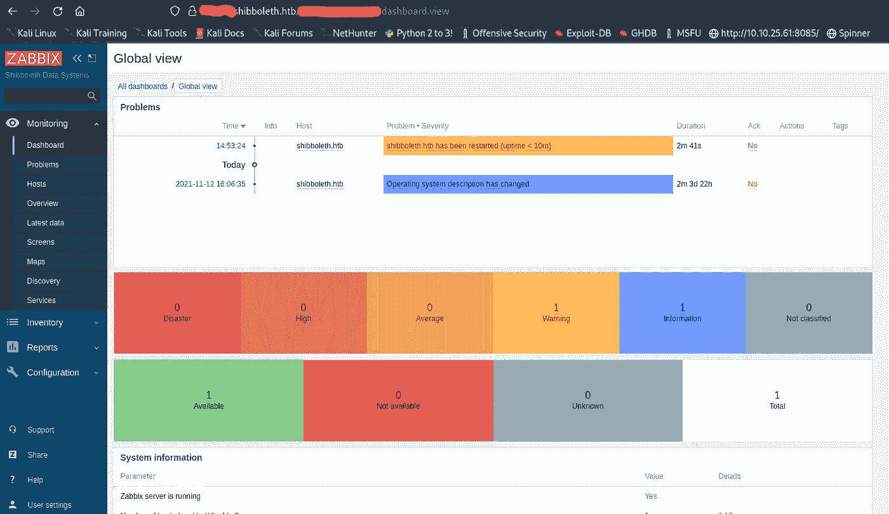

导航到配置→主机您将看到提到的 [**主机**](https://www.zabbix.com/documentation/5.0/en/manual/xml_export_import/hosts) 。现在，主机有不同类型的标签，如触发器，项目，网页等。我们感兴趣的是 [**物品**](https://www.zabbix.com/documentation/5.0/en/manual/xml_export_import/hosts#host-item-tags) 标签。

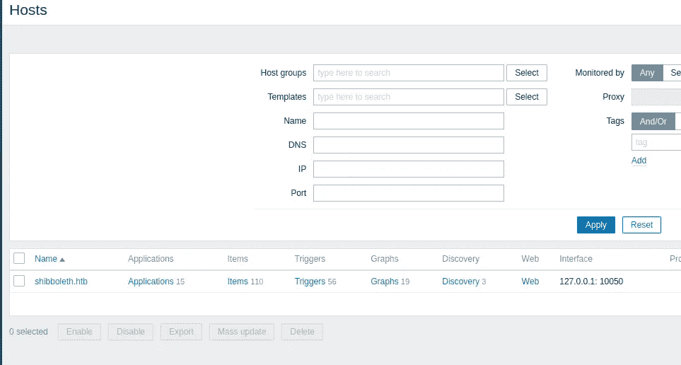

点击物品→点击 [**创建物品**](https://www.zabbix.com/documentation/5.0/en/manual/config/items/item)

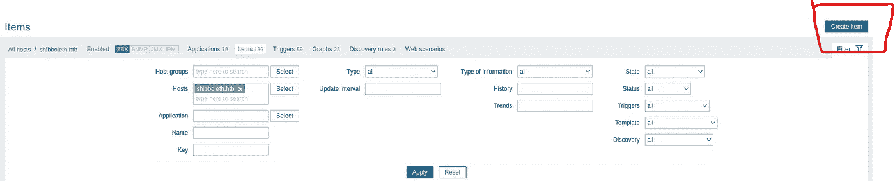

现在，通过从下拉列表中选择 **system.run** 选项，用 [**reverse shell**](https://pentestmonkey.net/cheat-sheet/shells/reverse-shell-cheat-sheet) 命令填充前三个字段，尤其是关键部分。现在最重要的部分，system.run 键有两个选项**命令**和**模式**。第一部分填充了反向外壳，对于第二部分，我们有两个选项**等待**和**不等待**。我两种都试过，但是在等待模式下，连接不稳定。

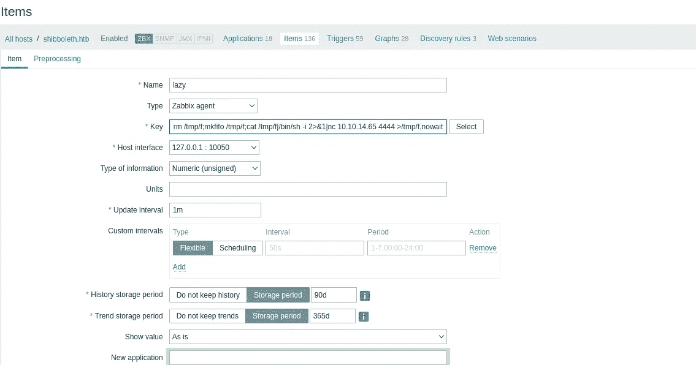

现在启动一个 NC 监听器，点击“test”按钮→“get value ”,我们就有了一个 shell。

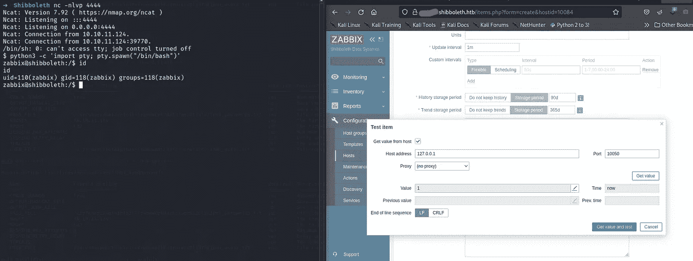

> **权限提升**

升级到用户“ipmi-svc”是这个框中最简单的部分，只需使用 hashcat 破解的密码。现在不使用 LinPEAS，我试图找到一些有用的文件，在这里。

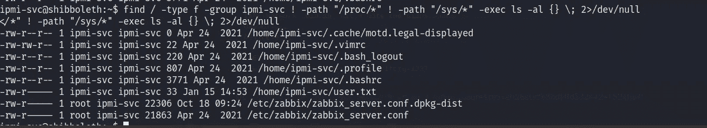

使用 **netstat** 我们可以看到端口 3306 正在运行。conf 文件将包含一些凭证。

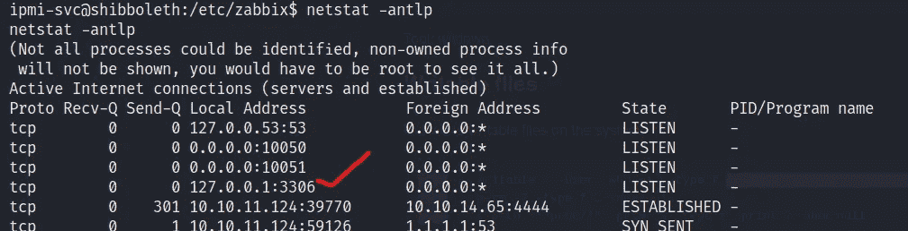

所以我是对的，我们有证件。登录到 MySQL，但获得的凭证与我们通过 Metasploit 获得的凭证相同。现在，您会注意到，我们登录后会列出 MariaDB 的版本。我搜索了漏洞利用[和**这里的**就是](https://github.com/Al1ex/CVE-2021-27928)。

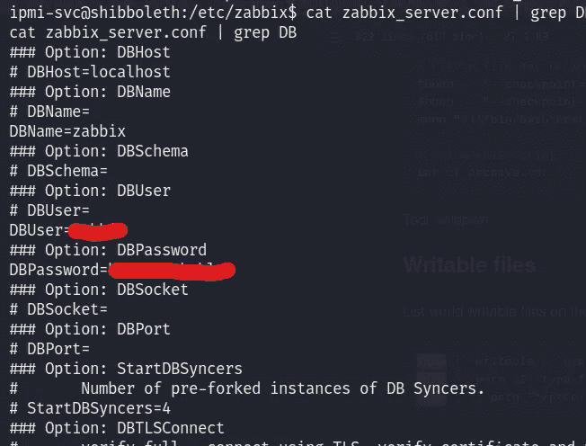

如图所示创建有效负载，并将其传输到受害者/tmp 目录。

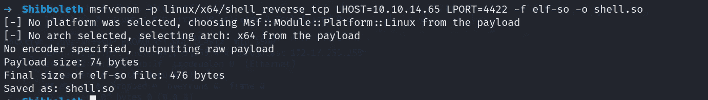

启动一个新的 NC 侦听器，并将 wsrep_provider 设置为您的有效负载，现在我们拥有 root 权限。

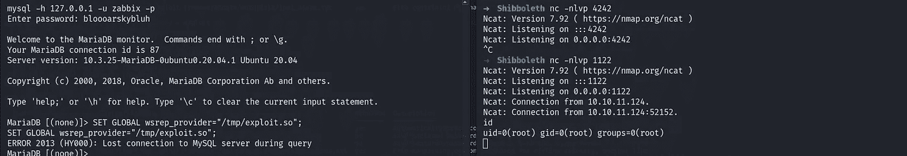

…同样，不要忘记订阅更多演练。

 [## 懒惰先生

### 如果你喜欢你所读的，我的一点捐赠将会帮助我学习 OSCP。印度人可以支付我使用上述…

www.buymeacoffee.com](https://www.buymeacoffee.com/MrLazy) 

# 在你走之前

这是我的另一个黑客机器演练:-

 [## 后门:黑客盒子演练

### 欢迎回来！今天我们要解决 HacktheBox 的另一台机器。该盒子被列为简易盒子。只需添加…

infosecwriteups.com](/backdoor-hackthebox-walkthrough-6e4e8b483db1)  [## horizontal:HackTheBox 演练

### 描述

infosecwriteups.com](/horizontall-hackthebox-walkthrough-13090d7d59a2)  [## 编剧:黑客盒子演练

### 描述

infosecwriteups.com](/writer-hackthebox-walkthrough-1ff86b33799a)