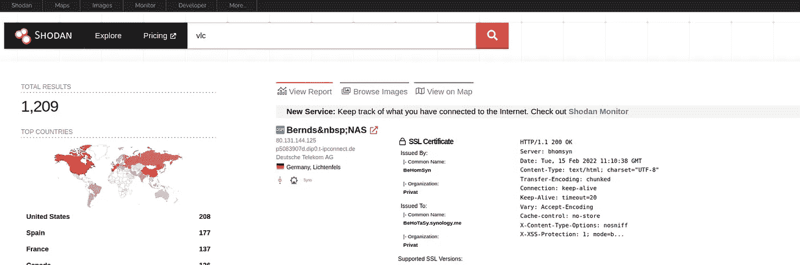

# SHODAN 是真正的互联网搜索引擎——这是为什么？

> 原文：<https://infosecwriteups.com/shodan-is-the-true-internet-search-engine-heres-why-b385be7fc72a?source=collection_archive---------2----------------------->

Shodan 是一个搜索引擎，可以索引所有打开的设备。与只扫描 80 和 443 端口的谷歌不同，Shodan 是真正的互联网搜索引擎，它扫描所有连接到互联网的设备上的每个端口。让我们看看到底是怎么回事。

# Shodan —简介

互联网是设备的连接。这些设备包括笔记本电脑、服务器、个人电脑、打印机、网络摄像头、智能汽车、智能冰箱以及其他许多与他人互动的设备。这些设备具有开放的特定端口，以便为其服务。web 服务器将开放端口 80 和 443 来提供网页服务。端口 53 由 DNS 服务器使用。同样，各种服务也在使用许多端口。

只有一个搜索引擎可靠地索引连接在互联网上的各种设备的所有这些端口。那是庄丹。它返回从与设备交互中获得的所有信息，如服务软件、版本、横幅消息、设备名称、型号等等。这听起来令人疲惫和恐惧。但是它是如何工作的呢？

SHODAN 主页

# shodan——工作

Shodan 很难找到这个信息。它请求连接到互联网上每个可以想象的 IP 地址的每个端口地址。连接到互联网的每台设备都有自己的公共 IP 地址，用于识别设备。在请求连接时，Shodan 处理返回的信息并对其进行索引。

这些请求中的大多数不返回任何内容，因为所有 IP 地址都没有与之相关联的设备和端口。但是具有 IP 地址的设备返回横幅信息，然后对其进行处理和索引。

# Shodan —用法

Shodan 特别用于从事网络安全工作的人。当 Shodan 返回端口上运行的服务的基本信息时，您可以发现其中是否有任何漏洞。Shodan 处理从服务返回的横幅信息，因此您使用 Shodan 搜索的内容将基于横幅信息。

庄丹搜索。

如果您在 Shodan 搜索栏中搜索“vlc ”,它会返回包含“vlc”一词的横幅信息。您可以根据不同的过滤器缩小搜索范围。端口类型、组织、国家、操作系统等是您可以使用的主要过滤器。这些过滤器存在于 Shodan 上，或者您可以使用语法— filtername:value 简单地搜索它。

要获得关于 organization Mozilla 的信息，只需在 Shodan 搜索中使用语法“org:Mozilla”即可。您还可以在搜索中组合不同的过滤条件。

***注意:*** *您需要创建一个 Shodan 帐户才能使用这些过滤器。高级帐户给你更多的访问 API 的机会。*

> Shodan 真的很强大很恐怖

# 结论

仔细想想，Shodan 真的很厉害，很吓人。它有这个星球上所有可用设备的信息。从你的 Xbox 到亚马逊的服务器。人们可以使用这些信息来修复补丁和减轻潜在的风险，但有些人会以有害的方式使用这些信息。无论如何，Shodan 是一个强大的工具，安全领域的每个人都应该熟悉它。

# 🔈 🔈Infosec Writeups 正在组织其首次虚拟会议和网络活动。如果你对信息安全感兴趣，这是最酷的地方，有 16 个令人难以置信的演讲者和 10 多个小时充满力量的讨论会议。[查看更多详情并在此注册。](https://iwcon.live/)

[T3【https://iwcon.live/】T5](https://iwcon.live/)