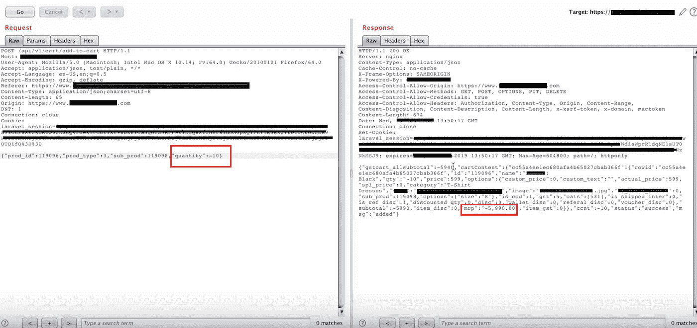
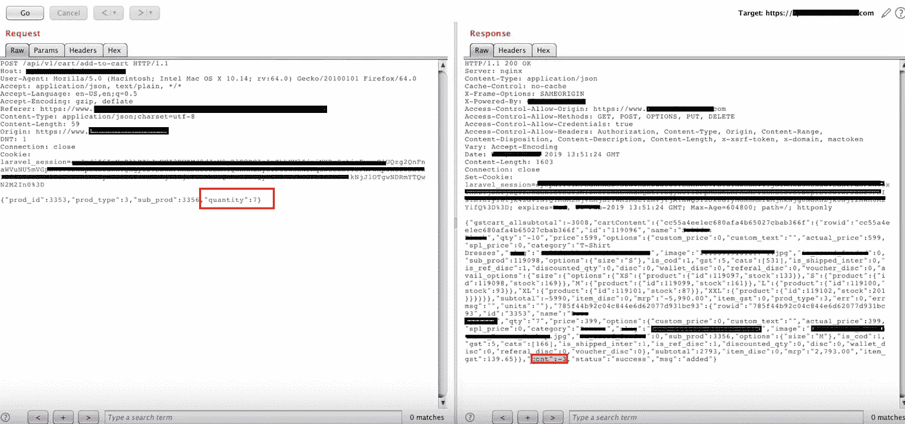
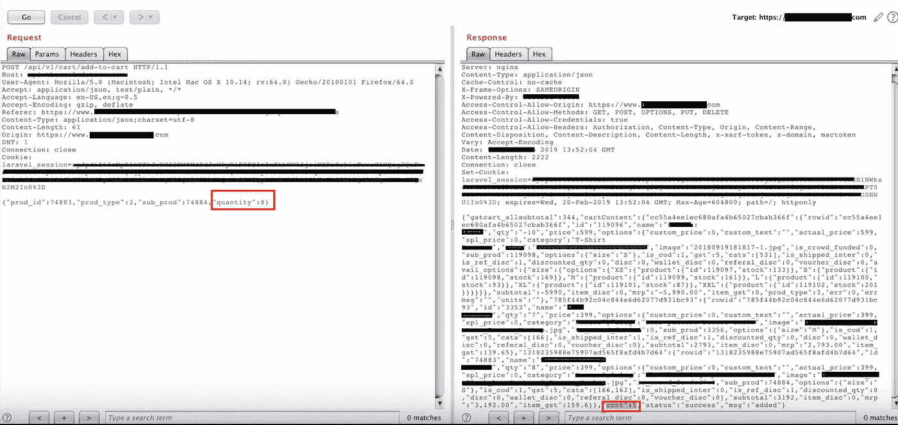
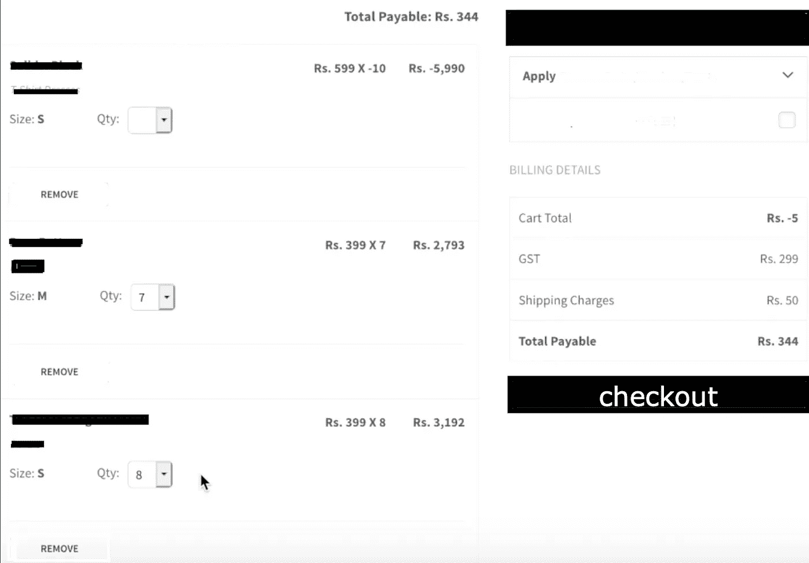
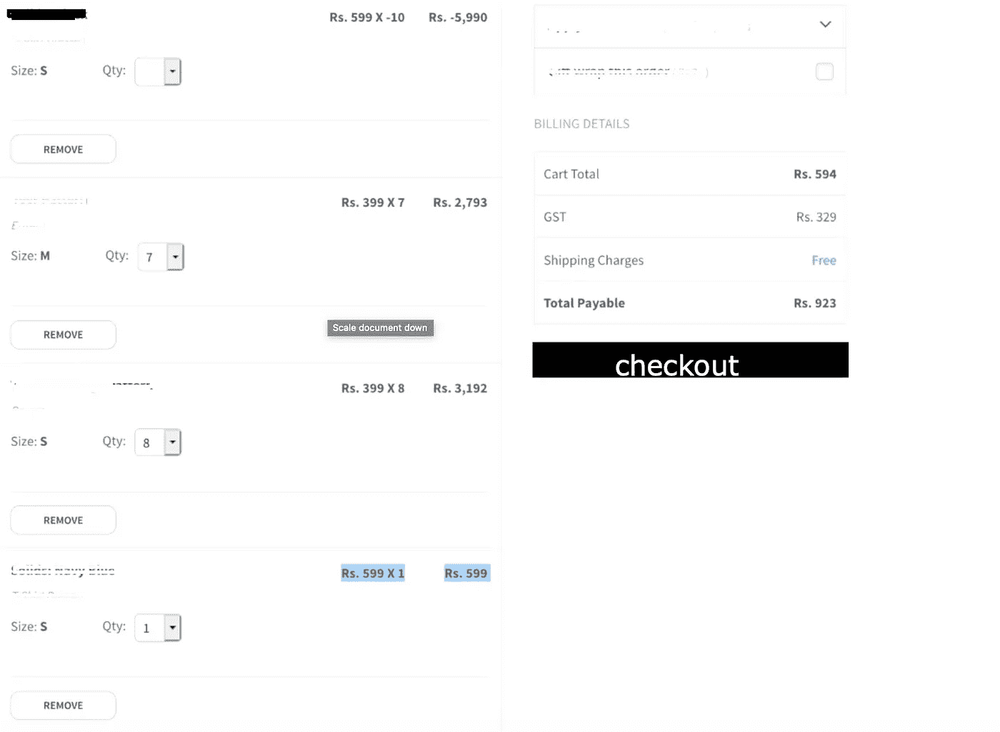

# 购物产品的自由参数篡改漏洞

> 原文：<https://infosecwriteups.com/shopping-products-for-free-parameter-tampering-vulnerability-8e09e1471596?source=collection_archive---------0----------------------->

让我们从一个电子商务网站在网上讨价还价。

我收到了一个非常受欢迎的电子商务网站的黑客邀请。我已经从那个网站订购了很长时间。所以我开始测试，特别是公司想要首先影响他们业务的错误。所以我首先想到的，显然是参数篡改。

# **总结**

参数篡改攻击依赖于由用户改变的参数的操作，从而改变应用信息，如用户凭证和许可以及产品数量等。通常，这些数据在 post 请求或隐藏的种类字段中传递。
我们将调查价格操纵漏洞，这一漏洞目前几乎存在于所有在线购物车和支付网关中。

> 出于显而易见的原因，我们将假设该网站为**redacted.com**。该网站的主要问题是，他们每次保持产品的上限不超过 10 个数量，但对于下限，他们忘记了设置约束。因此，任何人都可以将购物车价值减为负值，然后乘以产品价格，从而在购物车中添加负的数量和价格。

# **冲击**

由于一个业务逻辑错误，我可以篡改购物车的值，并添加产品的负数量，这反映在结账时，并以较低的价格订购产品，因为对最小购物车值有限制。

# **复制步骤:**

*   访问 redacted.com，打开你不想买的产品，把它放入购物车，就像我添加 t 恤衫和拦截请求一样，然后把数量改为-10。
    *值:-10 * 599*₹*=-5990*₹*/-*

*   然后为了平衡购物车，我又加了 7 只鞋。
    *值:7*399* ₹ *=2793* ₹ /-

7 双鞋平衡 399 英镑

*   不过，购物车需要有一些正值，以便显示在 UI 上。
*   我又加了 8 个丹尼尔。
    *值:8*399 ₹ = 3192 ₹ /-*

399 英镑再买 8 条牛仔布

*   当我随机添加到余额中并尝试用总花费 *-5 ₹* 购买时。但是它向我显示了一个错误。
    *数值:-5990 ₹ +2793 ₹ + 3192 ₹ = -5 ₹*

> 因为最小的购物车价值是 350 ₹，继续进行和结帐。

推车总数不到 350 *₹*

然后我又加了 1 件 599 ₹的衬衫，这样加起来就比 3 件 50 ₹的多了。

*   总成本变成了 *594 ₹* 加上商品及服务税，大约是 *923 ₹* 。

最终购物车价值

*   所以我的购物车里有 7 双鞋，8 条短裤和 1 件小衬衫可以买。
*   我进一步选择了地址，并找到了支付方式，通过信用卡支付。
*   订单成功。
*   然后，我报告了视频 POC 中的关键错误，并获得了奖金。

# **补救:**

*   不要依赖依赖于浏览器的控件— **不要依赖于客户端验证**并存储在浏览器中。
*   当产品被添加到购物车中时，计算总请求的 **md5 和或任何哈希**，并与后端进行比较，以便如果在请求中发生任何值的任何操作，它都不同于服务器的哈希。
*   验证**不正确字符**和**数据类型**的输入。具体到这种情况，我们可以检查负范围的数量。保持范围从 1 到 10，因为最大值已定义，我们可以定义最小值。始终定义应用程序将接受的最大值和最小值。

# 参考:

[https://www.owasp.org/index.php/Web_Parameter_Tampering](https://www.owasp.org/index.php/Web_Parameter_Tampering)

[https://www.cgisecurity.com/owasp/html/ch11s04.html](https://www.cgisecurity.com/owasp/html/ch11s04.html)

[https://hackerone.com/reports/403783](https://hackerone.com/reports/403783)

[https://medium . com/@ chawdamrunal/what-is-parameter-tampering-5b 12 C5 ba](https://medium.com/@chawdamrunal/what-is-parameter-tampering-5b1beb12c5ba)

[https://yassineaboukir . com/blog/price-manipulation-vulnerability-in-e-commerce-platforms](https://yassineaboukir.com/blog/price-manipulation-vulnerability-in-e-commerce-platforms/)

*关注* [*Infosec 报道*](https://medium.com/bugbountywriteup) *获取更多此类精彩报道。*

 [## 信息安全报道

### 收集了世界上最好的黑客的文章，主题从 bug 奖金和 CTF 到 vulnhub…

medium.com](https://medium.com/bugbountywriteup)