# 简单的 CTF-特里哈克姆

> 原文：<https://infosecwriteups.com/simple-ctf-tryhackme-eebd0254865c?source=collection_archive---------0----------------------->

## 夺旗类游戏

欢迎神奇的黑客我想到了另一个很酷的文章，这是 Tryhackme 简单 CTF 写。

别浪费时间了，让我们开始吧。部署后，我开始扫描目标。

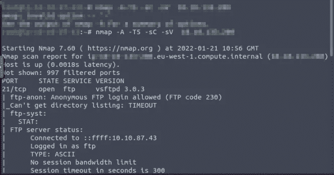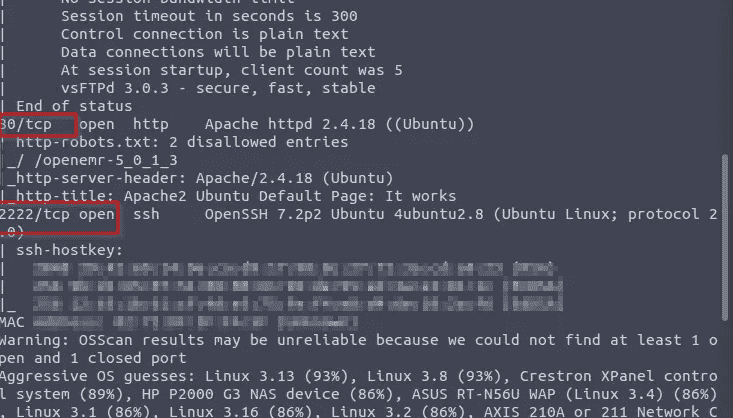

我在扫描目标时发现了一系列有用的信息。然后我使用 Gobuster 工具来查找有用的目录。

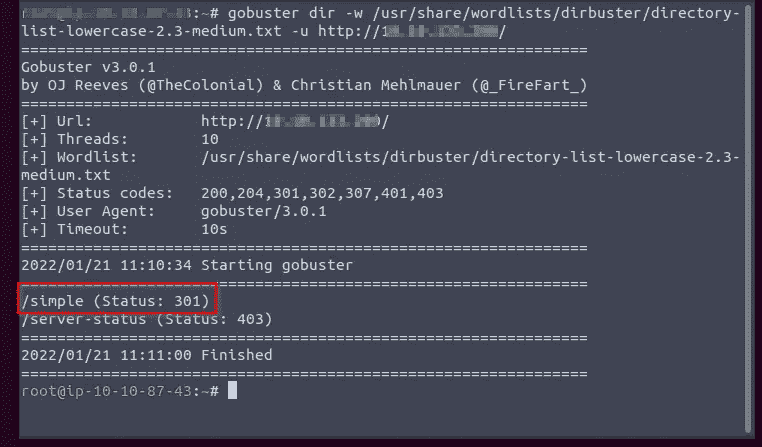

从 Gobuster 我找到了/简单目录。

在查看了/simple 目录后，我发现这是一件有趣的事情！！！

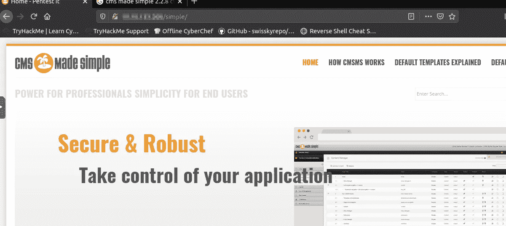

名为 CMS 的网站很简单，我进一步检查了该版本是否在网站上公开，最终我找到了它。

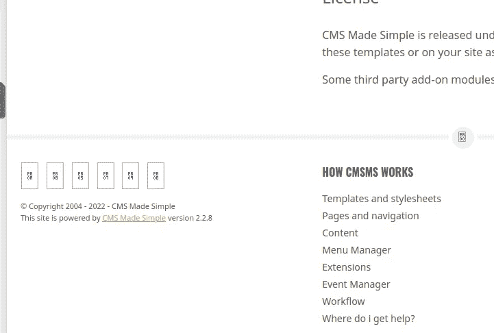

我在谷歌上查了 CVE 的这个版本。

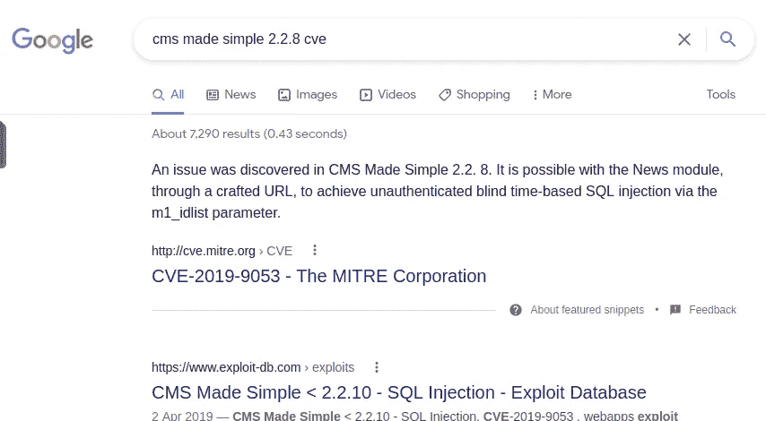

最后，我在 exploit-db.com 发现了这个版本的漏洞。

下载并执行了那个漏洞。

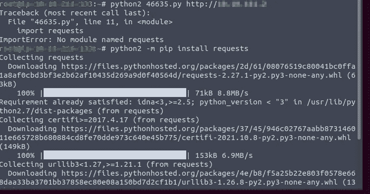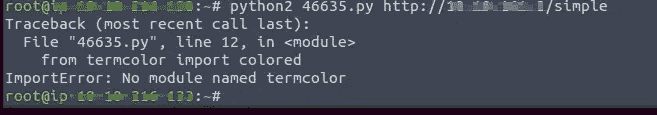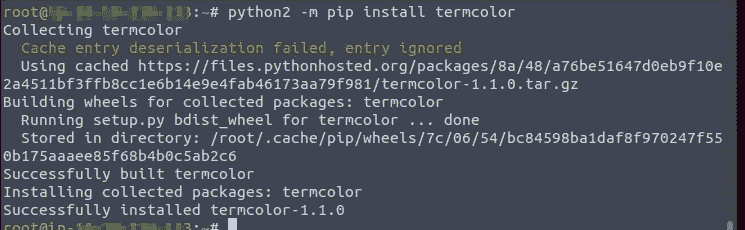

我们必须安装执行漏洞利用所需的库。

执行利用后，我发现密码和盐散列。

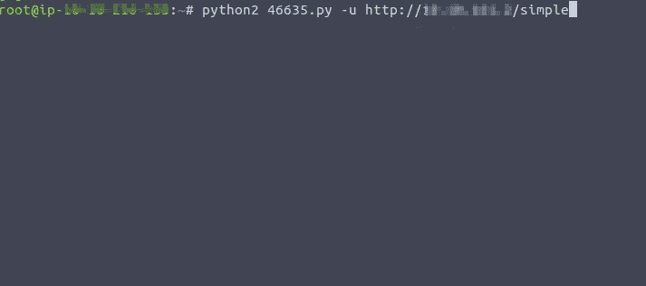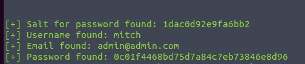

我使用 Hashcat 工具来破解密码。

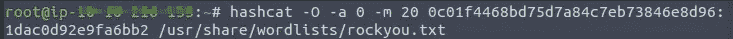

最后，我发现了密码秘密。然后我用找到的密码通过 ssh 登录。

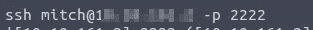

然后我发现了一个标志 user.txt。

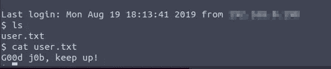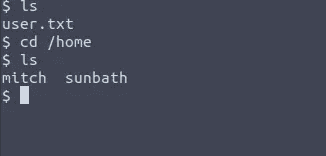

最后，我们通过生成外壳找到了根标志。

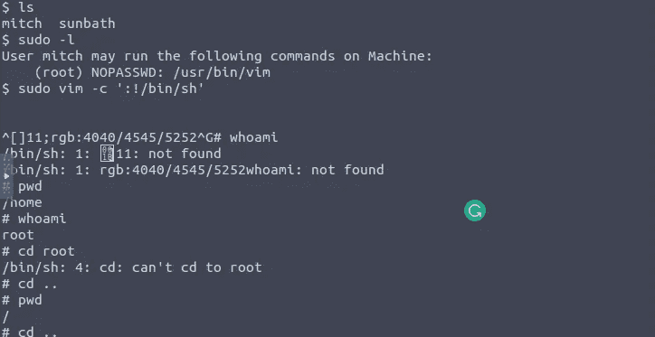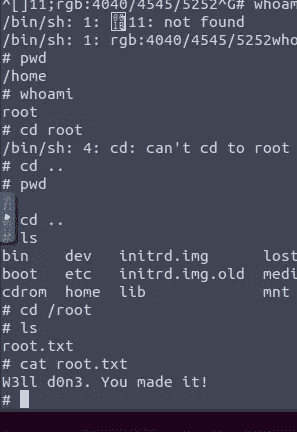

**🔈 🔈Infosec Writeups 正在组织其首次虚拟会议和网络活动。如果你对信息安全感兴趣，这是最酷的地方，有 16 个令人难以置信的演讲者和 10 多个小时充满力量的讨论会议。** [**查看更多详情并在此注册。**](https://iwcon.live/)

 [## IWCon2022 - Infosec 书面报告虚拟会议

### 与世界上最优秀的信息安全专家建立联系。了解网络安全专家如何取得成功。将新技能添加到您的…

iwcon.live](https://iwcon.live/)