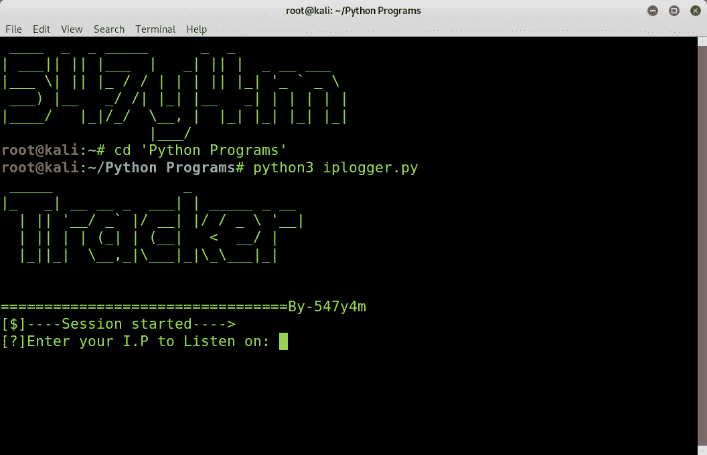
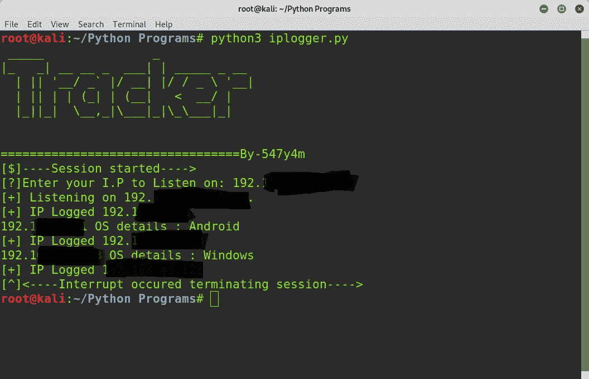

# Python 中的简单 I.P 记录器

> 原文：<https://infosecwriteups.com/simple-i-p-logger-in-python-2103b49dec0e?source=collection_archive---------2----------------------->

在这里，我将简要介绍，我如何创建我的第一个 python 工具来抓取 IP 地址(IPv4)和检测同一网络上的用户的 OS(操作系统)。

仅出于教育目的，请勿在不属于您的网络上进行任何恶意操作。可以采取严格的措施！

你好，朋友

在 Python3 上测试

## 入门指南

这是一个简单的 python 脚本，包括我为大学项目制作的各种 python 库，你可以在我的 [GitHub 简介](https://github.com/547y4m/I.P-Logger)中查看。按照&随意添加其他功能。P.S 仍然没有 0b😆

 [## 547y4m/I.P .记录器

### 记录 LAN 上设备的 IP 地址(IPv4 ),并执行操作系统猜测。GitHub 是超过 5000 万用户的家园…

github.com](https://github.com/547y4m/I.P-Logger) 

源代码

**#注意** -仅适用于连接在局域网上的内部 IP 地址，不适用于公共 IP 地址。

> 1.它输入 IPv4 地址进行监听。
> 
> 2.然后，它打开一个端口，在同一个 IP 上接收传入的请求，就像一个服务器一样，并记录访问者的 IP 地址。
> 
> 3.并执行扫描以检测操作系统的登录 ip，它是递归的，可以同时登录多个 IP。
> 
> 4.在第一步之后，我们的程序开始监听给定的 IP 地址，如果你想知道局域网中任何设备或用户的 IP 地址，只要把这个 IP 地址发送给他们&点击或访问它，他们的 IP 地址就会被记录下来，预期的操作系统就会被打印出来。

现在你知道了网络上某个人或用户的 IP 地址和操作系统。祝贺🎉

## 在行动中…

示例案例:

> 实验设置(用于实验目的)—笔记本电脑在 Vbox 上运行 Kali Linux，主机操作系统 Win-10 均使用桥接模式与我的移动热点(Android)连接。

Android 是我的手机，Windows 是我的主机操作系统

请鼓掌、分享并关注更多内容。

在那之前继续学习💻。

## 与我联系:-)

[**GitHub**](https://github.com/547y4m)

[**LinkedIn**](https://www.linkedin.com/public-profile/in/satyam-kanojiya-2975281b1/)