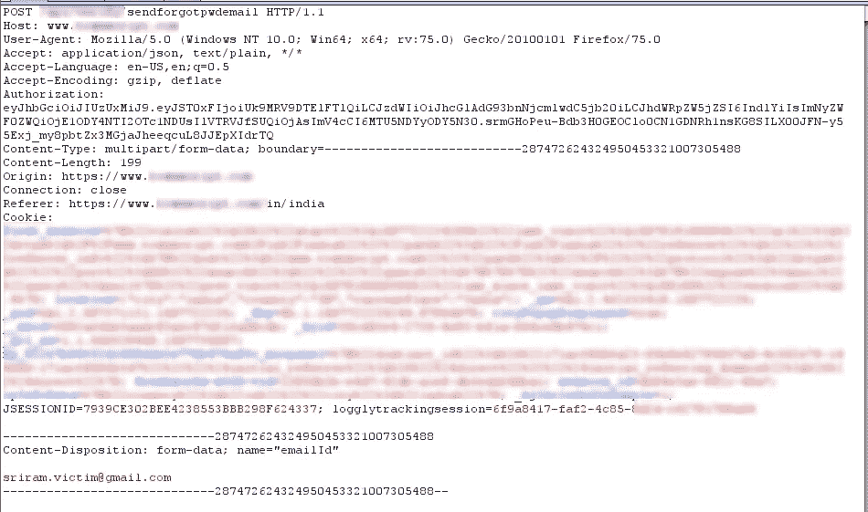
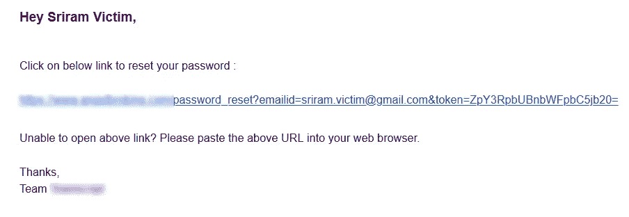
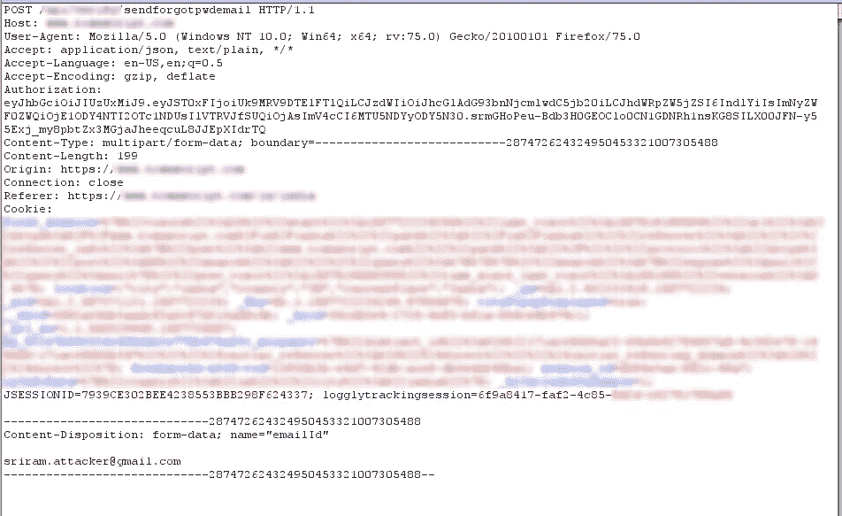
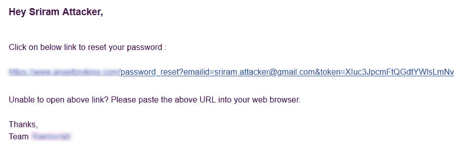
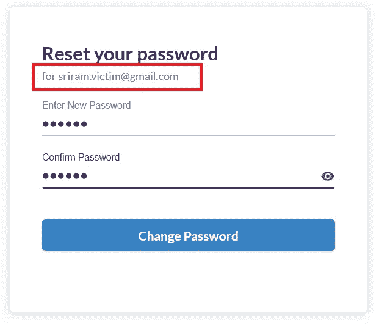
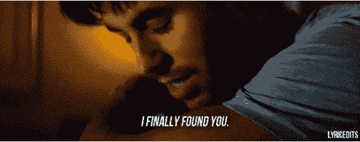

# 简单的逻辑:导致账户被接管。

> 原文：<https://infosecwriteups.com/simple-logic-leads-to-account-takeover-63fec69e88b7?source=collection_archive---------0----------------------->

我和 XSS 分手已经有几个星期了，我真的爱上了逻辑错误。这是如此具有挑战性，给了我很多想法来测试它们，在某一点上，我的记事本几乎看起来像狗屎。

我决定休息一段时间，和我的朋友聊天。她在一家顶级科技公司做远程实习生，她正在给一些人转发一些邮件。她问我你能为我做一段时间吗。既然是远程工作，我就接受了。我所要做的就是改变整个邮件中的 Hi**【name】**并添加一些关于彼此独特的任务的信息。我有一个想法，如果我把一个人的任务加到另一个人身上会怎么样。等等，我感觉到了什么！！！

我感觉到了什么！

如果你不明白其中的逻辑，那很好。

# 深入研究

我决定选择一个目标来测试这个场景，所以我开始选择几个不同领域的顶级 web 应用程序。我选的第一个是一个事件管理门户，但是它宕机了**(-_-)HTTP 503；**

接下来，我选择了一个被认为是该国领先的交易平台之一的网站，交易者/投资者可以在这里投资股票市场。呼钱宝贝！！

同样没有注入，只有逻辑错误！！

我决定创建两个账户，分别是 sriram.victim@gmail.com 的**和 sriram.attacker@gmail.com 的**和**。***我自己的这个邮箱 ID 请不要发垃圾邮件，用在这里是为了让读者容易理解。*

我去了我最喜欢的目的地“忘记密码”页面，请求给我的受害者账户**sriram.victim@gmail.com**发送一封密码重置邮件，并决定分析这个请求。

受害者密码重置请求

发送密码重置邮件的请求相当复杂。我觉得有些可疑！我收到的邮件里的重置链接是干净的。

重置受害者帐户的链接

因此，我决定复制一个原始请求，不做任何修改地发送给中继器，并将原始请求转发给服务器。几分钟后，我决定将 *emailId* 更改为攻击者邮件 Id，即原始请求中的**sriram.attacker@gmail.com**，该请求保存在中继器和转发的请求中。

已发送的请求中的修改邮件。

不相信我去了我的攻击者的邮件，令我惊讶的是，我收到了一封邮件，但与我提供的邮件 ID 和不同的令牌。

攻击者重置邮件

加油！我期待的是寄到受害者邮箱的令牌。但是我收到了我的 *emailId* ，它是攻击者的邮件 Id 和一个新令牌。啊！伙计，这种情况在这里行不通。我点击了我在攻击者邮件上收到的链接，我发现的内容几乎让我震惊。

受害者帐户的密码重置。

我能够为受害者的帐户设置密码，即使我在重置链接上收到了不同的令牌和不同的电子邮件 Id。我真的很震惊，但我想知道这到底是怎么发生的。

:) ❤

经过认真了解，我发现这是由于在密码重置请求上使用的 cookie。命名为 ***JSESSIONID*** *的 cookie。*该 cookie 负责发送密码重置链接。

因为已经使用***JSESSIONID***cookie 向受害者的帐户发送了一封带有密码重置邮件的邮件。我需要用不同的邮件 ID 重新发送具有相同的 ***JSESSIONID*** 的请求，这样相同的链接将被发送给我，即:攻击者的邮件 ID，因为受害者的密码重置链接被分配给了***jession ID***cookie。

等等，但是攻击者收到的重置链接中的邮件和令牌是不同的，那么怎么可能重置受害者帐户的密码。

这是因为，有一个`<a href>`标签用来屏蔽邮件上的原始链接。还有一个链接用于在后端重置密码。即使链接看起来不同，它也会被重定向到发送给受害者的相同目的地。

这里，我们去了另一个逻辑错误，导致帐户接管。

找到你了！

# 吸取教训！

开发商加油！我相信你吸取了教训。对于 bug 猎人，请分析密码重置请求，特别是如果其中有多个 cookies，发送原始请求并更改邮件 ID，然后再次发送。你一定在那里发现一些可疑的东西。

# 时间线:

**2020 年 1 月:**向组织报告问题。

**2020 年 1 月:**几个小时后与安保人员接通。

**2020 年 1 月:**问题在第二天就得到解决，并得到了组织的认可，在其交易平台上提供了礼品卡和终身访问权限。

2020 年 4 月:写完发表。

那是快速补丁❤！！

好吧，如果你喜欢这个，写下来鼓掌👏(50X)，那我们来连线:

**推特:**https://www.twitter.com/sriramoffcl

**Instagram:**[https://www.instagram.com/sriram_offcl](https://www.instagram.com/sriram_offcl/)

**LinkedIn:**[https://www.linkedin.com/in/sriramkesavan](https://www.linkedin.com/in/sriramkesavan/)

电子邮件: sriramkesavan98@gmail.com | **Donate:** [https://paypal.me/sri123](https://www.paypal.me/sri123)

**和平** ⚠️ **！！(T19)**