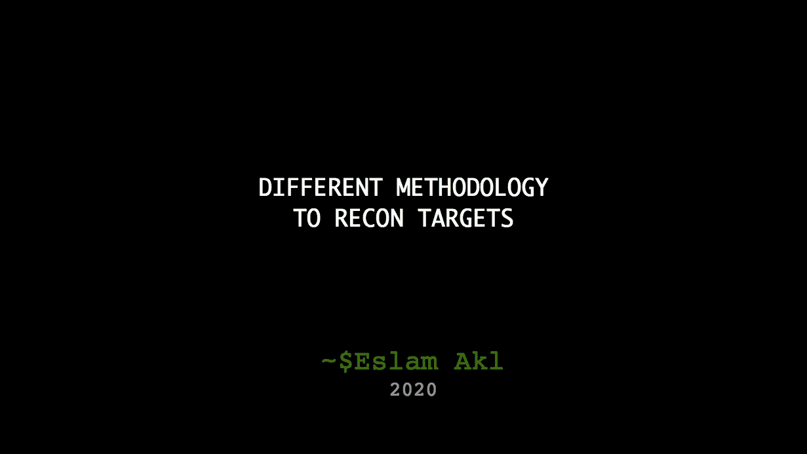
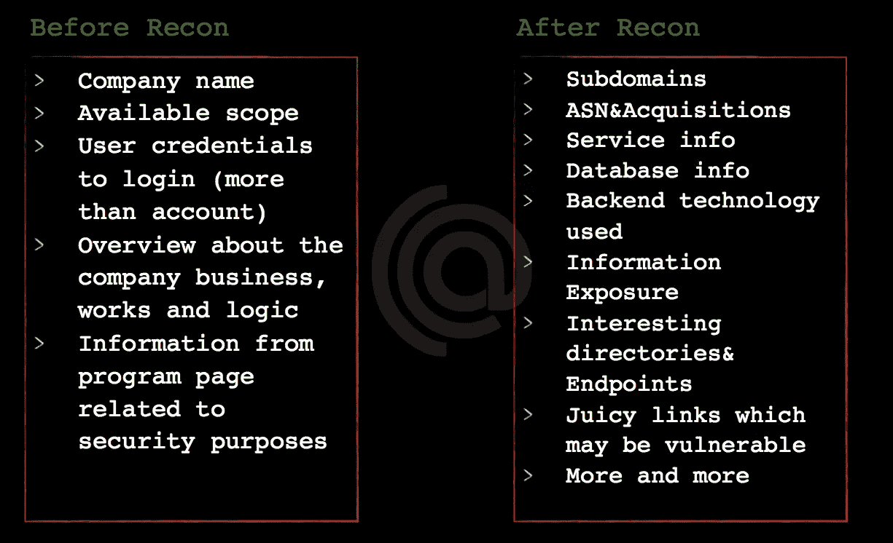
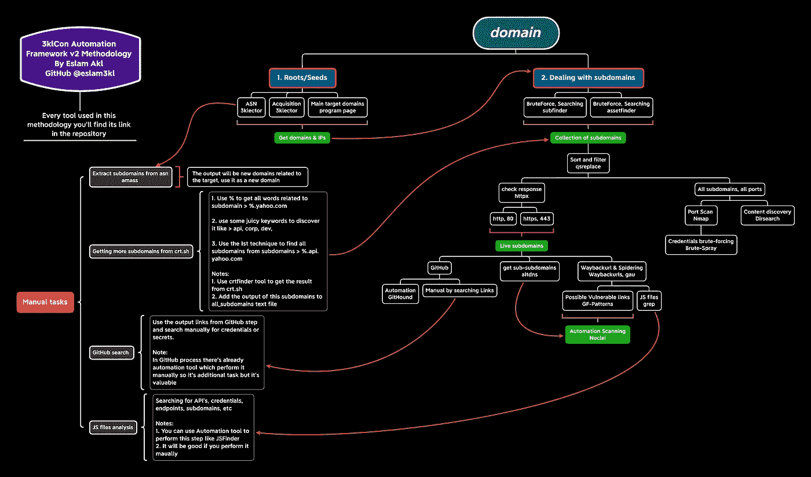
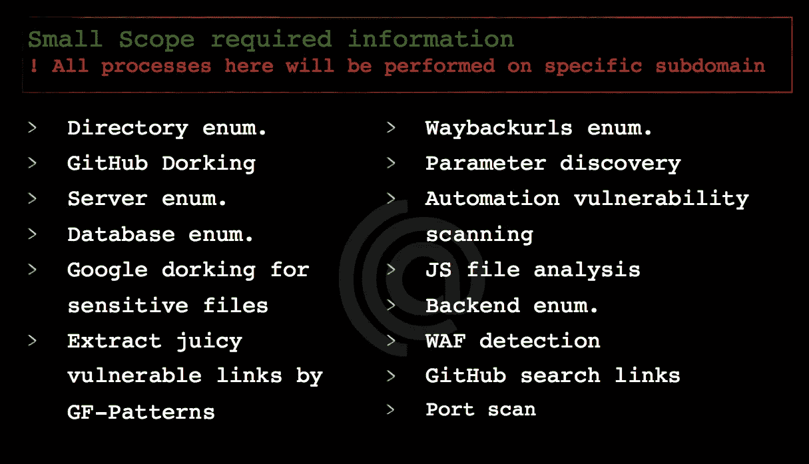
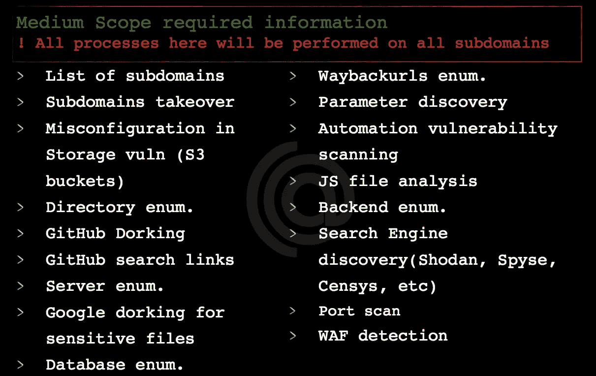
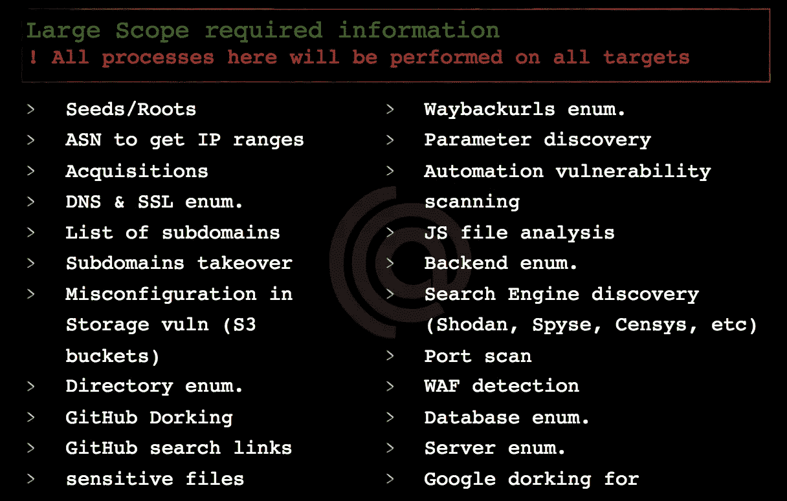

# 简单的侦察方法

> 原文：<https://infosecwriteups.com/simple-recon-methodology-920f5c5936d4?source=collection_archive---------0----------------------->

H ey 伙计们，我们又回到了渗透测试或 Bug 赏金猎人“侦查”或“信息收集”中最重要的话题。

## 内容

1.  什么是侦察？
2.  基于侦察的范围
3.  简单的步骤在短时间内收集所有信息
4.  推荐的工具和自动化框架
5.  推荐的博客、关注的流

## 什么是侦察？

在我们开始我们的谈话之前，让我们先知道什么是侦察？

侦察是你收集更多关于你的目标的信息的过程，更多的信息像子域，链接，开放的端口，隐藏的目录，服务信息等等。

想知道更多关于侦察的信息，看看这张照片就知道你在侦察前后的位置了…

侦察前和侦察后的信息

所以你现在想的问题是我们将如何收集所有这些信息，以及我们将使用什么样的工具？实际上，要收集所有这些信息，你需要遵循方法论，我将向你展示我自己的方法论，几分钟后你就会知道它是如何工作的。

我自己的方法论— 3klcon 自动化框架—src:[https://github . com/eslam 3 KL/3 klcon/blob/v 2.0/3 klcon-methodology . png](https://github.com/eslam3kl/3klCon/blob/v2.0/3klcon-MEthedology.png)

> 侦察过程应该基于范围，我的意思是你应该根据你的范围收集信息**(小、中或大)**。不同之处在于您将收集的数据的**数量**和**类型**，所以让我们开始吧。

## 基于侦察的范围

我们将把范围分为 3 种类型(小、中、大范围)

**A .小范围**

在这种类型的范围内，你有唯一的*子域*，你可以像`sub.domain.com`一样在上面测试，你没有任何权限在任何其他子域上测试，你应该收集的信息将是这样的…

如你所见，你应该收集的信息将基于你有权测试的子域，如目录发现文件、服务信息、JS 文件、GitHub dorks、waybackurls 等

**B .中等范围**

在这里，您的测试区域将增加到包含与特定域相关的所有子域，例如，您有一个类似于`example.com`的域，在您的程序页面上，您被允许测试类似于`*.domain.com` 的所有子域。在这一步中，您应该收集的信息将超过小范围，例如包含所有子域，并将每个子域视为小范围“*我们将详细讨论这一点*，只需了解信息的类型即可。

中等范围所需信息

**C .大范围**

在这类范围内，你有权限测试所有属于主公司的网站，比如你开始测试`IBM`公司，所以你需要收集所有与该公司相关的域名、子域、收购和 ASN，并将每个域名视为中等范围。这种型号的望远镜是❤有史以来最好的望远镜

大范围所需信息

现在，我们知道了您需要为每个范围收集的所有信息，现在让我们来谈谈如何收集所有这些信息。

来看看这个怎么收藏吧！

准备好了吗？

## 收集所有信息的简单步骤

为了便于理解，我们在这里将作为中等范围来工作

> 这里使用的所有工具在 GitHub 上都是免费开源的

*   从`subfinder`、`amass`、`crtfinder`、`sublist3r`等工具中收集所有子域(使用不止工具)
*   以谷歌呆子为例`site:ibm.com -www`
*   从`subdinder + amass + crtfinder + sublist3r + google_dorks`收集所有这些信息，并将它们收集到一个文本文件`all_subdomains.txt`

**[*]现在我们有 1 个包含所有子域** `all_subdomains.txt` **的文本文件，让我们继续…**

*   通过`httpx`或`httprobe`传递文本文件，这些工具将过滤所有子域，只返回在端口 80 和 443 上工作的活动子域
*   将这些活跃的子域收集到单独的文件中`live_subdomains.txt`

**[*]现在我们有 2 个文本文件** `all_subdomains.txt + live_subdomains.txt`

*   获取`live_subdomains.txt`文件，并通过`waybackurls`工具收集与所有活动子域相关的所有链接
*   将所有这些链接收集到新文件`waybackurls.txt`

**[*]现在我们有 3 个文本文件** `all_subdomains.txt + live_subdomains.txt+ waybackurls.txt`

*   获取所有子域文本文件，并通过`dirsearch`或`ffuf`来发现所有隐藏的目录，如`[https://community](https://community).ibm.com/database_conf.txt`
*   收集并过滤所有结果，只显示来自工具本身的 2xx、3xx、403 响应代码(使用-h 了解如何过滤结果)
*   将所有这些信息收集到文本文件`hidden_directories.txt` 中，并尝试发现泄漏数据或禁止页面，并尝试绕过它们

**[*]现在我们有 4 个文本文件** `all_subdomains.txt + live_subdomains.txt + waybackurls.txt + hidden_directories.txt`

*   通过`all_subdomains.txt`到`nmap`或`masscan`扫描所有端口，发现开放的端口+尝试暴力破解这个开放的端口如果你看到这个端口可能被暴力破解，使用`brute-spray`暴力破解这个凭证
*   将所有结果收集到文本文件`nmap_results.txt`

**[*]现在我们有 5 个文本文件** `all_subdomains.txt + live_subdomains.txt + waybackurls.txt + hidden_directories.txt + nmap_results.txt`

*   使用`live_subdomains.txt`并通过使用像`GitHound`这样的自动化工具或手动搜索在 GitHub 中搜索凭证(我将在参考资料一节中放入漂亮的参考资料)
*   将所有这些信息收集到文本文件`GitHub_search.txt`

**[*]现在我们有 6 个文本文件** `all_subdomains.txt + live_subdomains.txt + waybackurls.txt + hidden_directories.txt + nmap_results.txt + GitHub_search.txt`

*   使用`altdns`从子域中收集子域，例如`sub.sub.sub.domain.com`
*   照常:)将所有这些信息收集到文本文件`altdns_subdomain.txt`

**[*]现在我们有 7 个文本文件** `all_subdomains.txt + live_subdomains.txt + waybackurls.txt + hidden_directories.txt + nmap_results.txt + GitHub_search.txt + altdns_subdomain.txt`

*   将`waybackurls.txt`文件传递到`gf`工具，并使用`gf-patterns`过滤链接到可能易受攻击的链接，例如，如果链接具有类似`?user_id=`的参数，则此链接可能易受 **sqli** 或 **idor** 攻击，如果链接具有类似`?page=`的参数，则此链接可能易受 **lfi** 攻击
*   将所有这些易受攻击的链接收集到目录`vulnerable_links.txt`中，在这个目录中有所有易受攻击链接的单独文本文件`gf_sqli.txt`、`gf_idor.txt`等

**[*]现在我们有 7 个文本文件** `all_subdomains.txt + live_subdomains.txt + waybackurls.txt + hidden_directories.txt + nmap_results.txt + GitHub_search.txt + altdns_subdomain.txt` **和一个目录** `vulnerable_links.txt`

*   使用`grep`以`cat waybackurls.txt | grep js > js_files.txt`的身份收集`waybackurls.txt` 中的所有 JS 文件
*   您可以手动分析这些文件，或者使用自动化工具(我推荐手动扫描，参见参考资料)
*   将所有结果保存到`js_files.txt`

**[*]现在我们有 8 个文本文件** `all_subdomains.txt + live_subdomains.txt + waybackurls.txt + hidden_directories.txt + nmap_results.txt + GitHub_search.txt + altdns_subdomain.txt + js_files.txt` **+一个目录** `vulnerable_links.txt`

*   通过`all_subdomain.txt + waybackurls.txt + vulnerable_links.txt`到`nuclei`“自动化扫描仪”扫描所有。

下一步！！放心，没有更多的步骤:)

恭喜你，你已经完成了侦察❤的最大部分

现在我相信你知道所有这些步骤，去上面的方法学再检查一遍，看看你是否理解它！

很好！让我们进入下一步…

## 推荐的工具和自动化框架

**>对于自动化框架，我推荐 2 个框架**

*   `3klcon`[https://github.com/eslam3kl/3klCon](https://github.com/eslam3kl/3klCon)——我自己的框架和它依赖的上层方法论
*   `Bheem`https://github.com/harsh-bothra/Bheem

**>为工具**

*   `3klector`[https://github.com/eslam3kl/3klector](https://github.com/eslam3kl/3klector)
*   `crtfinder`[https://github.com/eslam3kl/crtfinder](https://github.com/eslam3kl/crtfinder)
*   `Subfinder`[https://github.com/projectdiscovery/subfinder](https://github.com/projectdiscovery/subfinder)
*   `Assetfinder`[https://github.com/tomnomnom/assetfinder](https://github.com/tomnomnom/assetfinder)
*   `Altdns`[https://github.com/infosec-au/altdns](https://github.com/infosec-au/altdns)
*   `Dirsearch`[https://github.com/maurosoria/dirsearch](https://github.com/maurosoria/dirsearch)
*   `Httpx`[https://github.com/projectdiscovery/httpx](https://github.com/projectdiscovery/httpx)
*   `Waybackurls`[https://github.com/tomnomnom/waybackurls](https://github.com/tomnomnom/waybackurls)
*   `Gau`[https://github.com/lc/gau](https://github.com/lc/gau)
*   `Git-hound`[https://github.com/tillson/git-hound](https://github.com/tillson/git-hound)
*   `Gf`[https://github.com/tomnomnom/gf](https://github.com/tomnomnom/gf)
*   `Gf-pattern`[https://github.com/1ndianl33t/Gf-Patterns](https://github.com/1ndianl33t/Gf-Patterns)
*   `Nuclei`[https://github.com/projectdiscovery/nuclei](https://github.com/projectdiscovery/nuclei)
*   `Nuclei-templets`[https://github.com/projectdiscovery/nuclei-templates](https://github.com/projectdiscovery/nuclei-templates)
*   `Subjack`[https://github.com/haccer/subjack](https://github.com/haccer/subjack)

## 信贷

Harsh Bothra " [Recon based scope](https://cobalt.io/blog/scope-based-recon-smart-recon-tactics) "
Jhaddix [攻击性](https://www.offensity.com/en/blog/just-another-recon-guide-pentesters-and-bug-bounty-hunters/)

## 曲名 : Stay in Touch

[GitHub](https://github.com/eslam3kl)|[LinkedIn](https://linkedin.com/in/eslam3kl/)|[Twitter](https://twitter.com/eslam3kll)

> 谢谢你，❤