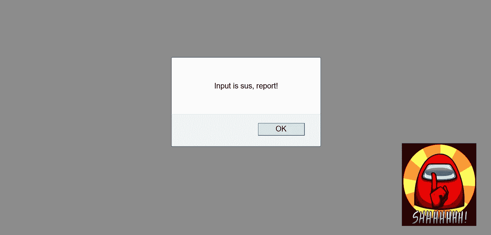
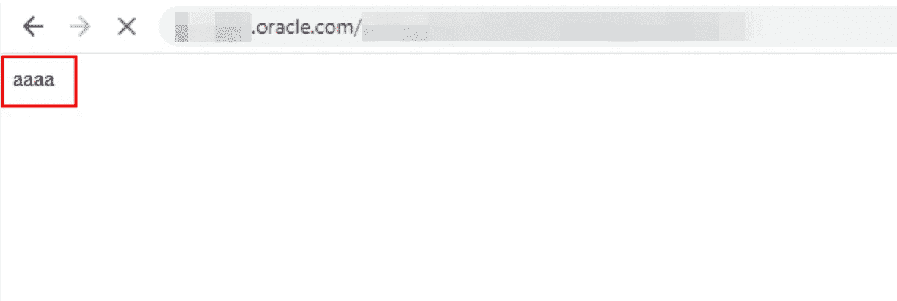

# 网站污损和拒绝服务。跨站点脚本

> 原文：<https://infosecwriteups.com/site-defacement-and-denial-of-service-via-cross-site-scripting-9c54d1d3fd06?source=collection_archive---------1----------------------->

## 在 Oracle 产品中绕过正则表达式过滤

> “跨站点脚本(XSS)可能是最广为人知的网络漏洞，它会让您的站点遭到黑客攻击。当网页显示未经正确验证的用户输入(通常通过 JavaScript)时，就会发生 XSS。犯罪黑客可以利用输入过滤的缺失，使网页在查看该网页的任何用户的计算机上执行恶意代码。”
> 
> —[https://www.dummies.com/](https://www.dummies.com/)

用户输入有点像 sus(一个“在我们之中”的引用):P

对此类客户端注入攻击的理想补救措施是执行[输出编码](https://owasp.org/www-project-proactive-controls/v3/en/c4-encode-escape-data)，但是一些开发人员更喜欢通过使用正则表达式来过滤某些关键字和/或通常用作 XSS 有效负载一部分的特殊字符来解决这个问题。在开发人员了解漏洞并使用正确的黑名单正则表达式模式的情况下，这肯定是有效的，但是正如您可能知道的，JavaScript 中的函数和方法有一些非穷尽的替代方法，可用于触发客户端注入攻击。这篇博客旨在强调，仅仅依靠黑名单或过滤作为服务器端验证的一部分并不是现有的最佳安全实践，并且总是有办法绕过这种实现。研究人员总是在寻找新的/替代的方法来绕过现有的协议。

## 问题是

Oracle 基于云的实用程序允许用户构建和部署企业应用程序，在花了几个小时研究它的主要功能后，我发现在每个表单提交请求中发送的用户输入在呈现到响应中之前都经过了适当的编码。但是奇怪的是，并非所有的功能都是如此；对于(*非常*)少数功能(*遗留功能)，应用程序对用户输入进行了不同的处理。*)。具体来说，看起来这个应用程序(在这几个功能中的*)被设计成过滤掉响应中的某些特殊字符和关键字，由于这些特殊字符和关键字，正常的 XSS 有效载荷将不能正常工作。*

在接下来的几个小时里，我理解了过滤机制实现背后的正则表达式模式，并精心制作了绕过过滤器的完美负载。结果是屏幕上出现了一个“警告框”，每次访问功能时都会出现，即存储的跨站点脚本。

## 接下来呢？

我列出了使用上述实现的所有模块，并观察到它们都容易受到存储的跨站点脚本的攻击，其中一个模块允许用户创建表单并与某个组( *DEV、QA、UAT、PROD 等)的其他用户共享表单。*)，即用户填写并提交表单后，该表单的内容在登录时对集团所有用户可见(*，包括提交表单的用户*)。

作为表单提交的一部分，我触发了新制作的 JavaScript XSS 有效负载，并观察到当组中的任何有效用户(*甚至管理员*)登录到应用程序时，JavaScript 有效负载就会被加载。接下来，我修改了 XSS 负载，让应用程序在用户登录到应用程序时解析*document . write(‘AAAA’)*。

该组的每个用户登录时将看到的内容。

也就是说，该组的登录用户不会在屏幕上看到一个花哨的“警告框”，而是会被定向到一个响应中带有“ **aaaa** ”的空白页面。

你可能会想知道下面这些—

1.  如果我强行访问其他功能的 URL，会发生什么情况？
2.  XSS 是如何拒绝用户访问应用程序的？

**Ans 1。**应用程序在每个请求中发送一个动态生成的唯一标识符，即，对于每个点击的按钮，应用程序发送一个随机生成的标识符，该标识符在服务器中被验证和映射，因此用户不可能访问任何其他功能，除非他们能够预测标识符值。下面是一个请求标识符的例子。

> :640991690762043326726::

**Ans 2。**现在用户无法访问应用程序中的任何其他功能(*参见 Ans 1* )，并且每次任何有效的工作区用户登录时都会执行 XSS 有效负载，因此任何用户(*甚至管理员*)都无法访问应用程序中的任何功能。Oracle 团队必须清除后端数据库中的有效负载，以便应用程序可以再次访问。

## 结果

在最初的披露中，Oracle 团队将漏洞裁定为预期功能，但经过几次反复，这些问题在 2020 年 10 月和 2021 年 1 月的补丁发布周期中被接受并修复。

与 Oracle 安全团队的合作非常愉快，我很高兴能够获得 Oracle 发布的第一批简历。更多即将推出！

## 参考

CVE-2020–14762 | CVE-2020–14763 | CVE-2020–14898 | CVE-2020–14899 | CVE-2020–14900 | CVE-2021–2116 | CVE-2021–2117

## 非常感谢博客上的反馈和见解。欢迎发表评论或在 Twitter 上联系我。