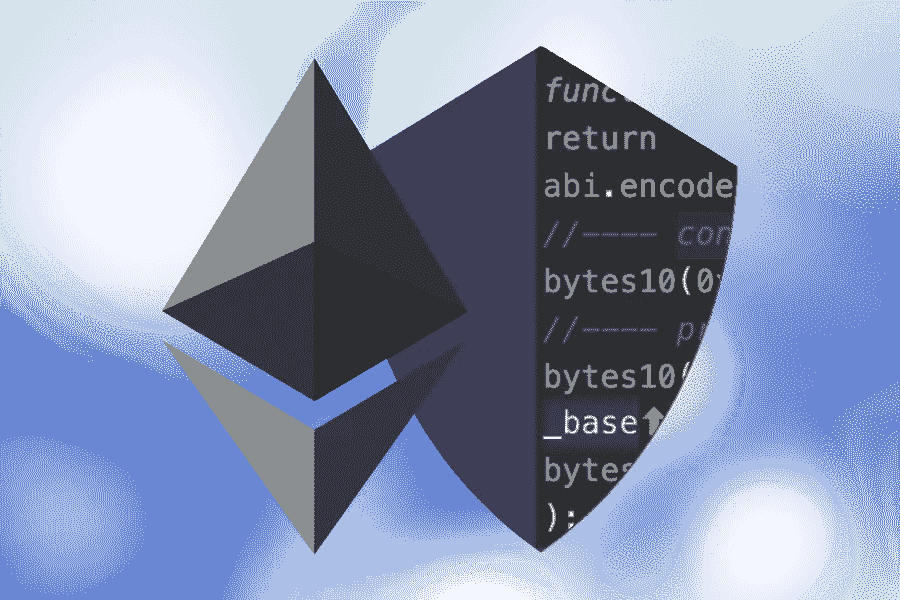
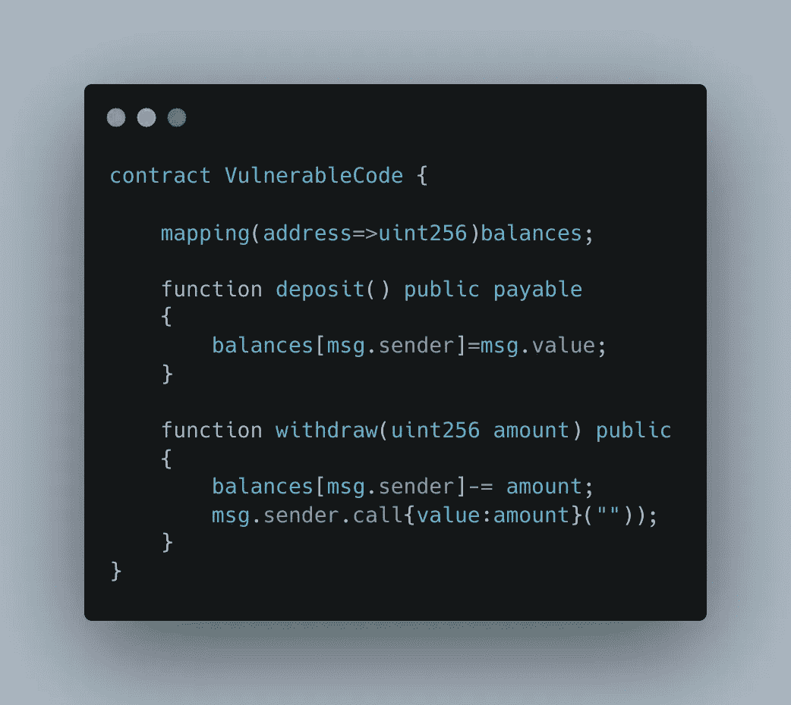
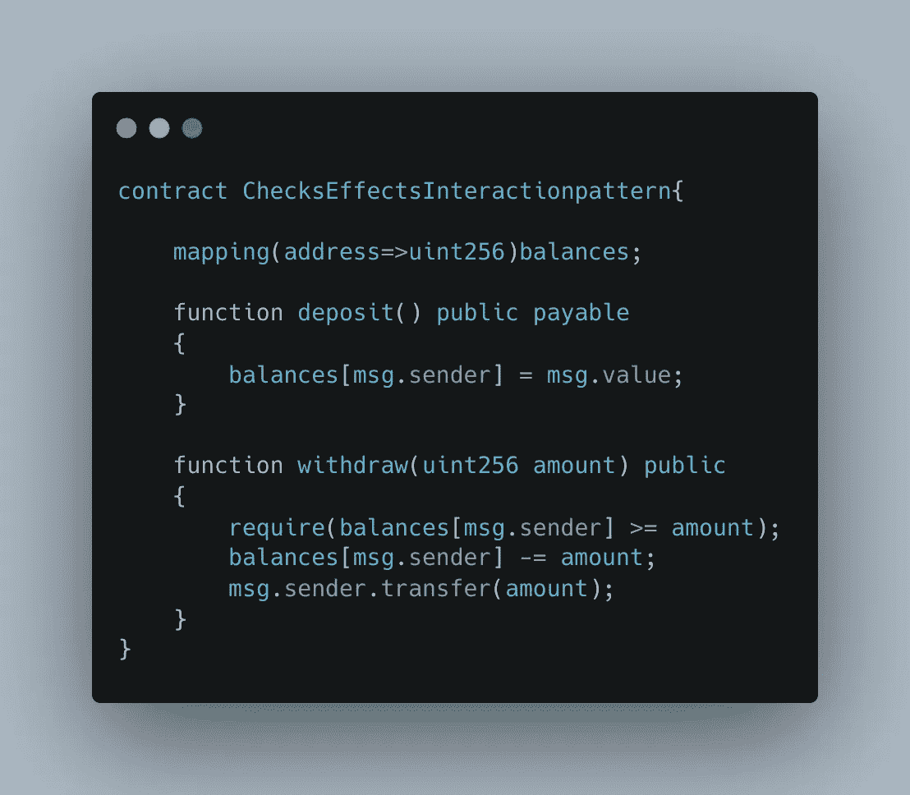

# 智能合约安全性最佳实践:第 1 部分

> 原文：<https://infosecwriteups.com/smart-contract-security-best-practices-part-1-c35b640ee2ff?source=collection_archive---------3----------------------->

大家好，希望你们做得好，今天，我们将讨论智能合同安全性，这是每个开发人员在创建智能合同之前都应该知道的事情。智能合约是在区块链上运行的代码片段，处理数百万美元的交易。一个简单的缺陷就可能导致一百万美元的损失。为了避免这种情况，我们今天将学习安全最佳实践。

我们开始吧

**状态更改必须在外部调用之前完成:**

根据 Consensys 的说法，“如果你正在调用一个不受信任的外部合同，*避免调用后的状态变化*为了更好地理解它，让我们看一看易受攻击的代码。

**举例:**

上述合同有两个功能，即存款和取款。把它想象成一家银行。用户可以存钱，也可以取钱。

这里的问题是没有检查用户是否有足够的钱来取款。

第二个可能是。 ***调用()*** 函数。这可能会导致可重入攻击。注意`.call()`对减轻重入攻击没有任何作用，所以必须采取其他预防措施。

第三个缺陷可能是 balance 在将金额转移给调用者后被更新。

**那么如何解决这个问题呢？**

为了解决这个问题，我们需要使用检查-效果-交互模式。

**什么是检查-效果-交互模式？**

支票-效果-交互模式是指在将资金转移到外部合同之前必须执行的各种检查。这样才能防止资金流失。

我们来看看固定代码。

在上面的合同中，取款功能有一定的检查，包括 1)用户是否有足够的余额

2)在转移资金之前完成状态更改

3)***的用法。转移()*** 功能代替 ***。调用()。*** 注意， ***transfer()*** 功能有一个气体上限 2300，这种方式会防止重入攻击。

我们在 2022 年前六个月损失的钱是 2021 年全年的两倍。为了避免这些攻击，开发人员应该将安全最佳实践纳入他们的智能合同中。

要了解更多关于 web3 安全性的信息，请在 Twitter 上关注我。

[https://twitter.com/UV_virus](https://twitter.com/UV_virus)

来自 Infosec 的报道:Infosec 上每天都会出现很多难以跟上的内容。 [***加入我们的每周简讯***](https://weekly.infosecwriteups.com/) *以 5 篇文章、4 个线程、3 个视频、2 个 Github Repos 和工具以及 1 个工作提醒的形式免费获取所有最新的 Infosec 趋势！*