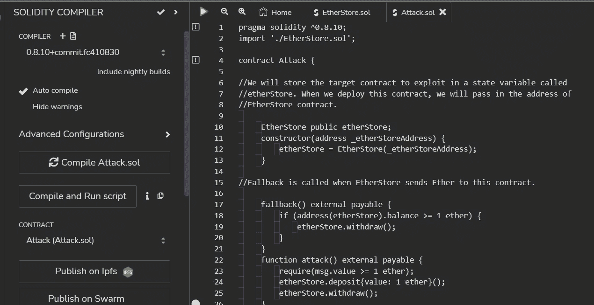
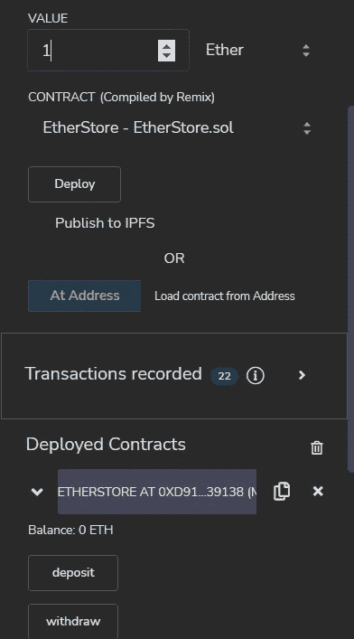
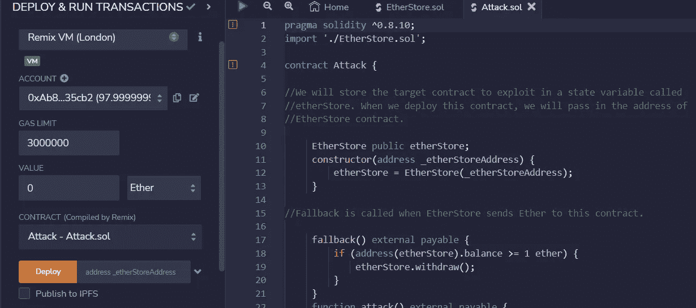
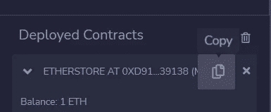
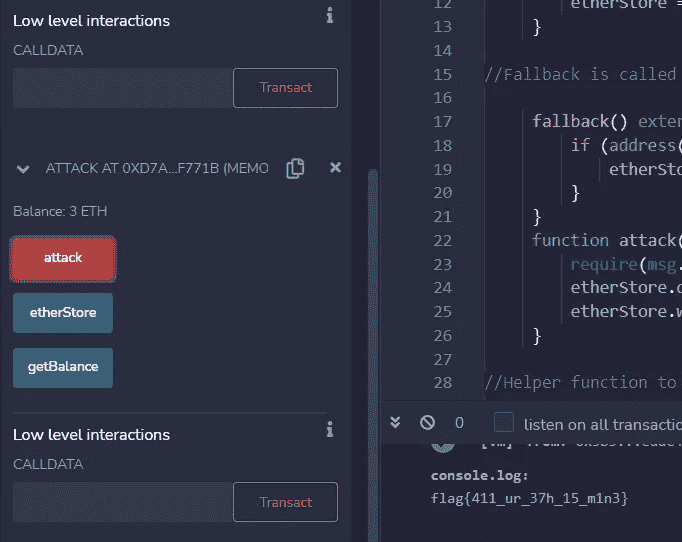

# 智能合同

> 原文：<https://infosecwriteups.com/smart-contracts-931081d9649a?source=collection_archive---------1----------------------->

## 第八天 THM-赛博 4 的来临

在我们实际动手操作基本漏洞的实际应用之前，该任务提供了许多关于智能合约漏洞的理论。

虽然如果你不熟悉区块链和智能合约，这很难理解，但我建议你简要阅读一下，大致了解一下舞台上的场景。

让我们跳到挑战的演练。

我们将使用 [Remix IDE](https://remix.ethereum.org/) ，它提供了一个安全可控的环境来测试和部署合同，就像在公共区块链上一样。

现在让我们下载文件，并在浏览器中打开这个 IDE。

当你第一次打开 Remix 的时候，你想把注意力吸引到左边；从上到下分别会有一个文件浏览器、搜索、Solidity 编译器和部署导航按钮。我们将大部分时间花在部署和运行事务菜单上，因为它允许我们从环境、客户和合同中进行选择，并与我们已编译的合同进行交互。

继续并打开您在 local_workspace 中下载的两个文件。

之后，导航到这两个文件，并在 solidity 编译器下编译这两个文件。

之后，转到部署和运行事务，并选择一个合同。

etherstore.sol 将是我们要部署的第一个。部署后，将值更改为 1，并单击已部署合同下的存款。

余额将从 0 变为 1，您可以将该值设置为您想要的任何数字:)

现在是时候部署我们的攻击了。转到攻击文件，然后部署并运行事务

要部署它，您需要一个地址，转到部署并复制 etherstore 的地址。

把这个粘贴进去，然后部署攻击。sol

现在，您将在已部署的合同下看到攻击，您所要做的就是将值更改为 1，然后单击“攻击”

我点击了三次，所以我得到了 3ETH 作为余额，但我们只存入了 1🤑。

这就是前面在房间里描述的漏洞。

这个房间有点让人不知所措，但我们最终了解了智能合同是如何工作的，以及我们如何利用一个基本的漏洞。

## 来自 Infosec 的报道:Infosec 每天都有很多内容，很难跟上。[加入我们的每周简讯](https://weekly.infosecwriteups.com/)以 5 篇文章、4 个线程、3 个视频、2 个 GitHub Repos 和工具以及 1 个工作提醒的形式免费获取所有最新的 Infosec 趋势！