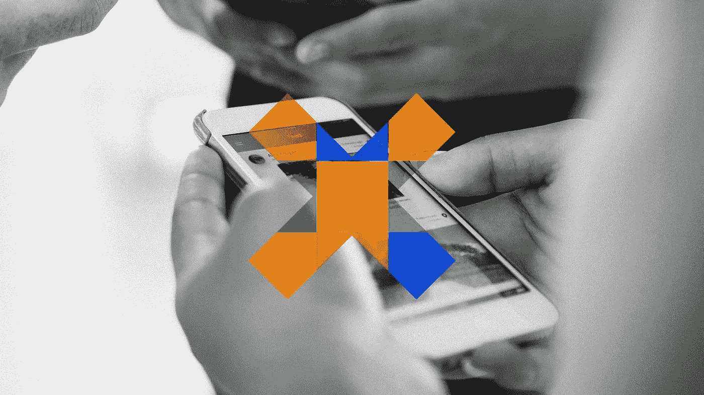
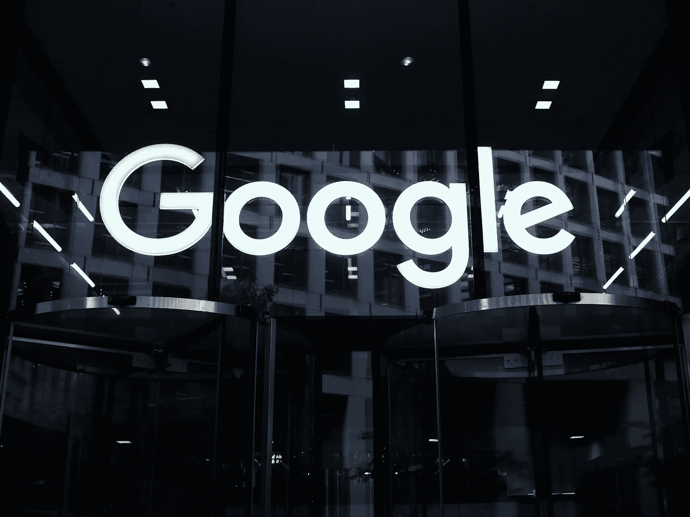
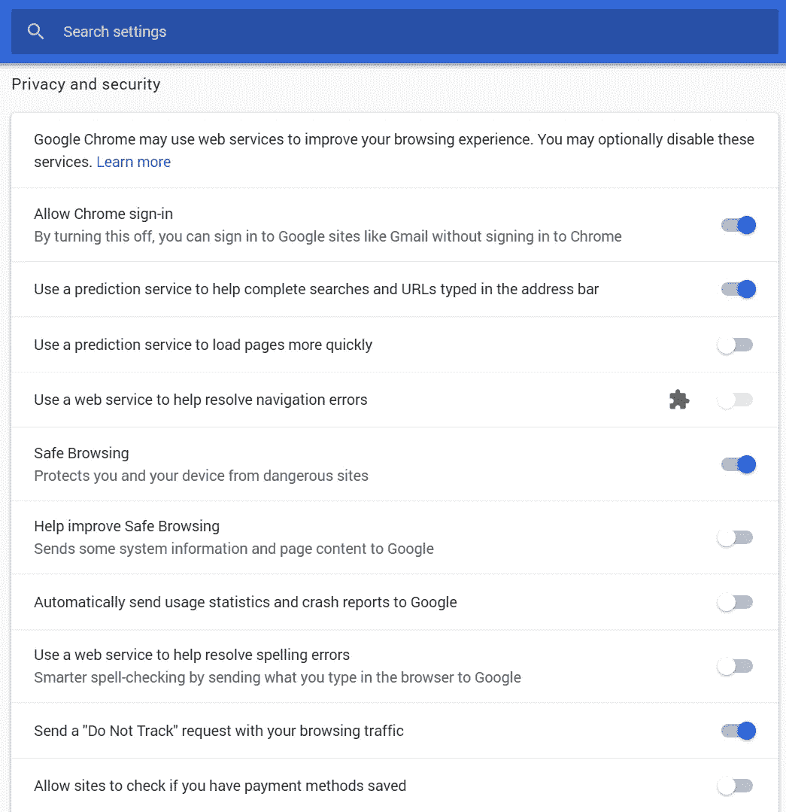
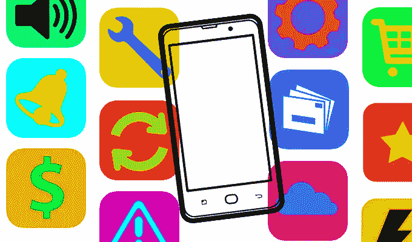
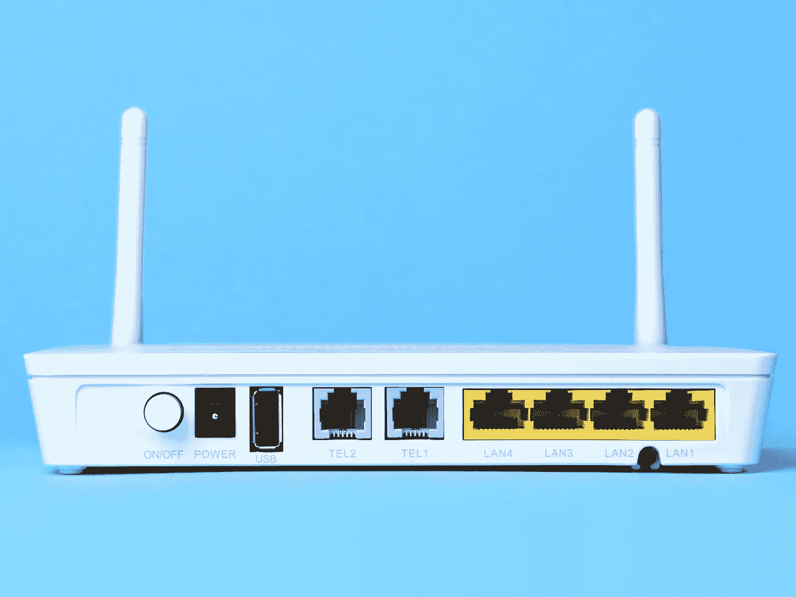

# 对隐私偏执的智能手机安全

> 原文：<https://infosecwriteups.com/smartphone-security-for-the-privacy-paranoid-6f2595f12085?source=collection_archive---------1----------------------->

## 实用隐私高级指南


这篇文章是两部分系列文章的第二部分。先看看第 1 部分。👇

[](https://medium.com/@reliancegcs/smartphone-surveillance-techniques-f9e206c5c456) [## 智能手机监控和跟踪技术

### 了解威胁、指数和防护

medium.com](https://medium.com/@reliancegcs/smartphone-surveillance-techniques-f9e206c5c456) 

> 以下系列文章融合了各种关于智能手机隐私/安全的公共领域文章的实质性总结和选择性汇编。所有的参考文献都在文章的末尾注明了。

# 智能手机隐私必备

存储在智能手机上的个人数据往往比智能手机本身更有价值。这也意味着更多的人正面临潜在的安全威胁。虽然手机的功能无穷无尽，但对我们个人隐私的威胁却是实实在在的。

智能手机可以通过四种方式利用/攻击来泄露您的个人数据，包括:

*   **操作系统攻击:**操作系统攻击利用了在操作系统级别发现的漏洞。
*   **应用程序攻击:**应用程序攻击通常是糟糕的开发和编码的结果。
*   **恶意软件攻击:**数量越来越多的恶意软件攻击可以窃取你的照片，劫持你的相机，删除重要文件。
*   **基于通信的攻击，如 Wi-Fi 或蓝牙上的攻击:**当用户登录到不安全或有故障的网络时，就会发生对通信网络的攻击。

除了个人照片之外，联系人、文件、移动应用程序、密码和认证令牌都可以被视为敏感信息。保护这些文件免受未经授权的访问至关重要。

隐私入侵者可以以多种方式威胁智能手机，如果你想(或需要)完全锁定它，铁甲保护就有点复杂了。幸运的是，可以采取一些措施来大大改善你的智能手机隐私。它们不能消除所有的风险，但它们是任何智能手机用户的坚实基础。

1。 **了解你的应用**


第一步是准确了解你使用的应用程序正在收集哪些数据，包括联系人、照片、互联网数据和通话记录。您还应该了解这些应用程序是如何使用您的数据的。

Android 和 iOS 增加了粒度工具，使精确控制设备上每个应用程序可以访问和不可以访问的内容变得更加简单。这些权限不仅控制联系人列表、照片和日历等数据访问，还控制对相机和麦克风等组件的硬件访问。通过将应用程序拥有的权限限制为它真正需要工作的内容(或你关心的功能)，你可以限制应用程序收集更多个人数据的能力。

广受欢迎的 Android 应用程序 Flash Keyboard 寻求的权限远远超过了它运行所需的权限，被 [*发现跟踪其用户*](https://www.theregister.co.uk/2016/06/07/android_keyboard_needs_to_see_camera_and_log_files/) ，提供潜在的恶意广告，并将数据传输回中国。

每次你第一次安装和打开一个应用程序时，你的手机会给你一个机会自定义其权限，但定期检查并确保一切都按照你想要的方式设置也是一个好主意。

**安卓**

*   进入**设置>应用**，将显示已安装应用的列表。
*   选择您选择的应用程序，然后点击**权限**。
*   从那里，你可以对应用程序能访问什么和不能访问什么进行精细控制。
*   还可以考虑通过访问**设置** > **安全&锁定屏幕** > **设备管理应用**来删除不需要的应用的管理员权限。

**iOS**

*   进入**设置>隐私，**，在那里你可以看到按类型分组的权限，一眼就能嗅出谁在跟踪你的位置。
*   或者去 app 接 app；只需点击**设置**并滚动，直到您点击您想要审计的应用程序。

评估很重要，因为我们有时会在没有意识到的情况下授予应用程序权限，就像只是因为你不小心在消息应用程序中按了一次听写按钮，就同意使用麦克风一样。最好在默认情况下关闭这些功能，当您遇到实际需要它们的情况时再打开它们。

2。 **避免第三方应用**


总是直接从操作系统的官方应用商店下载应用程序，而不是跟随链接或搜索引擎结果，它们可能会把你带到假冒的页面。

如果你是安卓用户，只从谷歌 Play 商店下载应用程序。即使这样也不能完全消除你意外下载恶意 app 的风险，但会大幅降低。

另一方面，iPhone 不能从苹果应用商店之外下载应用，除非你越狱——如果你越狱了你的手机，你希望已经知道从粗略来源下载软件的风险。虽然充满恶意软件的应用程序偶尔会躲过苹果严格的开发规则，但 iPhone 的应用程序商店通常是一个非常安全的地方。

> 为了进一步降低您在 Google Play 和 App Store 上的风险，请坚持使用那些具有持续高评分和知名开发者的主流应用。

幸运的是，网络罪犯还没有想出一种万无一失的方法来将他们的假应用程序安装到我们的设备上。通过对细节的额外关注，你可以在下载之前学会识别假冒的应用程序。方法如下:

*   **检查错别字和语法错误:**仔细检查应用开发者的名字、产品名称和描述，看是否有错别字和语法错误。恶意的开发人员经常伪造真实的开发人员 id，甚至仅仅通过一个字母来伪装成合法的。如果有折扣的承诺，或者描述只是感觉关闭，这些信号应该被视为危险信号。
*   **看看下载统计:**如果你正试图下载一个像 WhatsApp 这样的热门应用，但它的下载量莫名其妙地低，这是一个相当好的指标，表明一个应用最有可能是欺诈性的。
*   **阅读别人在说什么:**说到山寨应用，用户评论是你的盟友。仅仅浏览几个就可以提供关于一个应用程序是否可信的重要信息。

3。设置强密码


锁定你的智能手机，这样，如果它丢失、被盗或被单独放置几分钟，就没有人能进入它。虽然不锁定设备很方便，但安全风险远远大于好处。对大多数人来说，最简单的解决方案是使用指纹或面部扫描仪来锁定您的设备；那样的话，只需要轻轻一碰或者扫一眼就能进去。

**给记者/活动家的提示:**记住，那些生物传感器是可以被愚弄的，**尽管要付出很大的努力**。在与执法机构的遭遇中，如果你依靠这些生物识别机制，特工可以强迫你打开手机。在 iOS 11 中，你可以同时按住侧边按钮和任一音量按钮，以便在必要时禁用触控 ID 和 Face ID。如果你担心这个问题，那就坚持使用可信的密码。

六位数或更多位数的密码几乎不可能被攻击者暴力破解而不被锁定在设备之外。因此，至少使用六位数字的代码，或者更好的是，自定义的字母数字代码(不是你的宠物的名字/电话/汽车的注册号码)。 [*释放你键盘的全部力量！*](https://www.wired.com/story/7-steps-to-password-perfection/) 为你所有的账户设置不同的密码。而且不用费心解锁图案；它们通常不如六个字符的 PIN 安全。

4。待打补丁


定期下载软件更新。更新您的应用、操作系统和安全补丁。根据您使用的手机，检查更新需要不同的步骤。确保你检查了你的设备有什么可用的，并考虑购买运行安卓系统的智能手机，这样你就可以随时获得谷歌安全发布。

5。 **安装一个有信誉的杀毒程序**

如果你在官方应用商店之外安装应用，安装防病毒应用是保护自己安全的一种方式。现代 AVs 还具有扫描浏览器/短信应用程序中的钓鱼网址的功能，并在检测到任何钓鱼网址时提供警报，以确保网上冲浪时的安全体验。我们挑的最好的是 [*Malwarebytes*](https://www.malwarebytes.com/) 。

6。 **管理你的谷歌安全&隐私设置**

首先，如果你有多个谷歌账户——比如说，一个用于工作，一个用于个人——登录你想要执行安全和隐私检查的账户。

*(注意:这里提供的步骤将帮助您在桌面系统上修改您的 google 安全设置(通过任何搜索引擎)。但是，这一修改将在您的所有设备上自动同步，包括手机、平板电脑等。)*

***谷歌的关于我***

访问谷歌的 [*关于我的*](https://aboutme.google.com/) 页面。在信息类型旁边，选择图标。此图标显示当前谁看到了此信息。选择**私有**。

通过此设置，您可以控制人们对您的看法。您在此所做的更改会显示在 YouTube、Drive、Photos 等 Google 服务上。最好更改/删除任何你不想在网上与人分享的个人信息。

***安全体检***

访问谷歌的 [*安全检查*](https://myaccount.google.com/security-checkup) 页面。该页面将显示以下下拉选项:

*   **您的设备**
*   **最近的安全事件**
*   **签到&恢复**
*   **第三方访问**

任何标有黄色警告感叹号的项目都应该有一个快速概览。例如，如果您看到**您的设备**下列出了您不再使用的设备，请将其移除。

**第三方访问**将列出可以访问你的谷歌数据的应用和服务。根据您使用 Google 产品的方式，您帐户中的某些信息可能会格外敏感。当您授予第三方访问权限时，他们可能能够阅读、编辑、删除或共享这些私人信息。如果第三方应用的服务器被黑客攻击，你的数据可能会被互联网上未经授权的人访问。如果你不信任这些应用程序，最好删除它们。

还可以访问谷歌的 [*权限*](https://myaccount.google.com/permissions) 页面，在那里你可以找到使用谷歌账户凭证登录的网站。他们可以查看您的姓名、电子邮件地址和个人资料图片。如果您看到任何不再使用的网站，请将其移除。

***隐私检查***



访问谷歌的 [*隐私检查*](https://myaccount.google.com/privacycheckup) 页面，这是一个多步骤的过程，让你审查谷歌如何使用你的数据。这一部分是防止你的数据和谷歌使用被使用的本质的开始——即使谷歌说这些数据只是用来帮助你未来的活动。

这本质上是谷歌如何了解你，并在你使用其产品时让事情变得更容易，就像谷歌地图或谷歌助手似乎在你问之前就知道你想要什么。

**I.** 第一步是**个性化您的谷歌体验，**这包括总共六种不同的活动；

*   **Web & App 活动**
*   **位置历史**
*   **设备信息**
*   **语音&音频活动**
*   **YouTube 搜索历史**
*   **YouTube 观看历史**

**(打开)**文本出现在正在收集数据的所有活动旁边。点击**(开启)**，将重定向到**活动控制**页面，在此您可以将活动切换到**暂停**。这*将阻止*谷歌记录和存储你的个人数据/活动偏好。如果你不认为它对你有帮助，或者如果你认为谷歌正在向其他人出售它，尽管他们声称。

强烈建议考虑限制你的定位服务，这样谷歌(和苹果，微软，脸书等。)停止通过手机追踪你的实际存在。

**二。管理你在 YouTube** 上分享的内容是第二步。这包括你喜欢和保存的视频，你订阅的频道，以及你的 YouTube 活动源上显示的内容。您还可以使用此页面管理您上传的视频的隐私(公开、私人或未列出)。

**三世。** **管理您的 Google 相册设置**接下来。选项仅限于关闭更好的面部匹配功能，以及更重要的选项:删除链接共享项目的地理位置。这意味着，如果你分享了自己的照片，跟踪者就无法查看照片上的元数据并确定你的位置。请注意，它仅适用于通过链接共享的内容。

**四。** **Google +。**那还在附近？是的，目前是这样，但是谷歌计划停止提供消费者版本的 Google+,并将在 4 月份开始删除该网站。

请务必点击“**编辑您的共享背书设置**”链接。这将弹出设置页面。向下滚动并取消选中该框。此设置允许您限制在广告的共享广告中使用您的姓名、照片和活动。它仅适用于谷歌在广告中显示的活动。您可以通过删除活动或更改其可见性设置来限制活动在广告之外的可见性。

最后一步是**让广告与你更相关**。点击**管理您的广告设置**停止*广告个性化*。请记住，你不能在这里关闭它们——为此，你需要一个广告拦截程序，如[*Adblock Plus*](https://chrome.google.com/webstore/detail/adblock-plus-free-ad-bloc/cfhdojbkjhnklbpkdaibdccddilifddb)——你在这里能做的只是限制你被锁定的数量。

7。 **对您的谷歌账户进行隐私清理**



首先登录你想进行隐私清理的谷歌账户。

想知道谷歌在各方面到底收获了什么？下载所有数据，通过 [*谷歌外卖*](https://takeout.google.com/) 查看。需要说明的是，这并不会从谷歌服务器上删除你的任何数据。它只是向你展示了谷歌收集的惊人数量的数据。

按照以下步骤，通过 Google 产品删除一天或一个日期范围内的数据:

**网页& App 活动**

*   访问 [**管理网页& App 活动**](https://myactivity.google.com/myactivity?restrict=waa)
*   点击左侧导航栏中的删除活动**。**
*   点击向下箭头˅并选择**所有时间**。
*   点击**删除**。

**位置历史**

*   访问 [**管理位置历史**](https://www.google.com/maps/timeline)
*   在右下角点击重心设置图标。
*   选择**删除所有位置历史**。

**设备信息**

*   访问 [**管理设备信息**](https://myactivity.google.com/page?page=devices)
*   点击左侧导航栏中的**删除所有**。

**语音&视频活动**

*   访问 [**管理语音&视频活动**](https://myactivity.google.com/myactivity?restrict=vaa)
*   点击左侧导航栏中的删除活动。
*   点击向下箭头˅并选择**所有时间**。
*   点击**删除**。

**YouTube 搜索历史**

*   访问 [**管理 YouTube 搜索历史**](https://myactivity.google.com/myactivity?restrict=yts)
*   点击左侧导航栏中的**通过**删除活动。点击向下箭头˅并选择**所有时间**。
*   点击**删除**。

**YouTube 观看历史**

*   访问 [**管理 YouTube 观看历史**](https://myactivity.google.com/myactivity?restrict=ytw)
*   点击左侧导航栏中的**通过**删除活动。
*   点击向下箭头˅并选择**所有时间**。
*   点击**删除**

**Google Play 图书馆活动**

*   访问 [**管理 Google Play 库**](https://myactivity.google.com/page?page=play_library)
*   点击左侧导航栏中的**删除所有**。

**放置答案活动**

*   访问 [**管理地方答案**](https://myactivity.google.com/page?page=place_answers)
*   点击左侧导航栏中的**删除所有**。

**新闻偏好**

*   访问 [**管理新闻偏好**](https://myactivity.google.com/page?page=news_preferences)
*   点击左侧导航栏中的**删除所有**。

**谷歌产品调查**

*   访问 [**谷歌产品调查**](https://myactivity.google.com/page?page=product_surveys)
*   点击左侧导航栏中的**删除所有**。

**更多活动**

访问谷歌的 [**更多活动**](https://myactivity.google.com/more-activity) 页面，它会向你展示你所做的一切与谷歌远程相关的事情。我们建议您考虑立即删除以下数据。

*   **YouTube“不感兴趣”反馈**
*   **YouTube 调查答案**
*   **谷歌单词蔻驰**
*   **兴趣&通知订阅**
*   **为研究而共享的数据**
*   **产品价格跟踪**

8。 **优化谷歌浏览器，提高隐私保护**


Chrome 包括相当多的向谷歌服务器发送数据的功能。我们不建议您禁用所有这些功能，因为它们很有用。但是，如果你担心 Chrome 发送给谷歌的数据，以下是改善你的浏览隐私的基本设置列表。

**隐姓埋名:**如果你只想在自己的智能手机上不留下任何痕迹的情况下进行私密浏览，点击 Chrome 的菜单，点击**新隐名窗口**，启动私密浏览窗口。

**选择 Chrome 同步哪些数据:**默认情况下，Chrome 会自动将你的浏览器数据同步到你的谷歌账户，假设你已经用谷歌账户登录 Chrome。这允许您访问书签等信息，并在您拥有的其他设备上打开标签。

要查看和更改这些同步选项，请单击**菜单** > **设置** > **同步**。在这里，您可以选择要与您的 Google 帐户同步的数据类型。如果您希望同步数据时更加隐私，请选择底部的“**用您自己的同步密码**加密所有同步数据”选项。

**选择 Chrome 使用的在线服务:**要找到更多与隐私相关的选项，点击 Chrome 设置页面底部的**高级**。在**隐私&安全**部分，选择您想要启用或禁用的选项。理想情况下，设置应该如下。



**控制网站可以做什么:**点击**隐私&安全**下的**内容设置**按钮，你会发现控制网页在 Chrome 中可以做什么的选项。

默认情况下，Chrome 允许网站设置 cookies。这些 cookies 用于保存您在其他网站上的登录状态和其他首选项。要让 Chrome 自动清除 cookies，请选择“**仅保留本地数据，直到您退出浏览器**”。你可以登录网站并正常使用，但每次关闭时，Chrome 会忘记你登录的所有网站和你更改的偏好设置。

这里的其他选项控制网站是否可以使用各种功能，如您的位置、网络摄像头、麦克风和浏览器通知。使用这里的默认选项，网站在访问大多数功能之前必须询问您并获得您的许可。如果您不想让网站询问您的位置或向您发送桌面通知，您可以滚动浏览此处并禁用各种功能。

用 Chrome 浏览器做桌面，为了增强你的安全性，你可以到处安装[***HTTPS***](https://chrome.google.com/webstore/detail/https-everywhere/gcbommkclmclpchllfjekcdonpmejbdp?utm_source=chrome-ntp-icon)*，**[***Ghostery***](https://chrome.google.com/webstore/detail/ghostery-%E2%80%93-privacy-ad-blo/mlomiejdfkolichcflejclcbmpeaniij?utm_source=chrome-ntp-icon)*，**[***隐私獾***](https://chrome.google.com/webstore/detail/privacy-badger/pkehgijcmpdhfbdbbnkijodmdjhbjlgp?utm_source=chrome-ntp-icon) ***，*** 这迫使支持加密的网站默认开启加密，阻止网络追踪器并清除第三方 cookies。**

**9。 **取出腌制品****

****

**制造商和运营商通常会在安卓手机上安装自己的应用。他们可以从三星自己的消息应用程序到谷歌自己的音乐播放器应用程序，甚至是像 [*DT Ignite*](https://www.androidcentral.com/how-disable-dt-ignite-bloatware) 这样的实际间谍软件。**

**通常，制造商或运营商这样做是为了增加收入，也是为了保持对他们所销售设备的控制。**

**有时，他们会从销售的智能手机上预装的每个应用程序中获得报酬。他们甚至可以从这些应用程序可以在你的手机上收集的诊断和使用数据中赚更多的钱。**

**由于大多数智能手机和平板电脑都没有根/锁定，因此很难卸载甚至禁用这些预装的系统应用程序。这就是为什么我们不卸载膨胀软件，而是建议禁用这些应用程序。Android 有一个内置的方法来做到这一点，它应该适用于大多数应用程序。**

**此外，[*NoBloat Free*](https://play.google.com/store/apps/details?id=com.tvkdevelopment.nobloatfree)——一款安卓应用——可以让你成功地从你的设备上移除预装的膨胀软件。**

**[*这里的*](https://www.xda-developers.com/uninstall-carrier-oem-bloatware-without-root-access/) 是在没有 root 权限的情况下手动卸载这些膨胀器的指南。你所需要的只是命令提示符下的几个简单的 ADB 命令。**

**(**注意:**卸载某些系统应用可能会导致问题或不稳定。请在卸载任何系统应用程序之前做出明智的决定。)**

**10。 **保护您的网络****

****

**你还应该把注意力放在你的路由器上——它是你网络的中心，如果安全措施不力，它也是许多潜在问题的中心。这个小工具可能不会存储您的任何个人数据，但由于所有的流量都通过它，所以好好保护这个网络硬件应该是您的安全文化的一个关键组成部分。然而，我们通常会忽略与路由器相关的安全问题。**

**加固路由器有几个要素。**

****去掉默认设置:**访问路由器管理接口(192.168.1.1)的预配置密码首先应该替换为强而唯一的密码或口令。此外，选择一个非通用的用户名，而不是默认用户名，默认用户名通常是以下五个选项之一:“admin”、“administrator”、“root”、“user”和根本没有用户名。**

****使用 WPA2-PSK 安全性:**保护无线电脑网络安全系统 2-个人最适合家庭路由需求。以 AES 加密为基础，用今天的计算资源是无法破解的，确保窥探者不能简单地读取它，即使他们以某种方式得到了数据。**

****更新固件:**路由器是计算机，所以它们的操作系统——作为固件嵌入——需要更新安全漏洞。路由器因充斥着安全漏洞而臭名昭著，这主要是由于它们运行过时的固件。这对攻击者来说非常容易，因为许多入侵都是通过简单扫描具有已知安全漏洞的路由器来实现的。**

> ****要检查路由器的固件是否是最新的，请导航到设备的管理面板。然后，您需要访问供应商的网站，检查是否有可用的更新。然而，这不是一次性的任务，所以一定要定期检查新的更新，至少一年几次。****

****限制未使用:**除非你确定你需要通用即插即用(UPnP)，它旨在实现联网设备之间的无摩擦通信，但缺乏任何认证机制，否则你应该关闭它。关闭所有协议，阻塞所有不需要的端口，因为这将减少网络上的攻击面。**

# **为特别多疑的人提供先进的安全措施**

****

**有一些职业——比如政府工作人员、记者和活动人士——面临的威胁比普通公民多得多，也复杂得多，普通公民通常只需要担心科技公司会跟踪他们，以提供最好的广告，或者政府会收集他们的个人记录。下述指南的目的是为保护机密数据免受未经授权的访问或披露提供指导。但是每个人都可以接受基本的建议，并对其进行不同程度的修改。**

**虽然现在大多数应用程序和服务都在服务器上加密保护你的数据，以防止数据在被黑客攻击或被政府传票送达时可读，但现在有更多的应用程序和服务提供“端到端”的数据换句话说，除了你和与你交谈的人之外，没有其他人可以看到发送、存储或接收的内容，甚至公司本身也不行。**

**通常，打破这种“端到端”模式的唯一方法是攻击一个端点，例如您正在使用的设备、传输数据的互联网管道或公司的服务器。如果您保护了这些点中的每一个，那么您就很好地保护了您的数据隐私。**

**然而，有效的加密并不总是会发生，尤其是当你超越了基本的信息传递。以下是如何让窥探者远离你数字生活的方方面面，无论是视频聊天还是手机存储卡。**

**1。 **尽量减少你的社交媒体曝光率****

> **如果你真的想在网上保持匿名，尽量减少你在社交媒体上的出现。**

**在最近浮出水面的大规模隐私丑闻之后，世界各地有创纪录数量的用户正在考虑删除他们的脸书账户。**

**这只是关于您的情绪和偏好的又一个数据，可能会在未经您允许的情况下被用于披露您的信息。避免泄露这些信息的唯一可靠方法是彻底删除你的账户。**

**一个警告的话，“停用”你的帐户并不等同于删除它。停用你的帐户有点像让它进入休眠状态——你所有的信息都被储存起来，如果你有第二个想法，可以重新激活。如果您希望彻底清除帐户，请始终删除而不是停用帐户。**

**虽然，你的“数字足迹”包括了你所有在线活动的痕迹，包括你对新闻文章的评论，社交媒体上的帖子，以及你在线购物的记录。回顾你的“数字足迹”,密切关注每个平台保护敏感个人信息的方式。**

**使用多个搜索引擎搜索您的名字和姓氏。查找你的真实姓名和用户名。也试试常见的拼写错误。**

**查看结果的前两页。他们是积极的吗？他们展示了你太多的信息吗？如果出现任何你不喜欢的内容，请网站管理员将其删除。**

**设置谷歌提醒是关注你名字的一种方式。每次在某个地方提到它，你都会收到一个通知。如果你有一个普通的名字，它可能有助于你的搜索附加关键词，如你的位置或活动，可能会使你的名字与谷歌提醒相关联。**

**2。 **短信****

**[***信号***](https://signal.org/) ，智能手机和现在的桌面加密应用，已经成为隐私社区的宠儿，这是有充分理由的。它和你手机上的默认消息应用一样容易使用；它从一开始就是开源的，并经过安全研究人员的仔细审核和探索；爱德华·斯诺登(Edward Snowden)、学术密码学家以及其他人都给了它热情洋溢的推荐。它的加密协议也是 WhatsApp 和脸书秘密对话所提供的加密技术的基础。(然而，这两项服务并不能保证 Signal 不会记录谁在和谁通话的元数据。)**

**WhatsApp 收集和存储的元数据确实比 Signal 多。这意味着，如果政府要求脸书方面提供数据，它可以看到你在什么时候和谁通话。福布斯 最近的一份报告证实，该公司可能会被迫交出其收集的数据，如 IP 地址、电话标识符，甚至在某些情况下的位置数据。**

**对于加密聊天新手来说，最重要的一点是:记住，与你发信息的人必须在同一个服务上。信号对信号提供坚如磐石的端到端加密；信号到 iMessage，甚至到 WhatsApp，都不会。Signal 旨在当您的联系人的唯一键发生变化时向您发出警告，这样他或她就不会轻易在网络上被假冒。**

**对于不太敏感的通信需求，WhatsApp 也很好，只要通过与对方验证你的密钥来正确使用它。确保您启用了安全通知，以便您可以监控任何密钥更改。**

**你还应该关闭在线备份——无论是在应用程序上，还是在 iCloud 和 Android 的设置上——因为执法部门可以凭搜查令从云中挑选备份。**

**通过进入 WhatsApp 然后**聊天** > **聊天备份** >然后将**自动备份**设置为关闭。**

**3。 **视频和语音****

*****信号*** 也能实现加密视频和语音通话。WhatsApp 再次使用 Signal 的语音和视频加密协议，但与短信一样，它不承诺不保留对话元数据的日志。**

**4。 **电子邮件****

**加密邮件是一种谬论。考虑一下不需要你处理私钥的电子邮件服务，比如 [*ProtonMail*](https://protonmail.com/) ，它现在支持 Tor 浏览器。**

****临时电子邮件:**一次性电子邮件地址(DEAs)是匿名的、临时的。它们允许用户在需要的时候快速创建新的电子邮件地址，然后在使用后处理掉。这对于在需要电子邮件地址才能继续的网站上填写表单时避免垃圾邮件特别有用。让你的真实电子邮件地址远离垃圾邮件发送者对于保护你的在线身份至关重要，DEAs 是一个很好的解决方案。这项服务的热门供应商包括 [*游击邮件*](https://www.guerrillamail.com/) 和 [*EmailOnDeck*](https://www.emailondeck.com/) ，尽管有数百种可供选择。**

**在一个无缝加密信息激增的时代——比电子邮件更容易，也可能更安全——最好抛弃这种过时的协议。相反，您可以从数量庞大、通话速度和安全性更高的加密信息应用中进行选择。**

**5。 **储存****

**有许多智能手机保险库应用程序会加密数据，使其不可读，而不先用正确的密码解密。在最近发表的一篇论文[](https://www.researchgate.net/publication/318858478_Breaking_into_the_vault_Privacy_security_and_forensic_analysis_of_Android_vault_applications)*中，安全研究人员通过对 18 个不同的 Android vault 应用程序进行逆向工程并检查它们产生的取证人工制品，分享了他们对这些应用程序的取证分析、安全和隐私测试的第一份报告。在所有 18 个应用程序中，他们认为 [*守护者*](https://keepersecurity.com/en_GB/) (安卓和 iOS 都有)是最安全的。Keeper 是一个密码管理器应用程序和数字保险库，使用 256 位 AES 加密、零知识架构和双因素身份验证来存储网站密码、财务信息和其他敏感文档。***

**研究人员无法重建原始内容，除非对密码哈希进行暴力攻击。尽管暴力攻击是一种可能的解决方案，但破解一个大密码可能非常耗时。鉴于对密码长度和复杂性没有限制，**成功率取决于选择的密码**。**

**此外，也有数据粉碎机软件可用，即[*is red der*](https://www.protectstar.com/en/products/ishredder-android)，它允许手机所有者永久删除/清理某些敏感数据。**

**6。 **浏览****

**说到隐私的黄金标准，可以考虑使用 Tor。它类似于常规浏览器，但具有隐私优势，经常被有隐私意识的人使用，如记者和活动家。在智能手机上，可以使用 Android 版的名为 [*Orbot*](https://play.google.com/store/apps/details?id=org.torproject.android) 的 Tor 浏览器和 iOS 版的 [*Onion 浏览器*](https://itunes.apple.com/in/app/onion-browser/id519296448?mt=8) ，两者都是开源的。**

**你可以使用 Tor 做任何事情——但流媒体视频可能会很慢，一些网络插件(如 Flash)通常会被禁用，因为这些插件可以用来取消匿名，完全没有意义。**

**7。 **【否】公共无线网络****

**使用公共网络时，如咖啡店或任何其他地方的 Wi-Fi 热点，要非常小心。将此网络视为您访问的每个页面都将被监控——这可能会暴露您的个人信息，包括您的用户名和密码。**

**8。 **安装港湾 App****

**[*Haven*](https://play.google.com/store/apps/details?id=org.havenapp.main&hl=en_IN) 是一款开源的 Android 应用。它像一个监控系统一样工作，使用设备的摄像头、音频记录功能和加速度计来检测移动并通知用户。这个想法是，即使有世界上最好的加密技术，设备也很容易受到物理的、亲自的篡改——也被称为“邪恶的女佣”,因为实际上一个酒店女佣就可以访问它。**

**例如，你在笔记本电脑旁边的一个酒店保险箱里安装了一个 Android 设备。然后，Haven 可以被设置为广播任何音频或运动，如果有人打开保险箱，它会拍照，记录音频并检测运动。警报可以通过短信、信号或基于 Tor 的网站发送。**

**9。 **使用物理认证密钥****

**双因素认证已经成为任何受到良好保护的在线服务的标准。你通过输入一个一次性代码来证明你拥有它，这个代码是通过你试图登录的服务的短信发送的，或者更好的是，通过手机上使用 Google Authenticator 等服务生成的代码。但是手机账号 [*可以劫持*](https://www.wired.com/2016/06/even-ftcs-lead-technologist-can-get-hacked/) 来重定向短信。甚至认证代码也可能被人窃取并使用，他们会诱骗您在一个令人信服的网络钓鱼网站上输入这些代码。**

**一种更强大的双因素身份验证形式是您在钥匙链上携带的实际 USB 或蓝牙密钥。设置一个 [*Yubikey*](https://www.yubico.com/) 或其他使用所谓的通用第二因子(Universal Second Factor，或 U2F)标准的令牌，你将被要求在登录前将该加密狗连接到任何新计算机。没有那个物理密钥在手，任何人——即使是你——都无法访问你的帐户。这就是整个想法。**

**10。 **贴上隐私盾****

**当我们想到网络安全时，我们会想到数字解决方案。但是保护也可以是身体上的。要提升您的安全游戏，请考虑使用这种 IRL 增强功能。**

**[*隐私卫士*](https://www.amazon.in/s/ref=nb_sb_noss?url=search-alias%3Daps&field-keywords=Privacy+Anti-Spy+Tempered+Glass+Screen+Protector) 是一种薄的物理外壳，你可以把它放在智能手机屏幕上，以限制他们的视角。你可以把它们想象成带有防窥功能的移动钢化玻璃。当一个被安装，有人直视正常看到一切，或在最坏的情况下注意到一些微小的阴影。但是任何人试图从火车上的邻座或咖啡店的另一张桌子上偷偷瞥一眼，都无法看到屏幕上的内容。(这也说明了一个轻微的缺点:这些屏幕也让你很难用平板电脑和孩子一起看电影。)**

**隐私过滤器在工作设备上很常见，尤其是那些处理敏感、有价值或机密信息的设备，如医疗办公室。但是不太敏感的设备同样容易受到“肩膀冲浪”的攻击，这是一种看别人屏幕的简单行为。**

**还有一系列屏幕隐私应用程序，如安卓系统的 [*隐私屏幕过滤器*](https://play.google.com/store/apps/details?id=com.hueysl.priva cyscreen&hl=en&showAllReviews=true) ，所有这些应用程序都旨在遮住你手机的显示屏，以便其他人很难从你的肩膀上窥探。在 iOS 上，你可以为屏幕购买物理滤镜(变暗、着色等。)，但是数字的不越狱就不行。**

# **包裹**

****

**人们已经失去了对他们生成的数据的控制，他们通常不知道其他人收集了他们的哪些信息，这些信息是如何使用的，以及这些信息是与谁共享的。打个比方，把你产生的数据想象成形成你的信息体。就像你控制你自己的物质身体一样，你想要控制和控制你的信息身体。**

**在印度背景下，各种因素，如核心家庭和文化观点，长期以来抑制了对个人空间和隐私的需求。然而，城市化、数字化和不断变化的生活方式导致印度人对隐私和保护他们共享的信息的需求不断增长，特别是在数字平台上。**

**我们的政治制度中已经包含了强有力的宪法权利和人权，以防止行政部门滥用这些权利。言论自由就是这样一种保障。我们不应该忘记隐私是另一回事。**

**— — — — — — — — — — — — — — — — — — — — — — — — — — — — — — —**

**这是一个很长的列表，但是你可以很容易地做很多小事来保护你的隐私。除了这里列出的所有应用和设置，也许你能做的最有效的改变就是改变你的手机习惯。**

*****如果你有任何自己的隐私小技巧和窍门，欢迎在下面的评论中分享。*****

## **参考资料:**

```
**1.Featured Image: GIF from donottrack blog: [https://blog.donottrack-doc.com/how-to-protect-your-smartphone/](https://blog.donottrack-doc.com/how-to-protect-your-smartphone/)
2.Image 1: Photo from CASEY CHIN via Wired.com: [https://www.wired.com/story/how-to-check-app-permissions-ios-android-macos-windows/](https://www.wired.com/story/how-to-check-app-permissions-ios-android-macos-windows/)
3.How to Keep Your Smartphone From Getting Hacked | WIRED: [https://www.wired.com/story/smartphone-security-101/](https://www.wired.com/story/smartphone-security-101/)
4.Image 2: Photo from   iStock / serazetdinov via Wired.com: [https://www.wired.co.uk/article/uk-surveillance-unlawful-watson-davis](https://www.wired.co.uk/article/uk-surveillance-unlawful-watson-davis)
5.Smartphone Security 101 | Wired: [https://www.wired.com/story/smartphone-security-101/](https://www.wired.com/story/smartphone-security-101/)
6.Are Fake Apps Taking Over Your Phone? | McAfee Blogs: [https://securingtomorrow.mcafee.com/consumer/mobile-and-iot-security/fake-apps-taking-over-phone/](https://securingtomorrow.mcafee.com/consumer/mobile-and-iot-security/fake-apps-taking-over-phone/)
7.Image 3: Photo from THEN ONE via Wired.com: [https://www.wired.com/2016/03/want-safer-passwords-dont-change-often/](https://www.wired.com/2016/03/want-safer-passwords-dont-change-often/)
8.Image 4: Photo from Getty Images via Wired.com: [https://www.wired.com/2017/03/good-news-androids-huge-security-problem-getting-less-huge/](https://www.wired.com/2017/03/good-news-androids-huge-security-problem-getting-less-huge/)
9.How to Manage Your Google Privacy Settings | PCMag.com: [https://in.pcmag.com/dropbox/120272/how-to-manage-your-google-privacy-settings](https://in.pcmag.com/dropbox/120272/how-to-manage-your-google-privacy-settings)
10.Image 5: Photo from ALYSSA WALKER; GETTY IMAGES via Wired.com: [https://www.wired.com/story/apple-blocks-google-employee-apps/](https://www.wired.com/story/apple-blocks-google-employee-apps/)
11.Third-party sites & apps with access to your account | Google Account Help: [https://support.google.com/accounts/answer/3466521?hl=en](https://support.google.com/accounts/answer/3466521?hl=en)
12.Image 6: Photo from ALBERTO PEZZALI/NURPHOTO/GETTY IMAGES via Wired.com: [https://www.wired.com/story/google-plus-bug-52-million-users-data-exposed/](https://www.wired.com/story/google-plus-bug-52-million-users-data-exposed/)
13.Image 7: Photo from Getty Images via Wired.com: [https://www.wired.com/story/google-chrome-login-privacy/](https://www.wired.com/story/google-chrome-login-privacy/)
14.Image 8: Photo by Author
15.Image 9: Photo via threatpost.com: [https://threatpost.com/down-the-rabbit-hole-with-a-blu-phone-infection/128390/](https://threatpost.com/down-the-rabbit-hole-with-a-blu-phone-infection/128390/)
16.How to Uninstall Carrier/OEM Bloatware Without Root Access | xdadevelopers: [https://www.xda-developers.com/uninstall-carrier-oem-bloatware-without-root-access/](https://www.xda-developers.com/uninstall-carrier-oem-bloatware-without-root-access/)
17.How to Get Rid of Bloatware on Your Android Phone | How-To Geek: [https://www.howtogeek.com/115533/how-to-disable-or-uninstall-android-bloatware/](https://www.howtogeek.com/115533/how-to-disable-or-uninstall-android-bloatware/)
18.Image 10: Photo from Getty Images via Wired.com: [https://www.wired.com/story/upnp-router-game-console-vulnerabilities-exploited/](https://www.wired.com/story/upnp-router-game-console-vulnerabilities-exploited/)
19.New Year's resolutions: Routing done right | WeLiveSecurity: [https://www.welivesecurity.com/2019/01/17/new-years-resolutions-routing-done-right/](https://www.welivesecurity.com/2019/01/17/new-years-resolutions-routing-done-right/)
20.Image 11: Photo from Kaspersky Blog: [https://www.kaspersky.co.in/blog/cyber-detective-tiportal/14518/](https://www.kaspersky.co.in/blog/cyber-detective-tiportal/14518/)
21.Online security 101: Tips for protecting your privacy from hackers and spies | ZDNet: [https://www.zdnet.com/article/simple-security-step-by-step-guide/](https://www.zdnet.com/article/simple-security-step-by-step-guide/)
22.Internet privacy tips for the truly paranoid | Grunge: [https://www.grunge.com/10383/internet-privacy-tips-truly-paranoid/](https://www.grunge.com/10383/internet-privacy-tips-truly-paranoid/)
23.21 tips - tricks and shortcuts to help you stay anonymous online | The Guardian: [https://www.theguardian.com/technology/2015/mar/06/tips-tricks-anonymous-privacy](https://www.theguardian.com/technology/2015/mar/06/tips-tricks-anonymous-privacy)
24.Help protect your digital footprint from prying eyes | Norton: [https://us.norton.com/internetsecurity-privacy-clean-up-online-digital-footprint.html](https://us.norton.com/internetsecurity-privacy-clean-up-online-digital-footprint.html)
25.Zhang - Xiaolu & Baggili - Ibrahim & Breitinger - Frank. (2017). Breaking into the vault: Privacy - security and forensic analysis of Android vault applications. Computers & Security. 70\. 10.1016/j.cose.2017.07.011.
26.Edward Snowden's new app turns any Android phone into a surveillance system | TechCrunch: [https://techcrunch.com/2017/12/24/edward-snowden-haven-app/](https://techcrunch.com/2017/12/24/edward-snowden-haven-app/)
27.Physical Measures To Amp Up Your Digital Security | Wired.com: [https://www.wired.com/story/physical-security-measures/](https://www.wired.com/story/physical-security-measures/)
28.Image 12: Photo from Owni /-) - CC by NC - via Flicker.com: [https://www.flickr.com/photos/ownipics/4839933569/](https://www.flickr.com/photos/ownipics/4839933569/)
29.We don't want to sell our data - we want data rights! | Privacy International: [https://privacyinternational.org/blog/2683/we-dont-want-sell-our-data-we-want-data-rights](https://privacyinternational.org/blog/2683/we-dont-want-sell-our-data-we-want-data-rights)
30.An overview of the changing data privacy landscape in India | PWC India: [https://www.pwc.in/research-insights/2018/an-overview-of-the-changing-data-privacy-landscape-in-india.html](https://www.pwc.in/research-insights/2018/an-overview-of-the-changing-data-privacy-landscape-in-india.html)
31.Privacy as a Political Right | Privacy International: [https://privacyinternational.org/report/705/privacy-political-right](https://privacyinternational.org/report/705/privacy-political-right)**
```