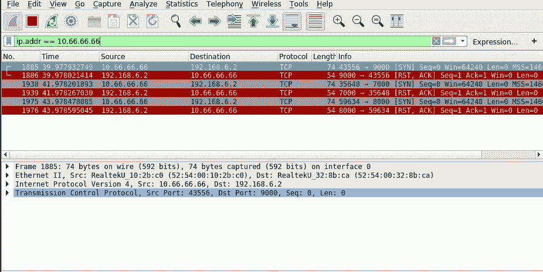

# 嗅探服务器的密钥

> 原文：<https://infosecwriteups.com/sniffing-the-keys-to-the-server-bfc4b0ee9c46?source=collection_archive---------0----------------------->

## 窃取服务器访问的端口敲门序列

Anthony Rampersad 在 [Unsplash](https://unsplash.com?utm_source=medium&utm_medium=referral) 上拍摄的照片

端口扫描是攻击者用来获取系统信息的一种方法。黑客使用端口扫描来列举系统上的服务，并揭示任何潜在的可利用的服务。之后，他们可以尝试利用这些服务非法访问系统。

因此，即使端口扫描本身不是一个漏洞，它也是一个很好的深度防御策略，可以防止人们这样做。系统可以通过使用“端口敲门”来防止端口扫描。今天，我们讨论端口敲门技术，如何不使用它，以及黑客用来绕过这种保护的一种方法。

# 什么是端口敲门？

端口敲门是从外部打开关闭的端口的一种方式。外部客户端通过向目的机器上的预定端口发送一个秘密的数据包序列来执行“敲门”。这些“敲门信号”可以包括从单个包到许多加密包的任何内容。在服务器上，一个守护程序监视防火墙日志文件中这些特殊的敲门序列，并相应地允许连接到端口。

实现端口敲门的目的是保护系统免受端口扫描和潜在易受攻击服务的枚举。如果没有有效的端口敲门，受保护的端口将对攻击者不可用，从而隐藏系统的服务。

## 不正确使用端口敲门

因为端口敲门有点像端口或服务的“密码”，所以它可以用来向服务器认证用户，对吗？

端口敲门是一种很好的深度防御策略，但是它不应该被用作服务器的身份验证方法。端口敲门本质上是通过隐蔽的安全性来保护系统:它依赖于敲门序列的保密性。如果 knock 序列被泄露给不可信的一方，那么所有使用 knock 序列的机器上的身份验证都会受到影响。

有几种方式可能会泄漏敲门序列。敲门序列可能会被意外公布。它也可能通过受损的日志文件泄露。最后，如果敲门序列未加密，它可能通过数据包嗅探被窃取。

# 偷窃港口敲门

那么，攻击者如何通过数据包嗅探窃取端口敲门信号呢？

首先，她可以使用 Wireshark 监听其他机器和目标服务器之间的流量。Wireshark 是一种网络协议分析器，允许您捕获网络上的数据包。

 [## Wireshark 深入。

### Wireshark 是世界上最重要、使用最广泛的网络协议分析器。它让你看到…

www.wireshark.org](https://www.wireshark.org/) 

在从网络中收集了适当长度的网络跟踪后，她可以过滤掉合法客户机和目标服务器之间的流量。例如，在下面的截图中，攻击者使用 IP 地址作为隔离相关数据包的标准。

然后，她可以从这些数据包中推断出正确的敲门序列，并获得对服务器和连接网络的未授权访问。注意，端口敲门序列有多长或多复杂并不重要。如果序列未加密，就很容易被窃取。

## 防止端口碰撞安全漏洞

不应依赖端口敲门作为主要的身份验证方法。相反，它应该与另一种不易受到中间人攻击的机制结合使用。最重要的是，像端口敲门这样的敏感网络流量应该始终加密！

# 结论

端口敲门是一种额外的安全措施，可以用来防止端口扫描。但是，安全措施只有在构建正确的情况下才会有效。设计端口敲门时遵循最佳实践，并始终牢记端口敲门嗅探的可能性！

感谢阅读！我错过了什么吗？请随时在 Twitter 上告诉我:

 [## 李薇薇

### Vickie Li 的最新推文(@ vickieli7)。书呆子的专业调查员。黑客和安全。创造上帝…

twitter.com](https://twitter.com/vickieli7) 

*关注* [*Infosec 报道*](https://medium.com/bugbountywriteup) *获取更多此类精彩报道。*

 [## 信息安全报道

### 收集了世界上最好的黑客的文章，主题从 bug 奖金和 CTF 到 vulnhub…

medium.com](https://medium.com/bugbountywriteup)