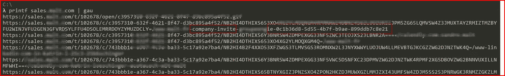
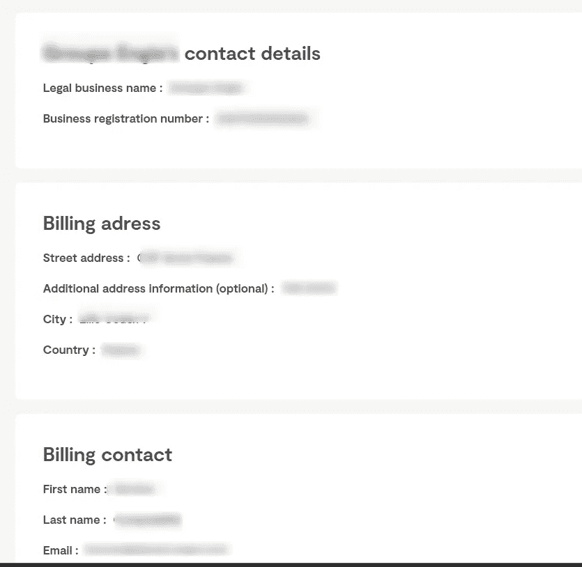
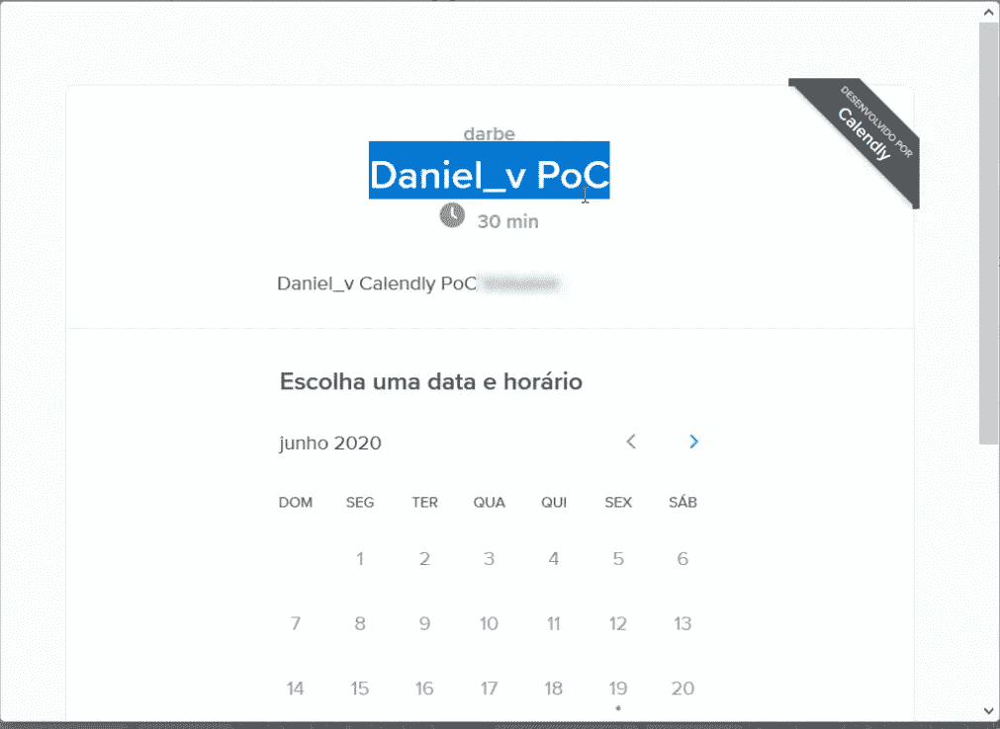
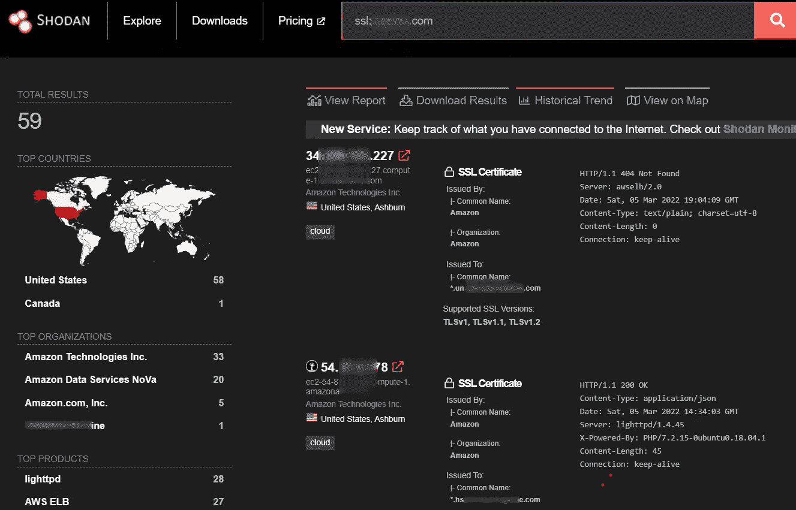
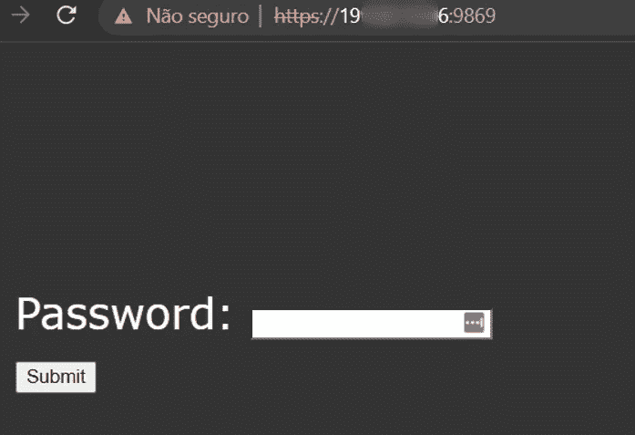
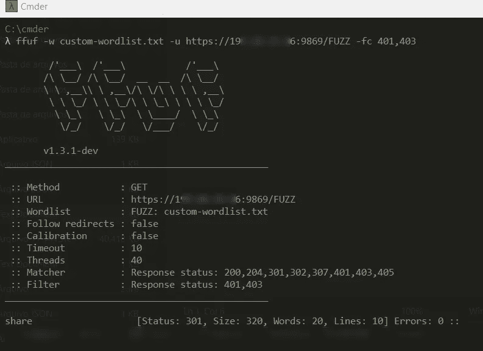

# 解释了被动分析 bug 赏金程序时发现的一些关键漏洞

> 原文：<https://infosecwriteups.com/some-critical-vulnerabilities-found-with-passive-analysis-on-bug-bounty-programs-explained-1da8b01c11ad?source=collection_archive---------0----------------------->

这篇文章描述了我在 bug bounty 程序中发现的三个漏洞，以及如何发现漏洞和执行步骤的概述。这篇文章的主要目的是展示如何在不触及公司资产或篡改请求的情况下找到关键/高漏洞。希望你喜欢，找到有用的东西！

## 报告:

1.  包含企业帐户邀请 URL 的公开端点允许攻击者作为员工加入公司。
2.  由于联系人页面上映射了一个未使用的日历，因此能够向[redacted]主张日历第三方服务的所有权，这导致与支持团队一起管理预定的客户呼叫。
3.  通过 Shodan 分析发现，公共[编辑的]公司 IP 上的源代码泄漏和敏感信息泄露带有一个不常见的开放端口。

# **描述:**

## 1.包含企业帐户邀请 URL 的公开端点允许作为员工加入公司。

在 OSINT 分析期间，我首先采取的步骤之一是检索第三方抓取的目标端点和 URL，这可以通过开源工具完成，如 [gau](https://github.com/lc/gau) 和下面的命令:

target.com 印刷厂| gau

之后，我开始从输出中手动分析端点和 URL，特别注意一些敏感的关键字:

> 发票、折扣、促销代码、重定向、重置密码、重置密码、密码、跟踪订单、令牌、邀请

对于这一个，`invite`关键字突然将我的注意力吸引到目标的端点上:

gau 工具的输出结果

我只是点击了这个可疑的网址，它把我带到了一个**注册页面**，在用个人电子邮件( **@gmail.com** )创建了一个新帐户之后，我就被重定向到了目标应用程序中的公司页面，其中包含了**所有被邀请的员工以及敏感信息**:

引导我访问公司团队的注册页面

来自员工的 PII 信息

来自公司的敏感数据

**影响:**

任何用户都可以使用映射在不同爬虫上的 URL 在目标应用服务上注册为员工，这将向攻击者泄露 PII 和关于公司的敏感信息。

**已采取措施发现此漏洞:**

1.  使用开源工具(subfinder、amass……)搜索范围内所有可用的公司资产
2.  使用 gau 工具从发现的域中检索 URL 和端点列表
3.  搜索包含敏感关键词的结果，在本例中是“invite”`grep -r "invite"`
4.  手动访问网址以查看其内容，并按照页面说明进行操作，这使我注册成为受影响的目标应用程序下注册的许多不同公司的员工。

## **2。**由于联系人页面上映射了一个未使用的日历，能够向[redacted]主张日历第三方服务的所有权，这导致管理与支持团队的预定客户通话。

在第一次访问目标时，我通常喜欢在攻击它之前分析应用程序的整体结构。在与不同页面互动了大约 5 分钟后，我点击了一个**联系人** **页面**左下方的日历图标，它最终打开了一个空白页，上面有一个来自 [Calendly 的](https://calendly.com/)服务的错误:

通过检查页面，我能够看到一个 **GET** 对`target-v2/call`的请求，该请求是来自第三方服务 calendarily 的**注册日历名称。我立即在那里注册了一个新帐户，创建了一个新日历，然后它要求我提供一个唯一的名称，该名称将附加到 URL 上，因此我自动想到了接管攻击。**

我提供了`target-v2`作为日历的名称，继续创建，然后砰！

目标联系人页面上的日历服务接管

我新创建的日历显示在目标域的联系人页面上，因此如果任何人安排了与支持团队的通话，他们实际上会安排与我(攻击者)的通话。

**影响:**

任何用户都可以接管用于为目标公司安排支持呼叫的第三方服务日历，这使得攻击者能够轻松执行网络钓鱼攻击，并管理目标客户的所有计划呼叫。

**发现此漏洞的步骤:**

1.  首先，我以普通用户的身份手动分析了应用程序的功能和页面
2.  然后我在联系人页面上发现了一个第三方集成的应用程序作为日程安排日历(Calendly service)
3.  最后，我想到了从这个平台接管日历的可能性。为此，我注册了一个新账户，研究了日历的创建，然后我将目标应用程序使用的名称注册为我的新日历。
4.  我的日历立即链接到目标应用程序的联系页面，然后与目标支持团队的预定呼叫现在完全由我(攻击者)管理。

**3。通过 Shodan 分析发现，公共[修订] IP 上的源代码泄漏和敏感信息泄露带有一个不常见的开放端口。**

最后一个是在对目标应用程序进行手动 Shodan 分析时发现的。我从下面的呆子开始，只是为了获取更多关于目标的信息:

ssl:目标网站

并通过访问“查看报告”选项来手动查找不常见的开放端口。突然，有一台主机的端口“9869”打开了，我立即试图访问它，它将我带到一个受密码保护的页面，以便访问该页面的内容:

然后我使用 [ffuf](https://github.com/ffuf/ffuf) 工具进行了一次暴力攻击来查找目录和端点，结果很好:

在获得对`share`端点的响应后，我访问它，从那里可以访问目录列表中公司项目的源代码:

**冲击**:

网络上的任何用户都可以发现这项服务暴露了敏感的公司文件，如项目数据和源代码。

**发现此漏洞的步骤:**

1.  从一个简单的 Shodan dork 开始，过滤所有匹配公司 SSL 证书名称的域
2.  手动搜索不常用的开放端口
3.  访问它们，有一个主机引导我到一个有密码保护的页面(非常可疑)
4.  使用 ffuf 工具发现可能隐藏的端点/目录以绕过密码页面，并找到了一个，开始了强力攻击
5.  访问端点`share`，敏感文件在那里。

**外卖:**

总是使用尽可能多的工具/研究/工具对目标应用进行被动分析，实际上在 github、bb tips 等网站上有很多。我学到的一件事是，公司越大，你得到的结果就越多，当然，你找到关键漏洞的机会也就越多，比如本文中的那些。

丹尼尔 _v

仇杀队

[推特](https://twitter.com/d4niel_v) | [BugCrowd 简介](https://bugcrowd.com/daniel_v) | [H1 简介](https://hackerone.com/daniel_v) | [Linkedin](https://www.linkedin.com/in/daniel-morais-968463120/)

Infosec Writeups 团队刚刚完成了我们的第一次虚拟网络安全会议和网络活动。我们有 16 位出色的演讲者，他们主持了非常有价值和鼓舞人心的会议。要查看发言人和主题列表，并终身获得所有 16 场演讲的录音版本，[单击此处。](https://iwcon.live.)

 [## IWCon2022 — Infosec 书面报告虚拟会议

### 与世界上最优秀的信息安全专家建立联系。了解网络安全专家如何取得成功。将新技能添加到您的…

iwcon.live](https://iwcon.live/)