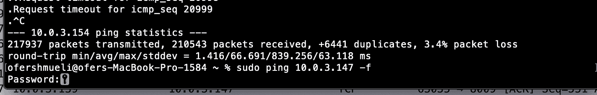
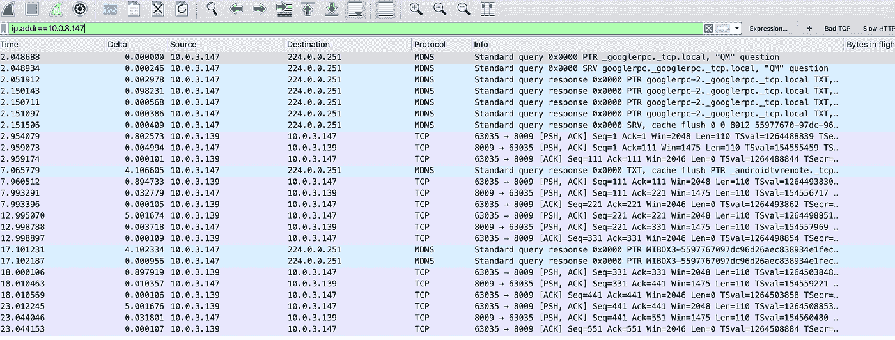
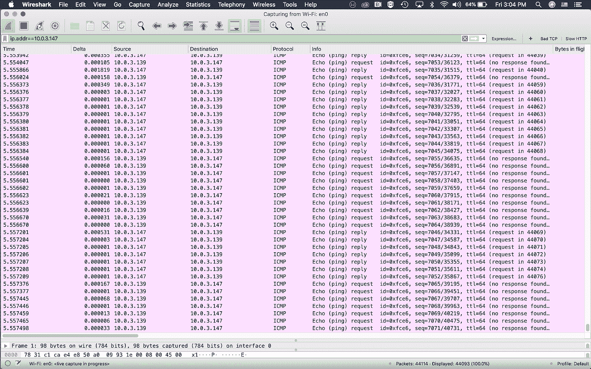

# 有些人可能称之为 DoS 攻击，我只是试图找到我的 streamer 在压力下的表现

> 原文：<https://infosecwriteups.com/some-may-call-it-a-dos-attack-i-just-tried-to-find-how-my-streamer-behaves-under-stress-36fead7643e4?source=collection_archive---------1----------------------->

# **CIA triad 模型(一种理论模型，描述了确保系统安全必须具备的 3 个关键要素)的关键原则之一是可用性，即保持系统正常运行。**

另外两个原则是**机密性**(需要加密我们的数据)和**完整性**(确保数据不被篡改，使用散列函数，等等)

**所以我决定让我的 streamer**[**https://amzn.to/33pTEln**](https://amzn.to/33pTEln)**进行测试，并使用 ICMP Flood** 对其发起拒绝服务攻击。(这仅用于教育目的，因为这是非法的。我只在我的局域网设备上做过)

# **术语**

**ICMP flood** 是一种常见的 DoS 攻击，攻击者通过向受害者的计算机发送大量 ICMP 回应请求(也称为 pings)来摧毁它。ICMP 数据包只不过是通过网络发送到特定 IP 地址的一个小数据包。该数据包包含 64 个字节——56 个数据字节和 8 个字节的协议报头信息。

**每个操作系统都支持 ICMP 回应请求并侦听 ICMP 回应回复，这样，您可以测量 ICMP 回复返回所需的往返时间。我们一直使用 ping 来检查稳定性和连接性问题**

在 UNIX 和 MAC-OS 等更新的操作系统中，我们可以选择发送 ping 请求，有许多选项，如计数大小、要发送的回送请求的数量、以字节为单位的数据包大小(实际上，您可以发送比默认的 56 字节更大的 ICMP，也称为死亡 ping ),最后，您可以发送大量数据包，导致在 1 秒钟内发送成百上千个 ICMP 数据包，而不是传统的每秒 5 个数据包

因此，让我们在我的 Mac 上使用 flood 选项(在终端上使用-f 选项),这实际上意味着，我正在对我的 android TV streamer 进行拒绝服务攻击。

打包程序的数量意味着会淹没流处理器，消耗大量的 CPU 和内存资源，并造成一些网络拥塞。

在我的 Ubuntu Linux 虚拟机上，我可以使用 Hping(我最喜欢的 Linux 工具之一)和其他更具针对性的工具来实现这个目的，但是我决定坚持使用每个 Mac 用户都拥有的更常见、更传统的工具

为此，我需要两件东西:

*   我的流媒体的 IP 地址
*   和根权限

所以我使用了 Sudo 命令，后跟我的密码

我的流媒体 IP 地址是 10.0.3.147，对于那些不熟悉这个流媒体的人来说，它是近年来最受欢迎的 Android 电视流媒体之一。在里面你会发现一个 Cortex-A53 四核 64 位 CPU 和一个 Mali-450 GPU，它还配有 2 GB 的 RAM 大小和 8 GB eMMC 的存储空间。我已经用了 6 个月了，它像预期的那样工作，支持 4k，快速，直观，非常便宜

# **Wireshark 视图**

我还使用 Wireshark 来捕获使用我的终端发送的流量

流式传输器使用 SSDP 协议做一些 UPNP 请求，如预期的那样连接到一些多播组，然后我启动了**洪流**

# **我想检查两件事**

**CPU 使用率**——我真的找不到一个能显示 CPU 负载的应用程序，似乎运行在 android 8.1 上的应用程序在显示这些信息时存在一些问题

**用户体验** —我会觉得导航和打开应用变得很慢吗？

嗯，起初，没有什么被注意到，但 3 分钟后，我开始觉得在主屏幕上的不同应用程序之间导航变得越来越慢，我试图打开 youtube，花了大约一分钟加载(缩略图)。降级主要表现在需要从外部服务器打开和加载资源的应用程序上

# **结论**

不要在家里尝试，即使你的孩子玩堡垒之夜，消耗了你家里所有的带宽

一段时间后，内存和 CPU 资源像预期的那样运行得很快，但是流服务器仍然运行着不错的硬件

打开时没有缓存内容的第三方应用似乎最困难

我的 Fortigate 管理指南手册[https://amzn.to/3brDX1t](https://amzn.to/3brDX1t)

你可以订阅我在 youtube.com/fortitip 的频道或者参加我在 https://www.udemy.com/course/fortigate-admin-crash-course/?的 FortiGate 课程 referral code = 0b 534 DCF 7 a6 D8 BD 3417 e

*   免责声明:请不要对你周围的任何设备使用它，这是非法的，目的只是教育